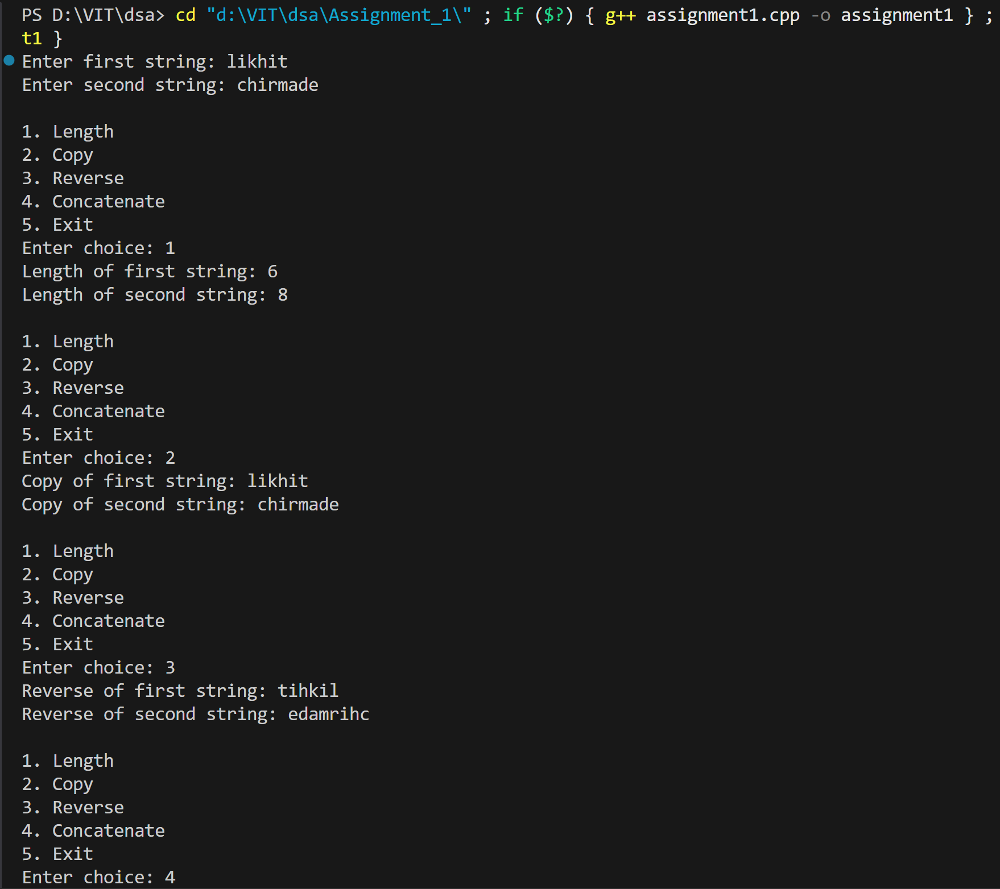
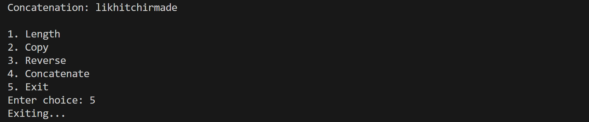

# String Operations in C++

## Name: Likhit Chirmade, Roll no: 23

## Theory

### Strings in C++

A string is a sequence of characters stored in memory as an array of characters, terminated by a null character (`\0`). In C++, strings can be handled in multiple ways:

1. **C-style strings**: Character arrays terminated by null character
2. **C++ string class**: Object-oriented approach using the `std::string` class

This program demonstrates fundamental string operations using C-style strings (character arrays).

### String Operations Explained

#### 1. **String Length**
- Calculates the number of characters in a string (excluding the null terminator)
- Implementation: Iterate through the array until null character is encountered
- Time Complexity: O(n) where n is the length of string

#### 2. **String Copy**
- Creates an exact duplicate of a source string into a destination string
- Implementation: Character-by-character copying from source to destination
- Important: Destination array must have sufficient space to hold the copied string

#### 3. **String Reverse**
- Creates a new string with characters in reverse order of the original string
- Implementation: Copy characters from the end of source string to the beginning of destination
- Formula: `reversed[i] = original[length - i - 1]`

#### 4. **String Concatenation**
- Combines two strings into a single string
- Implementation: Copy first string, then append second string at the end
- Result string length = length of first string + length of second string

### Memory Management
- All operations use character arrays with predefined sizes
- Null terminator (`\0`) is crucial for proper string handling
- Buffer overflow protection is important when working with fixed-size arrays

## Code

```cpp
#include <iostream>
using namespace std;

int length_lac(char str_lac[])
{
    int len_lac = 0;
    while (str_lac[len_lac] != '\0')
        len_lac++;
    return len_lac;
}

void copy_lac(char src_lac[], char dest_lac[])
{
    int i = 0;
    while (src_lac[i] != '\0')
    {
        dest_lac[i] = src_lac[i];
        i++;
    }
    dest_lac[i] = '\0';
}

void reverse_lac(char str_lac[], char rev_lac[])
{
    int len_lac = length_lac(str_lac);
    for (int i = 0; i < len_lac; i++)
    {
        rev_lac[i] = str_lac[len_lac - i - 1];
    }
    rev_lac[len_lac] = '\0';
}

void concat_lac(char str1_lac[], char str2_lac[], char result_lac[])
{
    int i = 0, j = 0;
    while (str1_lac[i] != '\0')
    {
        result_lac[i] = str1_lac[i];
        i++;
    }
    while (str2_lac[j] != '\0')
    {
        result_lac[i] = str2_lac[j];
        i++;
        j++;
    }
    result_lac[i] = '\0';
}

int main()
{
    char str1_lac[100], str2_lac[100], result_lac[200], temp_lac[100];
    int choice_lac;
    cout << "Enter first string: ";
    cin >> str1_lac;
    cout << "Enter second string: ";
    cin >> str2_lac;
    do
    {
        cout << "\n1. Length\n2. Copy\n3. Reverse\n4. Concatenate\n5. Exit\nEnter choice: ";
        cin >> choice_lac;
        switch (choice_lac)
        {
        case 1:
            cout << "Length of first string: " << length_lac(str1_lac) << endl;
            cout << "Length of second string: " << length_lac(str2_lac) << endl;
            break;
        case 2:
            copy_lac(str1_lac, temp_lac);
            cout << "Copy of first string: " << temp_lac << endl;
            copy_lac(str2_lac, temp_lac);
            cout << "Copy of second string: " << temp_lac << endl;
            break;
        case 3:
            reverse_lac(str1_lac, temp_lac);
            cout << "Reverse of first string: " << temp_lac << endl;
            reverse_lac(str2_lac, temp_lac);
            cout << "Reverse of second string: " << temp_lac << endl;
            break;
        case 4:
            concat_lac(str1_lac, str2_lac, result_lac);
            cout << "Concatenation: " << result_lac << endl;
            break;
        case 5:
            cout << "Exiting..." << endl;
            break;
        default:
            cout << "Invalid choice" << endl;
        }
    } while (choice_lac != 5);
    return 0;
}
```

## Output




