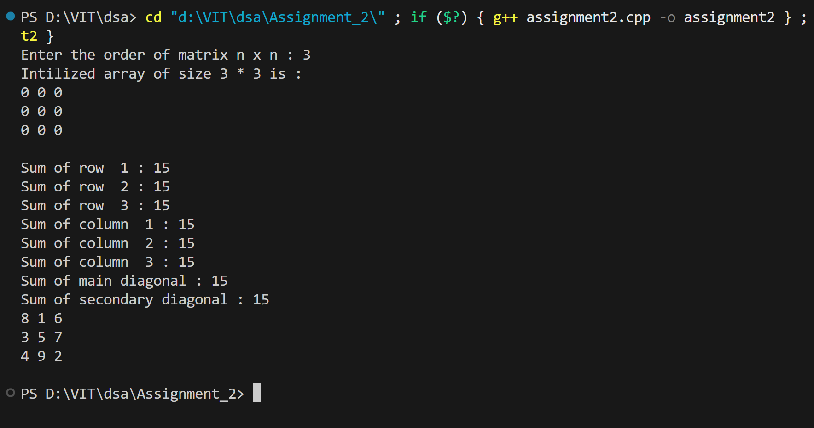

# Magic Square Generator

## Name: Likhit Chirmade, Roll no: 23

## Theory

### Magic Square

A magic square is an n×n matrix filled with distinct integers from 1 to n² such that the sum of numbers in each row, column, and both main diagonals is the same. This constant sum is called the "magic constant" and can be calculated using the formula:

**Magic Constant = n(n² + 1) / 2**

For example, for a 3×3 magic square, the magic constant = 3(9 + 1) / 2 = 15

### Siamese Method (De la Loubère Method)

This program implements the Siamese method for constructing magic squares of odd order. The algorithm works as follows:

1. **Starting Position**: Place the number 1 in the middle column of the first row
2. **Movement Rule**: Move diagonally up and to the right for the next number
3. **Boundary Conditions**:
   - If moving up goes above the top row, wrap to the bottom row
   - If moving right goes beyond the last column, wrap to the first column
4. **Collision Rule**: If the target cell is already occupied, move down one row from the current position instead

### Dynamic Memory Allocation in C++

The program uses dynamic 2D array allocation:

```cpp
int **matrix = new int*[n];  // Array of pointers
for(int i = 0; i < n; i++)
    matrix[i] = new int[n];  // Each pointer points to an array
```

This approach allows runtime determination of matrix size and demonstrates pointer manipulation in C++.

### Key C++ Concepts Used

- **Double Pointers**: `int**` for 2D dynamic arrays
- **Dynamic Memory**: `new` operator for heap allocation
- **Modulo Operator**: `%` for wrapping around boundaries
- **Pass by Reference**: Passing pointers to functions for modification

## Code

```cpp
#include<iostream>
#include<conio.h>
#include<stdlib.h>
using namespace std;

void createMagicSquare_lac(int **matrix_lac, int n_len)
{
    int row_lac = 0;
    int col_lac = n_len/2;
    int nextRow_lac = 0 , nextCol_lac = 0;
    for(int num_lac = 1 ; num_lac <= n_len*n_len ; num_lac++)
    {
        matrix_lac[row_lac][col_lac] = num_lac;

        nextRow_lac = row_lac - 1 ;
        nextCol_lac = col_lac + 1 ;
        
        if(nextRow_lac<0)
        {
            nextRow_lac = n_len - 1 ; 
        }
        if(nextCol_lac == n_len)
        {
            nextCol_lac = 0 ;
        }
        if(matrix_lac[nextRow_lac][nextCol_lac] != 0)
        {
            nextRow_lac = (row_lac + 1) % n_len ;
            nextCol_lac = col_lac ;
        }

        row_lac = nextRow_lac;
        col_lac = nextCol_lac;
    }
}

void verifyMagicSquare_lac(int **matrix_lac, int n_lac)
{
    int sum_lac = 0 ;
    int rowSum_lac = 0 , colSum_lac = 0 ;
    for(int i_lac = 0 ; i_lac<n_lac ; i_lac++)
    {
        cout<<"Sum of row  "<<i_lac+1<< " : ";
        for(int j_lac=0; j_lac<n_lac;j_lac++)
        {
            rowSum_lac+=matrix_lac[i_lac][j_lac];
        }
        cout<<rowSum_lac<<endl;
        rowSum_lac = 0 ;
    }
    for(int i_lac = 0 ; i_lac<n_lac ; i_lac++)
    {
        cout<<"Sum of column  "<<i_lac+1<< " : ";
        for(int j_lac=0; j_lac<n_lac;j_lac++)
        {
            colSum_lac+=matrix_lac[j_lac][i_lac];
        }
        cout<<colSum_lac<<endl;
        colSum_lac = 0 ;
    }
    for(int i_lac = 0; i_lac < n_lac; i_lac++)
    {
        sum_lac += matrix_lac[i_lac][i_lac];
    }
    cout << "Sum of main diagonal : " << sum_lac << endl;
    sum_lac = 0;
    for(int i_lac = 0; i_lac < n_lac; i_lac++)
    {
        sum_lac += matrix_lac[i_lac][n_lac - 1 - i_lac];
    }
    cout << "Sum of secondary diagonal : " << sum_lac << endl;
    
}

void printMatrix_lac(int **matrix_lac, int n_lac)
{
    for(int i =0; i<n_lac ; i++)
    {
        for(int j=0; j<n_lac;j++)
        {
            cout<<matrix_lac[i][j]<<" ";
        }
        cout<<endl;
    }
    cout<<endl;
}

int main()
{
    int n_lac = 0;
    cout<<"Enter the order of matrix n x n : ";
    cin>> n_lac ;
    if(n_lac == 0 || n_lac % 2 == 0)
    {
        cout<<"\nPlease enter an odd value for n";
        return 1;
    }
    int **matrix_lac = new int*[n_lac];

    for(int i =0; i<n_lac ; i++)
    {
        matrix_lac[i] = new int[n_lac];
    }

    for(int i =0; i<n_lac ; i++)
    {
        for(int j=0; j<n_lac;j++)
        {
            matrix_lac[i][j] = 0;
        }
    }

    cout<<"Intilized array of size "<<n_lac<<" * "<<n_lac<<" is : "<<endl;
    
    printMatrix_lac(matrix_lac,n_lac);
    createMagicSquare_lac(matrix_lac,n_lac);
    verifyMagicSquare_lac(matrix_lac,n_lac);
    printMatrix_lac(matrix_lac,n_lac);
}
```

## Output


