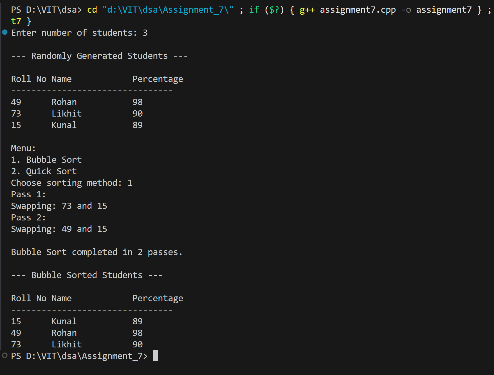
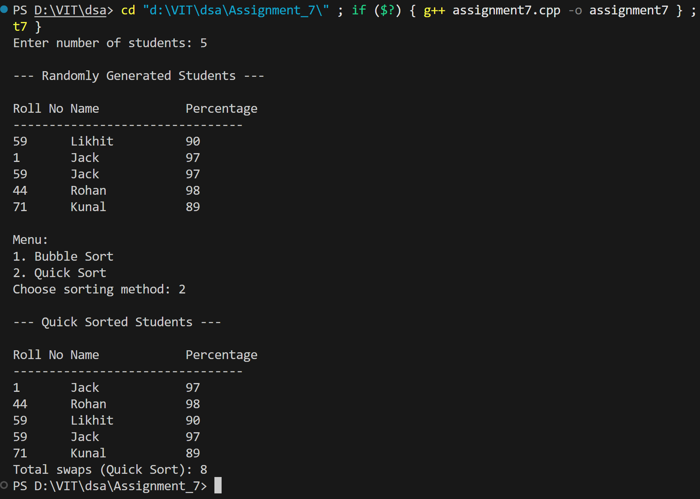

# Sorting Student Records - Bubble Sort and Quick Sort

## Name: Likhit Chirmade, Roll no: 23

## Theory

### Bubble Sort

Bubble sort is a simple comparison-based sorting algorithm that repeatedly steps through the list, compares adjacent elements, and swaps them if they are in the wrong order. The process is repeated until the list is sorted.

**Algorithm:**
1. Compare adjacent elements
2. Swap if they are in wrong order
3. Repeat for all elements
4. After each pass, the largest element "bubbles up" to its correct position
5. Repeat until no swaps are needed

**Time Complexity:**
- Best Case: O(n) - already sorted
- Average Case: O(n²)
- Worst Case: O(n²) - reverse sorted

**Space Complexity:** O(1) - in-place sorting

**Characteristics:**
- Stable sorting algorithm
- Simple to implement
- Inefficient for large datasets

### Quick Sort

Quick sort is a divide-and-conquer algorithm that selects a pivot element and partitions the array around it, placing smaller elements before the pivot and larger elements after it.

**Algorithm:**
1. Choose a pivot element (typically last element)
2. Partition: rearrange array so elements smaller than pivot are on left, larger on right
3. Recursively apply quick sort to left and right subarrays
4. Base case: subarray with 0 or 1 element is already sorted

**Partition Process:**
- Select pivot (last element)
- Maintain index i for smaller elements
- Traverse array, swap elements smaller than pivot to left side
- Place pivot at correct position

**Time Complexity:**
- Best Case: O(n log n) - balanced partitions
- Average Case: O(n log n)
- Worst Case: O(n²) - already sorted with last element as pivot

**Space Complexity:** O(log n) - recursive call stack

**Characteristics:**
- Not stable (can be made stable with modifications)
- In-place sorting
- Generally faster than bubble sort for large datasets

### Comparison: Bubble Sort vs Quick Sort

| Aspect | Bubble Sort | Quick Sort |
|--------|-------------|------------|
| Time Complexity (Avg) | O(n²) | O(n log n) |
| Space Complexity | O(1) | O(log n) |
| Stability | Stable | Unstable |
| Best For | Small datasets | Large datasets |

### C++ Concepts Used

**Pass by Reference:**
```cpp
void swapStudents(Student &a, Student &b)    // Modifies original variables
```

**Random Number Generation:**
```cpp
srand(time(0));           // Seed random generator with current time
rand() % 100 + 1;         // Generate random number between 1 and 100
```

**Array Size Calculation:**
```cpp
sizeof(array) / sizeof(array[0])    // Number of elements in array
```

**Recursive Functions:**
```cpp
void quickSort(arr[], low, high) {
    // Base case
    if (low < high) {
        // Recursive calls
        quickSort(arr, low, pi - 1);
        quickSort(arr, pi + 1, high);
    }
}
```

**Switch Statement:**
```cpp
switch (choice) {
    case 1:
        // code
        break;
    case 2:
        // code
        break;
    default:
        // code
}
```

## Code

```cpp
#include <iostream>
#include <string>
#include <cstdlib>
#include <ctime>
using namespace std;

struct Student_lac {
    string name_lac;
    int roll_lac;
    float per_lac;
};

void swapStudents_lac(Student_lac &a_lac, Student_lac &b_lac, int &swapCount_lac) {
    Student_lac temp_lac = a_lac;
    a_lac = b_lac;
    b_lac = temp_lac;
    swapCount_lac++;
}

int partition_lac(Student_lac arr_lac[], int low_lac, int high_lac, int &swapCount_lac) {
    int pivot_lac = arr_lac[high_lac].roll_lac;
    int i_lac = low_lac - 1;
    for (int j_lac = low_lac; j_lac < high_lac; j_lac++) {
        if (arr_lac[j_lac].roll_lac < pivot_lac) {
            i_lac++;
            swapStudents_lac(arr_lac[i_lac], arr_lac[j_lac], swapCount_lac);
        }
    }
    swapStudents_lac(arr_lac[i_lac + 1], arr_lac[high_lac], swapCount_lac);
    return i_lac + 1;
}

void quickSort_lac(Student_lac arr_lac[], int low_lac, int high_lac, int &swapCount_lac) {
    if (low_lac < high_lac) {
        int pi_lac = partition_lac(arr_lac, low_lac, high_lac, swapCount_lac);
        quickSort_lac(arr_lac, low_lac, pi_lac - 1, swapCount_lac);
        quickSort_lac(arr_lac, pi_lac + 1, high_lac, swapCount_lac);
    }
}

void bubbleSort_lac(Student_lac arr_lac[], int n_lac) {
    int passNo_lac = 0;
    for (int i_lac = 0; i_lac < n_lac - 1; i_lac++) {
        passNo_lac++;
        cout << "Pass " << passNo_lac << ":\n";
        for (int j_lac = 0; j_lac < n_lac - 1 - i_lac; j_lac++) {
            if (arr_lac[j_lac].roll_lac > arr_lac[j_lac + 1].roll_lac) {
                cout << "Swapping: " << arr_lac[j_lac].roll_lac << " and " << arr_lac[j_lac + 1].roll_lac << endl;
                Student_lac temp_lac = arr_lac[j_lac];
                arr_lac[j_lac] = arr_lac[j_lac + 1];
                arr_lac[j_lac + 1] = temp_lac;
            }
        }
    }
    cout << "\nBubble Sort completed in " << passNo_lac << " passes.\n";
}

void displayStudents_lac(Student_lac arr_lac[], int n_lac) {
    cout << "\nRoll No\tName\t\tPercentage\n";
    cout << "--------------------------------\n";
    for (int i_lac = 0; i_lac < n_lac; i_lac++) {
        cout << arr_lac[i_lac].roll_lac << "\t" 
             << arr_lac[i_lac].name_lac << "\t\t" 
             << arr_lac[i_lac].per_lac << endl;
    }
}

int main() {
    srand(time(0));

    int n_lac;
    cout << "Enter number of students: ";
    cin >> n_lac;

    Student_lac *arr_lac = new Student_lac[n_lac];

    string names_lac[] = {"Likhit","Sahil","Rohan","Pranil","Jack","Kunal","Prem"};
    float per_lac[] = {90, 92, 98, 90, 97, 89, 92};
    int names_count_lac = sizeof(per_lac)/sizeof(per_lac[0]);

    for (int i_lac = 0; i_lac < n_lac; i_lac++) {
        arr_lac[i_lac].roll_lac = rand() % 100 + 1;
        int idx_lac = rand() % names_count_lac;
        arr_lac[i_lac].name_lac = names_lac[idx_lac];
        arr_lac[i_lac].per_lac = per_lac[idx_lac];
    }

    cout << "\n--- Randomly Generated Students ---\n";
    displayStudents_lac(arr_lac, n_lac);

    int ch_lac;
    cout << "\nMenu:\n1. Bubble Sort\n2. Quick Sort\nChoose sorting method: ";
    cin >> ch_lac;

    switch (ch_lac) {
        case 1:
            bubbleSort_lac(arr_lac, n_lac);
            cout << "\n--- Bubble Sorted Students ---\n";
            displayStudents_lac(arr_lac, n_lac);
            break;
        case 2: {
            int quickSwapCount_lac = 0;
            quickSort_lac(arr_lac, 0, n_lac - 1, quickSwapCount_lac);
            cout << "\n--- Quick Sorted Students ---\n";
            displayStudents_lac(arr_lac, n_lac);
            cout << "Total swaps (Quick Sort): " << quickSwapCount_lac << endl;
            break;
        }
        default:
            cout << "Invalid choice!";
    }

    delete[] arr_lac;
    return 0;
}
```

## Output


