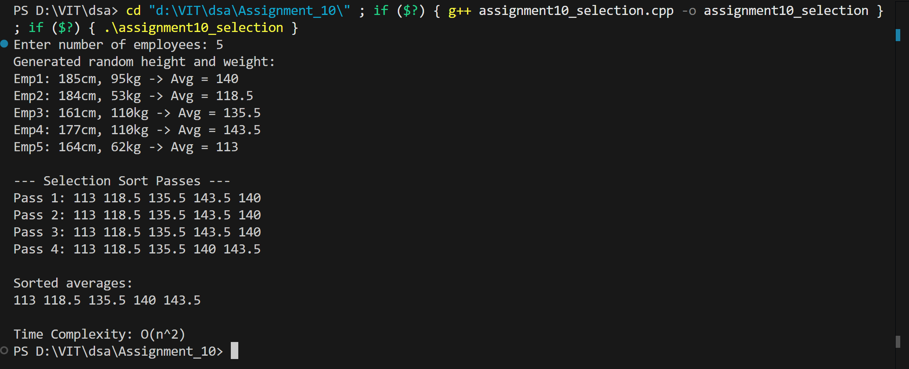
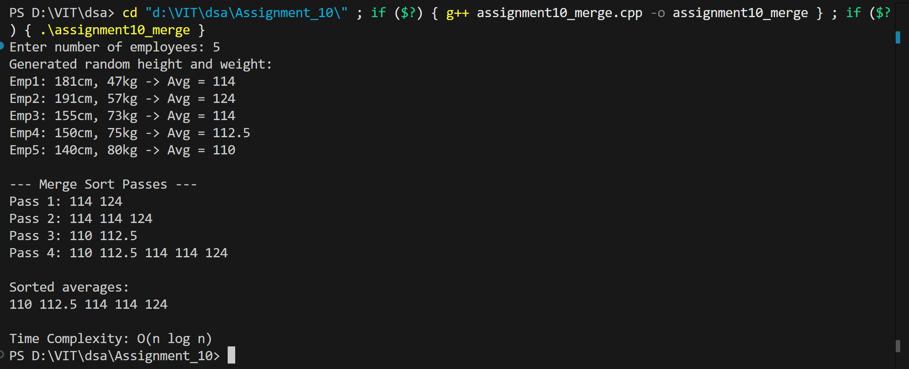

# Employee Sorting by Average Height and Weight - Merge Sort vs Selection Sort

Write a program to arrange the list of employees as per the average of their height and weight by using Merge and Selection sorting method. Analyse their time complexities and conclude which algorithm will take less time to sort the list.

## Name: Likhit Chirmade, Roll no: 23

## Theory

### Selection Sort Algorithm

Selection sort is a simple comparison-based sorting algorithm that divides the array into two parts: a sorted portion and an unsorted portion. It repeatedly selects the minimum (or maximum) element from the unsorted portion and moves it to the end of the sorted portion.

**Algorithm Steps:**
1. Find the minimum element in the unsorted portion
2. Swap it with the first element of the unsorted portion
3. Move the boundary between sorted and unsorted portions one position right
4. Repeat until the entire array is sorted

**Pseudocode:**
```
for i = 0 to n-2:
    minIndex = i
    for j = i+1 to n-1:
        if arr[j] < arr[minIndex]:
            minIndex = j
    swap(arr[i], arr[minIndex])
```

**Time Complexity:**
- Best Case: O(n²)
- Average Case: O(n²)
- Worst Case: O(n²)

**Space Complexity:** O(1) - in-place sorting

**Characteristics:**
- Not stable
- In-place sorting
- Minimum number of swaps: O(n)
- Simple to implement

### Merge Sort Algorithm

Merge sort is a divide-and-conquer algorithm that divides the array into two halves, recursively sorts them, and then merges the sorted halves back together.

**Algorithm Steps:**
1. **Divide**: Split the array into two halves
2. **Conquer**: Recursively sort both halves
3. **Combine**: Merge the two sorted halves into a single sorted array

**Merge Process:**
- Create two temporary arrays for left and right halves
- Compare elements from both arrays
- Place smaller element in the original array
- Copy remaining elements if any

**Pseudocode:**
```
mergeSort(arr, left, right):
    if left < right:
        mid = (left + right) / 2
        mergeSort(arr, left, mid)
        mergeSort(arr, mid+1, right)
        merge(arr, left, mid, right)

merge(arr, left, mid, right):
    Create leftArr and rightArr
    Copy data to temporary arrays
    Merge back to arr in sorted order
```

**Time Complexity:**
- Best Case: O(n log n)
- Average Case: O(n log n)
- Worst Case: O(n log n)

**Space Complexity:** O(n) - requires temporary arrays

**Characteristics:**
- Stable sorting algorithm
- Not in-place (requires extra space)
- Predictable performance
- Efficient for large datasets

### Comparison: Selection Sort vs Merge Sort

| Aspect | Selection Sort | Merge Sort |
|--------|---------------|------------|
| Time Complexity (Best) | O(n²) | O(n log n) |
| Time Complexity (Average) | O(n²) | O(n log n) |
| Time Complexity (Worst) | O(n²) | O(n log n) |
| Space Complexity | O(1) | O(n) |
| Stability | No | Yes |
| In-place | Yes | No |
| Best For | Small datasets | Large datasets |

### Analysis and Conclusion

**For Small Datasets (n < 50):**
- Selection sort may perform comparably due to lower overhead
- Simple implementation with minimal memory usage

**For Large Datasets (n > 100):**
- Merge sort significantly outperforms selection sort
- O(n log n) vs O(n²) makes a huge difference

**Example Comparison:**
```
For n = 1000 elements:
- Selection Sort: ~1,000,000 operations
- Merge Sort: ~10,000 operations (100x faster)

For n = 10,000 elements:
- Selection Sort: ~100,000,000 operations
- Merge Sort: ~130,000 operations (770x faster)
```

**Conclusion:**
Merge sort will take significantly less time to sort the list, especially for larger datasets. While selection sort uses less memory (O(1) vs O(n)), the time complexity advantage of merge sort (O(n log n) vs O(n²)) makes it the superior choice for most practical applications.


### C++ Concepts Used

**Dynamic Memory Allocation:**
```cpp
int *height = new int[n];
float *average = new float[n];
```

**Temporary Arrays in Merge:**
```cpp
float *leftArr = new float[n1];
float *rightArr = new float[n2];
delete[] leftArr;
delete[] rightArr;
```

**Recursive Function:**
```cpp
void mergeSort(float arr[], int left, int right) {
    if (left < right) {
        int mid = (left + right) / 2;
        mergeSort(arr, left, mid);      // Recursive call
        mergeSort(arr, mid + 1, right); // Recursive call
        merge(arr, left, mid, right);
    }
}
```

**Pass by Reference for Counter:**
```cpp
void merge(float arr[], int left, int mid, int right, int &passCount)
```

**Array Copying:**
```cpp
for (int i = 0; i < n1; i++)
    leftArr[i] = arr[left + i];
```

## Code

### Selection Sort Implementation

```cpp
#include <iostream>
#include <cstdlib>
#include <ctime>
using namespace std;

int main() {
    srand(time(0));
    int numEmployees_lac;
    cout << "Enter number of employees: ";
    cin >> numEmployees_lac;

    int *height_lac = new int[numEmployees_lac];
    int *weight_lac = new int[numEmployees_lac];
    float *average_lac = new float[numEmployees_lac];

    if (height_lac == NULL || weight_lac == NULL || average_lac == NULL){
        cout << "Memory not allocated";
        return -1;
    }

    cout << "Generated random height and weight:\n";
    for (int i_lac = 0; i_lac < numEmployees_lac; i_lac++) {
        height_lac[i_lac] = rand() % 61 + 140;
        weight_lac[i_lac] = rand() % 71 + 40;
        average_lac[i_lac] = (height_lac[i_lac] + weight_lac[i_lac]) / 2.0;
        cout << "Emp" << i_lac + 1 << ": " << height_lac[i_lac] << "cm, "
             << weight_lac[i_lac] << "kg -> Avg = " << average_lac[i_lac] << endl;
    }

    int passCount_lac = 1;
    cout << "\n--- Selection Sort Passes ---\n";
    for (int i_lac = 0; i_lac < numEmployees_lac - 1; i_lac++) {
        int minIndex_lac = i_lac;
        for (int j_lac = i_lac + 1; j_lac < numEmployees_lac; j_lac++) {
            if (average_lac[j_lac] < average_lac[minIndex_lac]) {
                minIndex_lac = j_lac;
            }
        }
        swap(average_lac[i_lac], average_lac[minIndex_lac]);

        cout << "Pass " << passCount_lac++ << ": ";
        for (int k_lac = 0; k_lac < numEmployees_lac; k_lac++) cout << average_lac[k_lac] << " ";
        cout << endl;
    }

    cout << "\nSorted averages:\n";
    for (int i_lac = 0; i_lac < numEmployees_lac; i_lac++) cout << average_lac[i_lac] << " ";

    cout << "\n\nTime Complexity: O(n^2)\n";

    delete[] height_lac;
    delete[] weight_lac;
    delete[] average_lac;

    return 0;
}
```

### Merge Sort Implementation

```cpp
#include <iostream>
#include <cstdlib>
using namespace std;

void merge_lac(float arr_lac[], int left_lac, int mid_lac, int right_lac, int &passCount_lac) {
    int n1_lac = mid_lac - left_lac + 1;
    int n2_lac = right_lac - mid_lac;

    float *leftArr_lac = new float[n1_lac];
    float *rightArr_lac = new float[n2_lac];

    for (int i_lac = 0; i_lac < n1_lac; i_lac++) 
    {
        leftArr_lac[i_lac] = arr_lac[left_lac + i_lac];
    }
    for (int j_lac = 0; j_lac < n2_lac; j_lac++) 
    {
        rightArr_lac[j_lac] = arr_lac[mid_lac + 1 + j_lac];
    }

    int i_lac = 0, j_lac = 0, k_lac = left_lac;
    while (i_lac < n1_lac && j_lac < n2_lac)
     {
        if (leftArr_lac[i_lac] <= rightArr_lac[j_lac]) 
        {
            arr_lac[k_lac++] = leftArr_lac[i_lac++];
        }
        else 
        {
            arr_lac[k_lac++] = rightArr_lac[j_lac++];
        }
    }
    while (i_lac < n1_lac) 
    {
        arr_lac[k_lac++] = leftArr_lac[i_lac++];
    }
    while (j_lac < n2_lac) 
    {
        arr_lac[k_lac++] = rightArr_lac[j_lac++];
    }

    cout << "Pass " << passCount_lac++ << ": ";
    for (int x_lac = left_lac; x_lac <= right_lac; x_lac++) 
    {
        cout << arr_lac[x_lac] << " ";
    }
    cout << endl;

    delete[] leftArr_lac;
    delete[] rightArr_lac;
}

void mergeSort_lac(float arr_lac[], int left_lac, int right_lac, int &passCount_lac) {
    if (left_lac < right_lac) {
        int mid_lac = (left_lac + right_lac) / 2;
        mergeSort_lac(arr_lac, left_lac, mid_lac, passCount_lac);
        mergeSort_lac(arr_lac, mid_lac + 1, right_lac, passCount_lac);
        merge_lac(arr_lac, left_lac, mid_lac, right_lac, passCount_lac);
    }
}

int main() {
    int n_lac;
    cout << "Enter number of employees: ";
    cin >> n_lac;

    int *height_lac = new int[n_lac];
    int *weight_lac = new int[n_lac];
    float *average_lac = new float[n_lac];

    cout << "Generated random height and weight:\n";
    for (int i_lac = 0; i_lac < n_lac; i_lac++) {
        height_lac[i_lac] = rand() % 61 + 140;
        weight_lac[i_lac] = rand() % 71 + 40;
        average_lac[i_lac] = (height_lac[i_lac] + weight_lac[i_lac]) / 2.0;
        cout << "Emp" << i_lac + 1 << ": " << height_lac[i_lac] << "cm, "
             << weight_lac[i_lac] << "kg -> Avg = " << average_lac[i_lac] << endl;
    }

    int passCount_lac = 1;
    cout << "\n--- Merge Sort Passes ---\n";
    mergeSort_lac(average_lac, 0, n_lac - 1, passCount_lac);

    cout << "\nSorted averages:\n";
    for (int i_lac = 0; i_lac < n_lac; i_lac++) cout << average_lac[i_lac] << " ";

    cout << "\n\nTime Complexity: O(n log n)\n";

    delete[] height_lac;
    delete[] weight_lac;
    delete[] average_lac;

    return 0;
}
```

## Output



