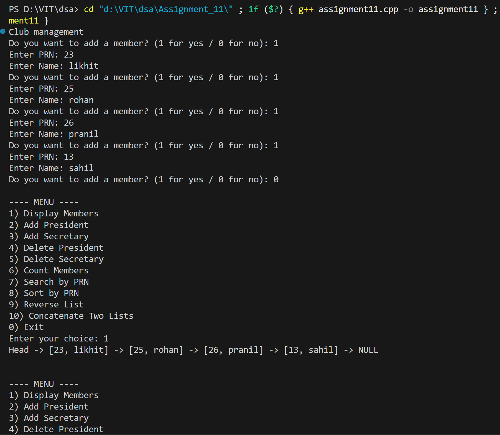
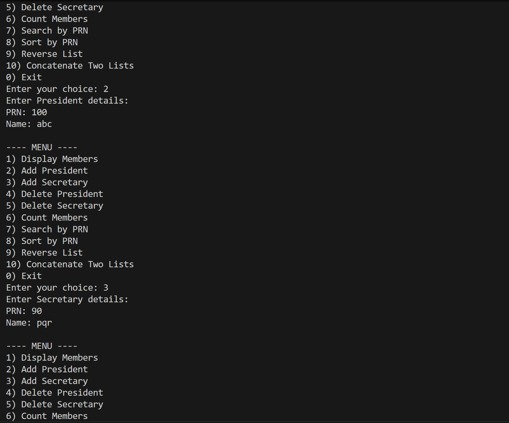
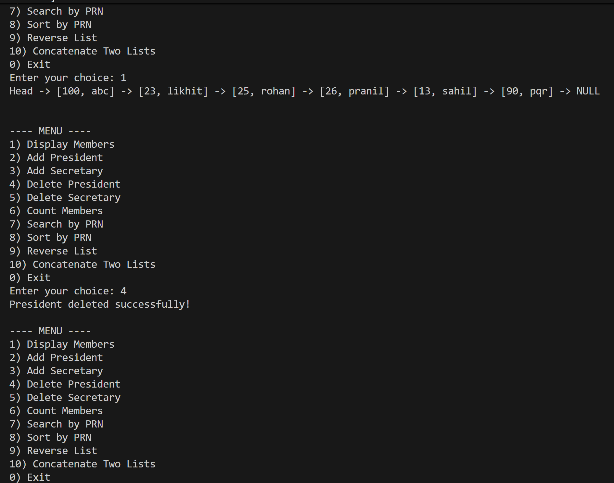
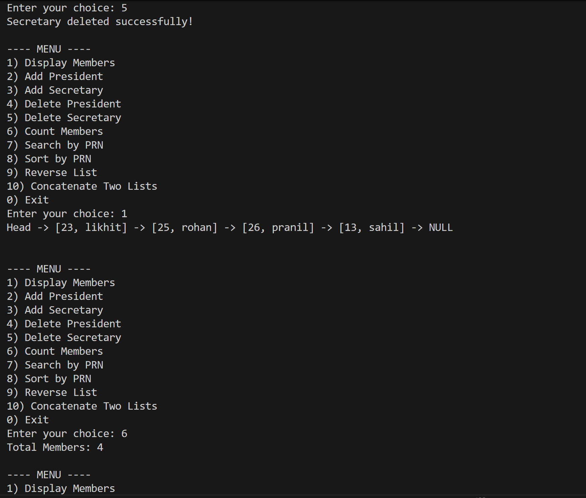
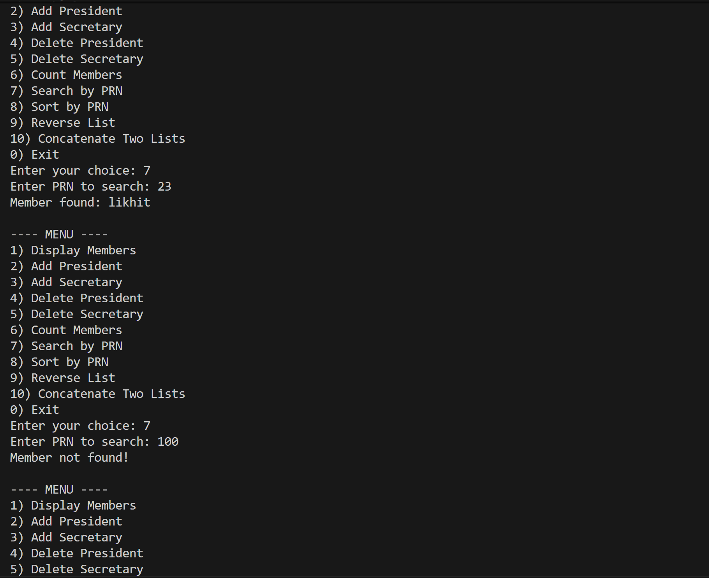
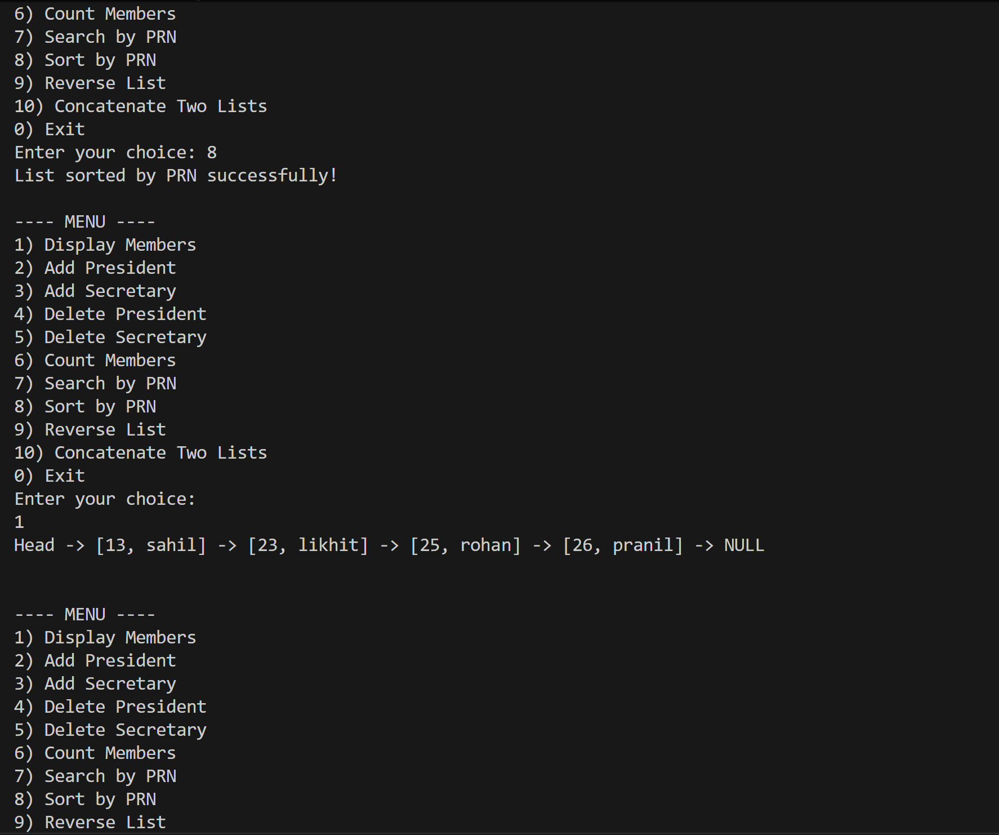
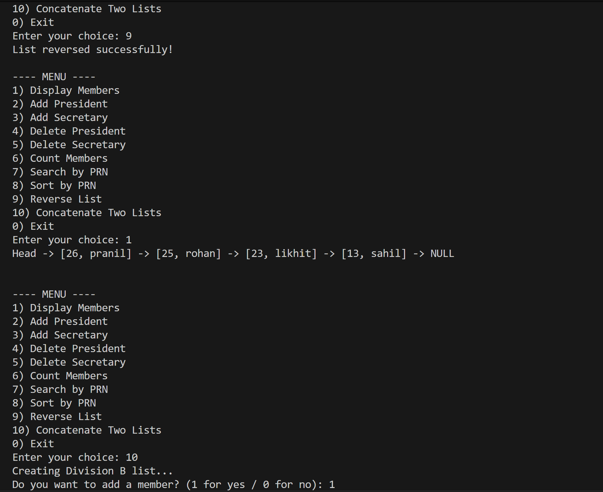
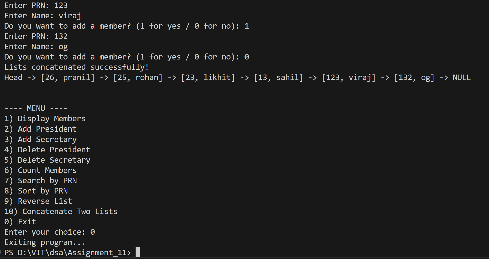

# Singly Linked List - Vertex Club Membership Management

## Name: Likhit Chirmade, Roll no: 23

## Theory

### Singly Linked List

A singly linked list is a linear data structure where each element (node) contains data and a pointer to the next node in the sequence. Unlike arrays, linked lists don't store elements in contiguous memory locations, allowing dynamic memory allocation and efficient insertions/deletions.

**Structure:**
```
Head -> [Data|Next] -> [Data|Next] -> [Data|Next] -> NULL
```

### Node Structure

Each node contains:
- **Data Fields**: Store actual information (PRN, Name)
- **Next Pointer**: Points to the next node in the list

```cpp
struct member {
    unsigned int prn;
    string name;
    struct member *next;
};
```

### Basic Operations

#### 1. **Node Creation**
Allocate memory dynamically for a new node and initialize the next pointer to NULL.

#### 2. **Insertion Operations**

**Insert at Beginning (Add President):**
- Create new node
- Point new node's next to current first node
- Update head to point to new node
- Time Complexity: O(1)

**Insert at End (Add Secretary):**
- Create new node
- Traverse to the last node
- Point last node's next to new node
- Time Complexity: O(n)

#### 3. **Deletion Operations**

**Delete from Beginning (Delete President):**
- Store reference to first node
- Update head to point to second node
- Free memory of first node
- Time Complexity: O(1)

**Delete from End (Delete Secretary):**
- Traverse to second-last node
- Set its next pointer to NULL
- Free memory of last node
- Time Complexity: O(n)

#### 4. **Traversal**
Visit each node sequentially from head to NULL.
- Time Complexity: O(n)

#### 5. **Search**
Traverse the list and compare each node's data with the target value.
- Time Complexity: O(n)

#### 6. **Sorting**
Bubble sort implementation for linked list by swapping data values.
- Time Complexity: O(n²)

#### 7. **Reverse**
Reverse the direction of all next pointers.
- Use three pointers: previous, current, next
- Time Complexity: O(n)

**Algorithm:**
```
prev = NULL
current = head
while current != NULL:
    next = current->next
    current->next = prev
    prev = current
    current = next
head = prev
```

#### 8. **Concatenation**
Join two linked lists by connecting the last node of the first list to the first node of the second list.
- Time Complexity: O(n) where n is length of first list

### Advantages of Linked Lists

1. **Dynamic Size**: Can grow or shrink at runtime
2. **Efficient Insertions/Deletions**: O(1) at beginning, no shifting required
3. **Memory Efficiency**: Allocate memory only when needed
4. **Flexible**: Easy to implement stacks, queues, and other data structures

### Disadvantages

1. **Random Access**: Cannot directly access elements by index (O(n) access time)
2. **Extra Memory**: Requires additional memory for storing pointers
3. **Sequential Access**: Must traverse from beginning to reach a node
4. **Cache Unfriendly**: Non-contiguous memory allocation

### Header Node Approach

This implementation uses a header node (dummy node) that doesn't store actual data:
- Simplifies insertion and deletion operations
- Head pointer always points to the header node
- Actual data starts from `head->next`

### Application: Vertex Club Management

The program manages a student club membership where:
- **President**: First member (insert at beginning)
- **Secretary**: Last member (insert at end)
- **Members**: Stored with PRN (roll no) and name
- **Operations**: Add, delete, search, sort, reverse, and concatenate divisions

### C++ Concepts Used

**Structure with Self-Referential Pointer:**
```cpp
struct member {
    unsigned int prn;
    string name;
    struct member *next;    // Pointer to same structure type
};
```

**typedef for Structure:**
```cpp
typedef struct member_lac { ... } member_lac;

```

**Dynamic Memory Allocation:**
```cpp
member_lac *newnode = new member_lac;    // Allocate
delete temp;                              // Deallocate
```

**Pointer Operations:**
```cpp
temp->next_lac           // Access member through pointer
temp = temp->next_lac    // Move to next node
```

**Pass by Reference for Pointer:**
```cpp
void deleteList(member_lac *&head)    // Can modify the pointer itself
```

**NULL Pointer Check:**
```cpp
if (head->next == NULL)    // Check if list is empty
```

**Swap Function:**
```cpp
swap(ptr1->prn, ptr2->prn);    // Built-in function to swap values
```

### Time Complexity Summary

| Operation | Time Complexity |
|-----------|----------------|
| Insert at Beginning | O(1) |
| Insert at End | O(n) |
| Delete from Beginning | O(1) |
| Delete from End | O(n) |
| Search | O(n) |
| Display | O(n) |
| Count | O(n) |
| Sort | O(n²) |
| Reverse | O(n) |
| Concatenate | O(n) |

## Code

```cpp

#include<iostream>
#include<string>
using namespace std;

typedef struct member_lac {
    unsigned int prn_lac;
    string name_lac;
    struct member_lac *next_lac;
} member_lac;

member_lac *getnode_lac() {
    member_lac *newnode_lac = new member_lac;
    if (newnode_lac == NULL) {
        cout << "getnode_lac(): Memory not allocated!" << endl;
        exit(-1);
    }
    newnode_lac->next_lac = NULL;
    return newnode_lac;
}

member_lac *createList_lac() {
    member_lac *head_lac = getnode_lac();
    head_lac->next_lac = NULL;
    member_lac *temp_lac = head_lac;

    while (1) {
        int ch_lac;
        cout << "Do you want to add a member? (1 for yes / 0 for no): ";
        cin >> ch_lac;
        if (ch_lac == 0)
            break;

        member_lac *cur_lac = getnode_lac();
        cout << "Enter PRN: ";
        cin >> cur_lac->prn_lac;
        cout << "Enter Name: ";
        cin >> cur_lac->name_lac;
        cur_lac->next_lac = NULL;

        temp_lac->next_lac = cur_lac;
        temp_lac = cur_lac;
    }
    return head_lac;
}

void display_lac(member_lac *head_lac) {
    member_lac *temp_lac = head_lac->next_lac;
    cout << "Head -> ";
    while (temp_lac != NULL) {
        cout << "[" << temp_lac->prn_lac << ", " << temp_lac->name_lac << "] -> ";
        temp_lac = temp_lac->next_lac;
    }
    cout << "NULL" << endl << endl;
}

void addPresident_lac(member_lac *head_lac) {
    member_lac *newnode_lac = getnode_lac();
    cout << "Enter President details:" << endl;
    cout << "PRN: ";
    cin >> newnode_lac->prn_lac;
    cout << "Name: ";
    cin >> newnode_lac->name_lac;
    newnode_lac->next_lac = head_lac->next_lac;
    head_lac->next_lac = newnode_lac;
}

void addSecretary_lac(member_lac *head_lac) {
    member_lac *newnode_lac = getnode_lac();
    cout << "Enter Secretary details:" << endl;
    cout << "PRN: ";
    cin >> newnode_lac->prn_lac;
    cout << "Name: ";
    cin >> newnode_lac->name_lac;
    newnode_lac->next_lac = NULL;

    member_lac *temp_lac = head_lac;
    while (temp_lac->next_lac != NULL)
        temp_lac = temp_lac->next_lac;
    temp_lac->next_lac = newnode_lac;
}

void deletePresident_lac(member_lac *head_lac) {
    if (head_lac->next_lac == NULL) {
        cout << "List empty!" << endl;
        return;
    }
    member_lac *temp_lac = head_lac->next_lac;
    head_lac->next_lac = temp_lac->next_lac;
    delete temp_lac;
    cout << "President deleted successfully!" << endl;
}

void deleteSecretary_lac(member_lac *head_lac) {
    if (head_lac->next_lac == NULL) {
        cout << "List empty!" << endl;
        return;
    }
    member_lac *prev_lac = head_lac, *cur_lac = head_lac->next_lac;
    while (cur_lac->next_lac != NULL) {
        prev_lac = cur_lac;
        cur_lac = cur_lac->next_lac;
    }
    prev_lac->next_lac = NULL;
    delete cur_lac;
    cout << "Secretary deleted successfully!" << endl;
}

void countMembers_lac(member_lac *head_lac) {
    int count_lac = 0;
    member_lac *temp_lac = head_lac->next_lac;
    while (temp_lac != NULL) {
        count_lac++;
        temp_lac = temp_lac->next_lac;
    }
    cout << "Total Members: " << count_lac << endl;
}

void search_lac(member_lac *head_lac) {
    unsigned int prn_lac;
    cout << "Enter PRN to search: ";
    cin >> prn_lac;
    member_lac *temp_lac = head_lac->next_lac;
    while (temp_lac != NULL) {
        if (temp_lac->prn_lac == prn_lac) {
            cout << "Member found: " << temp_lac->name_lac << endl;
            return;
        }
        temp_lac = temp_lac->next_lac;
    }
    cout << "Member not found!" << endl;
}

void sort_lac(member_lac *head_lac) {
    if (head_lac->next_lac == NULL) return;
    int swapped_lac;
    member_lac *ptr1_lac;
    member_lac *lptr_lac = NULL;

    do {
        swapped_lac = 0;
        ptr1_lac = head_lac->next_lac;

        while (ptr1_lac->next_lac != lptr_lac) {
            if (ptr1_lac->prn_lac > ptr1_lac->next_lac->prn_lac) {
                swap(ptr1_lac->prn_lac, ptr1_lac->next_lac->prn_lac);
                swap(ptr1_lac->name_lac, ptr1_lac->next_lac->name_lac);
                swapped_lac = 1;
            }
            ptr1_lac = ptr1_lac->next_lac;
        }
        lptr_lac = ptr1_lac;
    } while (swapped_lac);

    cout << "List sorted by PRN successfully!" << endl;
}

void reverse_lac(member_lac *head_lac) {
    member_lac *prev_lac = NULL, *cur_lac = head_lac->next_lac, *next_lac = NULL;
    while (cur_lac != NULL) {
        next_lac = cur_lac->next_lac;
        cur_lac->next_lac = prev_lac;
        prev_lac = cur_lac;
        cur_lac = next_lac;
    }
    head_lac->next_lac = prev_lac;
    cout << "List reversed successfully!" << endl;
}

member_lac *concatenate_lac(member_lac *head1_lac, member_lac *head2_lac) {
    member_lac *temp_lac = head1_lac;
    while (temp_lac->next_lac != NULL)
        temp_lac = temp_lac->next_lac;
    temp_lac->next_lac = head2_lac->next_lac;
    return head1_lac;
}

void deleteList_lac(member_lac *&head_lac) {
    member_lac *temp_lac;
    while (head_lac != NULL) {
        temp_lac = head_lac;
        head_lac = head_lac->next_lac;
        delete temp_lac;
    }
}

int main() {
    cout << "******* Vertex Club Membership Management *******" << endl;
    member_lac *divisionA_lac = NULL, *divisionB_lac = NULL, *merged_lac = NULL;
    divisionA_lac = createList_lac();

    int choice_lac;
    do {
        cout << "\n---- MENU ----" << endl;
        cout << "1) Display Members\n2) Add President\n3) Add Secretary\n4) Delete President\n5) Delete Secretary\n6) Count Members\n7) Search by PRN\n8) Sort by PRN\n9) Reverse List\n10) Concatenate Two Lists\n0) Exit\n";
        cout << "Enter your choice: ";
        cin >> choice_lac;

        switch (choice_lac) {
        case 1:
            display_lac(divisionA_lac);
            break;
        case 2:
            addPresident_lac(divisionA_lac);
            break;
        case 3:
            addSecretary_lac(divisionA_lac);
            break;
        case 4:
            deletePresident_lac(divisionA_lac);
            break;
        case 5:
            deleteSecretary_lac(divisionA_lac);
            break;
        case 6:
            countMembers_lac(divisionA_lac);
            break;
        case 7:
            search_lac(divisionA_lac);
            break;
        case 8:
            sort_lac(divisionA_lac);
            break;
        case 9:
            reverse_lac(divisionA_lac);
            break;
        case 10:
            cout << "Creating Division B list..." << endl;
            divisionB_lac = createList_lac();
            merged_lac = concatenate_lac(divisionA_lac, divisionB_lac);
            cout << "Lists concatenated successfully!" << endl;
            display_lac(merged_lac);
            break;
        case 0:
            cout << "Exiting program..." << endl;
            break;
        default:
            cout << "Invalid choice!" << endl;
        }
    } while (choice_lac != 0);

    deleteList_lac(divisionA_lac);
    deleteList_lac(divisionB_lac);

    return 0;
}
```

## Output









