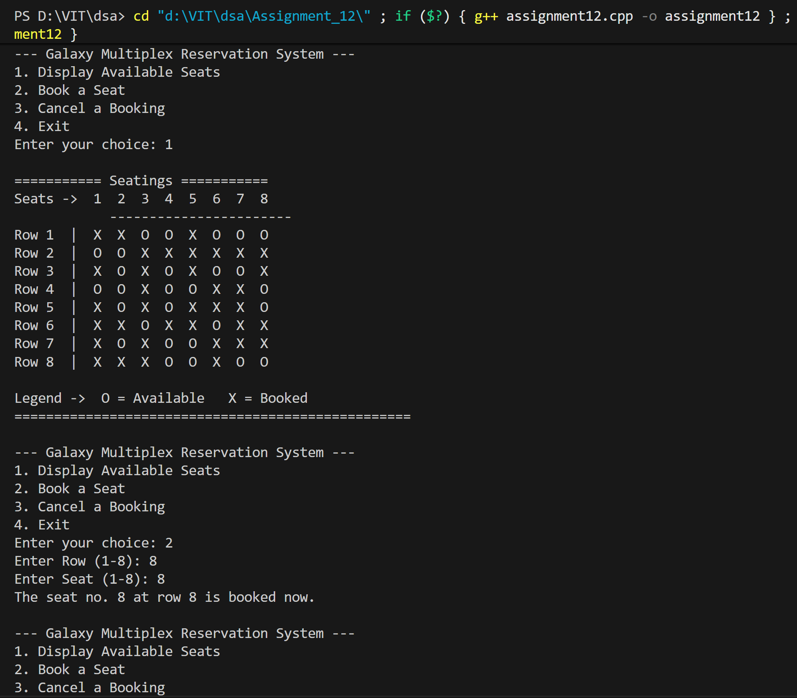
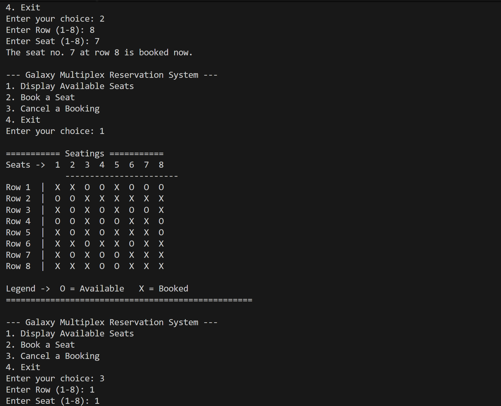
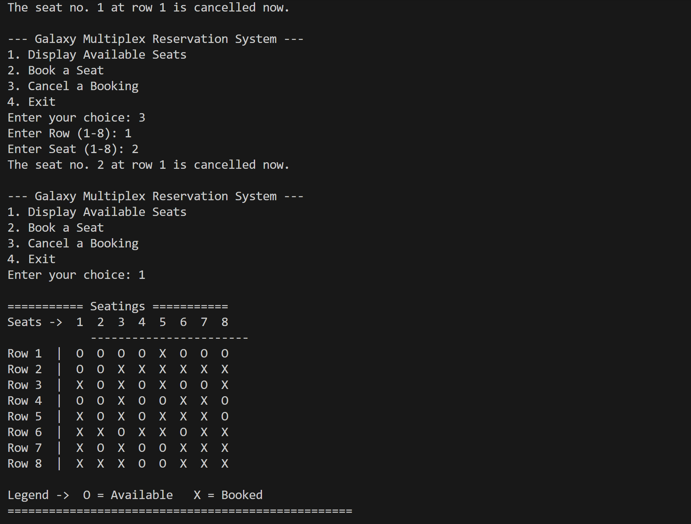

# Doubly Circular Linked List - Movie Theater Seat Reservation System

## Name: Likhit Chirmade, Roll no: 23

## Theory

### Doubly Circular Linked List

A doubly circular linked list is a variation of linked list where:
- Each node has two pointers: one pointing to the next node and one to the previous node
- The last node's next pointer points back to the first node (circular)
- The first node's prev pointer points to the last node (circular)
- Can be traversed in both forward and backward directions

**Structure:**
```
     ┌─────────────────────────────────────┐
     ↓                                     ↑
[Prev|Data|Next] ⇄ [Prev|Data|Next] ⇄ [Prev|Data|Next]
     ↑                                     ↓
     └─────────────────────────────────────┘
```

### Node Structure

```cpp
struct node {
    int data;
    bool flag;
    node *next;    // Points to next node
    node *prev;    // Points to previous node
};
```

### Characteristics

1. **Bidirectional Traversal**: Can move forward and backward
2. **Circular Nature**: No NULL pointers, last connects to first
3. **Header Node**: Dummy node that simplifies operations
4. **Efficient Operations**: Insert/delete at both ends in O(1)

### Basic Operations

#### 1. **Node Creation**
```
Create new node
Set data fields
Initialize next and prev pointers
```

#### 2. **Insertion**
For inserting a node between two nodes:
```
newNode->next = current->next
newNode->prev = current
current->next->prev = newNode
current->next = newNode
```

#### 3. **Deletion**
For deleting a node:
```
node->prev->next = node->next
node->next->prev = node->prev
delete node
```

#### 4. **Traversal**
Start from head and continue until reaching head again:
```
temp = head->next
while (temp != head):
    process temp
    temp = temp->next
```

### Advantages of Doubly Circular Linked List

1. **Bidirectional Navigation**: Can traverse in both directions
2. **No NULL Checks**: Circular nature eliminates NULL pointer checks
3. **Easy Access to Last Node**: Can reach last node from head in O(1)
4. **Efficient Deletion**: Can delete a node without traversing from head
5. **Circular Applications**: Perfect for round-robin scheduling, circular buffers

### Disadvantages

1. **Extra Memory**: Requires two pointers per node instead of one
2. **Complex Implementation**: More complex than singly linked list
3. **Maintenance Overhead**: Need to update two pointers for each operation

### Application: Movie Theater Seat Reservation

The program implements a seat reservation system for Galaxy Multiplex:
- **8 Rows**: Each row represented by a separate doubly circular linked list
- **8 Seats per Row**: Each node represents one seat
- **Array of Head Pointers**: `rows[8]` stores head pointer for each row
- **Seat Status**: Boolean flag indicates if seat is booked or available

### System Design

**Data Structure:**
```
rows[0] → Row 1: Head ⇄ Seat1 ⇄ Seat2 ⇄ ... ⇄ Seat8 ⇄ (back to Head)
rows[1] → Row 2: Head ⇄ Seat1 ⇄ Seat2 ⇄ ... ⇄ Seat8 ⇄ (back to Head)
...
rows[7] → Row 8: Head ⇄ Seat1 ⇄ Seat2 ⇄ ... ⇄ Seat8 ⇄ (back to Head)
```

**Operations:**
1. **Display Available Seats**: Traverse all rows and display unbooked seats
2. **Book Seat**: Mark seat as booked if available
3. **Cancel Booking**: Mark seat as available if currently booked

### Algorithm Details

#### Create List Algorithm
```
1. Create header node
2. Set header->next = header, header->prev = header
3. For each seat (1 to 8):
   a. Create new node
   b. Set seat number
   c. Randomly set booking status
   d. Insert at end of circular list
   e. Maintain circular links
```

#### Book Seat Algorithm
```
1. Get head pointer for specified row
2. Traverse to specified seat number
3. Check if seat is already booked
4. If available, mark as booked
5. If already booked, display error message
```

#### Cancel Booking Algorithm
```
1. Get head pointer for specified row
2. Traverse to specified seat number
3. Check if seat is booked
4. If booked, mark as available
5. If not booked, display message
```

### Time Complexity

| Operation | Time Complexity |
|-----------|----------------|
| Create List | O(n) where n = seats per row |
| Display All Seats | O(rows × seats) = O(64) |
| Book Seat | O(seat_number) |
| Cancel Booking | O(seat_number) |
| Traverse Row | O(n) |

### Space Complexity

- **O(rows × seats)** = O(8 × 8) = O(64) nodes
- Each node stores: seat number, booking status, and two pointers

### C++ Concepts Used

**Structure with Multiple Pointers:**
```cpp
struct mylist {
    int seatNo;
    bool isBooked;
    mylist *next;    // Forward pointer
    mylist *prev;    // Backward pointer
};
```

**Array of Pointers:**
```cpp
mylist *rows[8];    // Array storing 8 head pointers
```

**typedef for Structure:**
```cpp
typedef struct mylist { ... } mylist;
```

**Random Number Generation:**
```cpp
int x = rand() % 2;    // Generates 0 or 1 randomly
```

**Boolean Data Type:**
```cpp
bool isBooked;         // true or false
if (temp->isBooked)    // Check boolean value
```

**Circular List Condition:**
```cpp
while (temp != head)   // Loop until back to head
```

**Pointer Manipulation:**
```cpp
node->next->prev = newNode    // Access through multiple pointers
```

**nullptr vs NULL:**
```cpp
head->next = nullptr;    // Modern C++ null pointer
```

### Advantages of This Design

1. **Efficient Row Access**: O(1) access to any row using array
2. **Circular Navigation**: Can wrap around seats easily
3. **Bidirectional**: Can traverse seats forward or backward
4. **Scalable**: Easy to add more rows or seats
5. **Memory Efficient**: Only stores occupied structure, no empty 2D array

### Real-World Applications

1. **Theater Booking Systems**: Movie theaters, concert halls
2. **Flight Seat Reservation**: Airline seat management
3. **Event Management**: Conference seating arrangements
4. **Train Reservations**: Railway seat booking
5. **Circular Buffers**: Data streaming applications

## Code

```cpp


#include<iostream>
#include<math.h>
using namespace std;

typedef struct mylist_lac
{
    int seatNo_lac;
    bool isBooked_lac;
    mylist_lac *next_lac;
    mylist_lac *prev_lac;
} mylist_lac;

mylist_lac *rows_lac[8];

void createList_lac(mylist_lac *head_lac)
{
    head_lac->next_lac = head_lac;
    head_lac->prev_lac = head_lac;
    mylist_lac *last_lac = head_lac;

    for (int i_lac = 1; i_lac <= 8; i_lac++)
    {
        mylist_lac *node_lac = new mylist_lac;
        node_lac->seatNo_lac = i_lac;
        int x_lac = rand() % 2;
        node_lac->isBooked_lac = (x_lac ? true : false);

        node_lac->prev_lac = last_lac;
        last_lac->next_lac = node_lac;
        node_lac->next_lac = head_lac;
        head_lac->prev_lac = node_lac;

        last_lac = node_lac;
    }
}

void createArray_lac()
{
    for (int i_lac = 0; i_lac < 8; i_lac++)
    {
        mylist_lac *head_lac = new mylist_lac;
        head_lac->next_lac = nullptr;
        head_lac->prev_lac = nullptr;
        rows_lac[i_lac] = head_lac;
        createList_lac(head_lac);
    }
}

void DisplayAvailableSeats_lac()
{
    cout << "\n=========== Seatings ===========\n";
    cout << "Seats ->  1  2  3  4  5  6  7  8\n";
    cout << "            -----------------------\n";

    for (int i_lac = 0; i_lac < 8; i_lac++)
    {
        mylist_lac *head_lac = rows_lac[i_lac];
        mylist_lac *temp_lac = head_lac->next_lac;

        cout << "Row " << i_lac + 1 << "  |  ";

        while (temp_lac != head_lac)
        {
            if (temp_lac->isBooked_lac == false)
            {
                cout << "O  ";     
            }
            else 
            {
                cout << "X  ";     
            }

            temp_lac = temp_lac->next_lac;
        }
        cout << endl;
    }

    cout << "\nLegend ->  O = Available   X = Booked\n";
    cout << "==================================================\n";
}

void BookSeat_lac(int r_lac, int s_lac)
{
    mylist_lac *head_lac = rows_lac[r_lac - 1];
    mylist_lac *temp_lac = head_lac->next_lac;
    for (int i_lac = 1; i_lac < s_lac; i_lac++)
    {
        temp_lac = temp_lac->next_lac;
    }
    if (temp_lac->isBooked_lac)
    {
        cout << "Seat already booked" << endl;
    }
    else
    {
        temp_lac->isBooked_lac = true;
        cout << "The seat no. " << s_lac << " at row " << r_lac << " is booked now." << endl;
    }
}

void CancelSeat_lac(int r_lac, int s_lac)
{
    mylist_lac *head_lac = rows_lac[r_lac - 1];
    mylist_lac *temp_lac = head_lac->next_lac;
    for (int i_lac = 1; i_lac < s_lac; i_lac++)
    {
        temp_lac = temp_lac->next_lac;
    }
    if (temp_lac->isBooked_lac)
    {
        temp_lac->isBooked_lac = false;
        cout << "The seat no. " << s_lac << " at row " << r_lac << " is cancelled now." << endl;
    }
    else
    {
        cout << "The seat no. " << s_lac << " at row " << r_lac << " was not booked." << endl;
    }
}

int main()
{
    createArray_lac();

    int choice_lac;
    do
    {
        cout << "\n--- Galaxy Multiplex Reservation System ---\n";
        cout << "1. Display Available Seats\n";
        cout << "2. Book a Seat\n";
        cout << "3. Cancel a Booking\n";
        cout << "4. Exit\n";
        cout << "Enter your choice: ";
        cin >> choice_lac;

        switch (choice_lac)
        {
        case 1:
            DisplayAvailableSeats_lac();
            break;

        case 2:
        {
            int row_lac, seat_lac;
            cout << "Enter Row (1-8): ";
            cin >> row_lac;
            cout << "Enter Seat (1-8): ";
            cin >> seat_lac;
            if (row_lac >= 1 && row_lac <= 8 && seat_lac >= 1 && seat_lac <= 8)
                BookSeat_lac(row_lac, seat_lac);
            else
                cout << "Invalid row or seat number!\n";
            break;
        }

        case 3:
        {
            int row_lac, seat_lac;
            cout << "Enter Row (1-8): ";
            cin >> row_lac;
            cout << "Enter Seat (1-8): ";
            cin >> seat_lac;
            if (row_lac >= 1 && row_lac <= 8 && seat_lac >= 1 && seat_lac <= 8)
                CancelSeat_lac(row_lac, seat_lac);
            else
                cout << "Invalid row or seat number!\n";
            break;
        }

        case 4:
            cout << "Exiting...\n";
            break;

        default:
            cout << "Invalid choice! Please try again.\n";
        }

    } while (choice_lac != 4);

    return 0;
}

```

## Output




