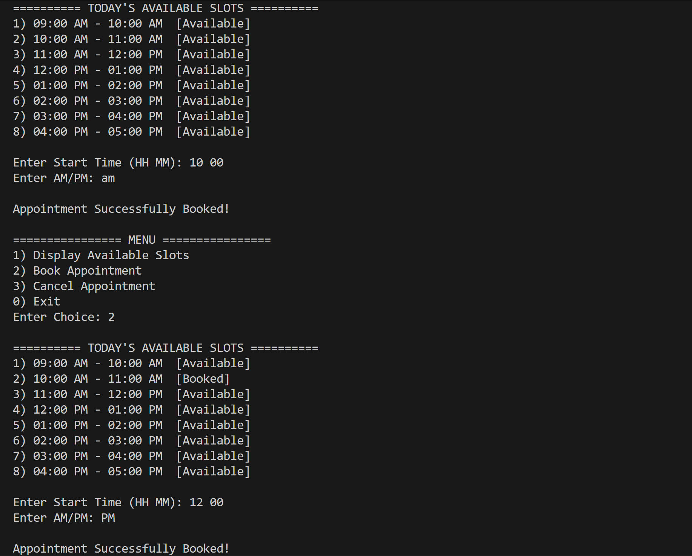
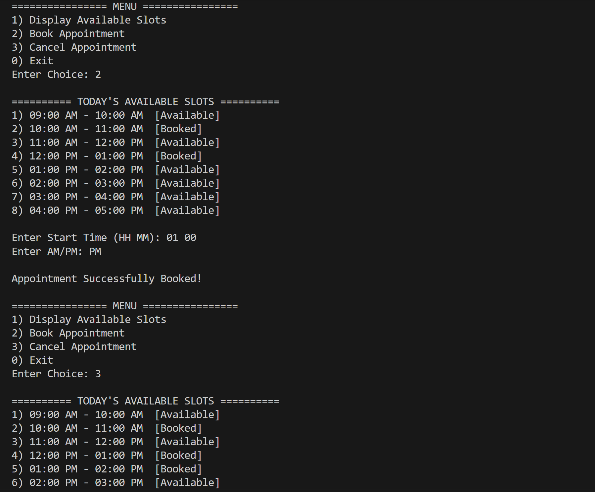
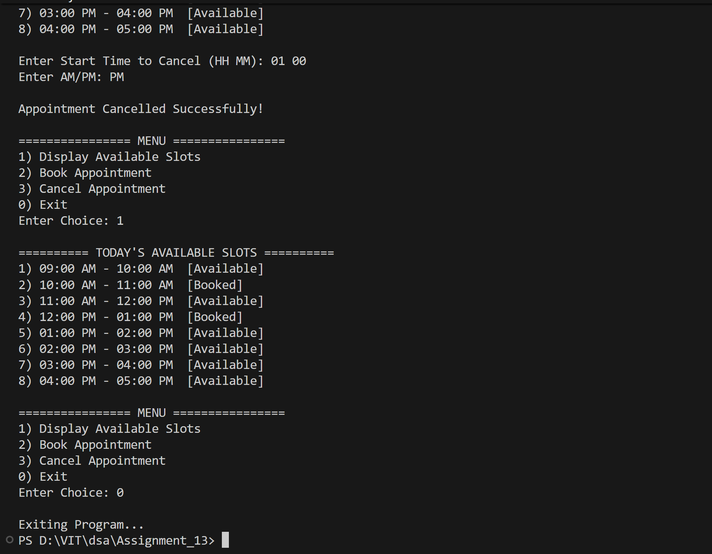

# Appointment Scheduler using Singly Linked List with Two Sorting Methods

## Name: Likhit Chirmade, Roll no: 23

## Theory

### Singly Linked List for Appointment Scheduling

A singly linked list is used to manage appointment time slots dynamically. Each node represents a time slot with start time, end time, and booking status. This data structure is ideal for appointment scheduling as it allows efficient insertion, deletion, and modification of time slots.

### Node Structure

```cpp
struct Appointment {
    int start;        // Start time in minutes from midnight
    int end;          // End time in minutes from midnight
    bool booked;      // Booking status
    Appointment *next; // Pointer to next appointment
};
```

### Time Representation

Time is stored as minutes from midnight for easier calculations:
- **9:00 AM** = 9 × 60 = 540 minutes
- **5:00 PM** = 17 × 60 = 1020 minutes
- **Conversion**: Hours × 60 + Minutes

### Basic Operations

#### 1. **Create Schedule**
Generate random appointment slots within working hours:
- Start time: 9:00 AM (540 minutes)
- End time: 5:00 PM (1020 minutes)
- Duration: Random between 30-60 minutes
- Each slot is initially available (not booked)

#### 2. **Display Slots**
Traverse the linked list and display all time slots with their booking status.

#### 3. **Book Appointment**
- Search for the time slot by start time
- Check if already booked
- Mark as booked if available

#### 4. **Cancel Appointment**
- Search for the time slot by start time
- Check if currently booked
- Mark as available if booked

### Sorting Techniques

The program implements two different sorting approaches:

#### **Method 1: Sorting by Swapping Data**

This method keeps the node structure intact and only swaps the data values between nodes.

**Algorithm:**
```
for each node i in list:
    for each node j after i:
        if i.start > j.start:
            swap(i.start, j.start)
            swap(i.end, j.end)
            swap(i.booked, j.booked)
```

**Characteristics:**
- Simple implementation
- Nodes remain in same memory locations
- Only data values are exchanged
- Time Complexity: O(n²)
- Space Complexity: O(1)

**Advantages:**
- Easy to implement
- No pointer manipulation needed
- Works well for small datasets

**Disadvantages:**
- Inefficient for large data structures
- Multiple swap operations per comparison
- Not suitable when data is large

#### **Method 2: Sorting by Pointer Manipulation**

This method rearranges the actual nodes by changing the next pointers, creating a new sorted list.

**Algorithm (Insertion Sort on Linked List):**
```
sorted = NULL
for each node in original list:
    remove node from original
    insert node in correct position in sorted list
return sorted
```

**Detailed Steps:**
1. Initialize sorted list as empty
2. Take first node from unsorted list
3. Find correct position in sorted list
4. Insert node by adjusting pointers
5. Repeat until all nodes are sorted

**Characteristics:**
- Rearranges node pointers
- Creates new sorted list
- Time Complexity: O(n²)
- Space Complexity: O(1) - in-place sorting

**Advantages:**
- Efficient for large data structures
- Only pointer manipulation, no data copying
- Preserves original node structure
- Better cache performance

**Disadvantages:**
- More complex implementation
- Requires careful pointer handling
- Risk of losing nodes if not careful

### Comparison: Data Swap vs Pointer Manipulation

| Aspect | Data Swap | Pointer Manipulation |
|--------|-----------|---------------------|
| Implementation | Simple | Complex |
| Data Movement | Multiple swaps | No data movement |
| Pointer Changes | None | Multiple |
| Memory Access | Sequential | Random |
| Best For | Small data | Large data |
| Risk | Low | Pointer errors |

### When to Use Each Method

**Use Data Swapping When:**
- Data size is small (few bytes)
- Simple implementation is priority
- List is small
- Debugging ease is important

**Use Pointer Manipulation When:**
- Data size is large (structures with many fields)
- Performance is critical
- Working with large lists
- Memory efficiency is important

### Time Complexity Analysis

| Operation | Time Complexity |
|-----------|----------------|
| Create Schedule | O(n) |
| Display Slots | O(n) |
| Book Appointment | O(n) |
| Cancel Appointment | O(n) |
| Sort by Data Swap | O(n²) |
| Sort by Pointer | O(n²) |
| Search | O(n) |

### Application Features

1. **Dynamic Slot Generation**: Creates random appointment slots
2. **Time Formatting**: Displays time in HH:MM format
3. **Booking Management**: Book and cancel appointments
4. **Dual Sorting**: Compare two sorting approaches
5. **Input Validation**: Handles invalid inputs gracefully

### C++ Concepts Used

**Time Conversion:**
```cpp
int minutes = hours * 60 + mins;    // Convert to minutes
int hours = minutes / 60;            // Extract hours
int mins = minutes % 60;             // Extract minutes
```

**I/O Formatting:**
```cpp
cout << setw(2) << setfill('0') << hours;    // Pad with zeros
```

**Random Duration Generation:**
```cpp
int dur = minDur + (rand() % (maxDur - minDur + 1));
```

**Pointer Manipulation for Sorting:**
```cpp
curr->next = sorted;           // Insert at beginning
sorted = curr;

temp->next = curr;             // Insert in middle
curr->next = temp->next;
```

**Input Error Handling:**
```cpp
if (cin.fail()) {
    cin.clear();               // Clear error flag
    cin.ignore(1000, '\n');    // Discard invalid input
}
```

**Dynamic Memory Management:**
```cpp
Appointment *node = new Appointment;    // Allocate
delete temp;                            // Deallocate
```

**Swap Function:**
```cpp
swap(i->start, j->start);    // Built-in swap for any type
```

### Algorithm Visualization

**Sorting by Data Swap:**
```
Before: [60|90] -> [30|60] -> [90|120]
Compare 60 and 30: Swap data
After:  [30|60] -> [60|90] -> [90|120]
```

**Sorting by Pointer Manipulation:**
```
Original: [60|90] -> [30|60] -> [90|120]

Step 1: Remove [60|90], sorted = [60|90]
Step 2: Remove [30|60], insert before [60|90]
        sorted = [30|60] -> [60|90]
Step 3: Remove [90|120], insert at end
        sorted = [30|60] -> [60|90] -> [90|120]
```

### Real-World Applications

1. **Medical Clinics**: Doctor appointment scheduling
2. **Salons**: Beauty service bookings
3. **Consulting**: Client meeting management
4. **Education**: Tutoring session scheduling
5. **Service Centers**: Repair appointment tracking

## Code

```cpp
#include <iostream>
#include <iomanip>
#include <ctime>
using namespace std;

typedef struct Appointment_lac
{
    int start_lac;
    int end_lac;
    bool booked_lac;
    Appointment_lac *next_lac;
} Appointment_lac;

void displayTime_lac(int time_lac)
{
    int hour_lac = time_lac / 60;
    int min_lac = time_lac % 60;
    string period_lac;

    if (hour_lac >= 12)
    {
        period_lac = "PM";
    }
    else
    {
        period_lac = "AM";
    }

    if (hour_lac == 0)
    {
        hour_lac = 12;
    }
    else if (hour_lac > 12)
    {
        hour_lac = hour_lac - 12;
    }

    cout << setw(2) << setfill('0') << hour_lac << ":" 
         << setw(2) << setfill('0') << min_lac << " " << period_lac;
}

Appointment_lac* createSchedule_lac(int startMin_lac, int endMin_lac)
{
    Appointment_lac *head_lac = NULL;
    Appointment_lac *prev_lac = NULL;

    for (int curr_lac = startMin_lac ; curr_lac + 60 <= endMin_lac ; curr_lac = curr_lac + 60)
    {
        Appointment_lac *node_lac = new Appointment_lac;
        node_lac->start_lac = curr_lac;
        node_lac->end_lac  = curr_lac + 60;
        node_lac->booked_lac = false;
        node_lac->next_lac = NULL;

        if (head_lac == NULL)
        {
            head_lac = node_lac;
        }
        else
        {
            prev_lac->next_lac = node_lac;
        }

        prev_lac = node_lac;
    }

    return head_lac;
}

void displaySlots_lac(Appointment_lac *head_lac)
{
    Appointment_lac *temp_lac = head_lac;
    int index_lac = 1;

    cout << "\n========== TODAY'S AVAILABLE SLOTS ==========\n";

    while (temp_lac != NULL)
    {
        cout << index_lac << ") ";
        displayTime_lac(temp_lac->start_lac);
        cout << " - ";
        displayTime_lac(temp_lac->end_lac);

        if (temp_lac->booked_lac == true)
        {
            cout << "  [Booked]\n";
        }
        else
        {
            cout << "  [Available]\n";
        }

        temp_lac = temp_lac->next_lac;
        index_lac = index_lac + 1;
    }
}

void bookAppointment_lac(Appointment_lac *head_lac)
{
    displaySlots_lac(head_lac);

    int hr_lac, min_lac;
    string period_lac;

    cout << "\nEnter Start Time (HH MM): ";
    cin >> hr_lac >> min_lac;

    cout << "Enter AM/PM: ";
    cin >> period_lac;

    for (char &c_lac : period_lac)
    {
        c_lac = toupper(c_lac);
    }

    if (period_lac == "PM" && hr_lac != 12)
    {
        hr_lac = hr_lac + 12;
    }
    else if (period_lac == "AM" && hr_lac == 12)
    {
        hr_lac = 0;
    }

    int st_lac = (hr_lac * 60) + min_lac;
    Appointment_lac *temp_lac = head_lac;

    while (temp_lac != NULL)
    {
        if (temp_lac->start_lac == st_lac)
        {
            if (temp_lac->booked_lac == true)
            {
                cout << "\nSlot Already Booked!\n";
            }
            else
            {
                temp_lac->booked_lac = true;
                cout << "\nAppointment Successfully Booked!\n";
            }
            return;
        }

        temp_lac = temp_lac->next_lac;
    }

    cout << "\nNo such slot exists.\n";
}

void cancelAppointment_lac(Appointment_lac *head_lac)
{
    displaySlots_lac(head_lac);

    int hr_lac, min_lac;
    string period_lac;

    cout << "\nEnter Start Time to Cancel (HH MM): ";
    cin >> hr_lac >> min_lac;

    cout << "Enter AM/PM: ";
    cin >> period_lac;

    for (char &c_lac : period_lac)
    {
        c_lac = toupper(c_lac);
    }

    if (period_lac == "PM" && hr_lac != 12)
    {
        hr_lac = hr_lac + 12;
    }
    else if (period_lac == "AM" && hr_lac == 12)
    {
        hr_lac = 0;
    }

    int st_lac = (hr_lac * 60) + min_lac;
    Appointment_lac *temp_lac = head_lac;

    while (temp_lac != NULL)
    {
        if (temp_lac->start_lac == st_lac)
        {
            if (temp_lac->booked_lac == false)
            {
                cout << "\nSlot Isn't Booked!\n";
            }
            else
            {
                temp_lac->booked_lac = false;
                cout << "\nAppointment Cancelled Successfully!\n";
            }
            return;
        }

        temp_lac = temp_lac->next_lac;
    }

    cout << "\nInvalid Slot.\n";
}

int main()
{
    int start_lac = 9 * 60;
    int end_lac   = 17 * 60;

    Appointment_lac *head_lac = createSchedule_lac(start_lac, end_lac);
    int choice_lac = -1;

    while (choice_lac != 0)
    {
        cout << "\n================ MENU ================\n";
        cout << "1) Display Available Slots\n";
        cout << "2) Book Appointment\n";
        cout << "3) Cancel Appointment\n";
        cout << "0) Exit\n";
        cout << "Enter Choice: ";
        cin >> choice_lac;

        if (choice_lac == 1)
        {
            displaySlots_lac(head_lac);
        }
        else if (choice_lac == 2)
        {
            bookAppointment_lac(head_lac);
        }
        else if (choice_lac == 3)
        {
            cancelAppointment_lac(head_lac);
        }
        else if (choice_lac == 0)
        {
            cout << "\nExiting Program...\n";
        }
        else
        {
            cout << "\nInvalid Input\n";
        }
    }

    return 0;
}

```

## Output





