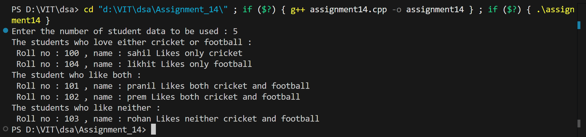

# Set Operations using Linked List - Student Sports Preferences

## Name: Likhit Chirmade, Roll no: 23

## Theory

### Set Theory and Operations

Set theory is a fundamental concept in mathematics and computer science that deals with collections of distinct objects. In this program, we use linked lists to represent sets of students and their sports preferences, then perform various set operations.

### Basic Set Operations

#### 1. **Union (A ∪ B)**
The union of two sets contains all elements that are in either set A or set B or both.
- **Formula**: A ∪ B = {x | x ∈ A or x ∈ B}
- **Example**: If A = {1, 2, 3} and B = {3, 4, 5}, then A ∪ B = {1, 2, 3, 4, 5}

#### 2. **Intersection (A ∩ B)**
The intersection of two sets contains only elements that are in both set A and set B.
- **Formula**: A ∩ B = {x | x ∈ A and x ∈ B}
- **Example**: If A = {1, 2, 3} and B = {3, 4, 5}, then A ∩ B = {3}

#### 3. **Difference (A - B)**
The difference of two sets contains elements that are in set A but not in set B.
- **Formula**: A - B = {x | x ∈ A and x ∉ B}
- **Example**: If A = {1, 2, 3} and B = {3, 4, 5}, then A - B = {1, 2}

#### 4. **Symmetric Difference (A ⊕ B)**
The symmetric difference contains elements that are in either set A or set B, but not in both.
- **Formula**: A ⊕ B = (A - B) ∪ (B - A) = (A ∪ B) - (A ∩ B)
- **Example**: If A = {1, 2, 3} and B = {3, 4, 5}, then A ⊕ B = {1, 2, 4, 5}

#### 5. **Complement (A')**
The complement of a set contains all elements in the universal set that are not in set A.
- **Formula**: A' = U - A (where U is the universal set)
- **Example**: If U = {1, 2, 3, 4, 5} and A = {1, 2}, then A' = {3, 4, 5}

### Application: Student Sports Preferences

In this program:
- **Universal Set (U)**: All students in the class
- **Set C**: Students who like Cricket
- **Set F**: Students who like Football

**Operations Implemented:**

1. **C ∩ F (Intersection)**: Students who like both Cricket AND Football
   - Condition: `likesCricket == true AND likesFootball == true`

2. **C ⊕ F (Symmetric Difference)**: Students who like either Cricket OR Football, but not both
   - Condition: `(likesCricket XOR likesFootball)`
   - Includes: Students who like only Cricket OR only Football

3. **(C ∪ F)' (Complement of Union)**: Students who like neither Cricket nor Football
   - Condition: `likesCricket == false AND likesFootball == false`


### Logical Operations

**AND Operation (Intersection):**
```
likesCricket  likesFootball  Result (Both)
     0              0            0
     0              1            0
     1              0            0
     1              1            1  ← Only this case
```

**XOR Operation (Symmetric Difference):**
```
likesCricket  likesFootball  Result (Either, not both)
     0              0            0
     0              1            1  ← Only Football
     1              0            1  ← Only Cricket
     1              1            0
```

**NOR Operation (Neither):**
```
likesCricket  likesFootball  Result (Neither)
     0              0            1  ← Only this case
     0              1            0
     1              0            0
     1              1            0
```

### Implementation Using Linked List

**Node Structure:**
```cpp
struct Student {
    int rollNo;
    string name;
    bool likesCricket;    // Set membership flag
    bool likesFootball;   // Set membership flag
    Student *next;
};
```

**Advantages of Using Linked List:**
1. Dynamic size - can add/remove students easily
2. Memory efficient - only stores actual data
3. Easy traversal for set operations
4. No fixed size limitation

### Algorithm for Set Operations

#### Intersection (Both Cricket and Football)
```
traverse list:
    if (likesCricket AND likesFootball):
        display student
```

#### Symmetric Difference (Either but not both)
```
traverse list:
    if (likesCricket XOR likesFootball):
        display student
```

#### Complement (Neither)
```
traverse list:
    if (NOT likesCricket AND NOT likesFootball):
        display student
```

### Time Complexity

| Operation | Time Complexity |
|-----------|----------------|
| Create List | O(n) |
| Display Intersection | O(n) |
| Display Symmetric Difference | O(n) |
| Display Complement | O(n) |
| Overall | O(n) |

Where n = number of students

### Space Complexity

- **O(n)**: Stores n student nodes in linked list
- Each node contains: roll number, name, two boolean flags, and one pointer

### Boolean Logic in C++

**Logical AND (&&):**
```cpp
if (condition1 && condition2)    // Both must be true
```

**Logical OR (||):**
```cpp
if (condition1 || condition2)    // At least one must be true
```

**Logical NOT (!):**
```cpp
if (!condition)                  // Negation
```

**XOR (Exclusive OR):**
```cpp
if ((condition1 && !condition2) || (!condition1 && condition2))
// Or using bitwise: if (condition1 ^ condition2)
```

### C++ Concepts Used

**Boolean Data Type:**
```cpp
bool likesCricket = true;        // Boolean variable
bool likesFootball = false;
```

**Random Boolean Generation:**
```cpp
int var = rand() % 2;            // Generates 0 or 1
bool flag = var;                 // Implicit conversion to bool
```

**Array of Strings:**
```cpp
string names[6] = {"name1", "name2", ...};
string selected = names[rand() % 6];    // Random selection
```

**Conditional Logic:**
```cpp
if (condition1 && condition2)           // AND
if (condition1 || condition2)           // OR
if (!condition1 && !condition2)         // NOR
if ((condition1 && !condition2) || (!condition1 && condition2))  // XOR
```

**typedef for Structure:**
```cpp
typedef struct sll_lac { ... } sll_lac;
```

**nullptr:**
```cpp
node->next = nullptr;            // Modern C++ null pointer
```

### Real-World Applications

1. **Database Queries**: Finding records matching multiple criteria
2. **Social Networks**: Finding common friends, unique connections
3. **E-commerce**: Product filtering (multiple attributes)
4. **Student Management**: Course enrollment analysis
5. **Survey Analysis**: Preference matching and analysis
6. **Recommendation Systems**: Finding similar user preferences

### Mathematical Properties

**Commutative:**
- A ∪ B = B ∪ A
- A ∩ B = B ∩ A

**Associative:**
- (A ∪ B) ∪ C = A ∪ (B ∪ C)
- (A ∩ B) ∩ C = A ∩ (B ∩ C)

**Distributive:**
- A ∪ (B ∩ C) = (A ∪ B) ∩ (A ∪ C)
- A ∩ (B ∪ C) = (A ∩ B) ∪ (A ∩ C)

**De Morgan's Laws:**
- (A ∪ B)' = A' ∩ B'
- (A ∩ B)' = A' ∪ B'

## Code

```cpp
#include<iostream>
#include<math.h>
#include<string>
using namespace std;

typedef struct sll_lac{
    int rno_lac;
    string name_lac;
    bool likesCricket_lac;
    bool likesFootball_lac;
    sll_lac *next_lac;
}sll_lac;

sll_lac *getNode_lac()
{
    sll_lac *node_lac = new sll_lac;
    node_lac->next_lac = nullptr;
    return node_lac;
}

sll_lac *createList_lac(int n)
{
    int no_lac = 100;
    string namearr_lac[6] = {"likhit","sahil","pranil","prem","rohan","xyz"};
    sll_lac *head_lac = getNode_lac();
    sll_lac *temp_lac = head_lac;
    for(int i=0; i<n; i++)
    {
        sll_lac *node_lac = getNode_lac();
        int cvar_lac = rand() % 2;
        int fvar_lac = rand() % 2;
        int svar_lac = rand() % 6;

        node_lac->rno_lac = no_lac++;
        node_lac->name_lac = namearr_lac[svar_lac];
        node_lac->likesCricket_lac = cvar_lac;
        node_lac->likesFootball_lac = fvar_lac;

        temp_lac->next_lac = node_lac;
        temp_lac = temp_lac->next_lac;
    }
    return head_lac;
}

void DisplayIntersection_lac(sll_lac *head_lac)
{
    sll_lac *temp_lac = head_lac->next_lac;
    while(temp_lac != nullptr)
    {
        if(temp_lac->likesCricket_lac && temp_lac->likesFootball_lac)
        {
            cout<<" Roll no : "<<temp_lac->rno_lac<<" , name : "<<temp_lac->name_lac<<" Likes both cricket and football";
            cout<<endl;
        }
        temp_lac = temp_lac->next_lac;
    }
}

void DisplayNonIntersection_lac(sll_lac *head_lac)
{
    sll_lac *temp_lac = head_lac->next_lac;
    while(temp_lac != nullptr)
    {
        if(temp_lac->likesCricket_lac || temp_lac->likesFootball_lac)
        {
            if(temp_lac->likesCricket_lac && !temp_lac->likesFootball_lac)
            {
                cout<<" Roll no : "<<temp_lac->rno_lac<<" , name : "<<temp_lac->name_lac<<" Likes only cricket";
                cout<<endl;
            }
            if(temp_lac->likesFootball_lac && !temp_lac->likesCricket_lac)
            {
                cout<<" Roll no : "<<temp_lac->rno_lac<<" , name : "<<temp_lac->name_lac<<" Likes only football";
                cout<<endl;
            }
        }
        temp_lac = temp_lac->next_lac;
    }
}

void displayLikeNone_lac(sll_lac *head_lac)
{
    sll_lac *temp_lac = head_lac->next_lac;
    while(temp_lac != nullptr)
    {
        if(!temp_lac->likesCricket_lac && !temp_lac->likesFootball_lac)
        {
            cout<<" Roll no : "<<temp_lac->rno_lac<<" , name : "<<temp_lac->name_lac<<" Likes neither cricket and football";
            cout<<endl;
        }
        temp_lac = temp_lac->next_lac;
    }
}

int main()
{
    int x_lac;
    cout<<"Enter the number of student data to be used : ";
    cin>>x_lac;
    sll_lac *list_lac = createList_lac(x_lac);   

    cout<<"The students who love either cricket or football : "<<endl;
    DisplayNonIntersection_lac(list_lac);

    cout<<"The student who like both : "<<endl;
    DisplayIntersection_lac(list_lac);

    cout<<"The students who like neither : "<<endl;
    displayLikeNone_lac(list_lac);

    return 0;
}
```

## Output

