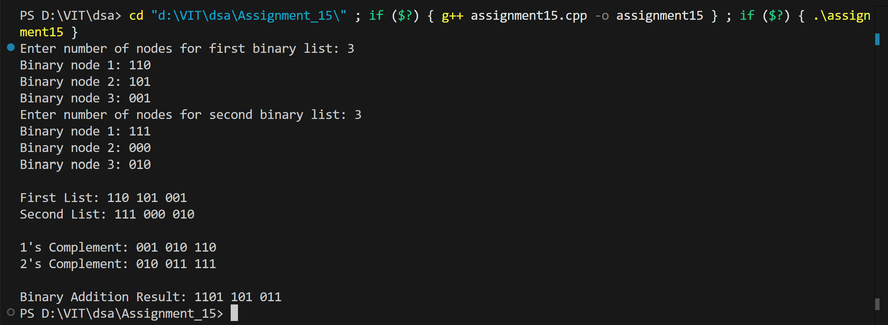
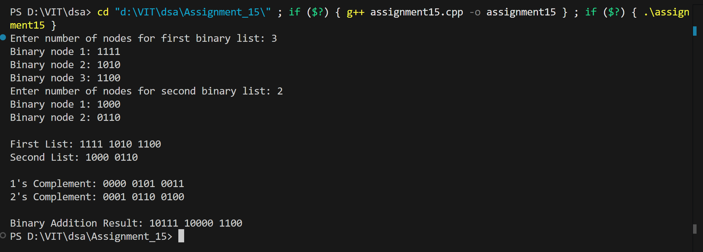

# Binary Number Operations using Doubly Linked List

## Name: Likhit Chirmade, Roll no: 23

## Theory

### Binary Number System

The binary number system is a base-2 numeral system that uses only two digits: 0 and 1. It is fundamental to digital electronics and computer systems as all data is ultimately represented in binary form.

**Decimal to Binary Conversion:**
- Divide the decimal number by 2 repeatedly
- Record remainders in reverse order
- Example: 13₁₀ = 1101₂

**Binary to Decimal Conversion:**
- Multiply each bit by 2 raised to its position (from right, starting at 0)
- Sum all products
- Example: 1101₂ = 1×2³ + 1×2² + 0×2¹ + 1×2⁰ = 8 + 4 + 0 + 1 = 13₁₀

### Binary Arithmetic Operations

#### 1. **One's Complement**

One's complement is obtained by inverting all bits (changing 0 to 1 and 1 to 0).

**Algorithm:**
```
For each bit in binary number:
    if bit == 0:
        result_bit = 1
    else:
        result_bit = 0
```

**Example:**
```
Original:        1 0 1 1 0
One's Complement: 0 1 0 0 1
```

**Properties:**
- Used in signed number representation
- Two representations of zero: all 0s and all 1s
- Simple to compute: just flip all bits

#### 2. **Two's Complement**

Two's complement is obtained by adding 1 to the one's complement. It is the most common method for representing signed integers in computers.

**Algorithm:**
```
1. Find one's complement
2. Add 1 to the result
```

**Example:**
```
Original:         1 0 1 1 0  (22 in decimal)
One's Complement: 0 1 0 0 1
Add 1:          + 0 0 0 0 1
Two's Complement: 0 1 0 1 0  (-22 in two's complement)
```

**Properties:**
- Only one representation of zero
- Range for n bits: -2^(n-1) to 2^(n-1) - 1
- Addition and subtraction use same hardware
- Most significant bit (MSB) indicates sign: 0 = positive, 1 = negative

**Advantages of Two's Complement:**
1. Unique representation of zero
2. Simple addition/subtraction circuits
3. Sign extension is straightforward
4. Widely used in modern computers

#### 3. **Binary Addition**

Binary addition follows similar rules to decimal addition, but with base 2.

**Rules:**
```
0 + 0 = 0
0 + 1 = 1
1 + 0 = 1
1 + 1 = 10 (0 with carry 1)
1 + 1 + 1 = 11 (1 with carry 1)
```

**Example:**
```
    1 0 1 1  (11 in decimal)
  + 0 1 1 0  (6 in decimal)
  ---------
  1 0 0 0 1  (17 in decimal)
  
Carry: 1 1 1 0
```

**Algorithm:**
```
1. Start from rightmost bit (LSB)
2. Add corresponding bits plus any carry
3. Record sum bit and new carry
4. Move to next bit position
5. Repeat until all bits processed
```

### Doubly Linked List for Binary Numbers

A doubly linked list is used where each node stores a binary number as a string. This allows:
- Forward and backward traversal
- Easy insertion and deletion
- Dynamic size management

**Node Structure:**
```cpp
struct Node {
    string binary;    // Stores binary number as string
    Node* prev;       // Pointer to previous node
    Node* next;       // Pointer to next node
};
```

**Advantages of Using Linked List:**
1. Can store arbitrarily large binary numbers
2. Easy to add/remove digits
3. No fixed size limitation
4. Efficient memory usage

### Implementation Approach

#### One's Complement Implementation
```
For each node in list:
    For each character in binary string:
        if char == '0':
            append '1' to result
        else:
            append '0' to result
    Store result in new node
```

#### Two's Complement Implementation
```
1. Get one's complement
2. For each node:
    Convert binary string to decimal
    Add 1
    Convert back to binary string
    Store in node
```

#### Binary Addition Implementation
```
For each pair of nodes from both lists:
    Convert both binary strings to decimal
    Add the decimal values
    Convert sum back to binary
    Store in result list
```

### String to Integer Conversion in C++

**stoi() function:**
```cpp
int num = stoi(binaryString, nullptr, 2);
// Parameters:
// - binaryString: string to convert
// - nullptr: position of first character after number
// - 2: base (binary)
```

**Example:**
```cpp
string bin = "1011";
int decimal = stoi(bin, nullptr, 2);  // decimal = 11
```

### Integer to Binary Conversion

**Algorithm:**
```cpp
string binary = "";
while (num > 0) {
    binary = char('0' + num % 2) + binary;  // Prepend remainder
    num /= 2;
}
```

**Example:**
```
num = 13
13 % 2 = 1, binary = "1", num = 6
6 % 2 = 0, binary = "01", num = 3
3 % 2 = 1, binary = "101", num = 1
1 % 2 = 1, binary = "1101", num = 0
Result: "1101"
```

### Time Complexity

| Operation | Time Complexity |
|-----------|----------------|
| Insert at End | O(n) - traverse to end |
| Display | O(n) |
| One's Complement | O(n × m) where m = avg string length |
| Two's Complement | O(n × m) |
| Binary Addition | O(n × m) |

### Space Complexity

- **O(n)**: Stores n nodes in linked list
- Each node stores a binary string of variable length

### C++ Concepts Used

**String Manipulation:**
```cpp
string str = "";
str += '1';                    // Append character
for (char c : str)             // Range-based for loop
    process(c);
```

**Character to String Conversion:**
```cpp
char c = '0' + digit;          // Convert digit to character
string s = char('0' + digit) + s;  // Prepend to string
```

**Ternary Operator:**
```cpp
result = (condition) ? value_if_true : value_if_false;
comp += (c == '0') ? '1' : '0';
```

**String to Integer with Base:**
```cpp
int num = stoi(str, nullptr, 2);    // Binary to decimal
int num = stoi(str, nullptr, 10);   // String to decimal
```

**Pointer Traversal:**
```cpp
Node* temp = head->next_lac;
while (temp) {
    process(temp);
    temp = temp->next_lac;
}
```

**Dynamic Memory Allocation:**
```cpp
Node* node = new Node;             // Allocate node
node->bin_lac = value;             // Assign value
```

**Header Node Pattern:**
```cpp
Node* head = new Node;             // Dummy header node
head->next_lac = nullptr;          // Initialize
// Actual data starts from head->next_lac
```

### Real-World Applications

1. **Computer Arithmetic**: CPU operations on binary numbers
2. **Digital Signal Processing**: Binary data manipulation
3. **Cryptography**: Binary operations in encryption algorithms
4. **Network Protocols**: Binary packet processing
5. **Error Detection**: Checksum and parity calculations
6. **Image Processing**: Pixel manipulation in binary format

### Binary Number Properties

**Even/Odd Detection:**
- If LSB (rightmost bit) = 0, number is even
- If LSB = 1, number is odd

**Power of 2 Detection:**
- A number is a power of 2 if it has only one '1' bit
- Example: 8 = 1000₂, 16 = 10000₂

**Multiplication/Division by 2:**
- Left shift (<<) multiplies by 2
- Right shift (>>) divides by 2
- Example: 5₁₀ = 101₂, 5 << 1 = 1010₂ = 10₁₀

## Code

```cpp
#include <iostream>
#include <string>
using namespace std;

struct Node_lac
{
    string bin_lac;
    Node_lac *prev_lac;
    Node_lac *next_lac;
};

void insertAtEnd_lac(Node_lac *head, string bin_lac)
{
    Node_lac *node_lac = new Node_lac;
    node_lac->bin_lac = bin_lac;
    node_lac->next_lac = nullptr;

    Node_lac *temp_lac = head;
    while(temp_lac->next_lac != nullptr)
    {
        temp_lac = temp_lac->next_lac;
    }

    temp_lac->next_lac = node_lac;
    node_lac->prev_lac = temp_lac;
}

void display_lac(Node_lac *head)
{
    Node_lac *temp_lac = head->next_lac;
    while(temp_lac != nullptr)
    {
        cout << temp_lac->bin_lac << " ";
        temp_lac = temp_lac->next_lac;
    }
    cout << endl;
}

Node_lac* onesComplement_lac(Node_lac *head)
{
    Node_lac *newHead_lac = new Node_lac;
    newHead_lac->next_lac = nullptr;
    newHead_lac->prev_lac = nullptr;

    Node_lac *temp_lac = head->next_lac;

    while(temp_lac != nullptr)
    {
        string str_lac = temp_lac->bin_lac;
        for(int i=0;i<str_lac.length();i++)
        {
            str_lac[i] = (str_lac[i]=='0') ? '1' : '0';
        }
        insertAtEnd_lac(newHead_lac,str_lac);
        temp_lac = temp_lac->next_lac;
    }

    return newHead_lac;
}

string addBinaryString_lac(string a_lac, string b_lac)
{
    string res_lac = "";
    int carry_lac = 0;

    int i = a_lac.size()-1;
    int j = b_lac.size()-1;

    while(i>=0 || j>=0 || carry_lac)
    {
        int sum_lac = carry_lac;
        if(i>=0) sum_lac += a_lac[i--]-'0';
        if(j>=0) sum_lac += b_lac[j--]-'0';

        res_lac = char(sum_lac%2+'0') + res_lac;
        carry_lac = sum_lac/2;
    }

    return res_lac;
}

Node_lac* twosComplement_lac(Node_lac *head)
{
    Node_lac *oneComp_lac = onesComplement_lac(head);
    Node_lac *temp_lac = oneComp_lac->next_lac;

    while(temp_lac != nullptr)
    {
        temp_lac->bin_lac = addBinaryString_lac(temp_lac->bin_lac,"1");
        temp_lac = temp_lac->next_lac;
    }
    return oneComp_lac;
}

Node_lac* addBinary_lac(Node_lac *A_lac, Node_lac *B_lac)
{
    Node_lac *sumHead_lac = new Node_lac;
    sumHead_lac->next_lac = nullptr;
    sumHead_lac->prev_lac = nullptr;

    Node_lac *p_lac = A_lac->next_lac;
    Node_lac *q_lac = B_lac->next_lac;

    while(p_lac != nullptr || q_lac != nullptr)
    {
        string num1_lac = (p_lac) ? p_lac->bin_lac : "0";
        string num2_lac = (q_lac) ? q_lac->bin_lac : "0";

        string res_lac = addBinaryString_lac(num1_lac,num2_lac);
        insertAtEnd_lac(sumHead_lac,res_lac);

        if(p_lac) p_lac = p_lac->next_lac;
        if(q_lac) q_lac = q_lac->next_lac;
    }
    return sumHead_lac;
}

int main()
{
    Node_lac *head1 = new Node_lac;
    head1->next_lac = nullptr;
    head1->prev_lac = nullptr;

    Node_lac *head2 = new Node_lac;
    head2->next_lac = nullptr;
    head2->prev_lac = nullptr;

    int n1_lac,n2_lac;
    cout << "Enter number of nodes for first binary list: ";
    cin >> n1_lac;

    for(int i=0;i<n1_lac;i++)
    {
        string s_lac;
        cout << "Binary node " << i+1 << ": ";
        cin >> s_lac;
        insertAtEnd_lac(head1,s_lac);
    }

    cout << "Enter number of nodes for second binary list: ";
    cin >> n2_lac;

    for(int i=0;i<n2_lac;i++)
    {
        string s_lac;
        cout << "Binary node " << i+1 << ": ";
        cin >> s_lac;
        insertAtEnd_lac(head2,s_lac);
    }

    cout << "\nFirst List: ";
    display_lac(head1);

    cout << "Second List: ";
    display_lac(head2);

    cout << "\n1's Complement: ";
    display_lac(onesComplement_lac(head1));

    cout << "2's Complement: ";
    display_lac(twosComplement_lac(head1));

    cout << "\nBinary Addition Result: ";
    display_lac(addBinary_lac(head1,head2));

    return 0;
}

```

## Output



