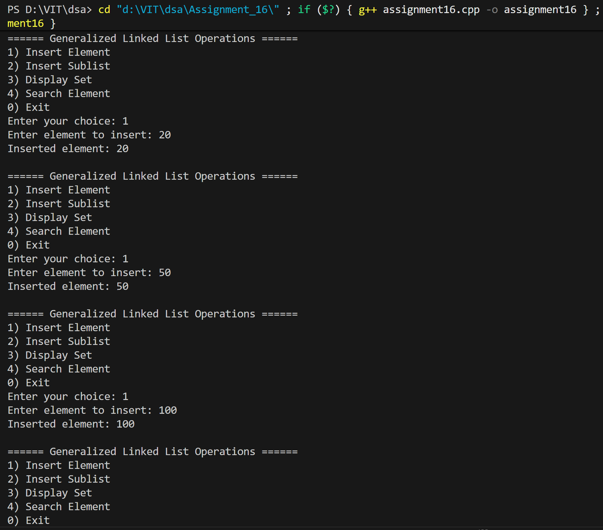
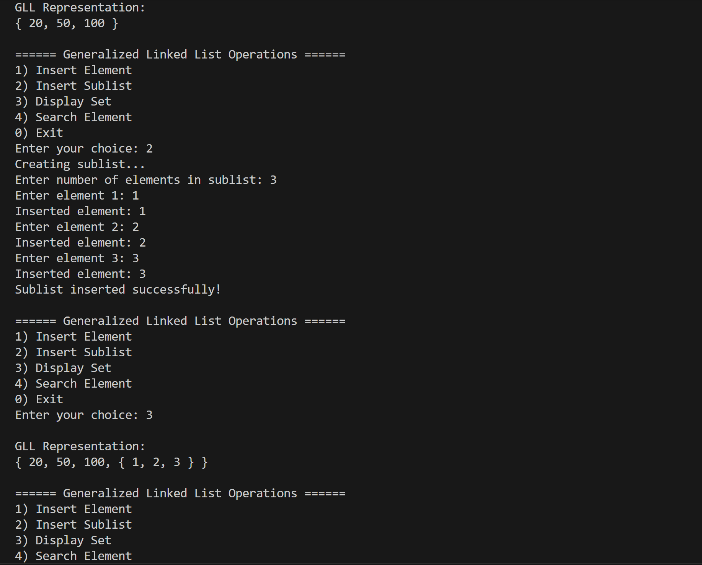
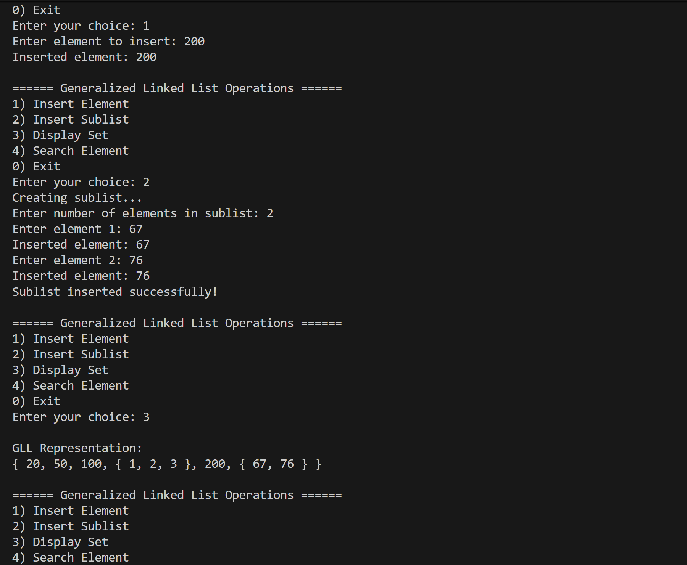
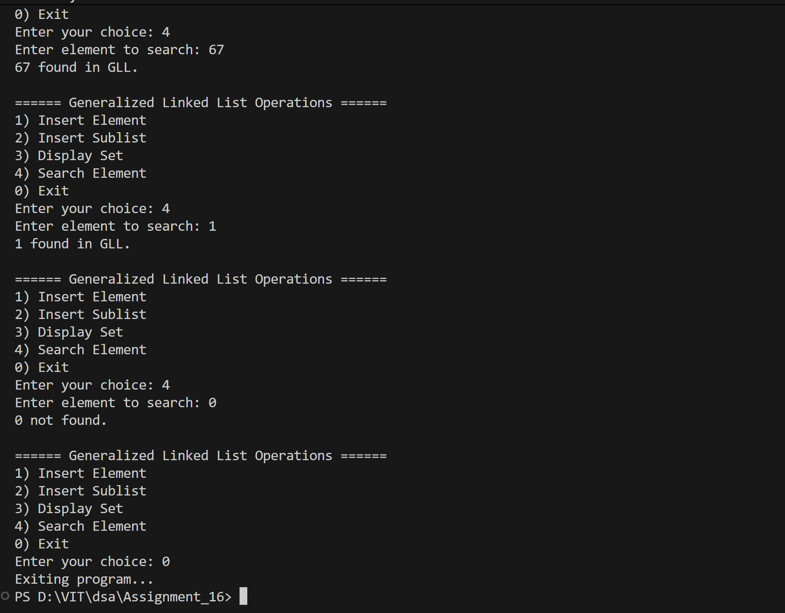

# Generalized Linked List (GLL) for Set Implementation

## Name: Likhit Chirmade, Roll no: 23

## Theory

### Generalized Linked List (GLL)

A GLL can store both atoms (simple elements) and sublists (nested structures).

**Node Structure:**
```cpp
struct Node {
    int flag;        // 0 = atom, 1 = sublist
    string data;     // For atoms
    Node* down;      // Points to sublist
    Node* next;      // Points to next element
};
```

### Flag System

- **flag = 0:** Node contains atom (simple data)
- **flag = 1:** Node contains sublist (down pointer used)

### Example

```
Set: {a, {b, c}, d}

Structure:
head → [0,a] → [1,*] → [0,d] → NULL
              ↓
            [0,b] → [0,c] → NULL
```

### Operations

#### Insert Atom
```
1. Create node with flag = 0
2. Set data field
3. Append to list
```

#### Insert Sublist
```
1. Create sublist recursively
2. Create node with flag = 1
3. Set down pointer to sublist
4. Append to main list
```

#### Display (Recursive)
```
display(head):
    print "{ "
    for each node:
        if flag == 0:
            print data
        else:
            display(down)  // Recursive call
        if not last: print ", "
    print " }"
```

#### Search (Recursive)
```
search(head, target):
    for each node:
        if flag == 0 and data == target:
            return true
        if flag == 1 and search(down, target):
            return true
    return false
```

### Time Complexity

| Operation | Complexity |
|-----------|------------|
| Insert Atom | O(n) |
| Insert Sublist | O(n) |
| Display | O(n) |
| Search | O(n) |

### Space Complexity

O(n + d) where n = nodes, d = depth of nesting

## Code

```cpp
#include <iostream>
#include <string>
#include <new>
using namespace std;

typedef struct node_lac {
    int flag_lac;
    string data_lac;
    struct node_lac *down_lac;
    struct node_lac *next_lac;
} node_lac;

node_lac* getNode_lac(int flag_lac, string data_lac = "") {
    node_lac* newnode_lac = new(nothrow) node_lac;
    if (!newnode_lac) {
        cout << "Memory allocation failed!\n";
        exit(-1);
    }
    newnode_lac->flag_lac = flag_lac;
    newnode_lac->data_lac = data_lac;
    newnode_lac->down_lac = NULL;
    newnode_lac->next_lac = NULL;
    return newnode_lac;
}

void insertData_lac(node_lac* &head_lac, string value_lac) {
    node_lac* newnode_lac = getNode_lac(0, value_lac);
    if (!head_lac) {
        head_lac = newnode_lac;
    } else {
        node_lac* temp_lac = head_lac;
        while (temp_lac->next_lac)
            temp_lac = temp_lac->next_lac;
        temp_lac->next_lac = newnode_lac;
    }
    cout << "Inserted element: " << value_lac << endl;
}

void insertSublist_lac(node_lac* &head_lac) {
    cout << "Creating sublist...\n";
    node_lac* sublist_lac = NULL;
    int n_lac;
    cout << "Enter number of elements in sublist: ";
    cin >> n_lac;

    for (int i_lac = 0; i_lac < n_lac; i_lac++) {
        string val_lac;
        cout << "Enter element " << i_lac + 1 << ": ";
        cin >> val_lac;
        insertData_lac(sublist_lac, val_lac);
    }

    node_lac* newnode_lac = getNode_lac(1);
    newnode_lac->down_lac = sublist_lac;

    if (!head_lac)
        head_lac = newnode_lac;
    else {
        node_lac* temp_lac = head_lac;
        while (temp_lac->next_lac)
            temp_lac = temp_lac->next_lac;
        temp_lac->next_lac = newnode_lac;
    }
    cout << "Sublist inserted successfully!\n";
}

void display_lac(node_lac* head_lac) {
    cout << "{ ";
    node_lac* temp_lac = head_lac;
    while (temp_lac) {
        if (temp_lac->flag_lac == 0)
            cout << temp_lac->data_lac;
        else
            display_lac(temp_lac->down_lac);

        if (temp_lac->next_lac)
            cout << ", ";
        temp_lac = temp_lac->next_lac;
    }
    cout << " }";
}

bool search_lac(node_lac* head_lac, const string &target_lac) {
    node_lac* temp_lac = head_lac;
    while (temp_lac) {
        if (temp_lac->flag_lac == 0 && temp_lac->data_lac == target_lac)
            return true;
        else if (temp_lac->flag_lac == 1 && search_lac(temp_lac->down_lac, target_lac))
            return true;
        temp_lac = temp_lac->next_lac;
    }
    return false;
}

void deleteGLL_lac(node_lac* &head_lac) {
    while (head_lac) {
        if (head_lac->flag_lac == 1)
            deleteGLL_lac(head_lac->down_lac);
        node_lac* temp_lac = head_lac;
        head_lac = head_lac->next_lac;
        delete temp_lac;
    }
}

int main() {
    node_lac* head_lac = NULL;
    int choice_lac;

    do {
        cout << "\n====== Generalized Linked List Operations ======\n";
        cout << "1) Insert Element (Atom)\n";
        cout << "2) Insert Sublist\n";
        cout << "3) Display Set\n";
        cout << "4) Search Element\n";
        cout << "0) Exit\n";
        cout << "Enter your choice: ";
        cin >> choice_lac;

        switch (choice_lac) {
            case 1: {
                string val_lac;
                cout << "Enter element to insert: ";
                cin >> val_lac;
                insertData_lac(head_lac, val_lac);
                break;
            }
            case 2:
                insertSublist_lac(head_lac);
                break;
            case 3:
                cout << "\nGLL Representation:\n";
                display_lac(head_lac);
                cout << "\n";
                break;
            case 4: {
                string target_lac;
                cout << "Enter element to search: ";
                cin >> target_lac;
                if (search_lac(head_lac, target_lac))
                    cout << target_lac << " found in GLL.\n";
                else
                    cout << target_lac << " not found.\n";
                break;
            }
            case 0:
                cout << "Exiting program...\n";
                deleteGLL_lac(head_lac);
                break;
            default:
                cout << "Invalid choice! Try again.\n";
        }
    } while (choice_lac != 0);

    return 0;
}
```

## Output





