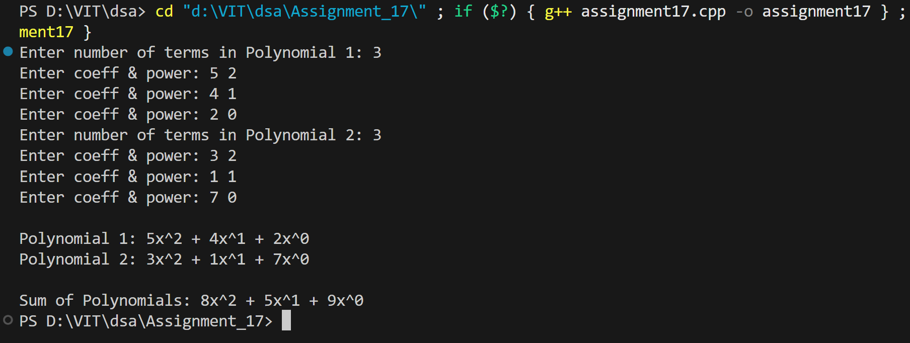
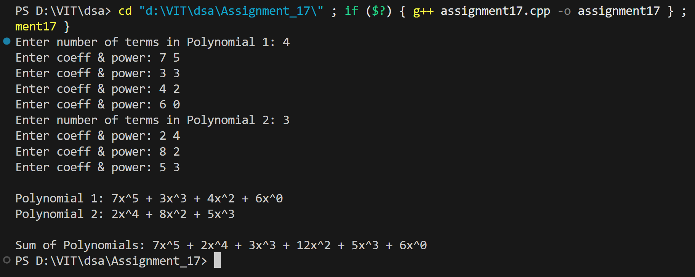

# Polynomial Addition using Singly Linked List

## Name: Likhit Chirmade, Roll no: 23

## Theory

### Polynomial Representation

Each term stored as node with coefficient and power.

**Node Structure:**
```cpp
struct Node {
    int coeff;    // Coefficient
    int pow;      // Power of x
    Node* next;
};
```

**Example:** 3x² + 5x + 2
```
[3,2] → [5,1] → [2,0] → NULL
```

### Addition Algorithm

```
while both polynomials not empty:
    if pow1 == pow2:
        add coefficients
        move both pointers
    else if pow1 > pow2:
        copy term from poly1
        move poly1 pointer
    else:
        copy term from poly2
        move poly2 pointer

Copy remaining terms
```

### Example

```
P1: 3x² + 5x + 2
P2: 4x² + 2x + 7

Addition:
- 3x² + 4x² = 7x²
- 5x + 2x = 7x
- 2 + 7 = 9

Result: 7x² + 7x + 9
```

### Time Complexity

O(m + n) where m, n are lengths of polynomials

### Space Complexity

O(m + n) for result polynomial

## Code

```cpp
#include<iostream>
using namespace std;

struct Poly_lac {
    int coeff_lac;
    int pow_lac;
    Poly_lac *next_lac;
};

Poly_lac* getNode_lac(int c, int p) {
    Poly_lac* nn = new Poly_lac;
    nn->coeff_lac = c;
    nn->pow_lac = p;
    nn->next_lac = NULL;
    return nn;
}

void insertTerm_lac(Poly_lac* &head, int c, int p) {
    Poly_lac* nn = getNode_lac(c,p);

    if(head == NULL) { head = nn; return; }

    Poly_lac* temp = head;
    while(temp->next_lac != NULL)
        temp = temp->next_lac;
    temp->next_lac = nn;
}

Poly_lac* addPoly_lac(Poly_lac* p1, Poly_lac* p2) {
    Poly_lac* result = NULL;

    while(p1 != NULL && p2 != NULL) {
        if(p1->pow_lac == p2->pow_lac) {
            insertTerm_lac(result, p1->coeff_lac + p2->coeff_lac, p1->pow_lac);
            p1 = p1->next_lac;
            p2 = p2->next_lac;
        }
        else if(p1->pow_lac > p2->pow_lac) {
            insertTerm_lac(result, p1->coeff_lac, p1->pow_lac);
            p1 = p1->next_lac;
        }
        else {
            insertTerm_lac(result, p2->coeff_lac, p2->pow_lac);
            p2 = p2->next_lac;
        }
    }

    while(p1 != NULL) {
        insertTerm_lac(result, p1->coeff_lac, p1->pow_lac);
        p1 = p1->next_lac;
    }
    while(p2 != NULL) {
        insertTerm_lac(result, p2->coeff_lac, p2->pow_lac);
        p2 = p2->next_lac;
    }
    return result;
}

void printPoly_lac(Poly_lac* head) {
    while(head != NULL) {
        cout << head->coeff_lac << "x^" << head->pow_lac;
        head = head->next_lac;
        if(head != NULL) cout << " + ";
    }
    cout << endl;
}

int main() {

    Poly_lac* P1 = NULL;
    Poly_lac* P2 = NULL;

    int n1, n2, c, p;

    cout << "Enter number of terms in Polynomial 1: ";
    cin >> n1;
    for(int i=0;i<n1;i++){
        cout << "Enter coeff & power: ";
        cin >> c >> p;
        insertTerm_lac(P1,c,p);
    }

    cout << "Enter number of terms in Polynomial 2: ";
    cin >> n2;
    for(int i=0;i<n2;i++){
        cout << "Enter coeff & power: ";
        cin >> c >> p;
        insertTerm_lac(P2,c,p);
    }

    cout << "\nPolynomial 1: ";
    printPoly_lac(P1);
    cout << "Polynomial 2: ";
    printPoly_lac(P2);

    Poly_lac* SUM = addPoly_lac(P1,P2);

    cout << "\nSum of Polynomials: ";
    printPoly_lac(SUM);

    return 0;
}
```

## Output



