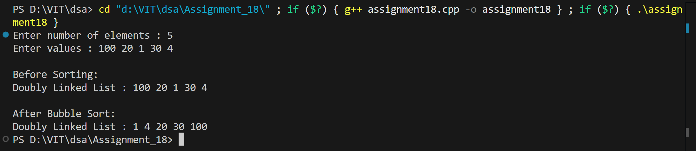

# Bubble Sort on Doubly Linked List

## Name: Likhit Chirmade, Roll no: 23

## Theory

### Bubble Sort

Repeatedly swaps adjacent elements if they're in wrong order.

### Algorithm

```
do:
    swapped = false
    for each adjacent pair:
        if left > right:
            swap(left, right)
            swapped = true
while swapped == true
```

### Doubly Linked List

**Node Structure:**
```cpp
struct Node {
    int data;
    Node* next;
    Node* prev;
};
```

### Optimization

After each pass, largest element reaches end. Use `end` pointer to avoid checking sorted portion.

### Example

```
Initial: 5 → 2 → 8 → 1

Pass 1: 2 → 5 → 1 → 8 (8 sorted)
Pass 2: 2 → 1 → 5 → 8 (5,8 sorted)
Pass 3: 1 → 2 → 5 → 8 (sorted)
```

### Time Complexity

| Case | Complexity |
|------|------------|
| Best | O(n) |
| Average | O(n²) |
| Worst | O(n²) |

### Space Complexity

O(1) - In-place sorting

## Code

```cpp
#include <iostream>
using namespace std;

struct Node_lac {
    int data_lac;
    Node_lac *next_lac, *prev_lac;
};

Node_lac* getNode_lac(int val_lac) {
    Node_lac* nn_lac = new Node_lac();
    nn_lac->data_lac = val_lac;
    nn_lac->next_lac = nn_lac->prev_lac = NULL;
    return nn_lac;
}

Node_lac* insertEnd_lac(Node_lac* head_lac, int val_lac) {
    Node_lac* nn_lac = getNode_lac(val_lac);

    if(head_lac == NULL)
        return nn_lac;

    Node_lac* temp = head_lac;
    while(temp->next_lac != NULL)
        temp = temp->next_lac;

    temp->next_lac = nn_lac;
    nn_lac->prev_lac = temp;

    return head_lac;
}

void printList_lac(Node_lac* head_lac) {
    Node_lac* temp = head_lac;
    cout << "\nDoubly Linked List : ";
    while(temp != NULL) {
        cout << temp->data_lac << " ";
        temp = temp->next_lac;
    }
    cout << endl;
}

void bubbleSort_lac(Node_lac* head_lac) {
    if(head_lac == NULL || head_lac->next_lac == NULL)
        return;

    Node_lac *end_lac = NULL;
    bool swapped_lac = true;

    while(swapped_lac == true) {
        swapped_lac = false;
        Node_lac* temp = head_lac;

        while(temp->next_lac != end_lac) {
            if(temp->data_lac > temp->next_lac->data_lac) {
                int x = temp->data_lac;
                temp->data_lac = temp->next_lac->data_lac;
                temp->next_lac->data_lac = x;
                swapped_lac = true;
            }
            temp = temp->next_lac;
        }
        end_lac = temp;
    }
}

int main() {
    Node_lac* head_lac = NULL;
    int n,val;

    cout<<"Enter number of elements : ";
    cin>>n;

    cout<<"Enter values : ";
    int i=0;
    while(i < n) {
        cin>>val;
        head_lac = insertEnd_lac(head_lac,val);
        i++;
    }

    cout<<"\nBefore Sorting:";
    printList_lac(head_lac);

    bubbleSort_lac(head_lac);

    cout<<"\nAfter Bubble Sort:";
    printList_lac(head_lac);

    return 0;
}
```

## Output


