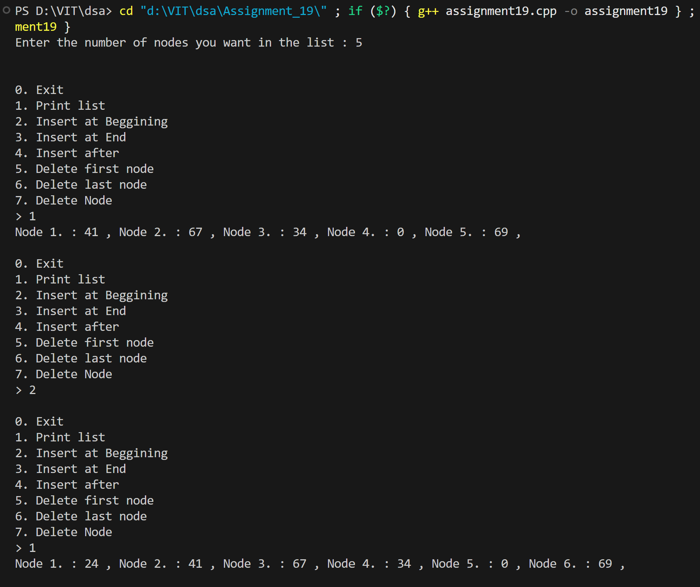
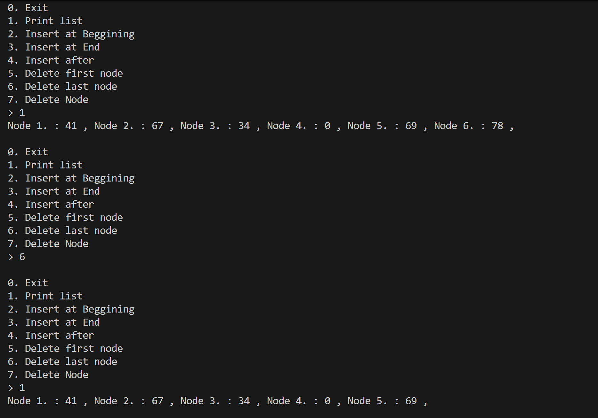
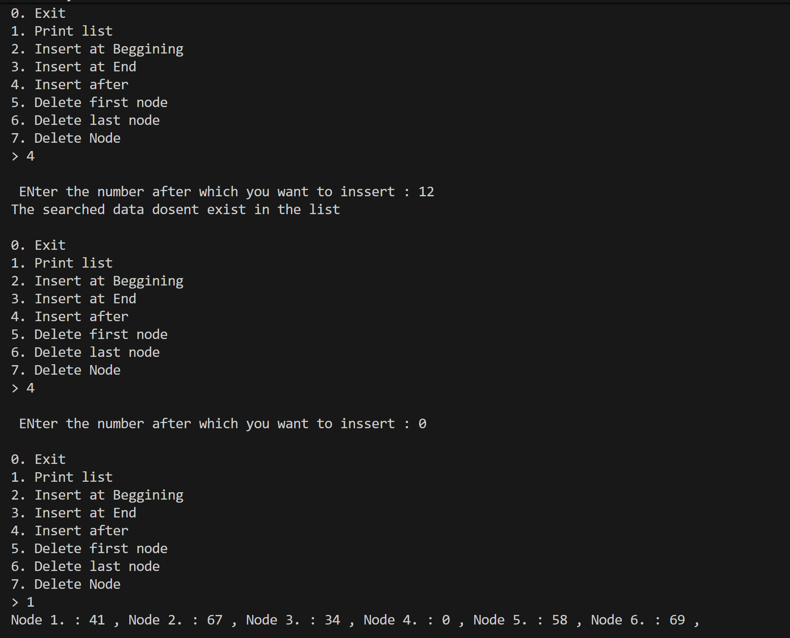
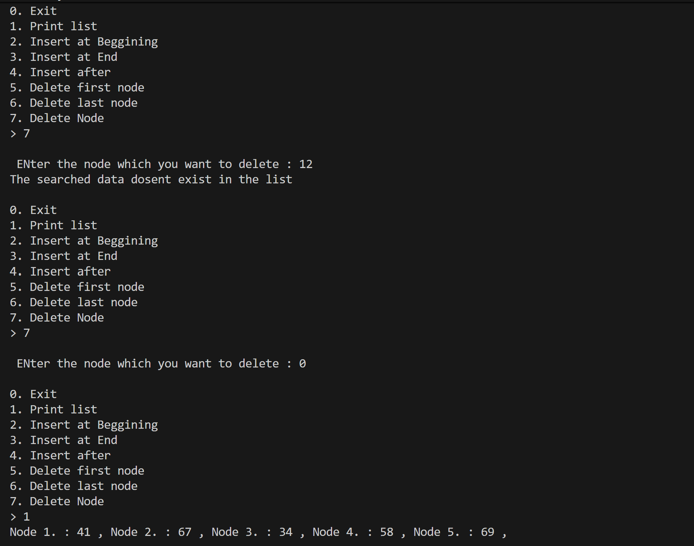

# Doubly Linked List Operations

## Name: Likhit Chirmade, Roll no: 23

## Theory

### Doubly Linked List

Each node has pointers to both next and previous nodes.

**Node Structure:**
```cpp
struct Node {
    int data;
    Node* next;
    Node* prev;
};
```

### Operations

#### Insert at Beginning
```
1. Create new node
2. newNode.next = head.next
3. newNode.prev = head
4. If list not empty:
   - head.next.prev = newNode
5. head.next = newNode
```

#### Insert at End
```
1. Traverse to last node
2. last.next = newNode
3. newNode.prev = last
```

#### Insert After
```
1. Search for target node
2. newNode.next = target.next
3. newNode.prev = target
4. target.next.prev = newNode
5. target.next = newNode
```

#### Delete Beginning
```
1. temp = head.next
2. head.next = temp.next
3. If temp.next exists:
   - temp.next.prev = head
4. Delete temp
```

#### Delete End
```
1. Traverse to last node
2. last.prev.next = NULL
3. Delete last
```

#### Delete Node
```
1. Search for node
2. node.prev.next = node.next
3. node.next.prev = node.prev
4. Delete node
```

### Time Complexity

| Operation | Complexity |
|-----------|------------|
| Insert Beginning | O(1) |
| Insert End | O(n) |
| Insert After | O(n) |
| Delete Beginning | O(1) |
| Delete End | O(n) |
| Delete Node | O(n) |

### Space Complexity

O(n) for n nodes

## Code

```cpp
#include<iostream>
#include<math.h>
using namespace std;

typedef struct dll_lac
{
    int data_lac;
    dll_lac *next_lac;
    dll_lac *prev_lac;
}dll_lac;

dll_lac *getNode_lac()
{
    dll_lac *newNode_lac = new dll_lac();
    newNode_lac->next_lac = nullptr;
    newNode_lac->prev_lac = nullptr;
    return newNode_lac;
}

dll_lac *createList_lac(int n_lac)
{
    dll_lac *head_lac = getNode_lac();
    dll_lac *temp_lac = head_lac;
    for(int i_lac=0;i_lac<n_lac;i_lac++)
    {
        dll_lac *newNode_lac = getNode_lac();
        newNode_lac->data_lac = rand()%100;
        temp_lac->next_lac = newNode_lac;
        newNode_lac->prev_lac = temp_lac;
        temp_lac = temp_lac->next_lac;
    }
    return head_lac;
}

void printList_lac(dll_lac *head_lac)
{
    dll_lac *temp_lac = head_lac->next_lac;
    if(temp_lac == nullptr)
    {
        cout<<"The list is empty"<<endl;
    }
    else
    {
        int i_lac=0;
        while(temp_lac!=nullptr)
        {
            i_lac++;
            cout<<"Node "<<i_lac<<". : "<<temp_lac->data_lac<<" , ";
            temp_lac = temp_lac->next_lac;
        }
        cout<<endl;
    }
}

void InsertAtBeginning_lac(dll_lac *head_lac)
{
    dll_lac *temp_lac = head_lac->next_lac;
    dll_lac *newNode_lac = getNode_lac();
    newNode_lac->data_lac = rand()%100;
    head_lac->next_lac = newNode_lac;
    newNode_lac->prev_lac = head_lac;
    if(!(temp_lac==nullptr))
    {
        newNode_lac->next_lac = temp_lac;
        temp_lac->prev_lac = newNode_lac;
    }
}

void InsertAtEnd_lac(dll_lac *head_lac)
{
    dll_lac *temp_lac = head_lac->next_lac;
    if(temp_lac==nullptr)
    {
        InsertAtBeginning_lac(head_lac);
        return ;
    }
    dll_lac *newNode_lac = getNode_lac();
    newNode_lac->data_lac = rand()%100;
    while(temp_lac->next_lac!=nullptr)
    {
        temp_lac = temp_lac->next_lac;
    }
    temp_lac->next_lac = newNode_lac;
    newNode_lac->prev_lac = temp_lac;
}

dll_lac * search_lac(dll_lac *head_lac, int n_lac)
{
    dll_lac *temp_lac = head_lac->next_lac;
    if(temp_lac==nullptr)
    {
        cout<<"Emoty list"<<endl;
        return nullptr;
    }
    else
    {
        while(temp_lac!=nullptr)
        {
            if(temp_lac->data_lac == n_lac)
            {
                return temp_lac;
            }
            temp_lac = temp_lac->next_lac;
        }
    }
}

void InsertAfter_lac(dll_lac *head_lac, int n_lac)
{
    dll_lac *temp_lac = head_lac->next_lac;
    dll_lac *FoundNode_lac = search_lac(head_lac,n_lac);
    if(FoundNode_lac == nullptr)
    {
        cout<<"The searched data dosent exist in the list"<<endl;
        return;
    }
    if(FoundNode_lac->next_lac== nullptr)
    {
        InsertAtEnd_lac(head_lac);
        return;
    }
    else
    {
        dll_lac *newNode_lac = getNode_lac();
        newNode_lac->data_lac = rand()%100;
        FoundNode_lac->next_lac->prev_lac = newNode_lac;
        newNode_lac->next_lac = FoundNode_lac->next_lac;
        FoundNode_lac->next_lac = newNode_lac;
        newNode_lac->prev_lac = FoundNode_lac;
    }
}

void DeleteBeginning_lac(dll_lac *head_lac)
{
    dll_lac *temp_lac = head_lac->next_lac;
    if(temp_lac == nullptr)
    {
        cout<<"Empty List"<<endl;
        return;
    }
    head_lac->next_lac = temp_lac->next_lac;
    if(!(temp_lac->next_lac==nullptr))
    {
        temp_lac->next_lac->prev_lac = head_lac;
    }
    delete temp_lac;
}

void deleteEnd_lac(dll_lac *head_lac)
{
    dll_lac *temp_lac = head_lac->next_lac;
    if(temp_lac == nullptr)
    {
        cout<<"Empty List"<<endl;
        return;
    }
    while(temp_lac->next_lac != nullptr)
    {
        temp_lac = temp_lac->next_lac;
    }
    if( temp_lac->prev_lac == head_lac)
    {
        DeleteBeginning_lac(head_lac);
        return;
    }
    temp_lac->prev_lac->next_lac = nullptr;
    delete temp_lac;
}

void DeleteNode_lac(dll_lac *head_lac, int n_lac)
{
    dll_lac *temp_lac = head_lac->next_lac;
    dll_lac *FoundNode_lac = search_lac(head_lac,n_lac);
    if(FoundNode_lac == nullptr)
    {
        cout<<"The searched data dosent exist in the list"<<endl;
        return;
    }
    if(FoundNode_lac->prev_lac == head_lac)
    {
        DeleteBeginning_lac(head_lac);
        return;
    }
    if(FoundNode_lac->next_lac == nullptr)
    {
        deleteEnd_lac(head_lac);
        return;
    }
    FoundNode_lac->prev_lac->next_lac = FoundNode_lac->next_lac;
    FoundNode_lac->next_lac->prev_lac = FoundNode_lac->prev_lac;
    delete FoundNode_lac;
}

int main()
{
    int x_lac;
    cout<<"Enter the number of nodes you want in the list : ";
    cin>>x_lac;
    cout<<endl;
    dll_lac *list_lac = createList_lac(x_lac);
    int ch_lac,n_lac;
    while(true)
    {
        cout<<"\n0. Exit"
            <<"\n1. Print list"
            <<"\n2. Insert at Beggining"
            <<"\n3. Insert at End "
            <<"\n4. Insert after "
            <<"\n5. Delete first node"
            <<"\n6. Delete last node "
            <<"\n7. Delete Node "
            <<"\n> ";
        cin>>ch_lac;
        switch(ch_lac)
        {
            case 0:
                exit(0);
                break;
            case 1:
                printList_lac(list_lac);
                break;
            case 2:
                InsertAtBeginning_lac(list_lac);
                break;
            case 3:
                InsertAtEnd_lac(list_lac);
                break;
            case 4:
                cout<<"\n ENter the number after which you want to inssert : ";
                cin>>n_lac;
                InsertAfter_lac(list_lac,n_lac);
                break;
            case 5:
                DeleteBeginning_lac(list_lac);
                break;
            case 6:
                deleteEnd_lac(list_lac);
                break;
            case 7:
                cout<<"\n ENter the node which you want to delete : ";
                cin>>n_lac;
                DeleteNode_lac(list_lac,n_lac);
                break;
        }
    }
}
```

## Output






