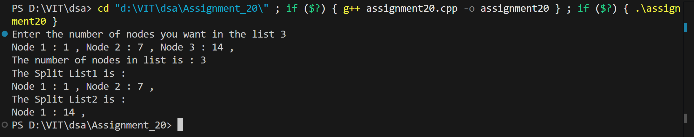
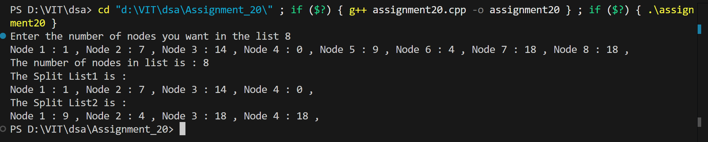
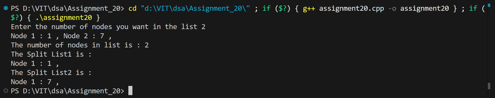
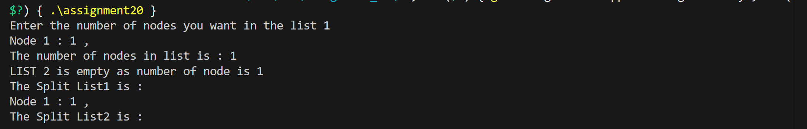
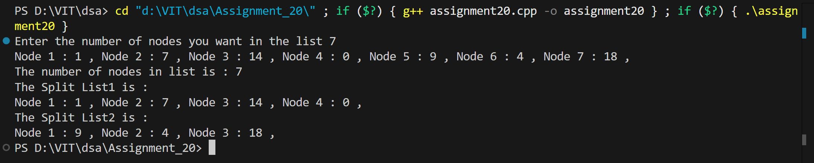

# Split Singly Linked List into Two Halves

## Name: Likhit Chirmade, Roll no: 23

## Theory

### Front-Back Split

Divides list into two sublists. If odd length, extra element goes to front list.

### Algorithm

```
1. Count total nodes (n)
2. If n is even:
   - Front: first n/2 nodes
   - Back: remaining n/2 nodes
3. If n is odd:
   - Front: first (n/2 + 1) nodes
   - Back: remaining nodes
```

### Examples

```
List: {2, 3, 5, 7, 11}
n = 5 (odd)
Front: {2, 3, 5} (3 nodes)
Back: {7, 11} (2 nodes)

List: {1, 2, 3, 4}
n = 4 (even)
Front: {1, 2} (2 nodes)
Back: {3, 4} (2 nodes)
```

### Edge Cases

- **n = 1:** Front = {element}, Back = {}
- **n = 2:** Front = {first}, Back = {second}
- **n = 3:** Front = {first, second}, Back = {third}

### Time Complexity

O(n) for traversal and splitting

### Space Complexity

O(n) for two new lists

## Code

```cpp
#include<iostream>
#include<math.h>
using namespace std;

typedef struct sll_lac
{
    int data_lac;
    sll_lac *next_lac;
}sll_lac;

sll_lac *getNode_lac()
{
    sll_lac *node_lac = new sll_lac();
    node_lac->next_lac = nullptr;
    return node_lac;
}

sll_lac *createList_lac(int n_lac)
{
    sll_lac *head_lac = getNode_lac();
    sll_lac *temp_lac = head_lac;
    for(int i_lac=1; i_lac<=n_lac;i_lac++)
    {
        sll_lac *node_lac = getNode_lac();
        node_lac->data_lac = rand() %20 ;
        temp_lac->next_lac = node_lac;
        temp_lac = temp_lac->next_lac;
    }
    return head_lac;
}

void printList_lac(sll_lac *head_lac)
{
    sll_lac *temp_lac = head_lac->next_lac;
    int n_lac = 0;
    while(temp_lac != nullptr)
    {
        n_lac++;
        cout<<"Node "<<n_lac<<" : "<<temp_lac->data_lac<<" , ";
        temp_lac = temp_lac->next_lac;
    }
    cout<<endl;
}

void splitList_lac(sll_lac *head_lac,int n_lac)
{
    sll_lac *temp_lac = head_lac->next_lac;
    sll_lac *head1_lac = getNode_lac();
    sll_lac *head2_lac = getNode_lac();
    sll_lac *temp1_lac = head1_lac;
    sll_lac *temp2_lac = head2_lac;
    cout<<"The number of nodes in list is : "<<n_lac<<endl;
    if(n_lac==1)
    {
        sll_lac *node_lac = getNode_lac();
        node_lac->data_lac = temp_lac->data_lac;
        head1_lac->next_lac = node_lac;
        head2_lac->next_lac = nullptr;
        cout<<"LIST 2 is empty as number of node is 1"<<endl;
    }
    if(n_lac%2 == 0)
    {
        int i_lac; 
        for(i_lac=1;i_lac<=n_lac;i_lac++)
        {
            sll_lac *node_lac = getNode_lac();
            node_lac->data_lac = temp_lac->data_lac;
            if( i_lac <= n_lac/2)
            {
                temp1_lac->next_lac = node_lac;
                temp1_lac = temp1_lac->next_lac;
            }
            else
            {
                temp2_lac->next_lac = node_lac;
                temp2_lac = temp2_lac->next_lac;
            }
            temp_lac = temp_lac->next_lac;
        }
    }
    else
    {
        int i_lac; 
        for(i_lac=1;i_lac<=n_lac;i_lac++)
        {
            sll_lac *node_lac = getNode_lac();
            node_lac->data_lac = temp_lac->data_lac;
            if( i_lac <= (n_lac/2)+1)
            {
                temp1_lac->next_lac = node_lac;
                temp1_lac = temp1_lac->next_lac;
            }
            else
            {
                temp2_lac->next_lac = node_lac;
                temp2_lac = temp2_lac->next_lac;
            }
            temp_lac = temp_lac->next_lac;
        }
    }
    cout<<"The Split List1 is : "<<endl;
    printList_lac(head1_lac);
    cout<<"The Split List2 is : "<<endl;
    printList_lac(head2_lac);
}

int main()
{
    int n_lac;
    cout<<"Enter the number of nodes you want in the list ";
    cin>>n_lac;
    sll_lac *list_lac = createList_lac(n_lac);
    printList_lac(list_lac);
    splitList_lac(list_lac,n_lac);
}
```

## Output






