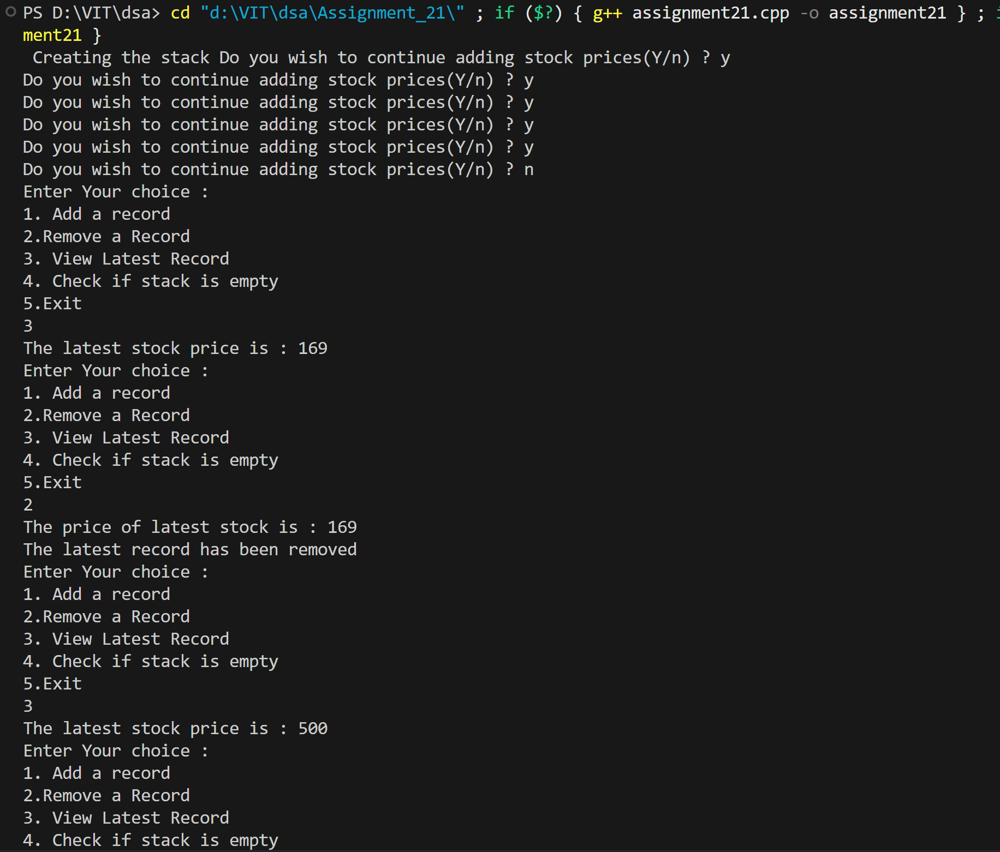
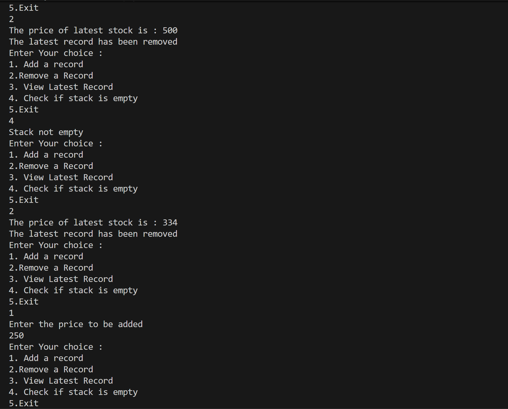
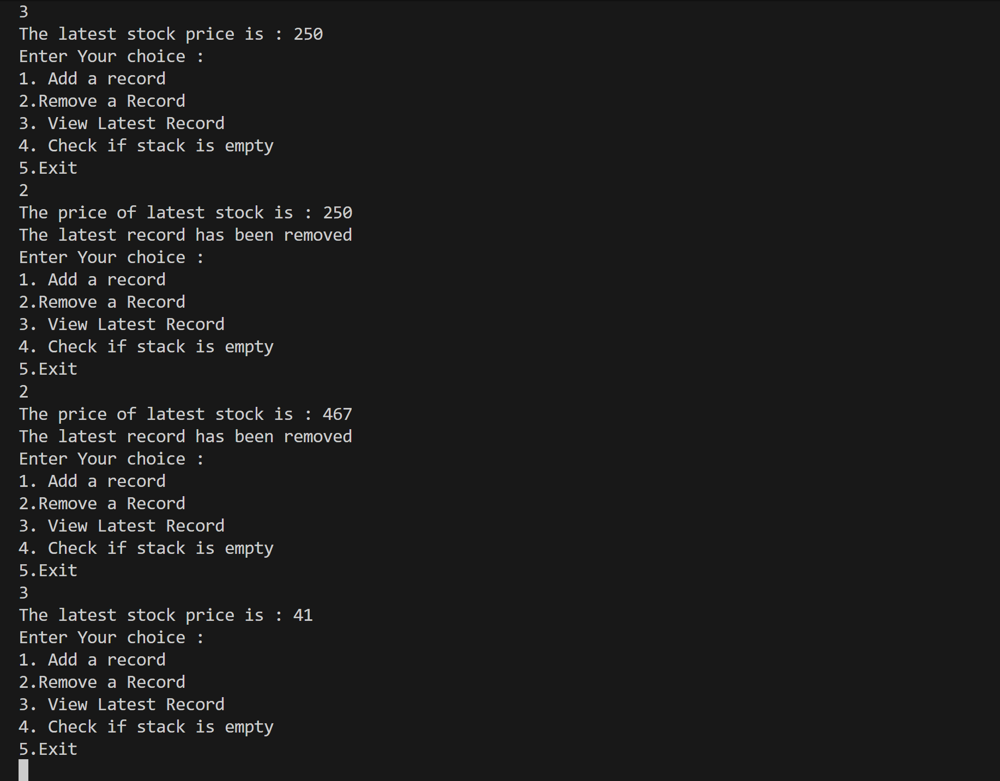

# Stock Price Tracker using Stack (Linked List)

## Name: Likhit Chirmade, Roll no: 23

## Theory

### Stack using Linked List

Dynamic stack with no size limit, implemented using singly linked list.

**Node Structure:**
```cpp
struct Node {
    int price;
    Node* next;
};
```

### Stack Operations

#### Push (Record Price)
```
1. Create new node
2. node.next = head.next
3. head.next = node
```

Inserts at beginning (top of stack).

#### Pop (Remove Price)
```
1. temp = head.next
2. head.next = head.next.next
3. Delete temp
```

Removes from beginning (top of stack).

#### Peek (Latest Price)
```
Return head.next.price
```

Views top without removing.

#### isEmpty
```
Return head.next == NULL
```

### LIFO (Last-In, First-Out)

Most recent price added is first to be removed.

### Time Complexity

| Operation | Complexity |
|-----------|------------|
| Push | O(1) |
| Pop | O(1) |
| Peek | O(1) |
| isEmpty | O(1) |

### Space Complexity

O(n) for n prices

## Code

```cpp
#include<iostream>
#include<math.h>
using namespace std;

typedef struct stack_lac
{
    int price_lac;
    stack_lac *next_lac;
}stack_lac;

stack_lac *getNode_lac()
{
    stack_lac *newNode_lac = new stack_lac();
    newNode_lac->next_lac = nullptr;
    return newNode_lac;
}

stack_lac *createStack_lac()
{
    stack_lac *head_lac = getNode_lac();
    char ch_lac;
    while(true)
    {
        cout<<"Do you wish to continue adding stock prices(Y/n) ? ";
        cin>>ch_lac;
        if(ch_lac!='n')
        {
            stack_lac *node_lac = getNode_lac();
            node_lac->price_lac = rand()%1000;
            node_lac->next_lac = head_lac->next_lac;
            head_lac->next_lac = node_lac;
        }
        else{
            break;
        }
    }
    return head_lac;
    
}

void record_lac(stack_lac *head_lac,int p_lac)
{
    stack_lac *newNode_lac = getNode_lac();
    newNode_lac->price_lac = p_lac;

    stack_lac *temp_lac = head_lac;
    newNode_lac->next_lac = head_lac->next_lac;
    head_lac->next_lac = newNode_lac;
}

void remove_lac(stack_lac *head_lac)
{
    stack_lac *temp_lac = head_lac->next_lac;
    int price_lac = head_lac->next_lac->price_lac;
    cout<<"The price of latest stock is : "<<price_lac<<endl;
    head_lac->next_lac = head_lac->next_lac->next_lac;
    delete temp_lac;
}

void latest_lac(stack_lac *head_lac)
{
    stack_lac *temp_lac = head_lac->next_lac;
    int price_lac = temp_lac->price_lac;
    cout<<"The latest stock price is : "<<price_lac<<endl;
}

void isEmpty_lac(stack_lac *head_lac)
{
    if(head_lac->next_lac==nullptr)
    {
        cout<<"Empty stack"<<endl;
    }
    else
    {
        cout<<"Stack not empty"<<endl;
    }
}

int main()
{
    int choice_lac,p_lac;
    cout<<" Creating the stack ";
    stack_lac *head_lac = createStack_lac();
    while(true)
    {
        cout<<"Enter Your choice : "<<" \n1. Add a record \n2.Remove a Record \n3. View Latest Record \n4. Check if stack is empty \n5.Exit\n";
        cin>>choice_lac;
        switch (choice_lac)
        {
        case 1:
            cout<<"Enter the price to be added"<<endl;
            cin>>p_lac;
            record_lac(head_lac,p_lac);
            break;
        case 2:
            remove_lac(head_lac);
            cout<<"The latest record has been removed"<<endl;
            break;
        case 3:
            latest_lac(head_lac);
            break;
        case 4:
            isEmpty_lac(head_lac);
            break;
        case 5:
            exit(0);
        default:
            break;
        }
    }

}
```

## Output




