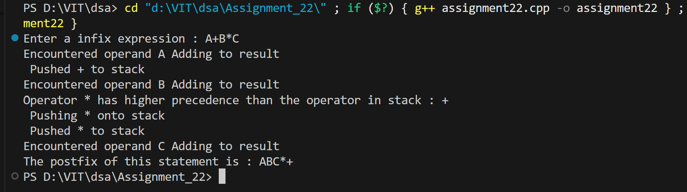
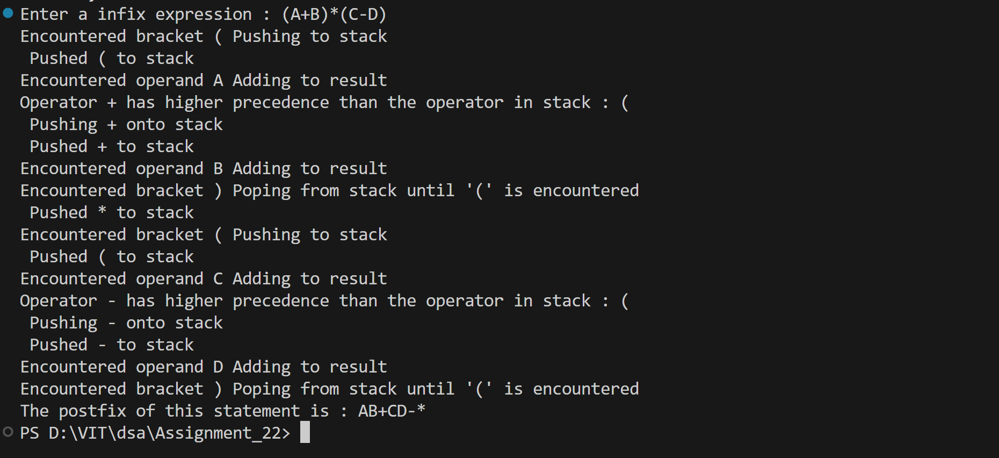
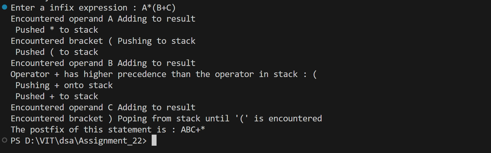

# Infix to Postfix Conversion using Stack

## Name: Likhit Chirmade, Roll no: 23

## Theory

### Infix vs Postfix

**Infix:** a + b * c (operator between operands)
**Postfix:** a b c * + (operator after operands)

### Conversion Algorithm

```
For each character in infix:
1. If operand → Add to result
2. If '(' → Push to stack
3. If ')' → Pop until '(' found
4. If operator:
   - Pop operators with >= precedence
   - Push current operator
5. Pop remaining operators
```

### Operator Precedence

```
^ (power)     : 3
*, /          : 2
+, -          : 1
```

### Example

```
Infix: a + b * c
Steps:
- a → result = "a"
- + → push to stack
- b → result = "ab"
- * → higher precedence, push
- c → result = "abc"
- Pop * → result = "abc*"
- Pop + → result = "abc*+"

Postfix: abc*+
```

### Associativity

- Left-to-right: +, -, *, /
- Right-to-left: ^

### Time Complexity

O(n) where n = length of expression

### Space Complexity

O(n) for stack

## Code

```cpp
#include<iostream>
using namespace std;

char *stack_lac = new char[20];
int top_lac = -1;
string res_lac;

void push_lac(char ch_lac)
{
    top_lac++;
    stack_lac[top_lac] = ch_lac;
    cout<<" Pushed "<<ch_lac<<" to stack "<<endl;
}

char pop_lac()
{
    char op_lac = stack_lac[top_lac];
    top_lac--;
    return op_lac;
}

char peek_lac()
{
    return stack_lac[top_lac];
}

bool IsEmpty_lac()
{
    if(top_lac == -1)
    {
        return true;
    }
    else
    {
        return false;
    }
}

int AssignPrecedence_lac(char ch_lac)
{
    if(ch_lac == '^')
    {
        return 3;
    }
    if( ch_lac == '*' || ch_lac=='/')
    {
        return 2;
    }
    if( ch_lac== '+' || ch_lac=='-')
    {
        return 1;
    }
    return 0;
}

void HandleOperator_lac(char ch_lac)
{
    if(IsEmpty_lac())
    {
        push_lac(ch_lac);
    }
    else
    {
        int CurrPrecedence_lac = AssignPrecedence_lac(ch_lac);
        while(top_lac != -1)
        {
            char StackOp_lac = peek_lac();
            int StackPrecedence_lac = AssignPrecedence_lac(StackOp_lac);
            if(CurrPrecedence_lac <= StackPrecedence_lac && ch_lac != '^')
            {
                cout<<"Operator "<<ch_lac<<" has lower precedence or equal precedence than the operator in stack : "<<StackOp_lac<<endl;
                cout<<"Adding "<<StackOp_lac<<" to result"<<endl;
                char op_lac = pop_lac();
                res_lac += op_lac;
            }
            else
            {
                cout<<"Operator "<<ch_lac<<" has higher precedence than the operator in stack : "<<StackOp_lac<<endl;
                cout<<" Pushing "<<ch_lac<<" onto stack"<<endl;
                break;
            }
        
        }
        push_lac(ch_lac);
    }
}

bool IsOperator_lac(char ch_lac)
{
    if( ch_lac=='^' || ch_lac =='+' || ch_lac =='-' || ch_lac == '*' || ch_lac== '/' || ch_lac=='(' || ch_lac==')')
    {
        return true;
    }
    else
    {
        return false;
    }
}

string ConvertToPostfix_lac(string input_lac)
{
    int len_lac = input_lac.length();
    char ch_lac;
    for(int i_lac = 0; input_lac[i_lac] != '\0'; i_lac++)
    {
        ch_lac = input_lac[i_lac];
        if(!IsOperator_lac(ch_lac))
        {
            cout<<"Encountered operand "<<ch_lac<<" Adding to result "<<endl;
            res_lac += ch_lac;
        }
        else if(ch_lac=='(')
        {
          cout<<"Encountered bracket "<<ch_lac<<" Pushing to stack "<<endl;
          push_lac(ch_lac);
        }
        else if(ch_lac==')')
        {
            cout<<"Encountered bracket "<<ch_lac<<" Poping from stack until '(' is encountered "<<endl;
            while(stack_lac[top_lac]!='(')
            {
                char op_lac = pop_lac();
                res_lac += op_lac;
            }
            top_lac--;
        }
        else
        {
            HandleOperator_lac(ch_lac);
        }
    }
    while(top_lac!=-1)
    {
        char op_lac = pop_lac();
        res_lac += op_lac;
    }
    return res_lac;
}

int main()
{
    string x_lac;
    cout<<"Enter a infix expression : ";
    cin>>x_lac;
    string result_lac = ConvertToPostfix_lac(x_lac);
    cout<<"The postfix of this statement is : "<<result_lac;
}
```

## Output




