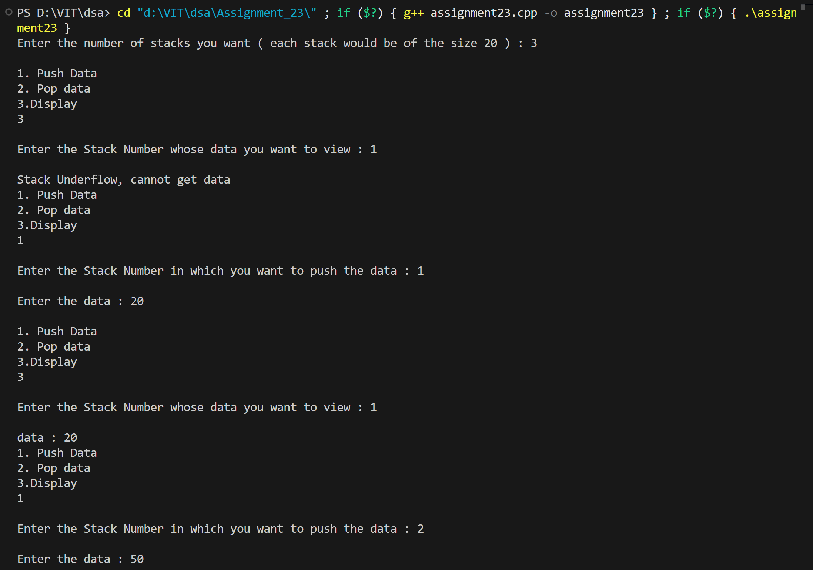
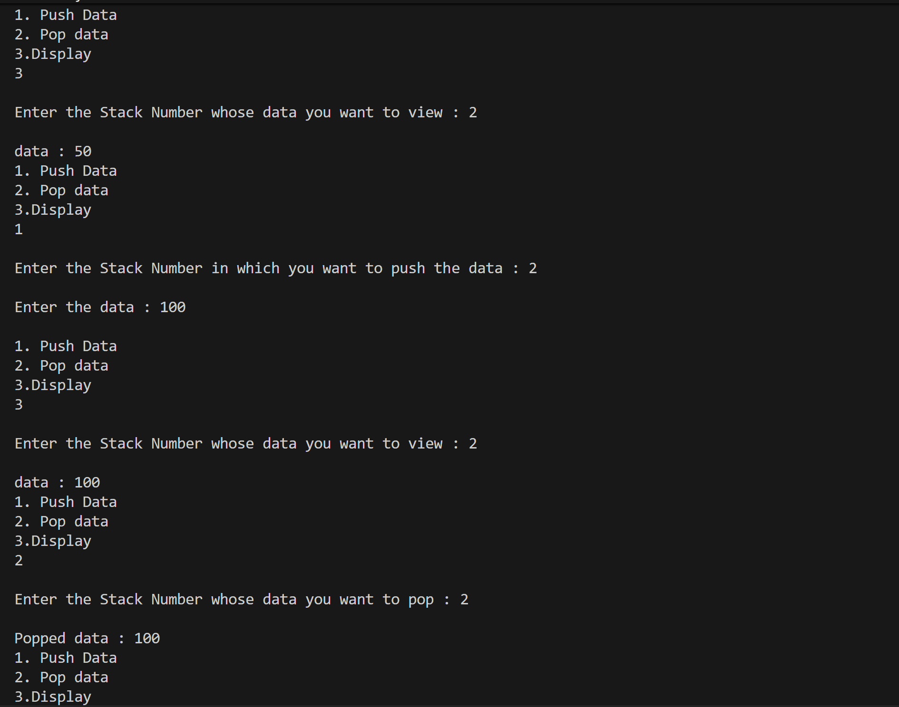
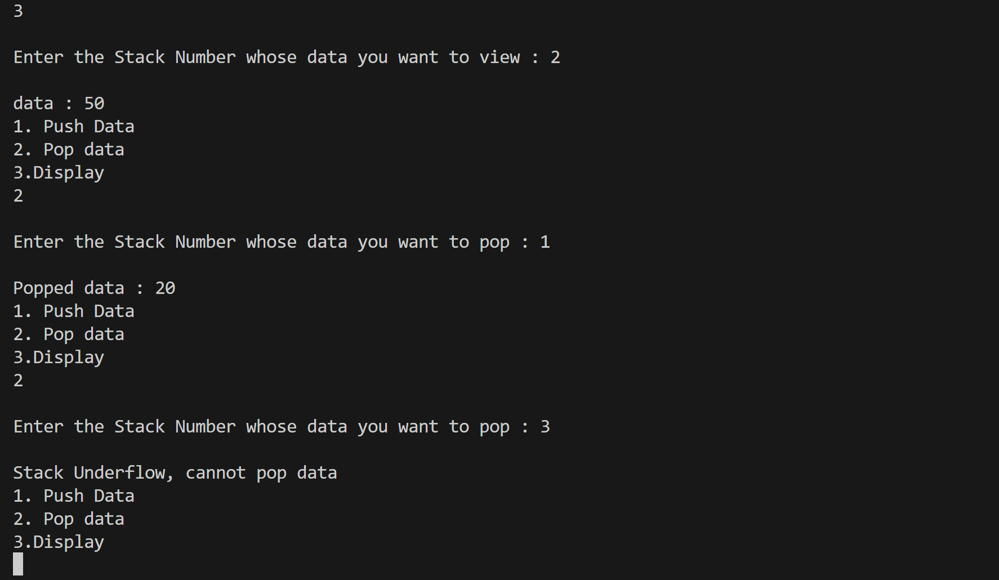

# Multiple Stacks using 2D Array

## Name: Likhit Chirmade, Roll no: 23

## Theory

### Multiple Stacks

Implements n stacks using 2D array where each row is a separate stack.

**Data Structure:**
```cpp
int** stack;  // 2D array
int* top;     // Array of top pointers
```

### Operations

#### Push
```
1. Check overflow (top[n] >= SIZE-1)
2. top[n]++
3. stack[n][top[n]] = data
```

#### Pop
```
1. Check underflow (top[n] == -1)
2. data = stack[n][top[n]]
3. top[n]--
4. Return data
```

#### Peek
```
Return stack[n][top[n]]
```

### Overflow/Underflow

**Overflow:** Stack full (top == SIZE-1)
**Underflow:** Stack empty (top == -1)

### Example

```
3 stacks, size 5 each:
Stack 0: [1, 2, 3, _, _]  top[0] = 2
Stack 1: [5, 6, _, _, _]  top[1] = 1
Stack 2: [9, _, _, _, _]  top[2] = 0
```

### Time Complexity

| Operation | Complexity |
|-----------|------------|
| Push | O(1) |
| Pop | O(1) |
| Peek | O(1) |

### Space Complexity

O(n × m) for n stacks of size m

## Code

```cpp
#include<iostream>
using namespace std;

int flag_lac = 0;

bool IsUnderflow_lac(int **stack_lac,int n_lac, int top_lac[])
{
    if(top_lac[n_lac]==-1)
        return true;
    else
        return false;
}

bool IsOverflow_lac(int **stack_lac,int n_lac, int top_lac[])
{
    if(top_lac[n_lac]>=19)
        return true;
    else
        return false;
}

void push_lac(int **stack_lac, int data_lac, int n_lac, int top_lac[])
{
    if(!IsOverflow_lac(stack_lac,n_lac,top_lac))
    {
        top_lac[n_lac]++;
        int col_lac = top_lac[n_lac];
        stack_lac[n_lac][col_lac] = data_lac;
    }
    else
    {
        cout<<"\nStack overflow, cannot push data  ";
    }
}

int pop_lac(int **stack_lac, int n_lac, int top_lac[])
{
    if(!IsUnderflow_lac(stack_lac,n_lac,top_lac))
    {
        int col_lac = top_lac[n_lac];
        int data_lac = stack_lac[n_lac][col_lac];
        top_lac[n_lac]--;
        return data_lac;
    }
    else{
        cout<<"\nStack Underflow, cannot pop data";
        flag_lac = 1;
    }
}

int peek_lac(int **stack_lac, int n_lac, int top_lac[])
{
    if(!IsUnderflow_lac(stack_lac,n_lac,top_lac))
    {
        int col_lac = top_lac[n_lac];
        int data_lac = stack_lac[n_lac][col_lac];
        return data_lac;
    }
    else{
        cout<<"\nStack Underflow, cannot get data";
        flag_lac = 1;
    }
}

int main()
{
    int n_lac;
    int stackNo_lac;
    int ch_lac;
    int data_lac;

    cout<<"Enter the number of stacks you want ( each stack would be of the size 20 ) : ";
    cin>>n_lac;

    int **stack_lac = new int*[n_lac];
    int *top_lac = new int[n_lac];

    for(int i_lac=0; i_lac<n_lac ;i_lac++)
    {
        stack_lac[i_lac] = new int[20];
        top_lac[i_lac] = -1;
    }

    while(true)
    {
        flag_lac = 0;
        cout<<" \n1. Push Data \n2. Pop data \n3.Display "<<endl;
        cin>>ch_lac;

        switch(ch_lac)
        {
            case 1:
                cout<<"\nEnter the Stack Number in which you want to push the data : ";
                cin>>stackNo_lac;
                cout<<"\nEnter the data : ";
                cin>>data_lac;
                push_lac(stack_lac,data_lac,stackNo_lac-1,top_lac);
                break;

            case 2:
                cout<<"\nEnter the Stack Number whose data you want to pop : ";
                cin>>stackNo_lac;
                data_lac = pop_lac(stack_lac,stackNo_lac-1,top_lac);
                if(flag_lac == 0)
                    cout<<"\nPopped data : "<<data_lac;
                break;

            case 3:
                cout<<"\nEnter the Stack Number whose data you want to view : ";
                cin>>stackNo_lac;
                data_lac = peek_lac(stack_lac,stackNo_lac-1,top_lac);
                if(flag_lac == 0)
                    cout<<"\ndata : "<<data_lac;
                break;

            default:
                exit(0);
        }
    }
}
```

## Output




