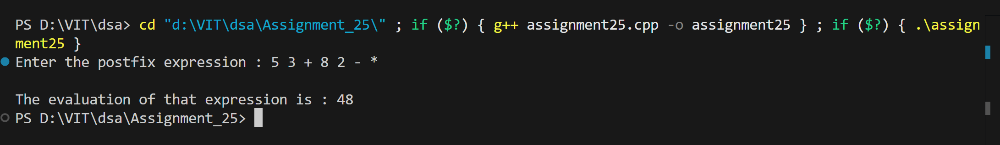

# Postfix Expression Evaluation using Stack

## Name: Likhit Chirmade, Roll no: 23

## Theory

### Postfix Notation (RPN)

Operators come after operands.

**Example:**
- Infix: `3 + 4`
- Postfix: `3 4 +`

### Evaluation Algorithm

```
For each character:
1. If operand → Push to stack
2. If operator:
   a. Pop two operands (num2, num1)
   b. Perform operation: num1 op num2
   c. Push result to stack
3. Final result = top of stack
```

### Example

```
Postfix: 5 3 + 2 *

Steps:
1. 5 → Push 5
2. 3 → Push 3
3. + → Pop 3,5 → 5+3=8 → Push 8
4. 2 → Push 2
5. * → Pop 2,8 → 8*2=16 → Push 16

Result: 16
```

### Character to Integer

```cpp
int digit = ch - '0';
// '5' - '0' = 5
```

### Time Complexity

O(n) where n = expression length

### Space Complexity

O(n) for stack

## Code

```cpp
#include<iostream>
#include<sstream>
using namespace std;

int *stack_lac = new int[20];
int top_lac = -1;

void push_lac(int data_lac)
{
    top_lac++;
    stack_lac[top_lac] = data_lac;
}

int pop_lac()
{
    int data_lac = stack_lac[top_lac];
    top_lac--;
    return data_lac;
}

bool IsOperator_lac(string ch_lac)
{
    if(ch_lac=="^" || ch_lac=="+" || ch_lac=="-" || ch_lac=="*" || ch_lac=="/")
        return true;
    else
        return false;
}

int EvaluatePostfix_lac(string str_lac)
{
    stringstream ss(str_lac);
    string token_lac;
    int num1_lac, num2_lac, res_lac;

    while(ss >> token_lac)
    {
        if(!IsOperator_lac(token_lac))
        {
            push_lac(stoi(token_lac));       
        }
        else
        {
            num2_lac = pop_lac();
            num1_lac = pop_lac();
            
            if(token_lac=="+") 
                res_lac = num1_lac + num2_lac;
            else if(token_lac=="-") 
                res_lac = num1_lac - num2_lac;
            else if(token_lac=="*") 
                res_lac = num1_lac * num2_lac;
            else if(token_lac=="/") 
                res_lac = num1_lac / num2_lac;
            else if(token_lac=="^") 
                res_lac = num1_lac ^ num2_lac;

            push_lac(res_lac);
        }
    }
    res_lac = pop_lac();
    return res_lac;
}

int main()
{
    string str_lac;
    cout << "Enter the postfix expression : ";
    getline(cin, str_lac);
    int res_lac = EvaluatePostfix_lac(str_lac);
    cout << "\nThe evaluation of that expression is : " << res_lac;
}

```

## Output



