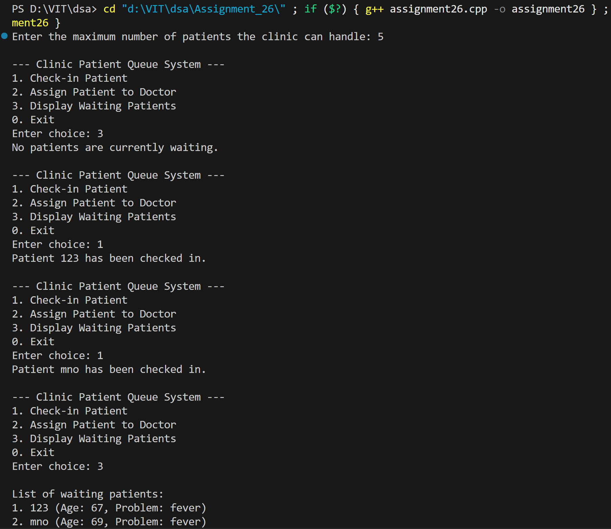
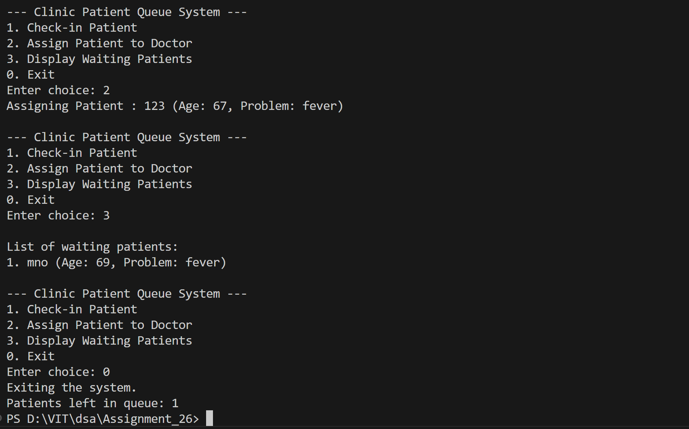

# Medical Clinic Patient Queue System

## Name: Likhit Chirmade, Roll no: 23

## Theory

### Circular Queue

Queue with fixed size where rear wraps around to beginning when reaching end.

**Formula:**
```
rear = (front + size) % capacity
front = (front + 1) % capacity
```

### FIFO (First-Come, First-Served)

Patients checked in first are assigned to doctors first.

### Operations

#### Check-in (Enqueue)
```
1. Check if queue full
2. Calculate rear position
3. Add patient at rear
4. Increment size
```

#### Assign to Doctor (Dequeue)
```
1. Check if queue empty
2. Get patient at front
3. Move front forward
4. Decrement size
```

#### Display
```
Traverse from front to rear using modulo arithmetic
```

### Time Complexity

| Operation | Complexity |
|-----------|------------|
| Check-in | O(1) |
| Assign | O(1) |
| Display | O(n) |

### Space Complexity

O(n) for queue array

## Code

```cpp
#include <iostream>
#include <string>
#include <math.h>
using namespace std;

const int MAX_lac = 20;

struct Patient_lac {
    string name_lac;
    int age_lac;
    string problem_lac;
};

Patient_lac queue_lac[MAX_lac];
int front_lac = 0;
int rear_lac = -1;
int size_lac = 0;
int capacity_lac;

string nameArr_lac[6] = {"abc","pqr","xyz","likhit","mno","123"};
string problemArr_lac[6] = {"cold","flu","malaria","dengue","fever"};

bool isFull_lac() {
    return size_lac == capacity_lac;
}

bool isEmpty_lac() {
    return size_lac == 0;
}

void checkIn_lac() {
    if (isFull_lac()) {
        cout << "Clinic queue is full. Cannot check in more patients.\n";
        return;
    }
    rear_lac = (front_lac + size_lac) % capacity_lac;
    queue_lac[rear_lac].name_lac = nameArr_lac[rand()%6];
    queue_lac[rear_lac].age_lac = rand()%100;
    queue_lac[rear_lac].problem_lac = problemArr_lac[rand()%6];

    size_lac++;
    cout << "Patient " << queue_lac[rear_lac].name_lac << " has been checked in.\n";
}

void assignPatient_lac() {
    if (isEmpty_lac()) {
        cout << "No patients waiting.\n";
        return;
    }
    Patient_lac p_lac = queue_lac[front_lac];
    cout << "Assigning Patient : " << p_lac.name_lac << " (Age: " << p_lac.age_lac << ", Problem: " << p_lac.problem_lac << ")\n";
    front_lac = (front_lac + 1) % capacity_lac;
    size_lac--;
}

void displayQueue_lac() {
    if (isEmpty_lac()) {
        cout << "No patients are currently waiting.\n";
        return;
    }

    cout << "\nList of waiting patients:\n";
    for (int i_lac = 0; i_lac < size_lac; i_lac++) {
        int index_lac = (front_lac + i_lac) % capacity_lac;
        cout << i_lac + 1 << ". " << queue_lac[index_lac].name_lac 
             << " (Age: " << queue_lac[index_lac].age_lac 
             << ", Problem: " << queue_lac[index_lac].problem_lac << ")\n";
    }
}

int main() {
    cout << "Enter the maximum number of patients the clinic can handle: ";
    cin >> capacity_lac;

    int choice_lac;
    while (true) {
        cout << "\n--- Clinic Patient Queue System ---\n";
        cout << "1. Check-in Patient\n";
        cout << "2. Assign Patient to Doctor\n";
        cout << "3. Display Waiting Patients\n";
        cout << "0. Exit\n";
        cout << "Enter choice: ";
        cin >> choice_lac;

        switch (choice_lac) {
            case 1:
                checkIn_lac();
                break;
            case 2:
                assignPatient_lac();
                break;
            case 3:
                displayQueue_lac();
                break;
            case 0:
                cout << "Exiting the system.\n";
                cout << "Patients left in queue: " << size_lac << endl;
                return 0;
            default:
                cout << "Invalid choice. Please try again.\n";
        }
    }
}
```

## Output



