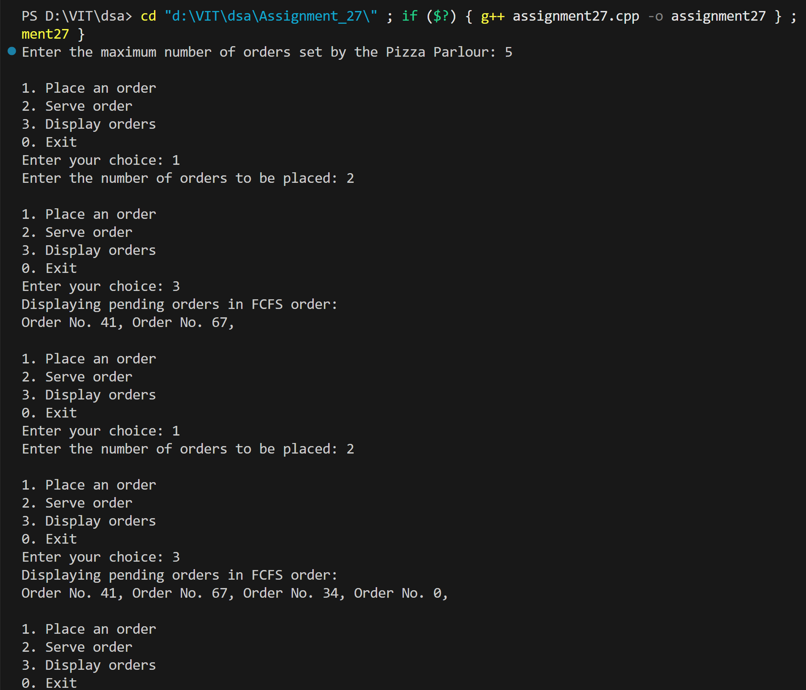
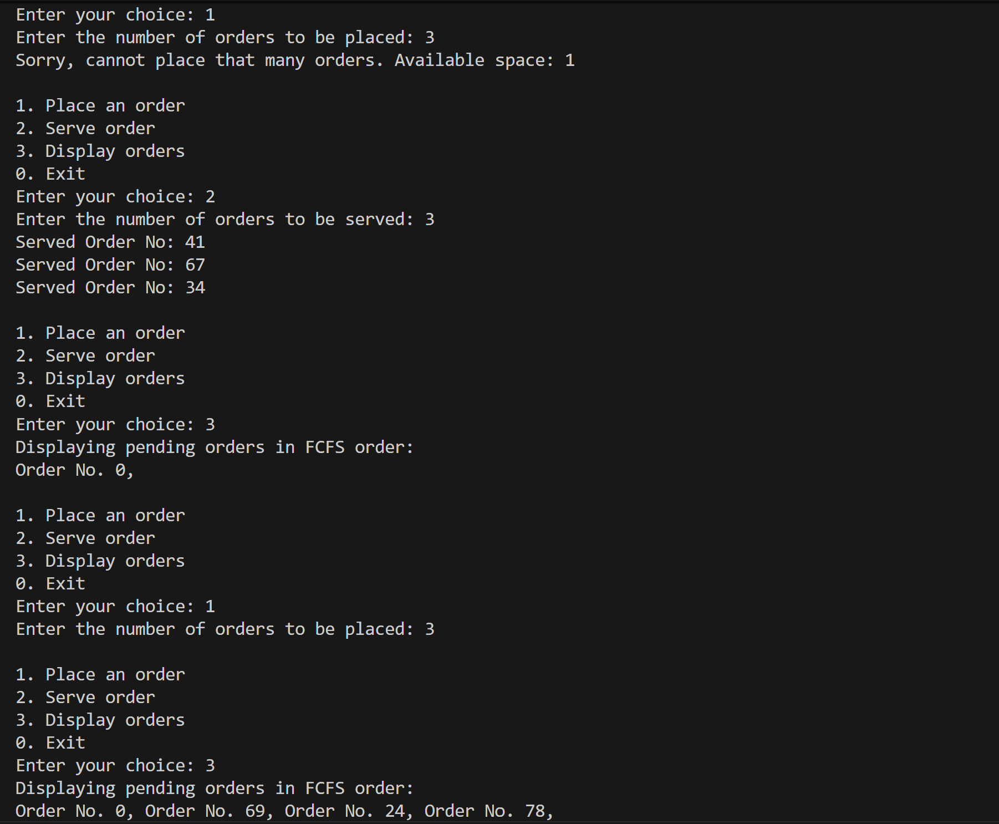
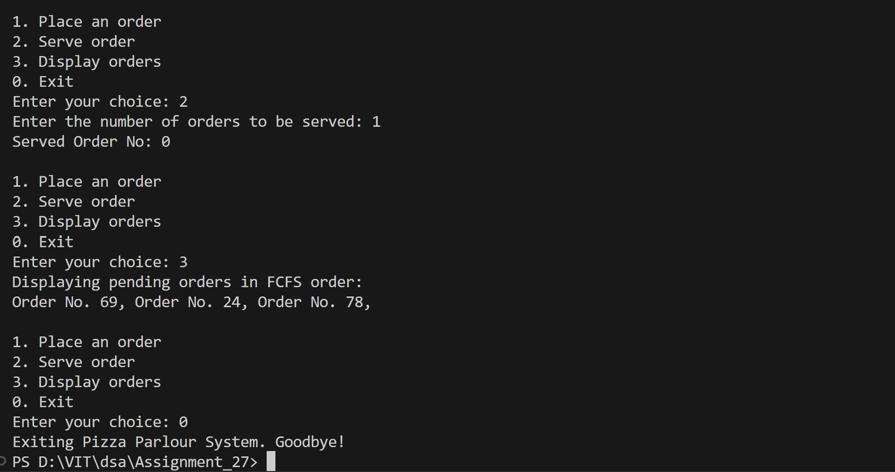

# Pizza Parlour Order Queue System (Circular Queue)

## Name: Likhit Chirmade, Roll no: 23

## Theory

### Circular Queue for Orders

Fixed-size queue where orders wrap around. Once placed, orders cannot be cancelled.

### FCFS (First-Come, First-Served)

Orders are served in the order they were placed.

### Circular Queue Operations

**Enqueue:**
```
rear = (front + size) % capacity
queue[rear] = order
size++
```

**Dequeue:**
```
order = queue[front]
front = (front + 1) % capacity
size--
```

### Advantages

1. **Fixed Memory:** No dynamic allocation
2. **Space Reuse:** Wraps around to reuse space
3. **Efficient:** O(1) operations

### Example

```
Capacity = 5
Orders: [101, 102, 103, _, _]
front = 0, rear = 2, size = 3

Place order 104:
Orders: [101, 102, 103, 104, _]
rear = 3, size = 4

Serve order:
Orders: [_, 102, 103, 104, _]
front = 1, size = 3
```

### Time Complexity

| Operation | Complexity |
|-----------|------------|
| Enqueue | O(1) |
| Dequeue | O(1) |
| Display | O(n) |

### Space Complexity

O(n) for fixed array

## Code

```cpp
#include <iostream>
#include <math.h>
using namespace std;

int front_lac = 0;
int rear_lac = -1;
int size_lac = 0;
int capacity_lac = 0;
int *queue_lac;

void Enqueue_lac()
{
    if (size_lac == capacity_lac)
    {
        cout << "Queue is full — cannot place any more orders!" << endl;
        return;
    }
    rear_lac = (front_lac + size_lac) % capacity_lac;
    queue_lac[rear_lac] = rand() % 100;
    size_lac++;
}

int Dequeue_lac()
{
    if (size_lac == 0)
    {
        cout << "Queue is empty! No orders to serve!" << endl;
        return -1;
    }
    int order_lac = queue_lac[front_lac];
    front_lac = (front_lac + 1) % capacity_lac;
    size_lac--;
    return order_lac;
}

void Display_lac()
{
    if (size_lac == 0)
    {
        cout << "Queue is empty! No orders to serve!" << endl;
        return;
    }
    for (int i = 0; i < size_lac; i++)
    {
        int index_lac = (front_lac + i) % capacity_lac;
        cout << "Order No. " << queue_lac[index_lac] << ", ";
    }
    cout << endl;
}

int main()
{
    int n_lac;
    cout << "Enter the maximum number of orders set by the Pizza Parlour: ";
    cin >> n_lac;

    capacity_lac = n_lac;
    queue_lac = new int[n_lac];

    int choice_lac, count_lac;

    while (true)
    {
        cout << "\n1. Place an order \n2. Serve order \n3. Display orders \n0. Exit" << endl;
        cout << "Enter your choice: ";
        cin >> choice_lac;

        switch (choice_lac)
        {
        case 1:
            cout << "Enter the number of orders to be placed: ";
            cin >> count_lac;
            if (count_lac > capacity_lac - size_lac)
            {
                cout << "Sorry, cannot place that many orders. Available space: " << capacity_lac - size_lac << endl;
                break;
            }
            for (int i = 0; i < count_lac; i++)
            {
                Enqueue_lac();
            }
            break;

        case 2:
            cout << "Enter the number of orders to be served: ";
            cin >> count_lac;
            if (count_lac > size_lac)
            {
                cout << "Not enough orders to serve! Currently available: " << size_lac << endl;
                break;
            }
            for (int i = 0; i < count_lac; i++)
            {
                int served_lac = Dequeue_lac();
                if (served_lac != -1)
                    cout << "Served Order No: " << served_lac << endl;
            }
            break;

        case 3:
            cout << "Displaying pending orders in FCFS order:" << endl;
            Display_lac();
            break;

        case 0:
            cout << "Exiting Pizza Parlour System. Goodbye!" << endl;
            exit(0);

        default:
            cout << "Invalid choice! Try again." << endl;
        }
    }
}
```

## Output




