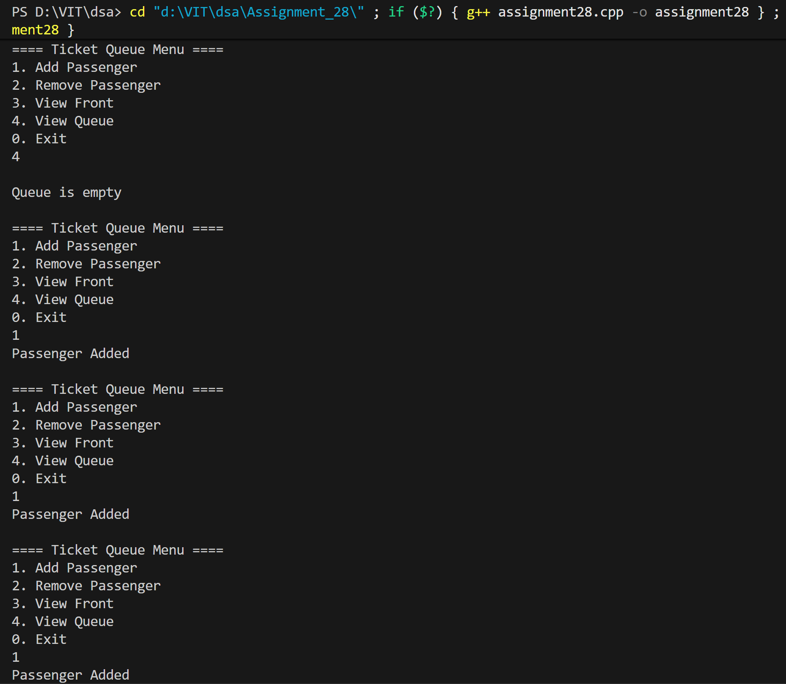
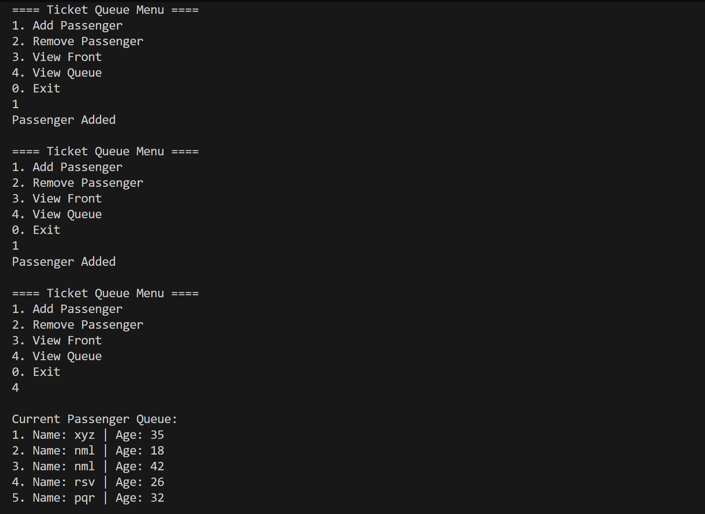
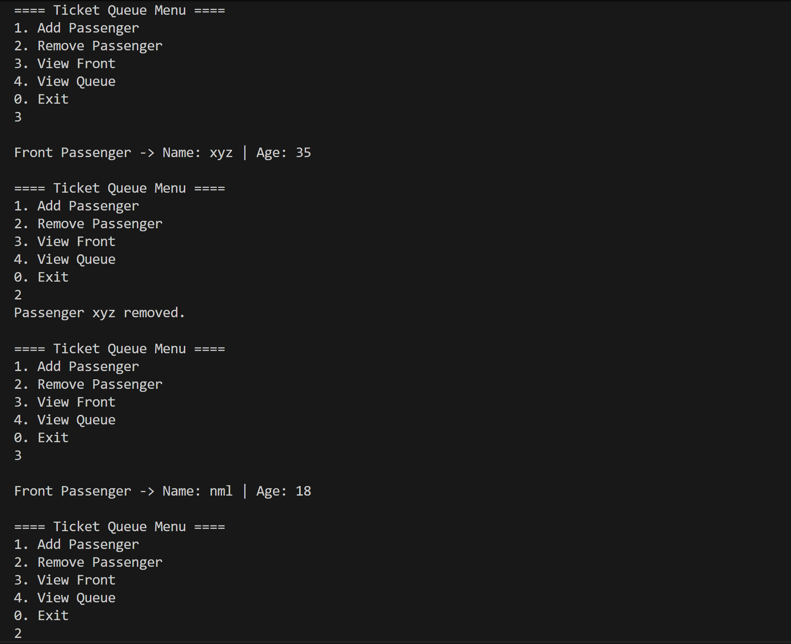
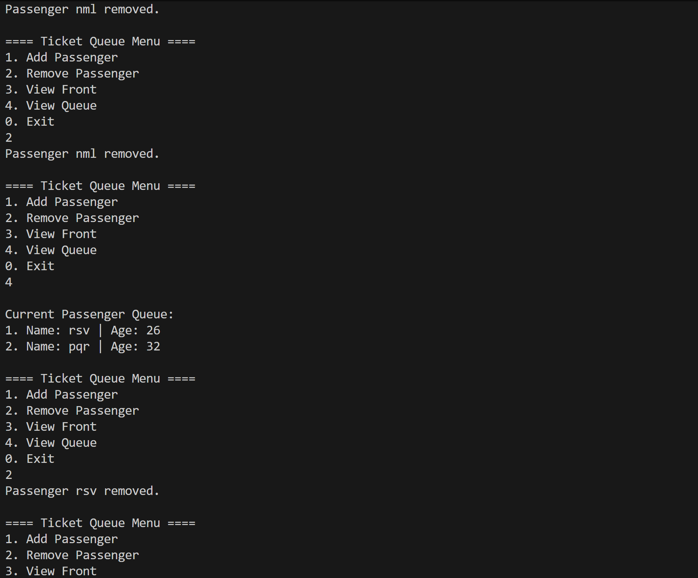
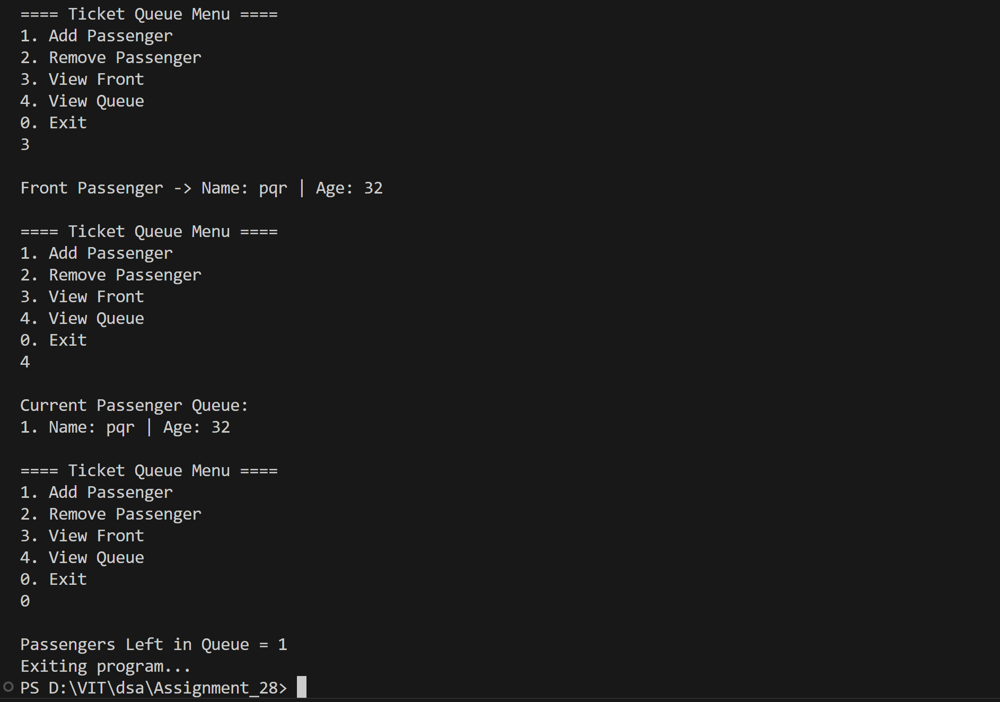

# Ticket Queue System using Linked List

## Name: Likhit Chirmade, Roll no: 23

## Theory

### Queue using Linked List

Dynamic queue with no size limit using linked nodes.

**Structure:**
```cpp
struct Node {
    string name;
    int age;
    Node* next;
};
```

### Operations

#### Enqueue (Add Passenger)
```
1. Create new node
2. If queue empty:
   - front = rear = newNode
3. Else:
   - rear.next = newNode
   - rear = newNode
```

#### Dequeue (Remove Passenger)
```
1. If queue empty: return
2. temp = front
3. front = front.next
4. If front == NULL: rear = NULL
5. Delete temp
```

#### View Front
```
Display front passenger details
```

#### View Queue
```
Traverse from front to rear
Display all passengers
```

### Advantages

1. **Dynamic Size:** No fixed limit
2. **No Overflow:** Grows as needed
3. **Memory Efficient:** Uses only required space

### Time Complexity

| Operation | Complexity |
|-----------|------------|
| Enqueue | O(1) |
| Dequeue | O(1) |
| View Front | O(1) |
| View Queue | O(n) |

### Space Complexity

O(n) for n passengers

## Code

```cpp
#include<iostream>
#include<math.h>
using namespace std;

typedef struct Queue_lac {
    string name_lac;
    int age_lac;
    Queue_lac *next_lac;
}Queue_lac;

string nameArr_lac[5] = {"abc","xyz","pqr","rsv","nml"};
Queue_lac *front_lac = nullptr;
Queue_lac *rear_lac = nullptr;

Queue_lac* getNode_lac() {
    Queue_lac *newNode_lac = new Queue_lac();
    newNode_lac->next_lac = nullptr;
    return newNode_lac;
}

void InsertPassenger_lac(Queue_lac *head_lac) {
    Queue_lac *newNode_lac = getNode_lac();
    newNode_lac->name_lac = nameArr_lac[rand()%5];
    newNode_lac->age_lac  = rand()%50 + 18;

    if(front_lac == nullptr) { 
        front_lac = rear_lac = newNode_lac;
        head_lac->next_lac = newNode_lac;
        return;
    }
    rear_lac->next_lac = newNode_lac;
    rear_lac = newNode_lac;
}

void ViewPassenger_lac() {
    if(front_lac == nullptr) {
        cout << "Queue is empty\n";
        return;
    }
    cout << "\nFront Passenger → Name: " << front_lac->name_lac 
         << " | Age: " << front_lac->age_lac << endl;
}

void RemovePassenger_lac(Queue_lac *head_lac) {
    if(front_lac == nullptr) {
        cout << "Queue empty\n";
        return;
    }
    cout << "Passenger " << front_lac->name_lac << " removed.\n";
    head_lac->next_lac = front_lac->next_lac;
    front_lac = front_lac->next_lac;

    if(front_lac == nullptr) rear_lac = nullptr;
}

void ViewQueue_lac() {
    if(front_lac == nullptr) {
        cout << "\nQueue is empty\n";
        return;
    }
    cout << "\nCurrent Passenger Queue:\n";
    Queue_lac *temp_lac = front_lac;
    int count_lac = 1;
    while(temp_lac != nullptr) {
        cout << count_lac++ << ". Name: " << temp_lac->name_lac 
             << " | Age: "  << temp_lac->age_lac << endl;
        temp_lac = temp_lac->next_lac;
    }
}

int Count_lac() {
    Queue_lac *temp_lac = front_lac;
    int cnt_lac = 0;
    while(temp_lac != nullptr) {
        cnt_lac++;
        temp_lac = temp_lac->next_lac;
    }
    return cnt_lac;
}

int main(){
    Queue_lac *MyQueue_lac = getNode_lac();
    int ch_lac;

    while(true){
        cout << "\n==== Ticket Queue Menu ====\n";
        cout << "1. Add Passenger\n2. Remove Passenger\n3. View Front\n4. View Queue\n0. Exit\n";
        cin >> ch_lac;

        switch(ch_lac){
            case 1: InsertPassenger_lac(MyQueue_lac); cout<<"Passenger Added\n"; break;
            case 2: RemovePassenger_lac(MyQueue_lac); break;
            case 3: ViewPassenger_lac(); break;
            case 4: ViewQueue_lac(); break;

            case 0:
                cout<<"\nPassengers Left in Queue = "<<Count_lac()<<endl;
                cout<<"Exiting program...\n";
                return 0;
        }
    }
}
```

## Output






