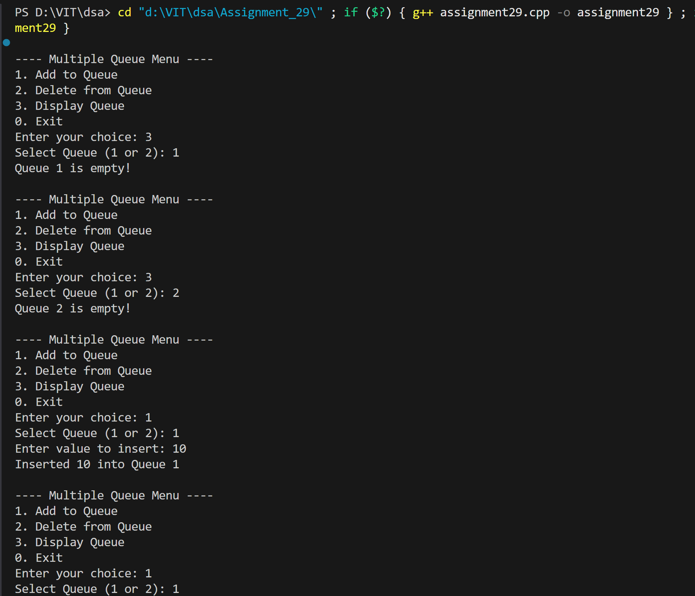
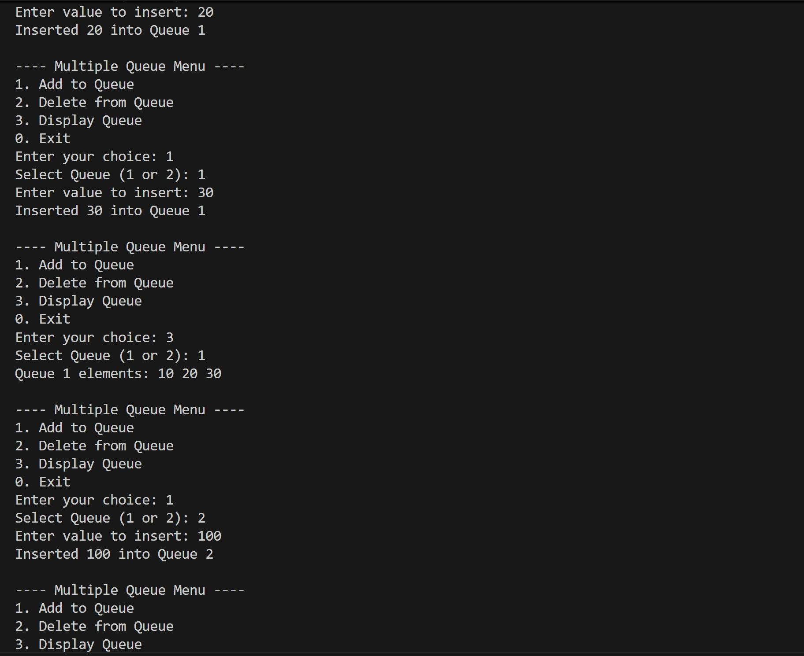
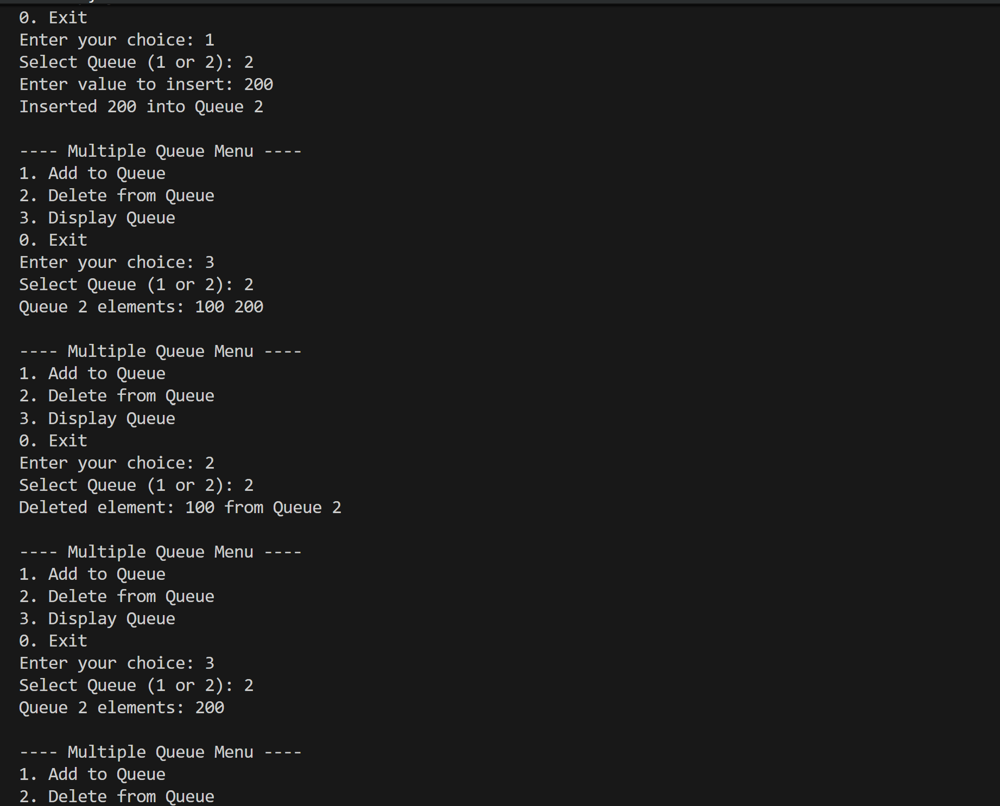
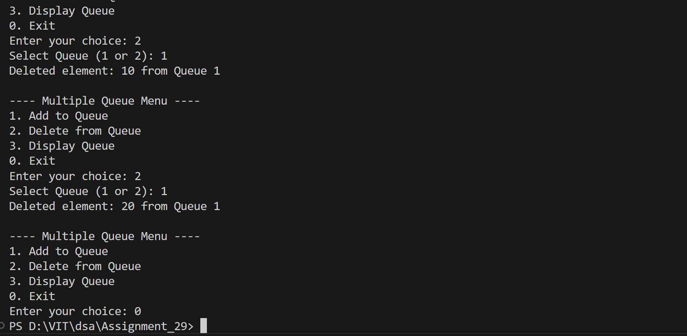

# Multiple Queues Implementation using Array

## Name: Likhit Chirmade, Roll no: 23

## Theory

### Multiple Queues

Two independent queues implemented using separate arrays.

**Data Structures:**
```cpp
int queue1[SIZE];
int front1, rear1;

int queue2[SIZE];
int front2, rear2;
```

### Operations

#### Enqueue
```
1. Select queue (1 or 2)
2. Check if queue full
3. If front == -1: front = 0
4. rear++
5. queue[rear] = value
```

#### Dequeue
```
1. Select queue (1 or 2)
2. Check if queue empty
3. value = queue[front]
4. front++
5. If front > rear: reset to -1
```

#### Display
```
Traverse from front to rear
Display all elements
```

### Pointer Usage

Uses pointers to select appropriate queue:
```cpp
int *queue, *front, *rear;
if (queueNo == 1) {
    queue = queue1;
    front = &front1;
    rear = &rear1;
}
```

### Time Complexity

| Operation | Complexity |
|-----------|------------|
| Enqueue | O(1) |
| Dequeue | O(1) |
| Display | O(n) |

### Space Complexity

O(2n) for two queues of size n

## Code

```cpp
#include <iostream>
using namespace std;

int *queue1_lac = new int[5];
int front1_lac = -1;
int rear1_lac = -1;

int *queue2_lac = new int[5];
int front2_lac = -1;
int rear2_lac = -1;

int SIZE = 5;

void Enqueue_lac(int queueNo_lac, int value_lac)
{
    int *rear_lac, *front_lac, *queue_lac;
    if (queueNo_lac == 1)
    {
        rear_lac = &rear1_lac;
        front_lac = &front1_lac;
        queue_lac = queue1_lac;
    }
    else
    {
        rear_lac = &rear2_lac;
        front_lac = &front2_lac;
        queue_lac = queue2_lac;
    }

    if (*rear_lac == SIZE - 1)
    {
        cout << "Queue " << queueNo_lac << " is full!" << endl;
        return;
    }

    if (*front_lac == -1)
        *front_lac = 0;

    (*rear_lac)++;
    queue_lac[*rear_lac] = value_lac;
    cout << "Inserted " << value_lac << " into Queue " << queueNo_lac << endl;
}

void Dequeue_lac(int queueNo_lac)
{
    int *rear_lac, *front_lac, *queue_lac;
    if (queueNo_lac == 1)
    {
        rear_lac = &rear1_lac;
        front_lac = &front1_lac;
        queue_lac = queue1_lac;
    }
    else
    {
        rear_lac = &rear2_lac;
        front_lac = &front2_lac;
        queue_lac = queue2_lac;
    }

    if (*front_lac == -1 || *front_lac > *rear_lac)
    {
        cout << "Queue " << queueNo_lac << " is empty!" << endl;
        return;
    }

    cout << "Deleted element: " << queue_lac[*front_lac] << " from Queue " << queueNo_lac << endl;
    (*front_lac)++;

    if (*front_lac > *rear_lac)
    {
        *front_lac = *rear_lac = -1; 
    }
}

void Display_lac(int queueNo_lac)
{
    int *rear_lac, *front_lac, *queue_lac;
    if (queueNo_lac == 1)
    {
        rear_lac = &rear1_lac;
        front_lac = &front1_lac;
        queue_lac = queue1_lac;
    }
    else
    {
        rear_lac = &rear2_lac;
        front_lac = &front2_lac;
        queue_lac = queue2_lac;
    }

    if (*front_lac == -1)
    {
        cout << "Queue " << queueNo_lac << " is empty!" << endl;
        return;
    }

    cout << "Queue " << queueNo_lac << " elements: ";
    for (int i = *front_lac; i <= *rear_lac; i++)
    {
        cout << queue_lac[i] << " ";
    }
    cout << endl;
}

int main()
{
    int choice_lac, queueNo_lac, value_lac;

    while (true)
    {
        cout << "\n---- Multiple Queue Menu ----" << endl;
        cout << "1. Add to Queue" << endl;
        cout << "2. Delete from Queue" << endl;
        cout << "3. Display Queue" << endl;
        cout << "0. Exit" << endl;
        cout << "Enter your choice: ";
        cin >> choice_lac;

        if (choice_lac == 0)
            break;

        cout << "Select Queue (1 or 2): ";
        cin >> queueNo_lac;

        switch (choice_lac)
        {
        case 1:
            cout << "Enter value to insert: ";
            cin >> value_lac;
            Enqueue_lac(queueNo_lac, value_lac);
            break;

        case 2:
            Dequeue_lac(queueNo_lac);
            break;

        case 3:
            Display_lac(queueNo_lac);
            break;

        default:
            cout << "Invalid choice!" << endl;
        }
    }

    return 0;
}
```

## Output





