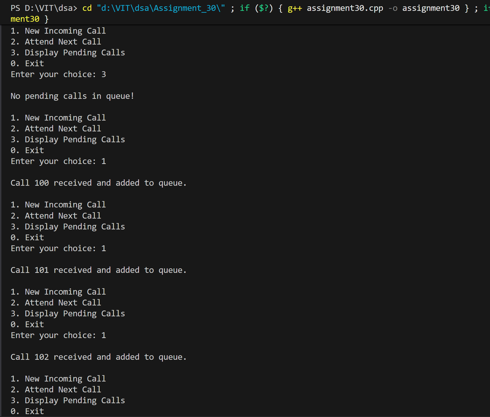
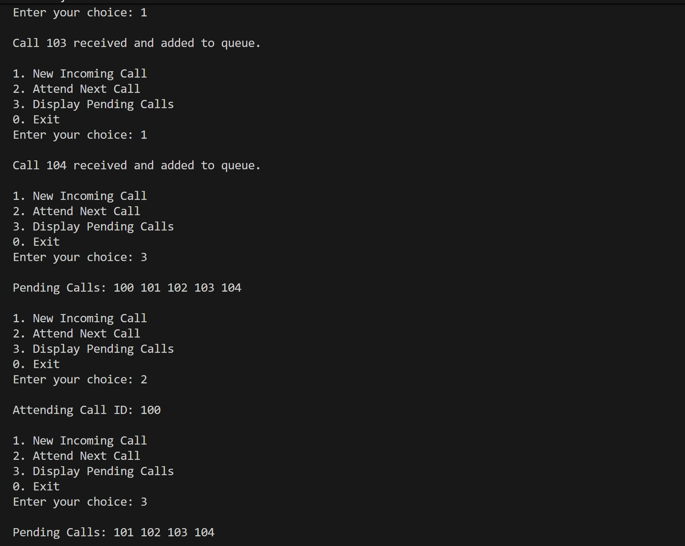
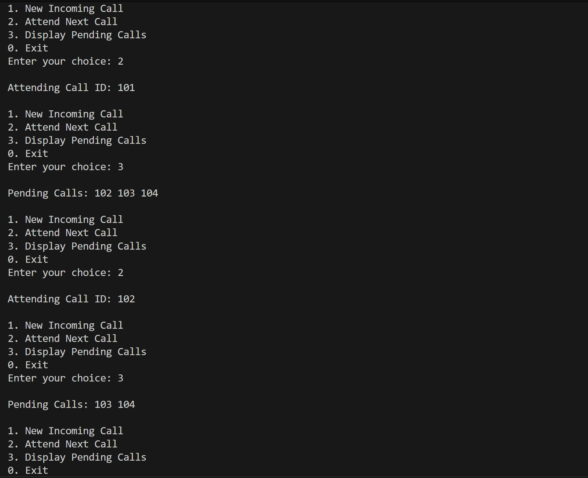
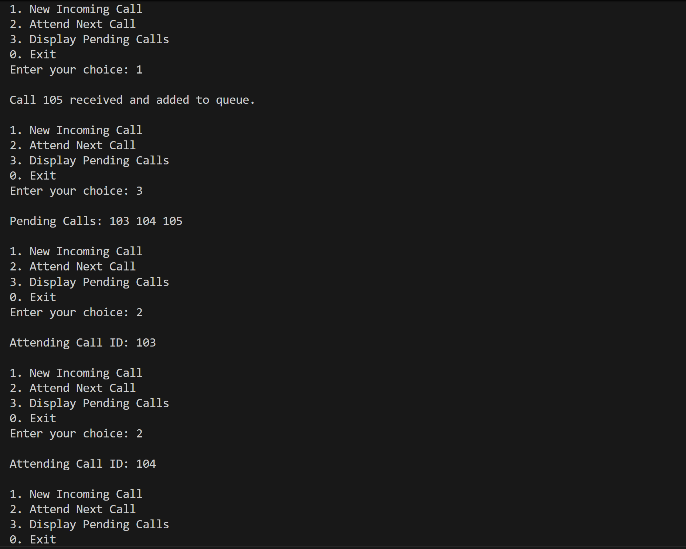
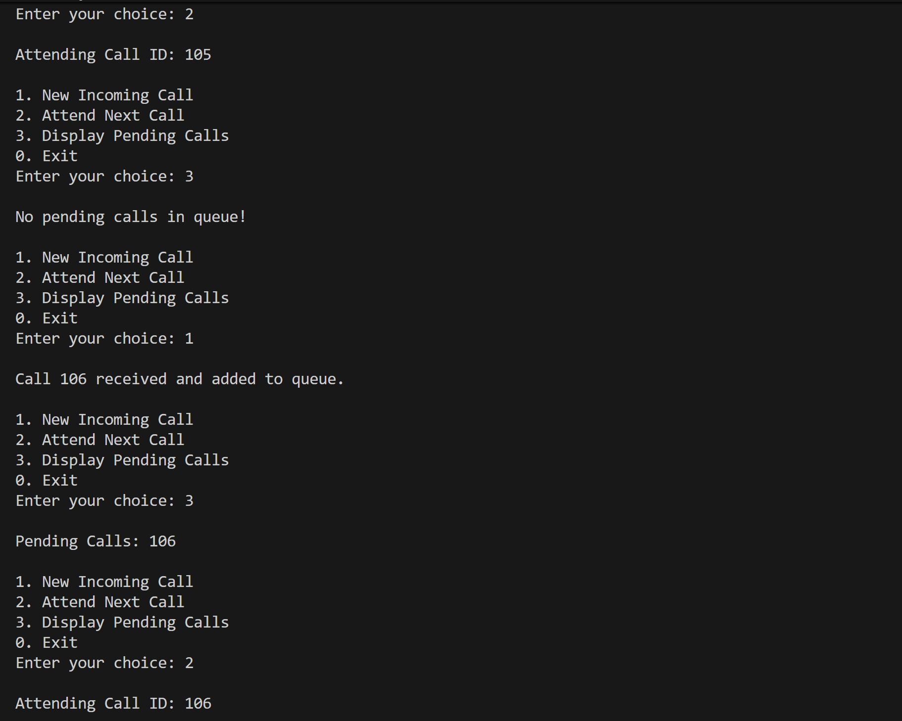
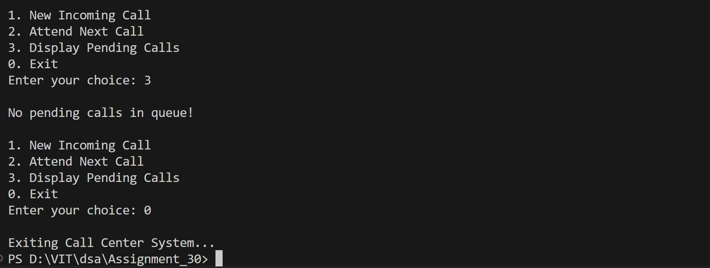

# Call Center Queue System using Linked List

## Name: Likhit Chirmade, Roll no: 23

## Theory

### Queue for Call Management

Linked list-based queue for handling customer calls in FCFS order.

**Node Structure:**
```cpp
struct Node {
    int callID;
    Node* next;
};
```

### Operations

#### Enqueue (Incoming Call)
```
1. Create new node with callID
2. If queue empty:
   - front = rear = newNode
3. Else:
   - rear.next = newNode
   - rear = newNode
```

#### Dequeue (Attend Call)
```
1. If queue empty:
   - Display "No pending calls"
2. Else:
   - temp = front
   - front = front.next
   - If front == NULL: rear = NULL
   - Delete temp
```

#### Display
```
Traverse from front to rear
Display all pending call IDs
```

### FCFS (First-Come, First-Served)

Calls are attended in the order they arrive.

### Advantages

1. **Dynamic:** No fixed size limit
2. **Efficient:** O(1) enqueue/dequeue
3. **Fair:** FCFS ensures fairness

### Time Complexity

| Operation | Complexity |
|-----------|------------|
| Enqueue | O(1) |
| Dequeue | O(1) |
| Display | O(n) |

### Space Complexity

O(n) for n calls

## Code

```cpp
#include <iostream>
#include <cstdlib>
using namespace std;

typedef struct Node_lac
{
    int callID_lac;
    Node_lac *next_lac;
}Node_lac;

Node_lac *front_lac = NULL;
Node_lac *rear_lac = NULL;

void Enqueue_lac(int id_lac)
{
    Node_lac *newNode_lac = new Node_lac();
    newNode_lac->callID_lac = id_lac;
    newNode_lac->next_lac = NULL;

    if (rear_lac == NULL)
    {
        front_lac = rear_lac = newNode_lac;
        cout << "Call " << id_lac << " received and added to queue." << endl;
        return;
    }

    rear_lac->next_lac = newNode_lac;
    rear_lac = newNode_lac;
    cout << "Call " << id_lac << " received and added to queue." << endl;
}
void Dequeue_lac()
{
    if (front_lac == NULL)
    {
        cout << "No pending calls. Waiting for customers..." << endl;
        return;
    }

    Node_lac *temp_lac = front_lac;
    cout << "Attending Call ID: " << front_lac->callID_lac << endl;

    front_lac = front_lac->next_lac;

    if (front_lac == NULL)
        rear_lac = NULL; 

    delete temp_lac;
}

void Display_lac()
{
    if (front_lac == NULL)
    {
        cout << "No pending calls in queue!" << endl;
        return;
    }

    Node_lac *temp_lac = front_lac;
    cout << "Pending Calls: ";
    while (temp_lac != NULL)
    {
        cout << temp_lac->callID_lac << " ";
        temp_lac = temp_lac->next_lac;
    }
    cout << endl;
}

int main()
{
    int choice_lac, id_lac, callCounter_lac = 100;

    while (true)
    {
        cout << "1. New Incoming Call" << endl;
        cout << "2. Attend Next Call" << endl;
        cout << "3. Display Pending Calls" << endl;
        cout << "0. Exit" << endl;
        cout << "Enter your choice: ";
        cin >> choice_lac;

        switch (choice_lac)
        {
        case 1:
            Enqueue_lac(callCounter_lac++);
            break;

        case 2:
            Dequeue_lac();
            break;

        case 3:
            Display_lac();
            break;

        case 0:
            cout << "Exiting Call Center System..." << endl;
            exit(0);

        default:
            cout << "Invalid choice! Try again." << endl;
        }
    }

    return 0;
}
```

## Output







