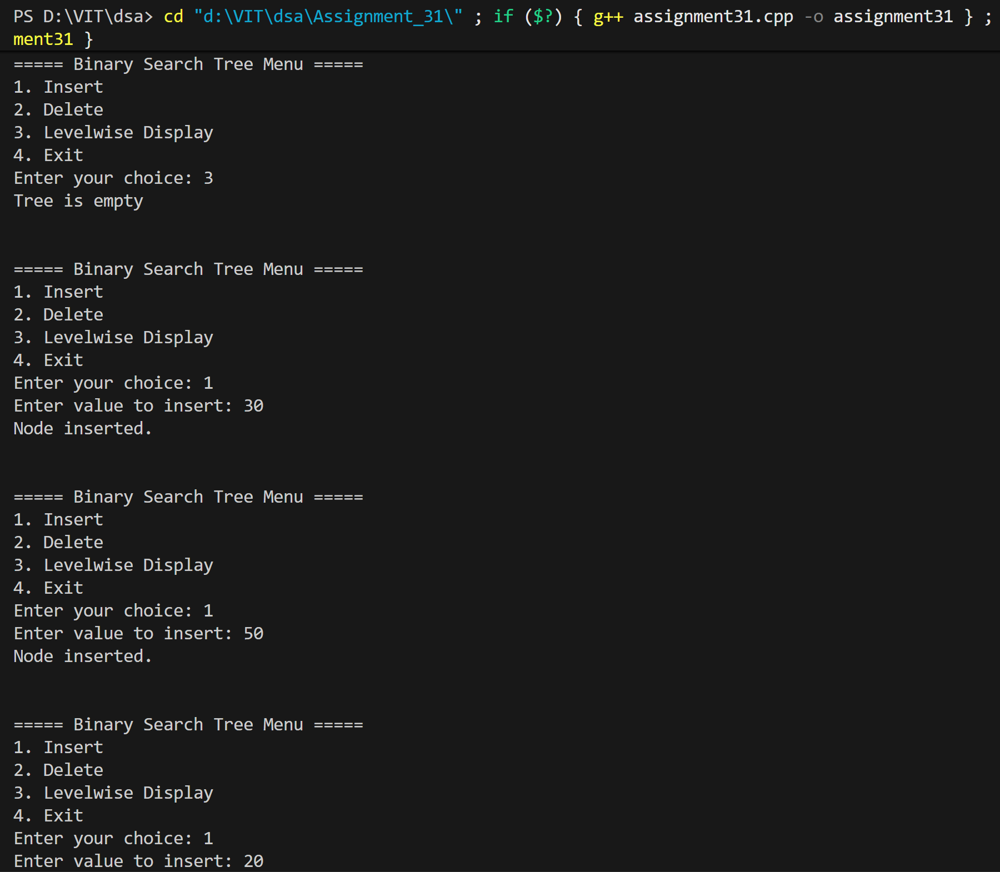
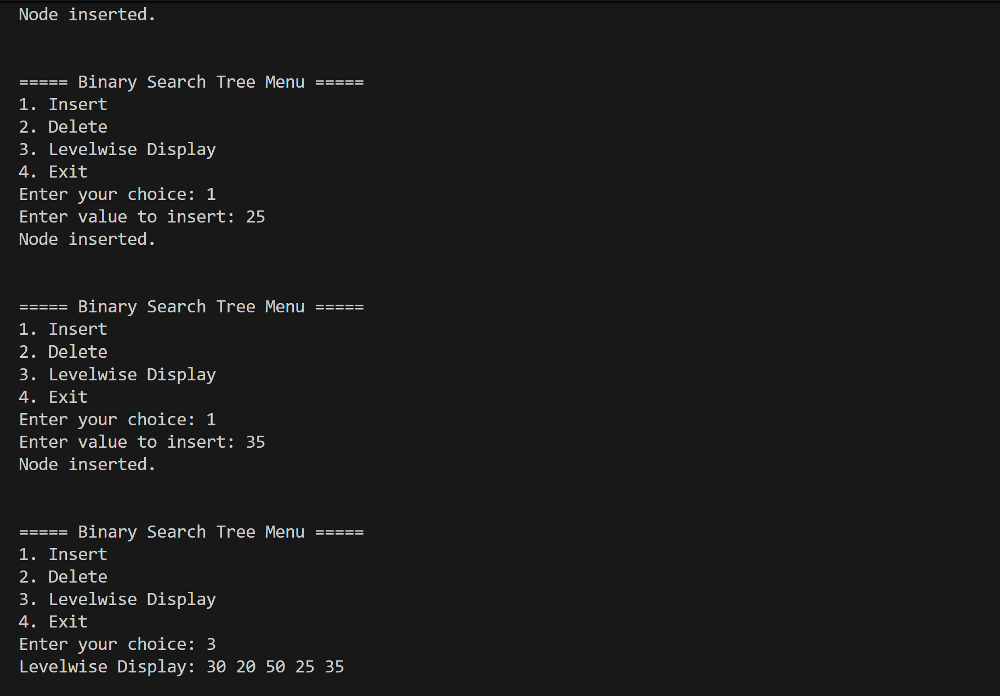
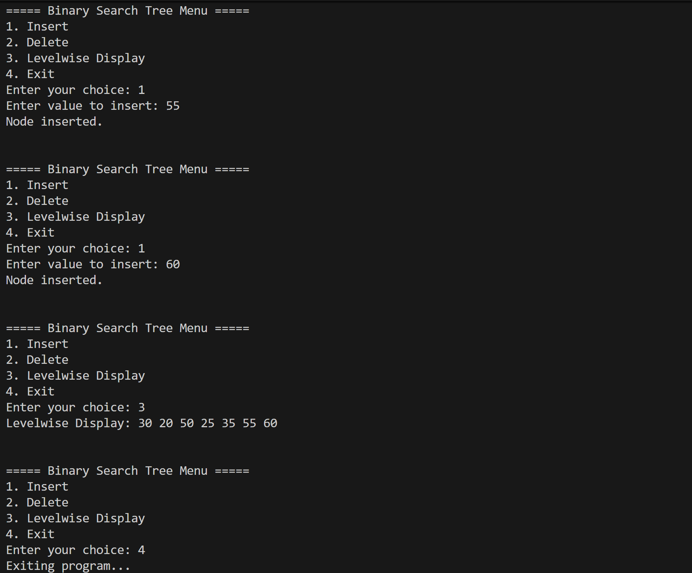

# BST Operations: Create, Insert, Delete, Level-wise Display

## Name: Likhit Chirmade, Roll no: 23

## Theory

### Binary Search Tree (BST)

Tree where left child < parent < right child.

### Operations

#### Insert
```
1. If tree empty → Create root
2. If value < root → Insert left
3. If value > root → Insert right
4. Reject duplicates
```

**Time:** O(log n) average, O(n) worst

#### Delete
```
Three cases:
1. Leaf node → Delete directly
2. One child → Replace with child
3. Two children → Replace with inorder successor
```

**Inorder Successor:** Leftmost node in right subtree

#### Level-wise Display (BFS)
```
1. Use queue
2. Enqueue root
3. While queue not empty:
   a. Dequeue node
   b. Print it
   c. Enqueue left and right children
```

Displays tree level by level.

### Time Complexity

| Operation | Average | Worst |
|-----------|---------|-------|
| Insert | O(log n) | O(n) |
| Delete | O(log n) | O(n) |
| Level-wise | O(n) | O(n) |

### Space Complexity

O(n) for tree, O(w) for queue where w = max width

## Code

```cpp
#include<iostream>
#include<queue>
using namespace std;

typedef struct tree_lac
{
    int data_lac;
    tree_lac *left_lac;
    tree_lac *right_lac;
};

tree_lac *getNode_lac(int val_lac)
{
    tree_lac *newNode_lac = new tree_lac();
    newNode_lac->data_lac = val_lac;
    newNode_lac->left_lac = nullptr;
    newNode_lac->right_lac = nullptr;
    return newNode_lac;
}

tree_lac *findMin_lac(tree_lac *root_lac)
{
    while (root_lac && root_lac->left_lac != nullptr)
    {
        root_lac = root_lac->left_lac;
    }
    return root_lac;
}

tree_lac *insert_lac(tree_lac *root_lac, int val_lac)
{
    if (root_lac == nullptr)
    {
        return getNode_lac(val_lac);
    }
    if (val_lac < root_lac->data_lac)
    {
        root_lac->left_lac = insert_lac(root_lac->left_lac, val_lac);
    }
    else if (val_lac > root_lac->data_lac)
    {
        root_lac->right_lac = insert_lac(root_lac->right_lac, val_lac);
    }
    else
    {
        cout << "\nDuplicate value not allowed!";
    }
    return root_lac;
}

tree_lac *deleteNode_lac(tree_lac *root_lac, int val_lac)
{
    if (root_lac == nullptr)
    {
        return root_lac;
    }
    if (val_lac < root_lac->data_lac)
    {
        root_lac->left_lac = deleteNode_lac(root_lac->left_lac, val_lac);
    }
    else if (val_lac > root_lac->data_lac)
    {
        root_lac->right_lac = deleteNode_lac(root_lac->right_lac, val_lac);
    }
    else
    {
        if (root_lac->left_lac == nullptr && root_lac->right_lac == nullptr)
        {
            delete root_lac;
            return nullptr;
        }
        else if (root_lac->left_lac == nullptr)
        {
            tree_lac *temp_lac = root_lac->right_lac;
            delete root_lac;
            return temp_lac;
        }
        else if (root_lac->right_lac == nullptr)
        {
            tree_lac *temp_lac = root_lac->left_lac;
            delete root_lac;
            return temp_lac;
        }
        else
        {
            tree_lac *temp_lac = findMin_lac(root_lac->right_lac);
            root_lac->data_lac = temp_lac->data_lac;
            root_lac->right_lac = deleteNode_lac(root_lac->right_lac, temp_lac->data_lac);
        }
    }
    return root_lac;
}

void levelwiseDisplay_lac(tree_lac* root_lac) {
    if (root_lac == NULL) {
        cout << "Tree is empty\n";
        return;
    }

    tree_lac* queue_lac[100];
    int front_lac = 0, rear_lac = 0;
    queue_lac[rear_lac++] = root_lac;

    cout << "Levelwise Display: ";
    while (front_lac < rear_lac) {
        tree_lac* current_lac = queue_lac[front_lac++];
        cout << current_lac->data_lac << " ";
        if (current_lac->left_lac)
            queue_lac[rear_lac++] = current_lac->left_lac;
        if (current_lac->right_lac)
            queue_lac[rear_lac++] = current_lac->right_lac;
    }
    cout << endl;
}

int main()
{
    tree_lac *root_lac = nullptr;
    int choice_lac, value_lac;

    while (true)
    {
        cout << "\n\n===== Binary Search Tree Menu =====";
        cout << "\n1. Insert";
        cout << "\n2. Delete";
        cout << "\n3. Levelwise Display";
        cout << "\n4. Exit";
        cout << "\nEnter your choice: ";
        cin >> choice_lac;

        switch (choice_lac)
        {
            case 1:
                cout << "Enter value to insert: ";
                cin >> value_lac;
                root_lac = insert_lac(root_lac, value_lac);
                cout << "Node inserted.\n";
                break;

            case 2:
                cout << "Enter value to delete: ";
                cin >> value_lac;
                root_lac = deleteNode_lac(root_lac, value_lac);
                cout << "Node deleted (if found).\n";
                break;

            case 3:
                levelwiseDisplay_lac(root_lac);
                break;

            case 4:
                cout << "Exiting program...\n";
                return 0;

            default:
                cout << "Invalid choice! Try again.\n";
        }
    }
}
```

## Output




