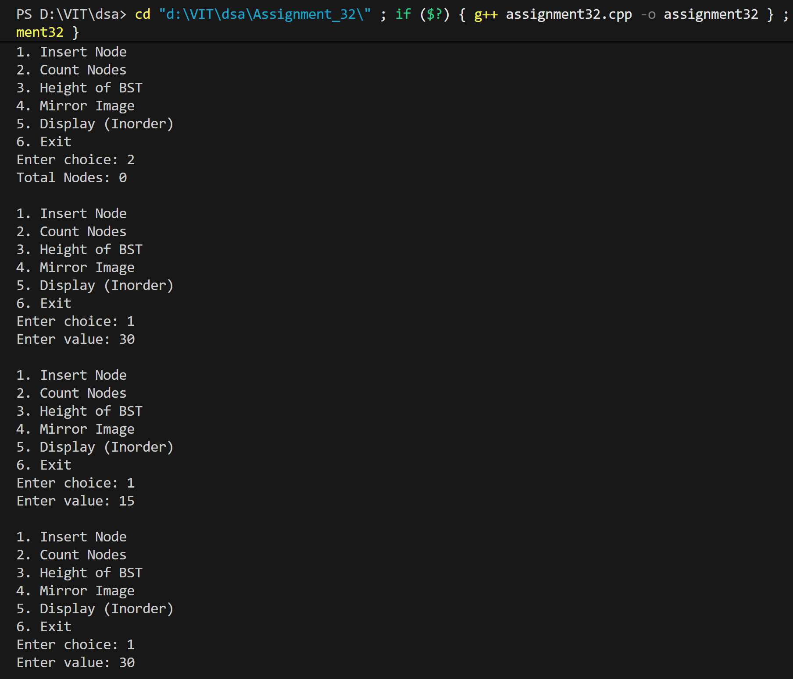
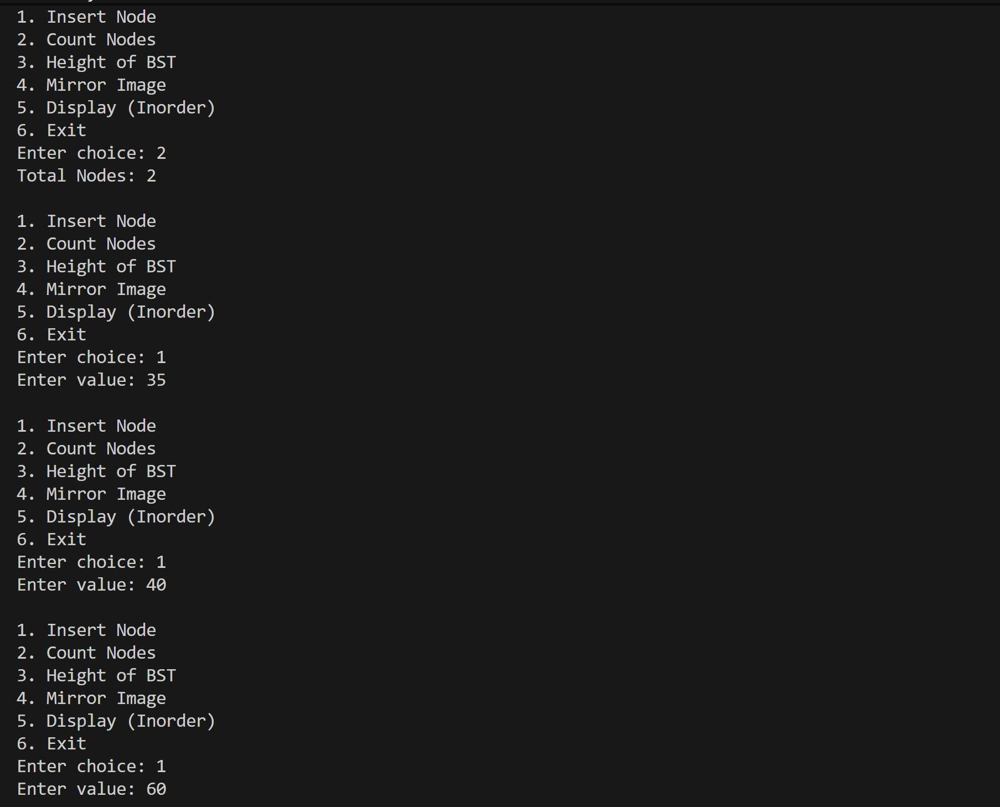
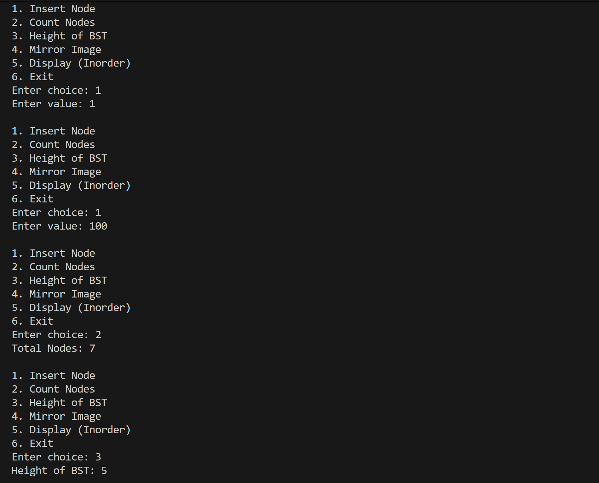
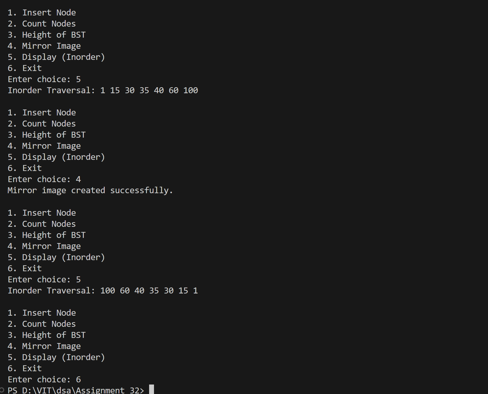

# BST Operations: Count Nodes, Height, Mirror Image

## Name: Likhit Chirmade, Roll no: 23

## Theory

### BST Operations

#### Count Nodes
```
count(root):
    if root == NULL: return 0
    return 1 + count(left) + count(right)
```

Recursively counts all nodes.

**Time:** O(n)

#### Height of BST
```
height(root):
    if root == NULL: return 0
    leftHeight = height(left)
    rightHeight = height(right)
    return max(leftHeight, rightHeight) + 1
```

Height = longest path from root to leaf.

**Time:** O(n)

#### Mirror Image
```
mirror(root):
    if root == NULL: return
    mirror(left)
    mirror(right)
    swap(left, right)
```

Swaps left and right children recursively.

**Time:** O(n)

### Example

```
Original BST:
      5
     / \
    3   7
   /     \
  1       9

Mirror:
      5
     / \
    7   3
   /     \
  9       1
```

### Time Complexity

| Operation | Complexity |
|-----------|------------|
| Count Nodes | O(n) |
| Height | O(n) |
| Mirror | O(n) |

### Space Complexity

O(h) for recursion stack where h = height

## Code

```cpp
#include <iostream>
using namespace std;

struct Node_lac {
    int data_lac;
    Node_lac *left_lac, *right_lac;
};

Node_lac* createNode_lac(int data_lac) {
    Node_lac* newNode_lac = new Node_lac();
    newNode_lac->data_lac = data_lac;
    newNode_lac->left_lac = newNode_lac->right_lac = NULL;
    return newNode_lac;
}

Node_lac* insertNode_lac(Node_lac* root_lac, int data_lac) {
    if (root_lac == NULL)
        return createNode_lac(data_lac);

    if (data_lac < root_lac->data_lac)
        root_lac->left_lac = insertNode_lac(root_lac->left_lac, data_lac);
    else if (data_lac > root_lac->data_lac)
        root_lac->right_lac = insertNode_lac(root_lac->right_lac, data_lac);

    return root_lac;
}

int countNodes_lac(Node_lac* root_lac) {
    if (root_lac == NULL)
        return 0;
    return 1 + countNodes_lac(root_lac->left_lac) + countNodes_lac(root_lac->right_lac);
}

int heightBST_lac(Node_lac* root_lac) {
    if (root_lac == NULL)
        return 0;

    int leftHeight_lac = heightBST_lac(root_lac->left_lac);
    int rightHeight_lac = heightBST_lac(root_lac->right_lac);

    return (leftHeight_lac > rightHeight_lac ? leftHeight_lac : rightHeight_lac) + 1;
}

void mirrorBST_lac(Node_lac* root_lac) {
    if (root_lac == NULL)
        return;

    mirrorBST_lac(root_lac->left_lac);
    mirrorBST_lac(root_lac->right_lac);

    Node_lac* temp_lac = root_lac->left_lac;
    root_lac->left_lac = root_lac->right_lac;
    root_lac->right_lac = temp_lac;
}

void inorder_lac(Node_lac* root_lac) {
    if (root_lac != NULL) {
        inorder_lac(root_lac->left_lac);
        cout << root_lac->data_lac << " ";
        inorder_lac(root_lac->right_lac);
    }
}

int main() {
    Node_lac* root_lac = NULL;
    int choice_lac, value_lac;

    while (true) {
        cout << "\n1. Insert Node\n2. Count Nodes\n3. Height of BST\n4. Mirror Image\n5. Display (Inorder)\n6. Exit\nEnter choice: ";
        cin >> choice_lac;

        switch (choice_lac) {
            case 1:
                cout << "Enter value: ";
                cin >> value_lac;
                root_lac = insertNode_lac(root_lac, value_lac);
                break;

            case 2:
                cout << "Total Nodes: " << countNodes_lac(root_lac) << endl;
                break;

            case 3:
                cout << "Height of BST: " << heightBST_lac(root_lac) << endl;
                break;

            case 4:
                mirrorBST_lac(root_lac);
                cout << "Mirror image created successfully.\n";
                break;

            case 5:
                cout << "Inorder Traversal: ";
                inorder_lac(root_lac);
                cout << endl;
                break;

            case 6:
                return 0;

            default:
                cout << "Invalid choice\n";
        }
    }
}
```

## Output





