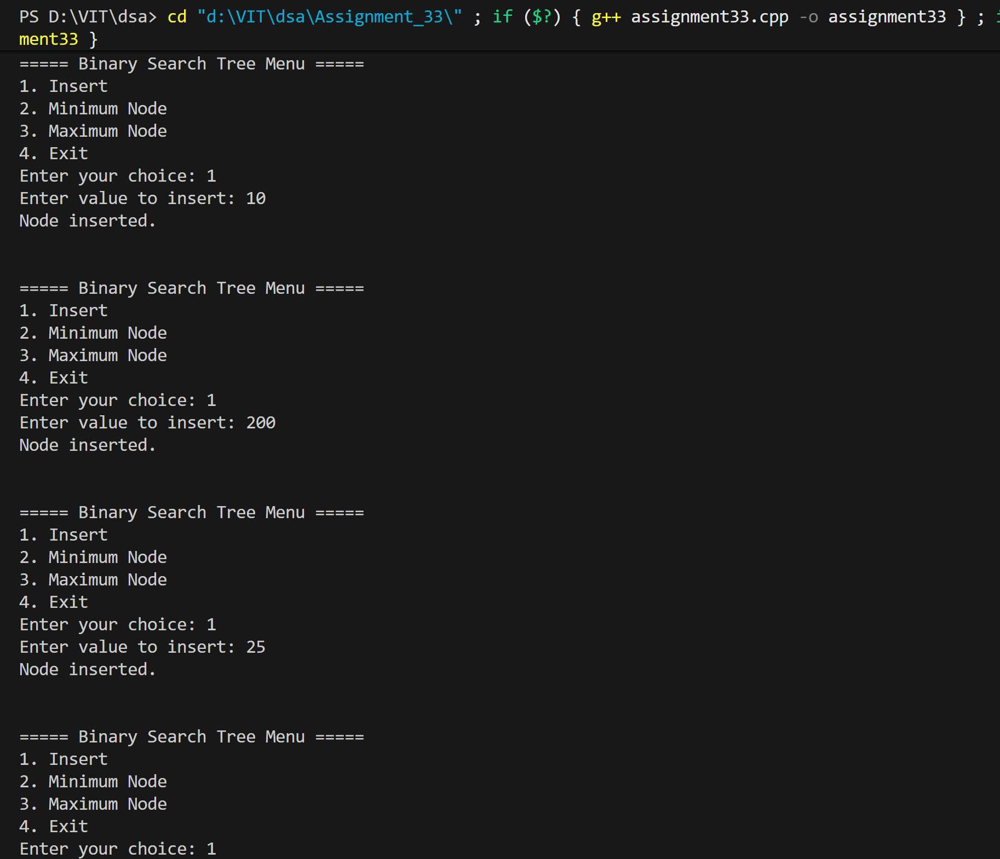
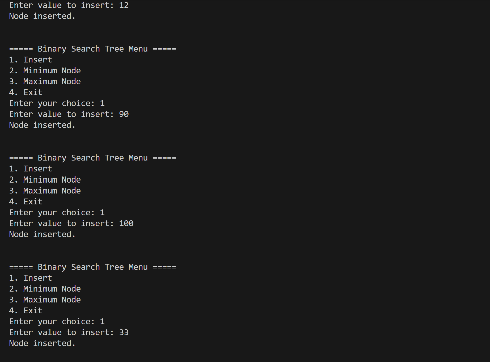
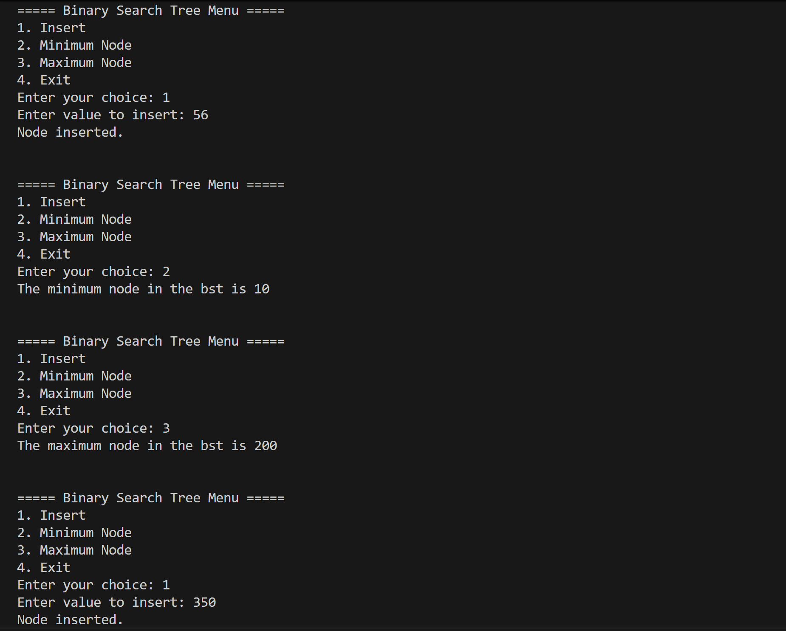
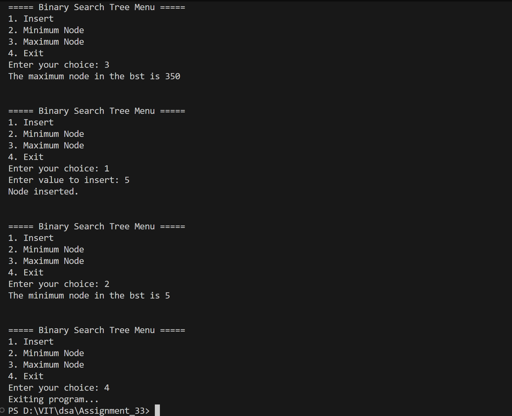

# BST: Find Minimum and Maximum

## Name: Likhit Chirmade, Roll no: 23

## Theory

### Finding Min/Max in BST

**Key Property:** BST maintains sorted order
- Minimum: Leftmost node
- Maximum: Rightmost node

#### Find Minimum
```
findMin(root):
    while root.left != NULL:
        root = root.left
    return root.data
```

Traverse left until no left child exists.

#### Find Maximum
```
findMax(root):
    while root.right != NULL:
        root = root.right
    return root.data
```

Traverse right until no right child exists.

### Example

```
BST:
      10
     /  \
    5    15
   / \     \
  3   7    20

Minimum: 3 (leftmost)
Maximum: 20 (rightmost)
```

### Time Complexity

| Operation | Average | Worst |
|-----------|---------|-------|
| Find Min | O(log n) | O(n) |
| Find Max | O(log n) | O(n) |

Worst case occurs in skewed tree (linked list).

### Space Complexity

O(1) - Iterative approach uses constant space

## Code

```cpp
#include<iostream>
#include<queue>
using namespace std;

typedef struct tree_lac
{
    int data_lac;
    tree_lac *left_lac;
    tree_lac *right_lac;
}tree_lac;

tree_lac *getNode_lac(int val_lac)
{
    tree_lac *newNode_lac = new tree_lac();
    newNode_lac->data_lac = val_lac;
    newNode_lac->left_lac = nullptr;
    newNode_lac->right_lac = nullptr;
    return newNode_lac;
}

int findMin_lac(tree_lac *root_lac)
{
    while (root_lac && root_lac->left_lac != nullptr)
    {
        root_lac = root_lac->left_lac;
    }
    return root_lac->data_lac;
}
int findMax_lac(tree_lac *root_lac)
{
    while (root_lac && root_lac->right_lac != nullptr)
    {
        root_lac = root_lac->right_lac;
    }
    return root_lac->data_lac;
}

tree_lac *insert_lac(tree_lac *root_lac, int val_lac)
{
    if (root_lac == nullptr)
    {
        return getNode_lac(val_lac);
    }
    if (val_lac < root_lac->data_lac)
    {
        root_lac->left_lac = insert_lac(root_lac->left_lac, val_lac);
    }
    else if (val_lac > root_lac->data_lac)
    {
        root_lac->right_lac = insert_lac(root_lac->right_lac, val_lac);
    }
    else
    {
        cout << "\nDuplicate value not allowed!";
    }
    return root_lac;
}


int main()
{
    tree_lac *root_lac = nullptr;
    int choice_lac, value_lac;
    int min,max;
    while (true)
    {
        cout << "\n\n===== Binary Search Tree Menu =====";
        cout << "\n1. Insert";
        cout << "\n2. Minimum Node";
        cout << "\n3. Maximum Node";
        cout << "\n4. Exit";
        cout << "\nEnter your choice: ";
        cin >> choice_lac;

        switch (choice_lac)
        {
            case 1:
                cout << "Enter value to insert: ";
                cin >> value_lac;
                root_lac = insert_lac(root_lac, value_lac);
                cout << "Node inserted.\n";
                break;

            case 2:
                min = findMin_lac(root_lac);
                cout << "The minimum node in the bst is "<<min<<" \n";
                break;

            case 3:
                max = findMax_lac(root_lac);
                cout << "The maximum node in the bst is "<<max<<" \n";
                break;

            case 4:
                cout << "Exiting program...\n";
                return 0;

            default:
                cout << "Invalid choice! Try again.\n";
        }
    }
}
```

## Output





