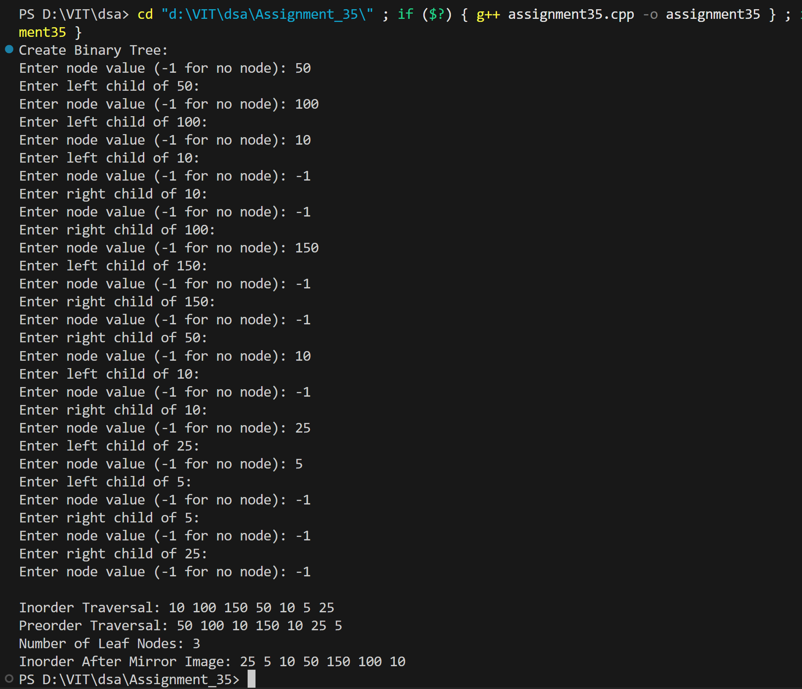

# Binary Tree Recursive Operations

## Name: Likhit Chirmade, Roll no: 23

## Theory

### Recursive Tree Traversals

Uses function call stack implicitly.

#### Inorder (Recursive)
```
inorder(root):
    if root == NULL: return
    inorder(left)
    print(root)
    inorder(right)
```

**Order:** Left → Root → Right

#### Preorder (Recursive)
```
preorder(root):
    if root == NULL: return
    print(root)
    preorder(left)
    preorder(right)
```

**Order:** Root → Left → Right

#### Count Leaf Nodes
```
countLeaf(root):
    if root == NULL: return 0
    if root is leaf: return 1
    return countLeaf(left) + countLeaf(right)
```

#### Mirror Image
```
mirror(root):
    if root == NULL: return
    mirror(left)
    mirror(right)
    swap(left, right)
```

### Comparison: Recursive vs Non-Recursive

| Aspect | Recursive | Non-Recursive |
|--------|-----------|---------------|
| Code | Simpler | More complex |
| Stack | Implicit | Explicit |
| Space | O(h) | O(h) |
| Readability | Better | Lower |

### Time Complexity

| Operation | Complexity |
|-----------|------------|
| Inorder | O(n) |
| Preorder | O(n) |
| Count Leaves | O(n) |
| Mirror | O(n) |

### Space Complexity

O(h) for recursion stack where h = height

## Code

```cpp
#include <iostream>
using namespace std;

struct Node_lac {
    int data_lac;
    Node_lac *left_lac, *right_lac;
};

Node_lac* createNode_lac(int val_lac) {
    Node_lac* newNode_lac = new Node_lac();
    newNode_lac->data_lac = val_lac;
    newNode_lac->left_lac = newNode_lac->right_lac = NULL;
    return newNode_lac;
}

Node_lac* createTree_lac() {
    int val_lac;
    cout << "Enter node value (-1 for no node): ";
    cin >> val_lac;

    if (val_lac == -1) return NULL;

    Node_lac* root_lac = createNode_lac(val_lac);

    cout << "Enter left child of " << val_lac << ":\n";
    root_lac->left_lac = createTree_lac();

    cout << "Enter right child of " << val_lac << ":\n";
    root_lac->right_lac = createTree_lac();

    return root_lac;
}

void inorder_lac(Node_lac* root_lac) {
    if (root_lac == NULL) return;
    inorder_lac(root_lac->left_lac);
    cout << root_lac->data_lac << " ";
    inorder_lac(root_lac->right_lac);
}

void preorder_lac(Node_lac* root_lac) {
    if (root_lac == NULL) return;
    cout << root_lac->data_lac << " ";
    preorder_lac(root_lac->left_lac);
    preorder_lac(root_lac->right_lac);
}

int countLeaf_lac(Node_lac* root_lac) {
    if (root_lac == NULL) return 0;

    if (root_lac->left_lac == NULL && root_lac->right_lac == NULL)
        return 1;

    return countLeaf_lac(root_lac->left_lac) +
           countLeaf_lac(root_lac->right_lac);
}

void mirror_lac(Node_lac* root_lac) {
    if (root_lac == NULL) return;

    mirror_lac(root_lac->left_lac);
    mirror_lac(root_lac->right_lac);

    Node_lac* temp_lac = root_lac->left_lac;
    root_lac->left_lac = root_lac->right_lac;
    root_lac->right_lac = temp_lac;
}

int main() {

    cout << "Create Binary Tree:\n";
    Node_lac* root_lac = createTree_lac();

    cout << "\nInorder Traversal: ";
    inorder_lac(root_lac);

    cout << "\nPreorder Traversal: ";
    preorder_lac(root_lac);

    cout << "\nNumber of Leaf Nodes: " << countLeaf_lac(root_lac);

    mirror_lac(root_lac);

    cout << "\nInorder After Mirror Image: ";
    inorder_lac(root_lac);

    cout << endl;
    return 0;
}
```

## Output


