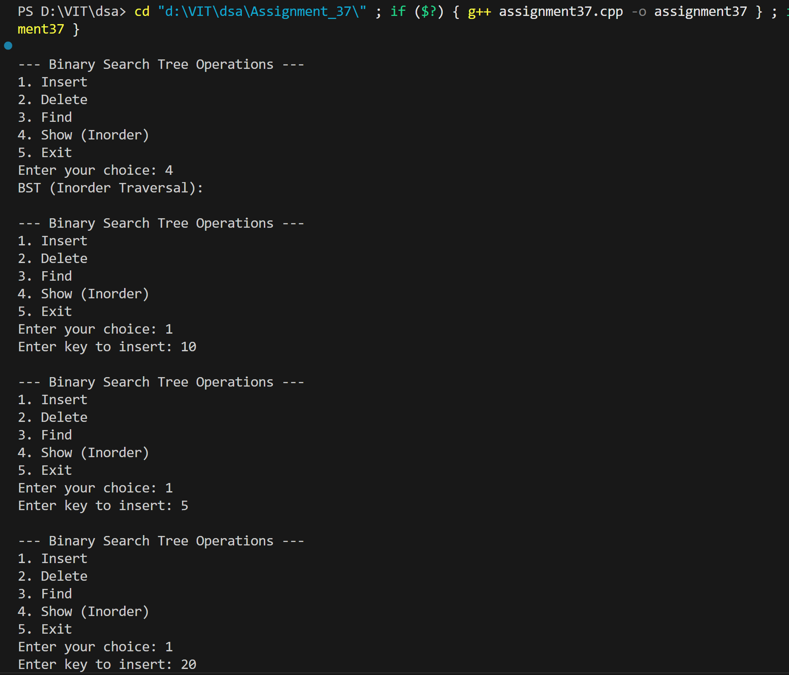
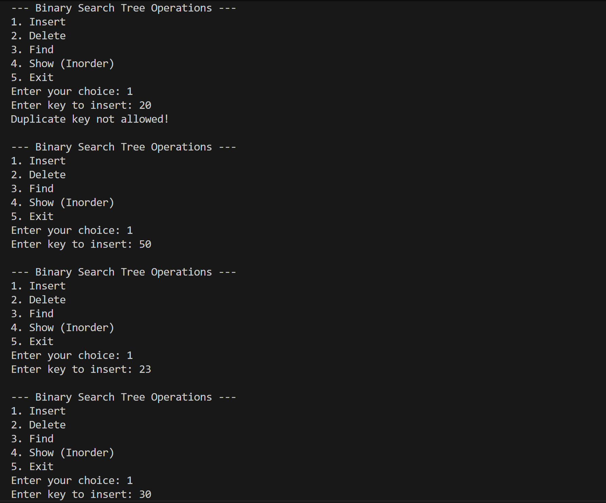
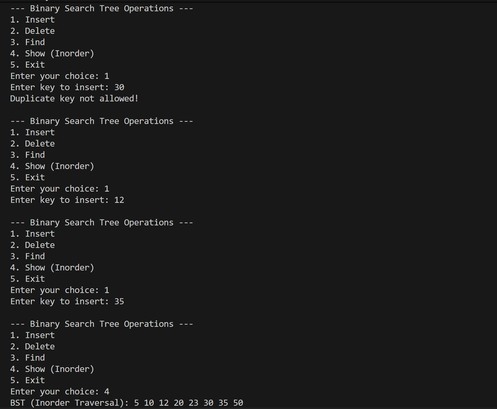
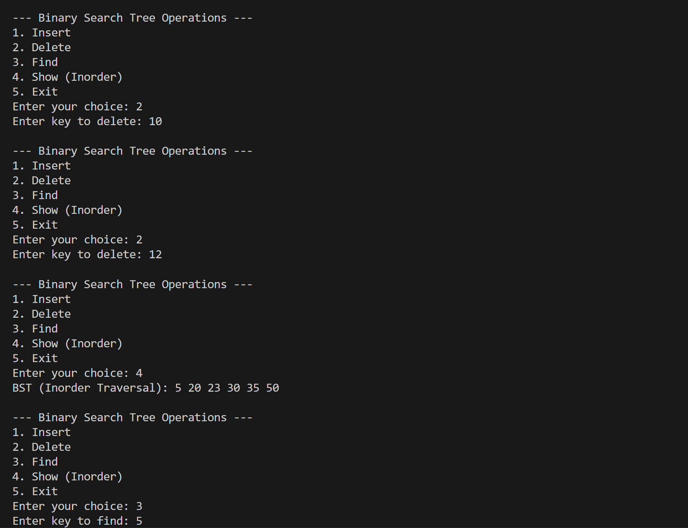
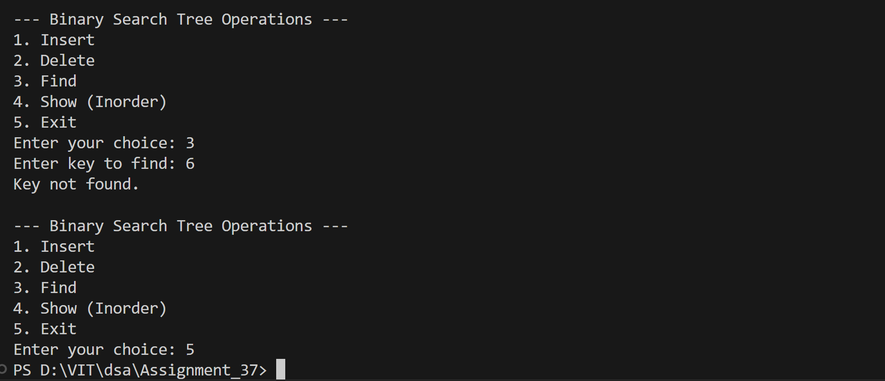

# Binary Search Tree Operations with Numeric Keys

## Name: Likhit Chirmade, Roll no: 23

## Theory

### Binary Search Tree (BST)

Tree where for each node:
- Left subtree has smaller values
- Right subtree has larger values

### Operations

#### Insert
```
1. If tree empty → Create root
2. If key < root → Insert left
3. If key > root → Insert right
4. Reject duplicates
```

#### Delete
```
Three cases:
1. Leaf node → Delete directly
2. One child → Replace with child
3. Two children → Replace with inorder successor
```

**Inorder Successor:** Minimum value in right subtree

#### Find
```
1. If key == root → Found
2. If key < root → Search left
3. If key > root → Search right
```

#### Inorder Traversal
```
Left → Root → Right
```
Displays elements in sorted order.

### Time Complexity

| Operation | Average | Worst |
|-----------|---------|-------|
| Insert | O(log n) | O(n) |
| Delete | O(log n) | O(n) |
| Find | O(log n) | O(n) |
| Inorder | O(n) | O(n) |

### Space Complexity

O(n) for n nodes

## Code

```cpp
#include <iostream>
using namespace std;

struct Node_lac {
    int key_lac;
    Node_lac* left_lac;
    Node_lac* right_lac;
};

Node_lac* createNode_lac(int key_lac) {
    Node_lac* newNode_lac = new Node_lac();
    newNode_lac->key_lac = key_lac;
    newNode_lac->left_lac = nullptr;
    newNode_lac->right_lac = nullptr;
    return newNode_lac;
}

Node_lac* insert_lac(Node_lac* root_lac, int key_lac) {
    if (root_lac == nullptr)
        return createNode_lac(key_lac);

    if (key_lac < root_lac->key_lac)
        root_lac->left_lac = insert_lac(root_lac->left_lac, key_lac);
    else if (key_lac > root_lac->key_lac)
        root_lac->right_lac = insert_lac(root_lac->right_lac, key_lac);
    else
        cout << "Duplicate key not allowed!\n";

    return root_lac;
}

Node_lac* findMin_lac(Node_lac* root_lac) {
    while (root_lac && root_lac->left_lac != nullptr)
        root_lac = root_lac->left_lac;
    return root_lac;
}

Node_lac* delete_lac(Node_lac* root_lac, int key_lac) {
    if (root_lac == nullptr)
        return root_lac;

    if (key_lac < root_lac->key_lac)
        root_lac->left_lac = delete_lac(root_lac->left_lac, key_lac);
    else if (key_lac > root_lac->key_lac)
        root_lac->right_lac = delete_lac(root_lac->right_lac, key_lac);
    else {
        if (root_lac->left_lac == nullptr) {
            Node_lac* temp_lac = root_lac->right_lac;
            delete root_lac;
            return temp_lac;
        }
        else if (root_lac->right_lac == nullptr) {
            Node_lac* temp_lac = root_lac->left_lac;
            delete root_lac;
            return temp_lac;
        }
        Node_lac* temp_lac = findMin_lac(root_lac->right_lac);
        root_lac->key_lac = temp_lac->key_lac;
        root_lac->right_lac = delete_lac(root_lac->right_lac, temp_lac->key_lac);
    }
    return root_lac;
}

bool find_lac(Node_lac* root_lac, int key_lac) {
    if (root_lac == nullptr)
        return false;
    if (root_lac->key_lac == key_lac)
        return true;
    if (key_lac < root_lac->key_lac)
        return find_lac(root_lac->left_lac, key_lac);
    else
        return find_lac(root_lac->right_lac, key_lac);
}

void inorder_lac(Node_lac* root_lac) {
    if (root_lac != nullptr) {
        inorder_lac(root_lac->left_lac);
        cout << root_lac->key_lac << " ";
        inorder_lac(root_lac->right_lac);
    }
}

int main() {
    Node_lac* root_lac = nullptr;
    int choice_lac, key_lac;

    while (true) {
        cout << "\n--- Binary Search Tree Operations ---\n";
        cout << "1. Insert\n";
        cout << "2. Delete\n";
        cout << "3. Find\n";
        cout << "4. Show (Inorder)\n";
        cout << "5. Exit\n";
        cout << "Enter your choice: ";
        cin >> choice_lac;

        switch (choice_lac) {
            case 1:
                cout << "Enter key to insert: ";
                cin >> key_lac;
                root_lac = insert_lac(root_lac, key_lac);
                break;

            case 2:
                cout << "Enter key to delete: ";
                cin >> key_lac;
                root_lac = delete_lac(root_lac, key_lac);
                break;

            case 3:
                cout << "Enter key to find: ";
                cin >> key_lac;
                if (find_lac(root_lac, key_lac))
                    cout << "Key found in the BST.\n";
                else
                    cout << "Key not found.\n";
                break;

            case 4:
                cout << "BST (Inorder Traversal): ";
                inorder_lac(root_lac);
                cout << endl;
                break;

            case 5:
                return 0;

            default:
                cout << "Invalid choice!\n";
        }
    }
}
```

## Output






