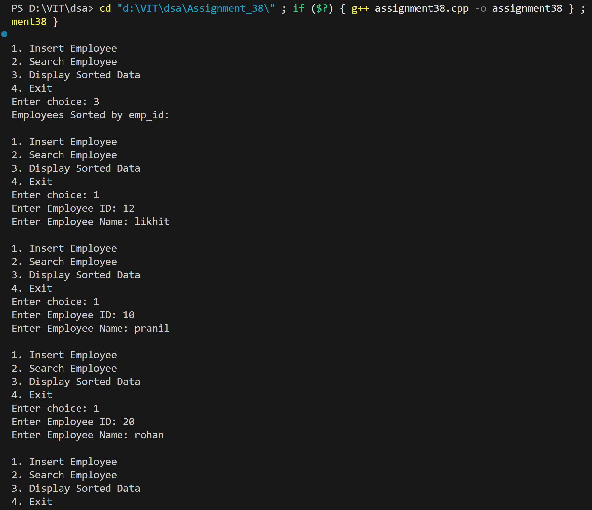
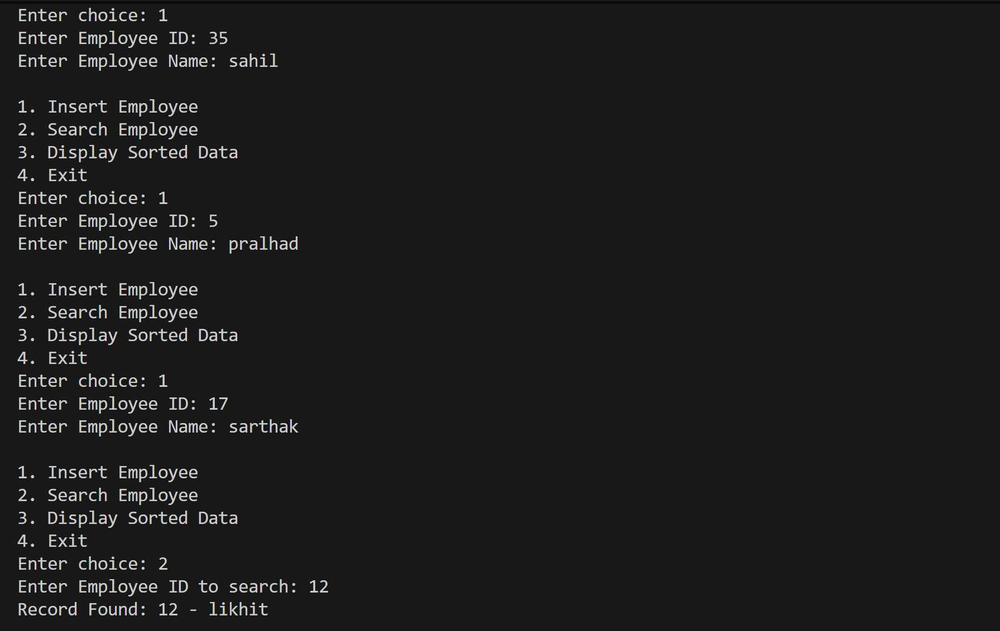
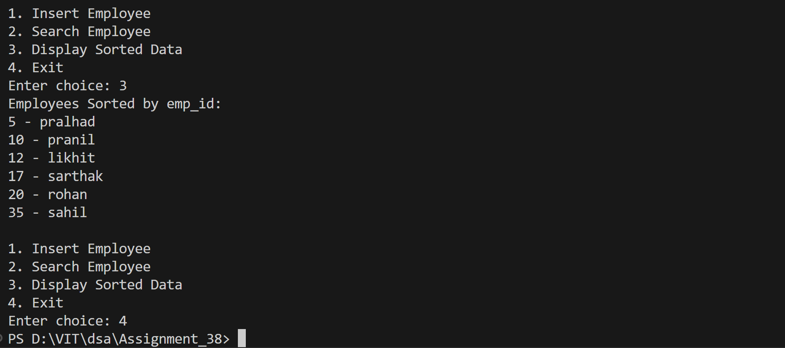

# Employee Record Management using BST

## Name: Likhit Chirmade, Roll no: 23

## Theory

### BST for Employee Records

Tree organized by employee ID for efficient search and sorted display.

### Employee Structure

```cpp
struct Employee {
    int empid;      // Primary key
    string name;    // Employee name
};
```

### Operations

#### Insert
```
1. Compare empid with root
2. If less → Insert left
3. If greater → Insert right
```

**Time Complexity:** O(log n) average

#### Search
```
1. If empid == root → Found
2. If empid < root → Search left
3. If empid > root → Search right
```

**Time Complexity:** O(log n) average

#### Inorder Traversal
```
Left → Root → Right
```

Displays employees sorted by ID in ascending order.

### Advantages

1. **Fast Search:** O(log n) lookup by employee ID
2. **Sorted Output:** Inorder gives ascending order
3. **Dynamic:** Easy insertion/deletion
4. **No Duplicates:** BST property ensures unique IDs

### Time Complexity

| Operation | Average | Worst |
|-----------|---------|-------|
| Insert | O(log n) | O(n) |
| Search | O(log n) | O(n) |
| Display | O(n) | O(n) |

### Space Complexity

O(n) for n employees

## Code

```cpp
#include <iostream>
#include <string>
using namespace std;

struct Node_lac {
    int empid_lac;
    string name_lac;
    Node_lac *left_lac, *right_lac;
};

Node_lac* createNode_lac(int empid_lac, string name_lac) {
    Node_lac* newNode_lac = new Node_lac;
    newNode_lac->empid_lac = empid_lac;
    newNode_lac->name_lac = name_lac;
    newNode_lac->left_lac = newNode_lac->right_lac = NULL;
    return newNode_lac;
}

Node_lac* insert_lac(Node_lac* root_lac, int empid_lac, string name_lac) {
    if (root_lac == NULL)
        return createNode_lac(empid_lac, name_lac);
    if (empid_lac < root_lac->empid_lac)
        root_lac->left_lac = insert_lac(root_lac->left_lac, empid_lac, name_lac);
    else if (empid_lac > root_lac->empid_lac)
        root_lac->right_lac = insert_lac(root_lac->right_lac, empid_lac, name_lac);
    return root_lac;
}

Node_lac* search_lac(Node_lac* root_lac, int empid_lac) {
    if (root_lac == NULL || root_lac->empid_lac == empid_lac)
        return root_lac;
    if (empid_lac < root_lac->empid_lac)
        return search_lac(root_lac->left_lac, empid_lac);
    return search_lac(root_lac->right_lac, empid_lac);
}

void inorder_lac(Node_lac* root_lac) {
    if (root_lac != NULL) {
        inorder_lac(root_lac->left_lac);
        cout << root_lac->empid_lac << " - " << root_lac->name_lac << endl;
        inorder_lac(root_lac->right_lac);
    }
}

int main() {
    Node_lac* root_lac = NULL;
    int choice_lac, empid_lac;
    string name_lac;

    while (true) {
        cout << "\n1. Insert Employee\n2. Search Employee\n3. Display Sorted Data\n4. Exit\nEnter choice: ";
        cin >> choice_lac;

        if (choice_lac == 1) {
            cout << "Enter Employee ID: ";
            cin >> empid_lac;
            cout << "Enter Employee Name: ";
            cin >> name_lac;
            root_lac = insert_lac(root_lac, empid_lac, name_lac);
        } 
        else if (choice_lac == 2) {
            cout << "Enter Employee ID to search: ";
            cin >> empid_lac;
            Node_lac* result_lac = search_lac(root_lac, empid_lac);
            if (result_lac)
                cout << "Record Found: " << result_lac->empid_lac << " - " << result_lac->name_lac << endl;
            else
                cout << "Record Not Found.\n";
        } 
        else if (choice_lac == 3) {
            cout << "Employees Sorted by emp_id:\n";
            inorder_lac(root_lac);
        } 
        else if (choice_lac == 4)
            break;
        else
            cout << "Invalid choice.\n";
    }
    return 0;
}
```

## Output




