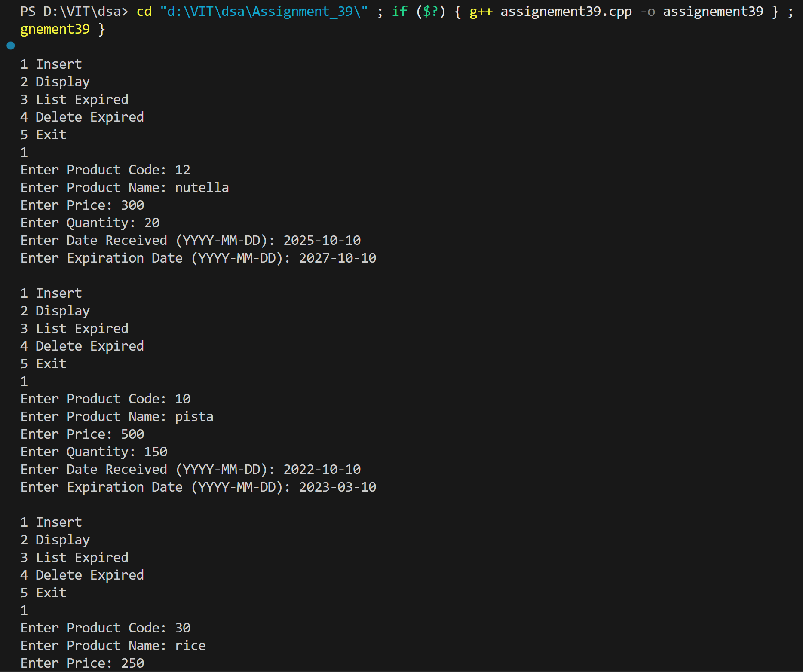
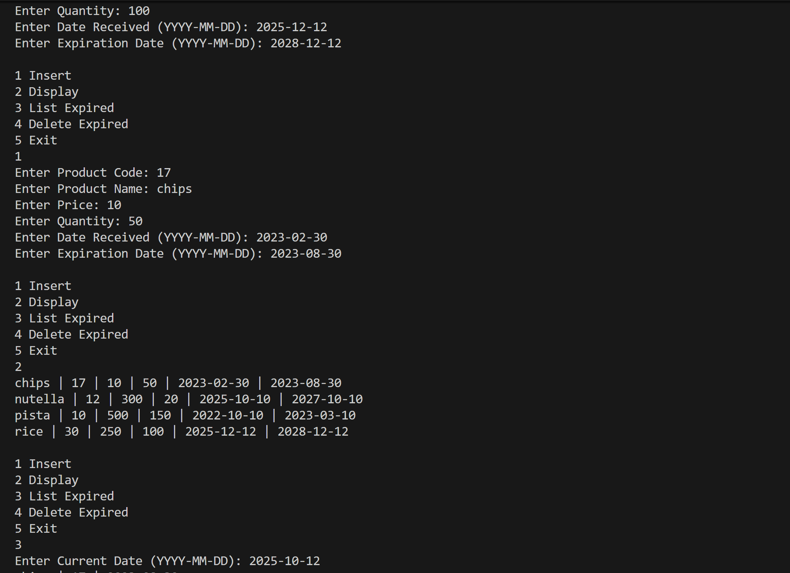
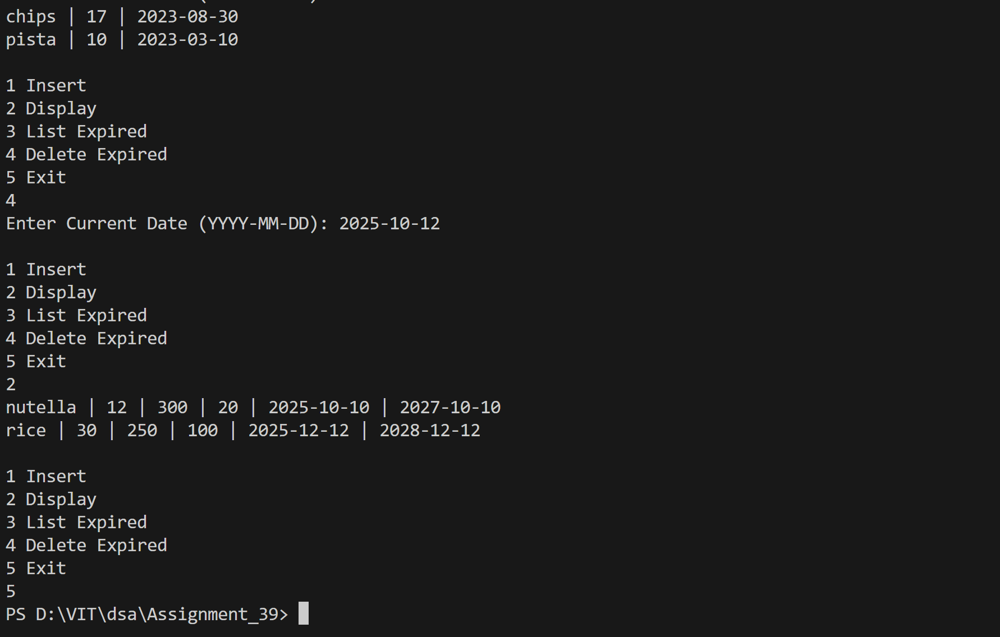

# Product Inventory Management System using BST

## Name: Likhit Chirmade, Roll no: 23

## Theory

### BST for Product Inventory

Tree organized by product name for alphabetical ordering.

### Product Structure

```cpp
struct Product {
    string code;           // Unique identifier
    string name;           // BST key
    float price;
    int quantity;
    string dateReceived;
    string expiry;         // Expiration date
};
```

### Operations

#### Insert by Name
```
1. Compare product name with root
2. If less → Insert left
3. If greater → Insert right
```

Organizes products alphabetically.

#### Inorder Traversal
```
Left → Root → Right
```

Displays inventory in alphabetical order by name.

#### Preorder Traversal (for Expired Items)
```
Root → Left → Right
```

Lists expired products in prefix order.

### Tree Traversals

**Inorder (Left-Root-Right):**
- Sorted output
- Used for inventory display

**Preorder (Root-Left-Right):**
- Process root first
- Used for expired items listing

### Time Complexity

| Operation | Average | Worst |
|-----------|---------|-------|
| Insert | O(log n) | O(n) |
| Inorder | O(n) | O(n) |
| Preorder | O(n) | O(n) |

### Space Complexity

O(n) for n products

## Code

```cpp
#include <iostream>
#include <string>
using namespace std;

struct Product_lac {
    string code_lac;
    string name_lac;
    string dateReceived_lac;
    string expiry_lac;
    float price_lac;
    int quantity_lac;
    Product_lac *left_lac;
    Product_lac *right_lac;
};

Product_lac* createProduct_lac(string code_lac, string name_lac, float price_lac, int quantity_lac, string dateReceived_lac, string expiry_lac) {
    Product_lac* new_lac = new Product_lac;
    new_lac->code_lac = code_lac;
    new_lac->name_lac = name_lac;
    new_lac->price_lac = price_lac;
    new_lac->quantity_lac = quantity_lac;
    new_lac->dateReceived_lac = dateReceived_lac;
    new_lac->expiry_lac = expiry_lac;
    new_lac->left_lac = NULL;
    new_lac->right_lac = NULL;
    return new_lac;
}

Product_lac* insert_lac(Product_lac* root_lac, string code_lac, string name_lac, float price_lac, int quantity_lac, string dateReceived_lac, string expiry_lac) {
    if (root_lac == NULL) {
        return createProduct_lac(code_lac, name_lac, price_lac, quantity_lac, dateReceived_lac, expiry_lac);
    }
    if (name_lac < root_lac->name_lac) {
        root_lac->left_lac = insert_lac(root_lac->left_lac, code_lac, name_lac, price_lac, quantity_lac, dateReceived_lac, expiry_lac);
    } else if (name_lac > root_lac->name_lac) {
        root_lac->right_lac = insert_lac(root_lac->right_lac, code_lac, name_lac, price_lac, quantity_lac, dateReceived_lac, expiry_lac);
    }
    return root_lac;
}

void inorder_lac(Product_lac* root_lac) {
    if (root_lac != NULL) {
        inorder_lac(root_lac->left_lac);
        cout << root_lac->name_lac << " | " << root_lac->code_lac << " | " << root_lac->price_lac << " | " << root_lac->quantity_lac << " | " << root_lac->dateReceived_lac << " | " << root_lac->expiry_lac << endl;
        inorder_lac(root_lac->right_lac);
    }
}

void listExpired_lac(Product_lac* root_lac, string current_lac) {
    if (root_lac != NULL) {
        if (root_lac->expiry_lac < current_lac) {
            cout << root_lac->name_lac << " | " << root_lac->code_lac << " | " << root_lac->expiry_lac << endl;
        }
        listExpired_lac(root_lac->left_lac, current_lac);
        listExpired_lac(root_lac->right_lac, current_lac);
    }
}

Product_lac* minNode_lac(Product_lac* root_lac) {
    while (root_lac->left_lac != NULL) {
        root_lac = root_lac->left_lac;
    }
    return root_lac;
}

Product_lac* deleteProduct_lac(Product_lac* root_lac, string code_lac) {
    if (root_lac == NULL) {
        return NULL;
    }
    if (code_lac < root_lac->code_lac) {
        root_lac->left_lac = deleteProduct_lac(root_lac->left_lac, code_lac);
    } else if (code_lac > root_lac->code_lac) {
        root_lac->right_lac = deleteProduct_lac(root_lac->right_lac, code_lac);
    } else {
        if (root_lac->left_lac == NULL && root_lac->right_lac == NULL) {
            delete root_lac;
            return NULL;
        }
        if (root_lac->left_lac == NULL) {
            Product_lac* temp_lac = root_lac->right_lac;
            delete root_lac;
            return temp_lac;
        }
        if (root_lac->right_lac == NULL) {
            Product_lac* temp_lac = root_lac->left_lac;
            delete root_lac;
            return temp_lac;
        }
        Product_lac* temp_lac = minNode_lac(root_lac->right_lac);
        root_lac->code_lac = temp_lac->code_lac;
        root_lac->name_lac = temp_lac->name_lac;
        root_lac->price_lac = temp_lac->price_lac;
        root_lac->quantity_lac = temp_lac->quantity_lac;
        root_lac->dateReceived_lac = temp_lac->dateReceived_lac;
        root_lac->expiry_lac = temp_lac->expiry_lac;
        root_lac->right_lac = deleteProduct_lac(root_lac->right_lac, temp_lac->code_lac);
    }
    return root_lac;
}

Product_lac* deleteExpired_lac(Product_lac* root_lac, string current_lac) {
    if (root_lac == NULL) {
        return NULL;
    }
    root_lac->left_lac = deleteExpired_lac(root_lac->left_lac, current_lac);
    root_lac->right_lac = deleteExpired_lac(root_lac->right_lac, current_lac);
    if (root_lac->expiry_lac < current_lac) {
        return deleteProduct_lac(root_lac, root_lac->code_lac);
    }
    return root_lac;
}

int main() {
    Product_lac* root_lac = NULL;
    int ch_lac;
    while (true) {
        cout << "\n1 Insert\n2 Display\n3 List Expired\n4 Delete Expired\n5 Exit\n";
        cin >> ch_lac;
        if (ch_lac == 1) {
            string code_lac, name_lac, dt_lac, exp_lac;
            float price_lac;
            int qty_lac;
            cin >> code_lac >> name_lac >> price_lac >> qty_lac >> dt_lac >> exp_lac;
            root_lac = insert_lac(root_lac, code_lac, name_lac, price_lac, qty_lac, dt_lac, exp_lac);
        }
        if (ch_lac == 2) {
            inorder_lac(root_lac);
        }
        if (ch_lac == 3) {
            string today_lac;
            cin >> today_lac;
            listExpired_lac(root_lac, today_lac);
        }
        if (ch_lac == 4) {
            string today_lac;
            cin >> today_lac;
            root_lac = deleteExpired_lac(root_lac, today_lac);
        }
        if (ch_lac == 5) {
            break;
        }
    }
    return 0;
}

```

## Output




