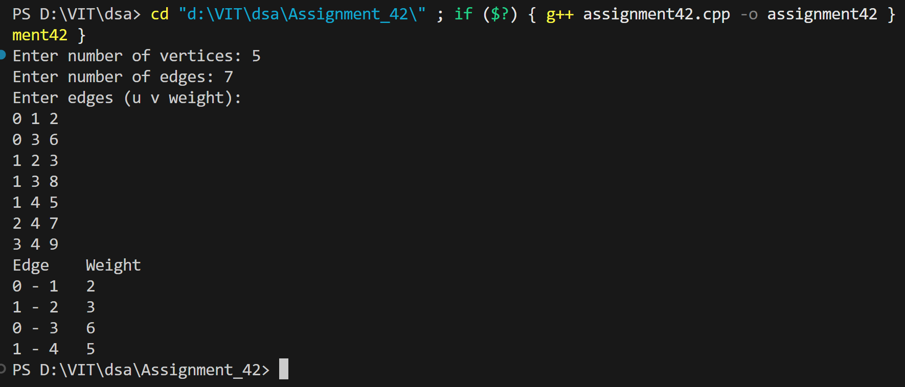

# Prim's Algorithm for Minimum Spanning Tree using Adjacency List

## Name: Likhit Chirmade, Roll no: 23

## Theory

### Minimum Spanning Tree (MST)

A spanning tree with minimum total edge weight that connects all vertices.

### Prim's Algorithm

Greedy algorithm that grows MST one vertex at a time.

**Algorithm:**
```
1. Initialize all keys to infinity
2. Set key[0] = 0 (start vertex)
3. Repeat V-1 times:
   a. Select minimum key vertex not in MST
   b. Add it to MST
   c. Update keys of adjacent vertices
```

**Key Concept:** Always pick the minimum weight edge connecting MST to non-MST vertex.

### Data Structures

**Adjacency List:**
```cpp
vector<vector<Edge>> adj;
// Each vertex has list of edges
```

**Arrays:**
- `key[]`: Minimum weight to connect vertex to MST
- `parent[]`: Parent vertex in MST
- `mstSet[]`: Tracks vertices in MST

### Example

```
Graph:
  0 --2-- 1
  |       |
  6       3
  |       |
  2 --8-- 3

MST edges: (0-1, 2), (1-3, 3), (0-2, 6)
Total weight: 11
```

### Time Complexity

- **O(V²)** with array-based vertex selection
- **O(E log V)** with priority queue

### Space Complexity

O(V + E) for adjacency list

## Code

```cpp
#include <iostream>
#include <vector>
#include <climits>
using namespace std;

struct Edge_lac {
    int vertex_lac;
    int weight_lac;
};

int selectMinVertex_lac(vector<int> &key_lac, vector<bool> &mstSet_lac, int vertices_lac) {
    int min_lac = INT_MAX, minIndex_lac = -1;
    for (int v_lac = 0; v_lac < vertices_lac; v_lac++) {
        if (!mstSet_lac[v_lac] && key_lac[v_lac] < min_lac) {
            min_lac = key_lac[v_lac];
            minIndex_lac = v_lac;
        }
    }
    return minIndex_lac;
}

void primMST_lac(int vertices_lac, vector<vector<Edge_lac>> &adj_lac) {
    vector<int> parent_lac(vertices_lac);
    vector<int> key_lac(vertices_lac, INT_MAX);
    vector<bool> mstSet_lac(vertices_lac, false);

    key_lac[0] = 0;
    parent_lac[0] = -1;

    for (int count_lac = 0; count_lac < vertices_lac - 1; count_lac++) {
        int u_lac = selectMinVertex_lac(key_lac, mstSet_lac, vertices_lac);
        mstSet_lac[u_lac] = true;

        for (auto edge_lac : adj_lac[u_lac]) {
            int v_lac = edge_lac.vertex_lac;
            int weight_lac = edge_lac.weight_lac;
            if (!mstSet_lac[v_lac] && weight_lac < key_lac[v_lac]) {
                key_lac[v_lac] = weight_lac;
                parent_lac[v_lac] = u_lac;
            }
        }
    }

    cout << "Edge \tWeight\n";
    for (int i_lac = 1; i_lac < vertices_lac; i_lac++)
        cout << parent_lac[i_lac] << " - " << i_lac << "\t" << key_lac[i_lac] << endl;
}

int main() {
    int vertices_lac, edges_lac, u_lac, v_lac, w_lac;
    cout << "Enter number of vertices: ";
    cin >> vertices_lac;
    cout << "Enter number of edges: ";
    cin >> edges_lac;

    vector<vector<Edge_lac>> adj_lac(vertices_lac);

    cout << "Enter edges (u v weight):\n";
    for (int i_lac = 0; i_lac < edges_lac; i_lac++) {
        cin >> u_lac >> v_lac >> w_lac;
        Edge_lac e1_lac = {v_lac, w_lac};
        Edge_lac e2_lac = {u_lac, w_lac};
        adj_lac[u_lac].push_back(e1_lac);
        adj_lac[v_lac].push_back(e2_lac);
    }

    primMST_lac(vertices_lac, adj_lac);
    return 0;
}
```

## Output



