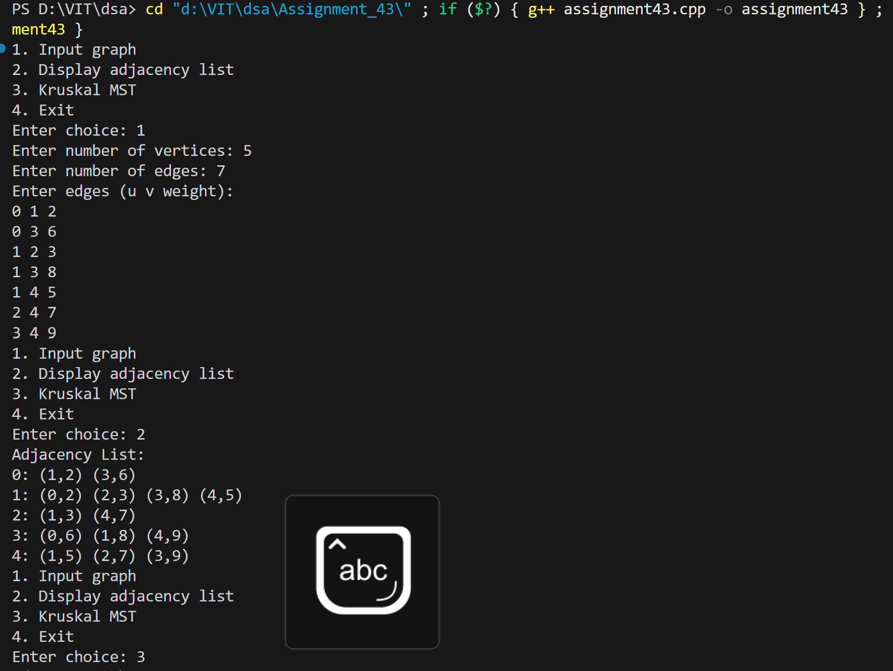
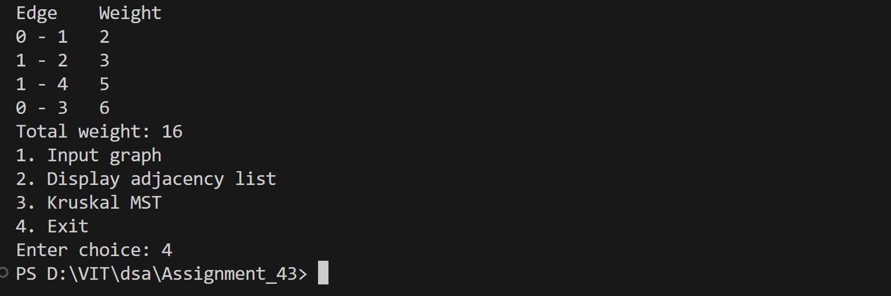

# Kruskal's Algorithm for Minimum Spanning Tree using Adjacency List

## Name: Likhit Chirmade, Roll no: 23

## Theory

### Kruskal's Algorithm

Greedy algorithm that builds MST by selecting edges in increasing order of weight.

**Algorithm:**
```
1. Sort all edges by weight
2. Initialize each vertex as separate set
3. For each edge (u, v):
   a. If u and v in different sets:
      - Add edge to MST
      - Union the sets
   b. Stop when V-1 edges added
```

### Union-Find (Disjoint Set)

Data structure to track connected components.

**Operations:**

**Find:**
```cpp
int find(int x) {
    if (parent[x] != x)
        parent[x] = find(parent[x]); // Path compression
    return parent[x];
}
```

**Union:**
```cpp
void union(int a, int b) {
    a = find(a);
    b = find(b);
    if (rank[a] < rank[b])
        parent[a] = b;
    else if (rank[b] < rank[a])
        parent[b] = a;
    else {
        parent[b] = a;
        rank[a]++;
    }
}
```

### Path Compression

Optimization that flattens tree structure during find operation.

### Union by Rank

Attaches smaller tree under root of larger tree.

### Example

```
Edges sorted: (0-1,2), (1-3,3), (0-2,6), (2-3,8)

Step 1: Add (0-1,2) → MST = {(0-1)}
Step 2: Add (1-3,3) → MST = {(0-1), (1-3)}
Step 3: Add (0-2,6) → MST = {(0-1), (1-3), (0-2)}
Step 4: Skip (2-3,8) → Creates cycle

Total weight: 11
```

### Time Complexity

- **O(E log E)** for sorting edges
- **O(E α(V))** for union-find operations
- **Overall: O(E log E)**

where α is inverse Ackermann function (nearly constant)

### Space Complexity

O(V + E) for graph storage

## Code

```cpp
#include <iostream>
#include <vector>
#include <algorithm>
#include <climits>
using namespace std;

struct Edge_lac { int u_lac; int v_lac; int w_lac; };
struct AdjEdge_lac { int vertex_lac; int weight_lac; };

int findSet_lac(vector<int> &parent_lac, int x_lac) {
    if (parent_lac[x_lac] != x_lac) 
        parent_lac[x_lac] = findSet_lac(parent_lac, parent_lac[x_lac]);
    return parent_lac[x_lac];
}

void unionSet_lac(vector<int> &parent_lac, vector<int> &rank_lac, int a_lac, int b_lac) {
    a_lac = findSet_lac(parent_lac, a_lac);
    b_lac = findSet_lac(parent_lac, b_lac);
    if (a_lac == b_lac) return;
    if (rank_lac[a_lac] < rank_lac[b_lac]) parent_lac[a_lac] = b_lac;
    else if (rank_lac[b_lac] < rank_lac[a_lac]) parent_lac[b_lac] = a_lac;
    else { parent_lac[b_lac] = a_lac; rank_lac[a_lac]++; }
}

int main() {
    int vertices_lac = 0, edges_lac = 0;
    vector<vector<AdjEdge_lac>> adj_lac;
    vector<Edge_lac> edgeList_lac;
    int choice_lac = 0;

    while (true) {
        cout << "1. Input graph\n2. Display adjacency list\n3. Kruskal MST\n4. Exit\nEnter choice: ";
        if (!(cin >> choice_lac)) return 0;

        if (choice_lac == 1) {
            cout << "Enter number of vertices: ";
            cin >> vertices_lac;
            cout << "Enter number of edges: ";
            cin >> edges_lac;

            adj_lac.assign(vertices_lac, vector<AdjEdge_lac>());
            edgeList_lac.clear();

            cout << "Enter edges (u v weight):\n";
            for (int i_lac = 0; i_lac < edges_lac; i_lac++) {
                int u_lac, v_lac, w_lac;
                cin >> u_lac >> v_lac >> w_lac;
                AdjEdge_lac a1_lac = {v_lac, w_lac};
                AdjEdge_lac a2_lac = {u_lac, w_lac};

                if (u_lac >= 0 && u_lac < vertices_lac) adj_lac[u_lac].push_back(a1_lac);
                if (v_lac >= 0 && v_lac < vertices_lac) adj_lac[v_lac].push_back(a2_lac);

                Edge_lac e_lac = {u_lac, v_lac, w_lac};
                edgeList_lac.push_back(e_lac);
            }
        }
        else if (choice_lac == 2) {
            cout << "Adjacency List:\n";
            for (int i_lac = 0; i_lac < (int)adj_lac.size(); i_lac++) {
                cout << i_lac << ": ";
                for (auto ed_lac : adj_lac[i_lac]) 
                    cout << "(" << ed_lac.vertex_lac << "," << ed_lac.weight_lac << ") ";
                cout << "\n";
            }
        }
        else if (choice_lac == 3) {
            if (vertices_lac == 0) { cout << "Graph not defined\n"; continue; }

            sort(edgeList_lac.begin(), edgeList_lac.end(), [](const Edge_lac &a_lac, const Edge_lac &b_lac){
                return a_lac.w_lac < b_lac.w_lac;
            });

            vector<int> parent_lac(vertices_lac), rank_lac(vertices_lac, 0);
            for (int i_lac = 0; i_lac < vertices_lac; i_lac++) parent_lac[i_lac] = i_lac;

            vector<Edge_lac> mst_lac;
            int totalWeight_lac = 0;

            for (auto e_lac : edgeList_lac) {
                int u_lac = e_lac.u_lac;
                int v_lac = e_lac.v_lac;

                int setU_lac = findSet_lac(parent_lac, u_lac);
                int setV_lac = findSet_lac(parent_lac, v_lac);

                if (setU_lac != setV_lac) {
                    unionSet_lac(parent_lac, rank_lac, setU_lac, setV_lac);
                    mst_lac.push_back(e_lac);
                    totalWeight_lac += e_lac.w_lac;
                }
            }

            if ((int)mst_lac.size() != vertices_lac - 1) {
                cout << "MST not possible (graph disconnected)\n";
            } else {
                cout << "Edge \tWeight\n";
                for (auto me_lac : mst_lac)
                    cout << me_lac.u_lac << " - " << me_lac.v_lac << "\t" << me_lac.w_lac << "\n";
                cout << "Total weight: " << totalWeight_lac << "\n";
            }
        }
        else if (choice_lac == 4) {
            return 0;
        }
        else {
            cout << "Invalid choice\n";
        }
    }
    return 0;
}
```

## Output



