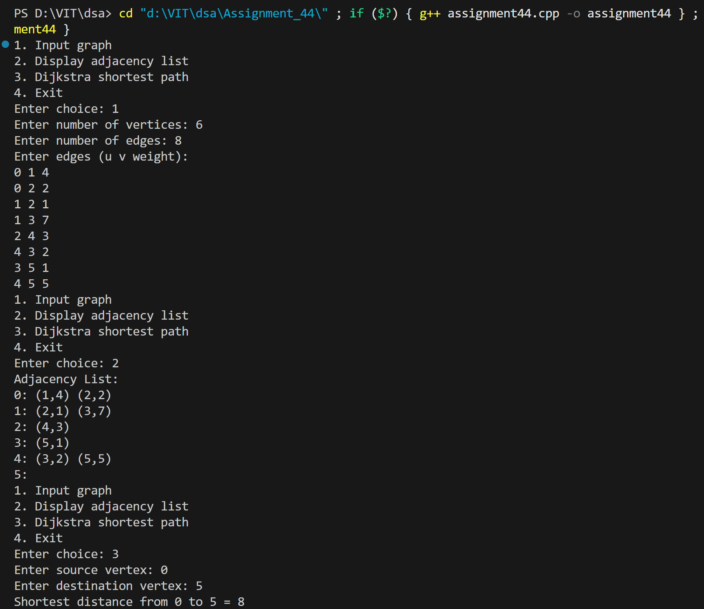
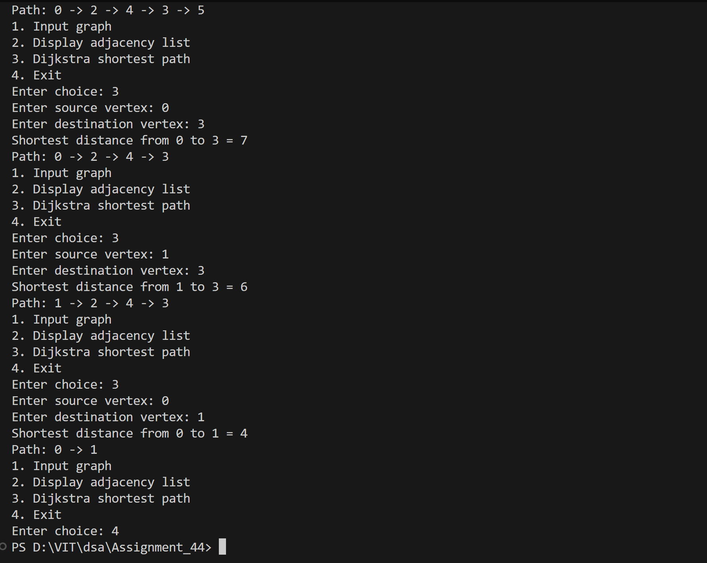

# Dijkstra's Algorithm for Shortest Path using Adjacency List

## Name: Likhit Chirmade, Roll no: 23

## Theory

### Dijkstra's Algorithm

Finds shortest path from source to destination in weighted graph with non-negative edges.

**Algorithm:**
```
1. Initialize distances to infinity
2. Set distance[source] = 0
3. Use priority queue (min-heap)
4. While queue not empty:
   a. Extract vertex with minimum distance
   b. For each neighbor:
      - If shorter path found, update distance
      - Add to priority queue
```

**Greedy Approach:** Always selects vertex with minimum distance.

### Priority Queue

Min-heap that efficiently extracts minimum distance vertex.

```cpp
priority_queue<pair<int,int>, vector<pair<int,int>>, greater<pair<int,int>>> pq;
```

Stores `(distance, vertex)` pairs.

### Path Reconstruction

Uses parent array to track shortest path:
```cpp
parent[v] = u  // u is previous vertex in path to v
```

### Example

```
Graph:
0 --4-- 1
|       |
2       1
|       |
2 --3-- 3

Shortest path 0→3: 0→2→3 (distance = 5)
```

### Time Complexity

**O((V + E) log V)** with priority queue

### Space Complexity

O(V + E) for adjacency list

## Code

```cpp
#include <iostream>
#include <vector>
#include <queue>
#include <climits>
using namespace std;

struct AdjEdge_lac { int vertex_lac; int weight_lac; };

void dijkstra_lac(int vertices_lac, vector<vector<AdjEdge_lac>> &adj_lac, int src_lac, int dest_lac) {
    vector<int> dist_lac(vertices_lac, INT_MAX);
    vector<int> parent_lac(vertices_lac, -1);
    vector<bool> visited_lac(vertices_lac, false);

    using pii_lac = pair<int,int>;
    priority_queue<pii_lac, vector<pii_lac>, greater<pii_lac>> pq_lac;

    dist_lac[src_lac] = 0;
    pq_lac.push({0, src_lac});

    while (!pq_lac.empty()) {
        auto top_lac = pq_lac.top(); pq_lac.pop();
        int u_lac = top_lac.second;

        if (visited_lac[u_lac]) continue;
        visited_lac[u_lac] = true;
        if (u_lac == dest_lac) break;

        for (auto ed_lac : adj_lac[u_lac]) {
            int v_lac = ed_lac.vertex_lac;
            int w_lac = ed_lac.weight_lac;

            if (!visited_lac[v_lac] && dist_lac[u_lac] != INT_MAX && dist_lac[u_lac] + w_lac < dist_lac[v_lac]) {
                dist_lac[v_lac] = dist_lac[u_lac] + w_lac;
                parent_lac[v_lac] = u_lac;
                pq_lac.push({dist_lac[v_lac], v_lac});
            }
        }
    }

    if (dist_lac[dest_lac] == INT_MAX) {
        cout << "No path from " << src_lac << " to " << dest_lac << "\n";
        return;
    }

    cout << "Shortest distance from " << src_lac << " to " << dest_lac << " = " << dist_lac[dest_lac] << "\n";

    vector<int> path_lac;
    for (int v_lac = dest_lac; v_lac != -1; v_lac = parent_lac[v_lac])
        path_lac.push_back(v_lac);

    cout << "Path: ";
    for (int i_lac = (int)path_lac.size() - 1; i_lac >= 0; i_lac--) {
        cout << path_lac[i_lac];
        if (i_lac) cout << " -> ";
    }
    cout << "\n";
}

int main() {
    int vertices_lac = 0, edges_lac = 0;
    vector<vector<AdjEdge_lac>> adj_lac;
    int choice_lac = 0;

    while (true) {
        cout << "1. Input graph\n2. Display adjacency list\n3. Dijkstra shortest path\n4. Exit\nEnter choice: ";
        if (!(cin >> choice_lac)) return 0;

        if (choice_lac == 1) {
            cout << "Enter number of vertices: ";
            cin >> vertices_lac;
            cout << "Enter number of edges: ";
            cin >> edges_lac;

            adj_lac.assign(vertices_lac, vector<AdjEdge_lac>());

            cout << "Enter edges (u v weight):\n";
            for (int i_lac = 0; i_lac < edges_lac; i_lac++) {
                int u_lac, v_lac, w_lac;
                cin >> u_lac >> v_lac >> w_lac;

                if (u_lac >= 0 && u_lac < vertices_lac && v_lac >= 0 && v_lac < vertices_lac) {
                    AdjEdge_lac a1_lac = {v_lac, w_lac};
                    adj_lac[u_lac].push_back(a1_lac);
                }
            }
        }

        else if (choice_lac == 2) {
            cout << "Adjacency List:\n";
            for (int i_lac = 0; i_lac < (int)adj_lac.size(); i_lac++) {
                cout << i_lac << ": ";
                for (auto ed_lac : adj_lac[i_lac])
                    cout << "(" << ed_lac.vertex_lac << "," << ed_lac.weight_lac << ") ";
                cout << "\n";
            }
        }

        else if (choice_lac == 3) {
            if (vertices_lac == 0) { cout << "Graph not defined\n"; continue; }
            int src_lac, dest_lac;
            cout << "Enter source vertex: "; cin >> src_lac;
            cout << "Enter destination vertex: "; cin >> dest_lac;

            if (src_lac < 0 || src_lac >= vertices_lac || dest_lac < 0 || dest_lac >= vertices_lac) {
                cout << "Invalid vertices\n";
                continue;
            }

            dijkstra_lac(vertices_lac, adj_lac, src_lac, dest_lac);
        }

        else if (choice_lac == 4) return 0;
        else cout << "Invalid choice\n";
    }
    return 0;
}
```

## Output



