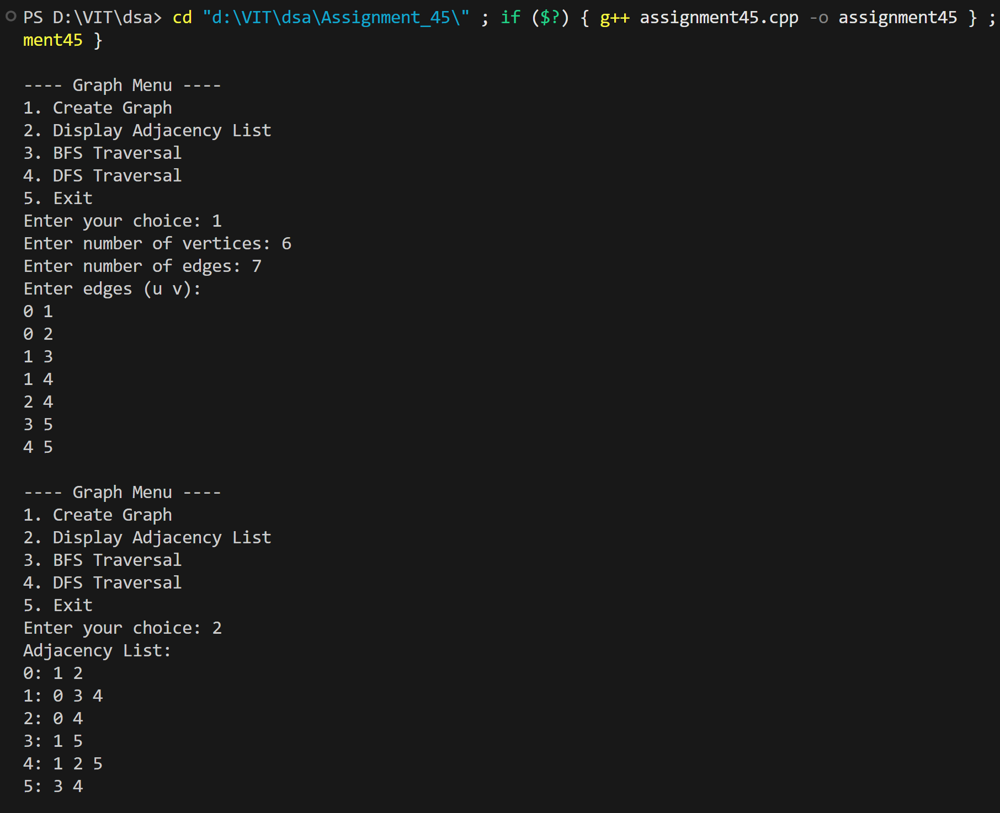
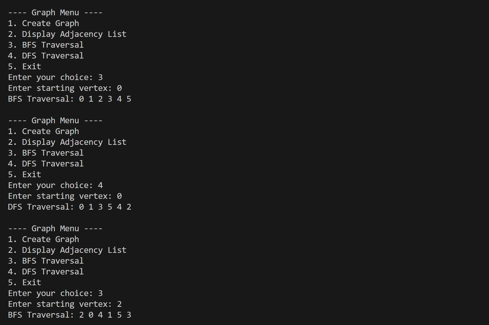
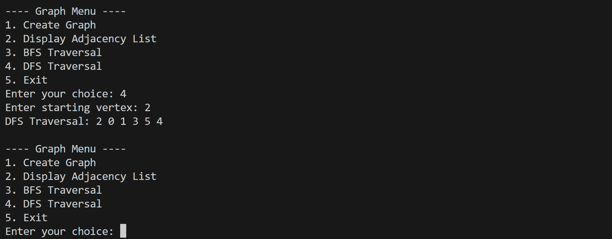

# Graph Representation with Adjacency List and BFS/DFS Traversals

## Name: Likhit Chirmade, Roll no: 23

## Theory

### Graph Representation

**Adjacency List:** Each vertex maintains a list of its adjacent vertices.

**Structure:**
```cpp
vector<vector<int>> adj;
// adj[i] contains list of vertices adjacent to vertex i
```

### Breadth-First Search (BFS)

Level-order traversal using queue (FIFO).

**Algorithm:**
```
1. Mark start vertex as visited
2. Add to queue
3. While queue not empty:
   a. Dequeue vertex
   b. Process it
   c. Add unvisited neighbors to queue
```

**Data Structure:** Queue for frontier vertices

### Depth-First Search (DFS)

Explores as deep as possible before backtracking.

**Algorithm:**
```
1. Mark current vertex as visited
2. Process it
3. For each unvisited neighbor:
   - Recursively call DFS
```

**Data Structure:** Recursion stack (implicit)

### Example

```
Graph:
  0 --- 1
  |     |
  2 --- 3

Adjacency List:
0: [1, 2]
1: [0, 3]
2: [0, 3]
3: [1, 2]

BFS from 0: 0 → 1 → 2 → 3
DFS from 0: 0 → 1 → 3 → 2
```

### Time Complexity

| Operation | Complexity |
|-----------|------------|
| Add Edge | O(1) |
| BFS | O(V + E) |
| DFS | O(V + E) |
| Display | O(V + E) |

### Space Complexity

- **Adjacency List:** O(V + E)
- **BFS:** O(V) for queue and visited array
- **DFS:** O(V) for recursion stack and visited array

## Code

```cpp
#include <iostream>
#include <vector>
#include <queue>
using namespace std;

void addEdge_lac(vector<vector<int>> &adj_lac, int u_lac, int v_lac) {
    adj_lac[u_lac].push_back(v_lac);
    adj_lac[v_lac].push_back(u_lac);
}

void displayAdjList_lac(vector<vector<int>> &adj_lac) {
    cout << "Adjacency List:\n";
    for (int i_lac = 0; i_lac < adj_lac.size(); i_lac++) {
        cout << i_lac << ": ";
        for (int v_lac : adj_lac[i_lac]) cout << v_lac << " ";
        cout << "\n";
    }
}

void bfs_lac(vector<vector<int>> &adj_lac, int start_lac) {
    vector<bool> visited_lac(adj_lac.size(), false);
    queue<int> q_lac;
    visited_lac[start_lac] = true;
    q_lac.push(start_lac);

    cout << "BFS Traversal: ";
    while (!q_lac.empty()) {
        int u_lac = q_lac.front();
        q_lac.pop();
        cout << u_lac << " ";
        for (int v_lac : adj_lac[u_lac]) {
            if (!visited_lac[v_lac]) {
                visited_lac[v_lac] = true;
                q_lac.push(v_lac);
            }
        }
    }
    cout << "\n";
}

void dfsUtil_lac(vector<vector<int>> &adj_lac, int u_lac, vector<bool> &visited_lac) {
    visited_lac[u_lac] = true;
    cout << u_lac << " ";
    for (int v_lac : adj_lac[u_lac])
        if (!visited_lac[v_lac]) dfsUtil_lac(adj_lac, v_lac, visited_lac);
}

void dfs_lac(vector<vector<int>> &adj_lac, int start_lac) {
    vector<bool> visited_lac(adj_lac.size(), false);
    cout << "DFS Traversal: ";
    dfsUtil_lac(adj_lac, start_lac, visited_lac);
    cout << "\n";
}

int main() {
    int vertices_lac = 0, edges_lac = 0;
    vector<vector<int>> adj_lac;
    int choice_lac = 0;

    while (true) {
        cout << "\n---- Graph Menu ----\n";
        cout << "1. Create Graph\n";
        cout << "2. Display Adjacency List\n";
        cout << "3. BFS Traversal\n";
        cout << "4. DFS Traversal\n";
        cout << "5. Exit\n";
        cout << "Enter your choice: ";
        cin >> choice_lac;

        if (choice_lac == 1) {
            cout << "Enter number of vertices: ";
            cin >> vertices_lac;
            cout << "Enter number of edges: ";
            cin >> edges_lac;

            adj_lac.assign(vertices_lac, vector<int>());

            cout << "Enter edges (u v):\n";
            for (int i_lac = 0; i_lac < edges_lac; i_lac++) {
                int u_lac, v_lac;
                cin >> u_lac >> v_lac;
                addEdge_lac(adj_lac, u_lac, v_lac);
            }
        }
        else if (choice_lac == 2) {
            if (vertices_lac == 0) cout << "Graph not created yet.\n";
            else displayAdjList_lac(adj_lac);
        }
        else if (choice_lac == 3) {
            if (vertices_lac == 0) cout << "Graph not created yet.\n";
            else {
                int start_lac;
                cout << "Enter starting vertex: ";
                cin >> start_lac;
                if (start_lac >= 0 && start_lac < vertices_lac)
                    bfs_lac(adj_lac, start_lac);
                else cout << "Invalid vertex.\n";
            }
        }
        else if (choice_lac == 4) {
            if (vertices_lac == 0) cout << "Graph not created yet.\n";
            else {
                int start_lac;
                cout << "Enter starting vertex: ";
                cin >> start_lac;
                if (start_lac >= 0 && start_lac < vertices_lac)
                    dfs_lac(adj_lac, start_lac);
                else cout << "Invalid vertex.\n";
            }
        }
        else if (choice_lac == 5) {
            cout << "Exiting...\n";
            break;
        }
        else cout << "Invalid choice!\n";
    }
    return 0;
}
```

## Output



