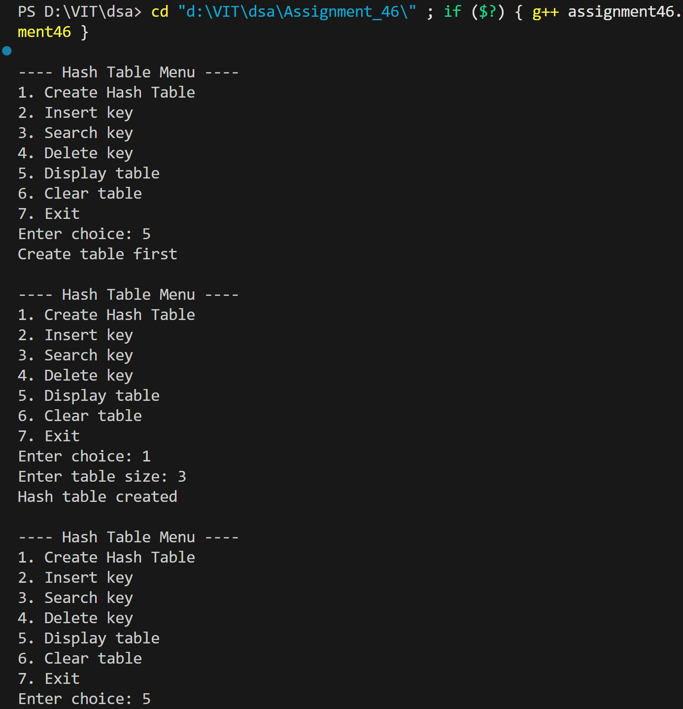
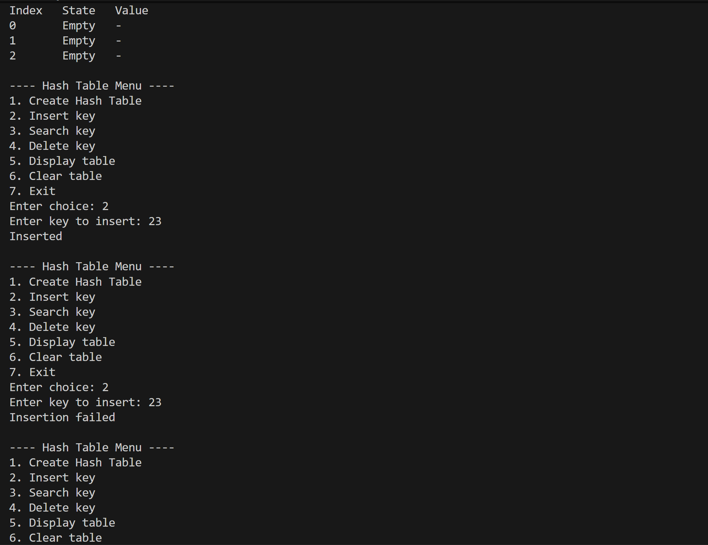
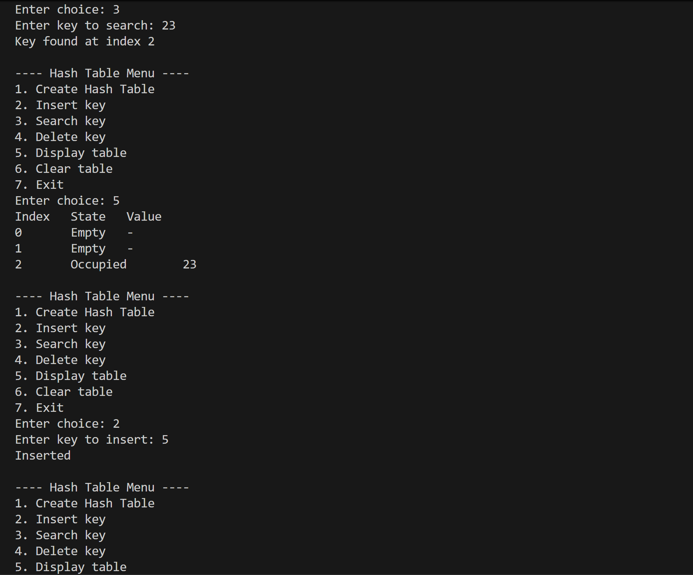
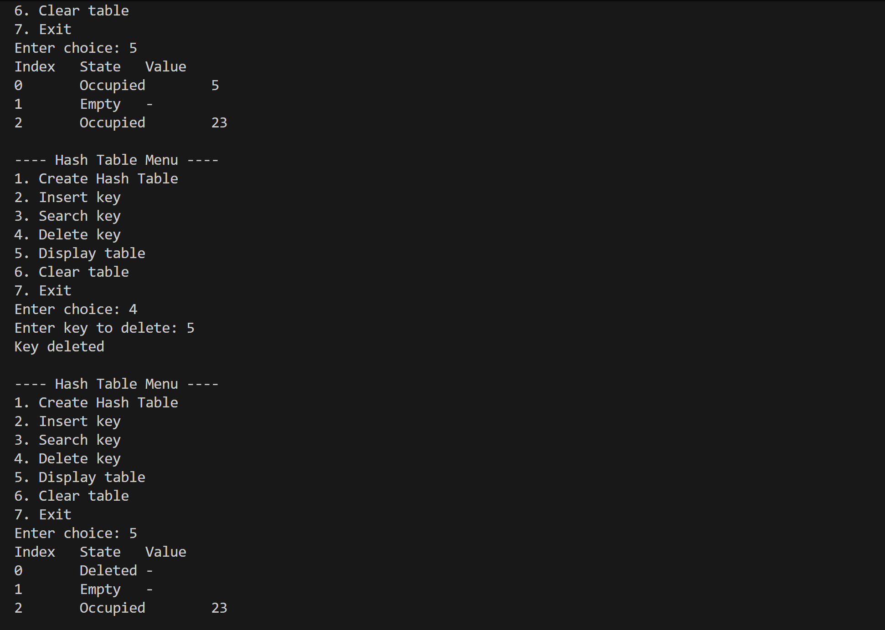
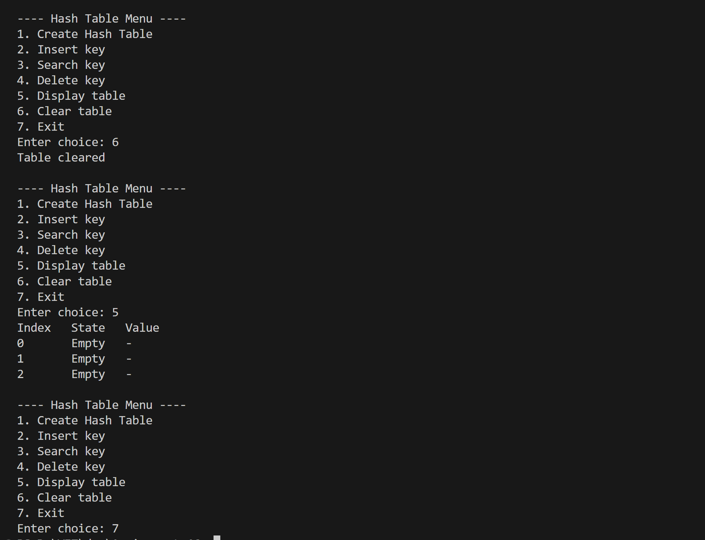

# Implement a hash table with collision resolution using linear probing.

## Name: Likhit Chirmade, Roll no: 23

## Theory

### Hash Table with Linear Probing

A hash table uses a hash function to map keys to indices. Linear probing is an open addressing technique that resolves collisions by searching sequentially for the next available slot.

### Hash Function (Division Method)

```
h(key) = key mod table_size
```

For negative keys: `if h < 0, then h = h + table_size`

### Linear Probing

When collision occurs at index `h`, probe sequence is:
```
h, h+1, h+2, h+3, ..., (wrapping around)
```

**Formula:**
```
index = (h(key) + i) mod m
where i = 0, 1, 2, 3, ...
```

### State Management

Each slot has three states:
- **0 (Empty)**: Never used
- **1 (Occupied)**: Currently holds data
- **2 (Deleted)**: Previously occupied, available for reuse

### Operations

#### Insert
```
1. Calculate hash index
2. If slot empty/deleted → Insert
3. If key exists → Return false (duplicate)
4. Else probe linearly until empty slot found
5. Reuse first deleted slot if found
```

**Optimization:** Tracks first deleted slot to reuse it instead of probing further.

#### Search
```
1. Calculate hash index
2. Probe linearly while slots not empty
3. If key matches → Return index
4. If empty slot reached → Key not found
```

#### Delete
```
1. Search for key
2. Mark state as deleted (lazy deletion)
3. Maintains probe sequence integrity
```

### Primary Clustering

Linear probing creates clusters of consecutive occupied slots, degrading performance as clusters grow.

**Example:**
```
Keys: 12, 22, 32 (all hash to index 2 in table size 10)
Result: Cluster at indices 2, 3, 4
```

### Time Complexity

| Operation | Average | Worst |
|-----------|---------|-------|
| Insert | O(1) | O(n) |
| Search | O(1) | O(n) |
| Delete | O(1) | O(n) |

Performance degrades as load factor (α = n/m) increases.

### Space Complexity

O(m) where m is table size

## Code

```cpp
#include <iostream>
#include <vector>
using namespace std;

class HashTable_lac {
    int size_lac;
    vector<int> table_lac;
    vector<int> state_lac; // 0 = empty, 1 = occupied, 2 = deleted

public:
    HashTable_lac(int n_lac = 10) {
        size_lac = n_lac;
        table_lac.assign(size_lac, 0);
        state_lac.assign(size_lac, 0);
    }

    int hash_lac(int key_lac) {
        int h_lac = key_lac % size_lac;
        if (h_lac < 0) h_lac += size_lac;
        return h_lac;
    }

    bool insert_lac(int key_lac) {
        int h_lac = hash_lac(key_lac);
        int firstDeleted_lac = -1;

        for (int i_lac = 0; i_lac < size_lac; i_lac++) {
            int idx_lac = (h_lac + i_lac) % size_lac;

            if (state_lac[idx_lac] == 1 && table_lac[idx_lac] == key_lac)
                return false;

            if (state_lac[idx_lac] == 2 && firstDeleted_lac == -1)
                firstDeleted_lac = idx_lac;

            if (state_lac[idx_lac] == 0) {
                if (firstDeleted_lac != -1) {
                    table_lac[firstDeleted_lac] = key_lac;
                    state_lac[firstDeleted_lac] = 1;
                } else {
                    table_lac[idx_lac] = key_lac;
                    state_lac[idx_lac] = 1;
                }
                return true;
            }
        }

        if (firstDeleted_lac != -1) {
            table_lac[firstDeleted_lac] = key_lac;
            state_lac[firstDeleted_lac] = 1;
            return true;
        }

        return false;
    }

    int search_lac(int key_lac) {
        int h_lac = hash_lac(key_lac);

        for (int i_lac = 0; i_lac < size_lac; i_lac++) {
            int idx_lac = (h_lac + i_lac) % size_lac;

            if (state_lac[idx_lac] == 0)
                return -1;

            if (state_lac[idx_lac] == 1 && table_lac[idx_lac] == key_lac)
                return idx_lac;
        }
        return -1;
    }

    bool remove_lac(int key_lac) {
        int pos_lac = search_lac(key_lac);
        if (pos_lac == -1) return false;
        state_lac[pos_lac] = 2;
        return true;
    }

    void display_lac() {
        cout << "Index\tState\tValue\n";
        for (int i_lac = 0; i_lac < size_lac; i_lac++) {
            cout << i_lac << "\t";
            if (state_lac[i_lac] == 0) cout << "Empty\t-\n";
            else if (state_lac[i_lac] == 2) cout << "Deleted\t-\n";
            else cout << "Occupied\t" << table_lac[i_lac] << "\n";
        }
    }

    void clear_lac() {
        table_lac.assign(size_lac, 0);
        state_lac.assign(size_lac, 0);
    }
};

int main() {
    int choice_lac = 0;
    HashTable_lac ht_lac;
    bool created_lac = false;

    while (true) {
        cout << "\n---- Hash Table Menu ----\n";
        cout << "1. Create Hash Table\n";
        cout << "2. Insert key\n";
        cout << "3. Search key\n";
        cout << "4. Delete key\n";
        cout << "5. Display table\n";
        cout << "6. Clear table\n";
        cout << "7. Exit\n";
        cout << "Enter choice: ";
        cin >> choice_lac;

        if (choice_lac == 1) {
            int n_lac;
            cout << "Enter table size: ";
            cin >> n_lac;
            ht_lac = HashTable_lac(n_lac);
            created_lac = true;
            cout << "Hash table created\n";
        }
        else if (choice_lac == 2) {
            if (!created_lac) { cout << "Create table first\n"; continue; }
            int key_lac;
            cout << "Enter key to insert: ";
            cin >> key_lac;
            cout << (ht_lac.insert_lac(key_lac) ? "Inserted\n" : "Insertion failed\n");
        }
        else if (choice_lac == 3) {
            if (!created_lac) { cout << "Create table first\n"; continue; }
            int key_lac;
            cout << "Enter key to search: ";
            cin >> key_lac;
            int pos_lac = ht_lac.search_lac(key_lac);
            if (pos_lac == -1) cout << "Key not found\n";
            else cout << "Key found at index " << pos_lac << "\n";
        }
        else if (choice_lac == 4) {
            if (!created_lac) { cout << "Create table first\n"; continue; }
            int key_lac;
            cout << "Enter key to delete: ";
            cin >> key_lac;
            cout << (ht_lac.remove_lac(key_lac) ? "Key deleted\n" : "Key not found\n");
        }
        else if (choice_lac == 5) {
            if (!created_lac) cout << "Create table first\n";
            else ht_lac.display_lac();
        }
        else if (choice_lac == 6) {
            if (!created_lac) cout << "Create table first\n";
            else { ht_lac.clear_lac(); cout << "Table cleared\n"; }
        }
        else if (choice_lac == 7) break;
        else cout << "Invalid choice\n";
    }

    return 0;
}
```

## Output






