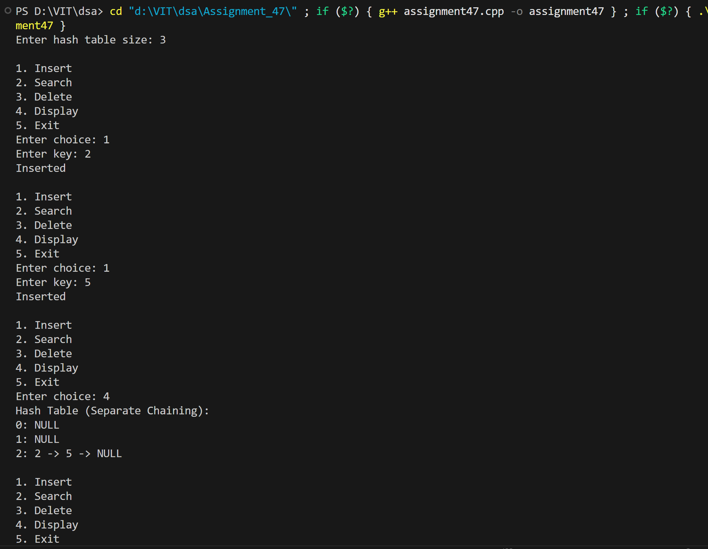
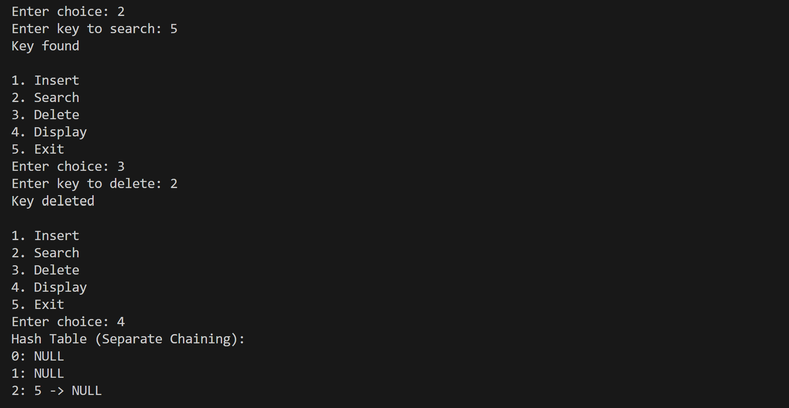

# Implement collision handling using separate chaining.

## Name: Likhit Chirmade, Roll no: 23

## Theory

### Separate Chaining

Separate chaining is a collision resolution technique where each slot in the hash table contains a linked list (or chain) of all elements that hash to that index.

### Hash Function

```
h(key) = key mod table_size
```

### Data Structure

```cpp
vector<list<int>> table;
```

Each index stores a linked list of keys that hash to that location.

### How It Works

When collision occurs:
1. Multiple keys can hash to same index
2. All colliding keys stored in a linked list at that index
3. No probing needed

**Example:**
```
Table size = 5
Insert: 12, 17, 22, 27

h(12) = 2 → table[2] = [12]
h(17) = 2 → table[2] = [12, 17]
h(22) = 2 → table[2] = [12, 17, 22]
h(27) = 2 → table[2] = [12, 17, 22, 27]
```

### Operations

#### Insert
```
1. Calculate index = hash(key)
2. Append key to list at table[index]
```

**Time Complexity:** O(1) average

#### Search
```
1. Calculate index = hash(key)
2. Traverse list at table[index]
3. Return true if key found
```

**Time Complexity:** O(1 + α) where α = n/m (load factor)

#### Delete
```
1. Calculate index = hash(key)
2. Traverse list at table[index]
3. Remove key if found
```

**Time Complexity:** O(1 + α)

### Advantages

1. **No Clustering:** Each chain independent
2. **Simple Implementation:** Uses standard linked list
3. **Unlimited Capacity:** Can store more elements than table size
4. **Easy Deletion:** No state management needed

### Disadvantages

1. **Extra Memory:** Pointers for linked lists
2. **Cache Performance:** Poor locality of reference
3. **Worst Case:** All keys hash to same index (O(n) operations)

### Load Factor

```
α = n / m

where:
- n = total number of elements
- m = table size
```

**Recommended:** Keep α ≤ 1 for optimal performance

### Time Complexity

| Operation | Average | Worst |
|-----------|---------|-------|
| Insert | O(1) | O(1) |
| Search | O(1+α) | O(n) |
| Delete | O(1+α) | O(n) |

### Space Complexity

O(n + m) where n = elements, m = table size

## Code

```cpp
#include <iostream>
#include <vector>
#include <list>
using namespace std;

class HashTable_lac {
    int size_lac;
    vector<list<int>> table_lac;

public:
    HashTable_lac(int n_lac = 10) {
        size_lac = n_lac;
        table_lac.assign(size_lac, list<int>());
    }

    int hash_lac(int key_lac) {
        return key_lac % size_lac;
    }

    void insert_lac(int key_lac) {
        int idx_lac = hash_lac(key_lac);
        table_lac[idx_lac].push_back(key_lac);
    }

    bool search_lac(int key_lac) {
        int idx_lac = hash_lac(key_lac);
        for (int x_lac : table_lac[idx_lac])
            if (x_lac == key_lac) return true;
        return false;
    }

    bool delete_lac(int key_lac) {
        int idx_lac = hash_lac(key_lac);
        for (auto it_lac = table_lac[idx_lac].begin(); it_lac != table_lac[idx_lac].end(); it_lac++) {
            if (*it_lac == key_lac) {
                table_lac[idx_lac].erase(it_lac);
                return true;
            }
        }
        return false;
    }

    void display_lac() {
        cout << "Hash Table (Separate Chaining):\n";
        for (int i_lac = 0; i_lac < size_lac; i_lac++) {
            cout << i_lac << ": ";
            for (int x_lac : table_lac[i_lac]) cout << x_lac << " -> ";
            cout << "NULL\n";
        }
    }
};

int main() {
    int choice_lac, size_lac;
    cout << "Enter hash table size: ";
    cin >> size_lac;

    HashTable_lac ht_lac(size_lac);

    while (true) {
        cout << "\n1. Insert\n2. Search\n3. Delete\n4. Display\n5. Exit\nEnter choice: ";
        cin >> choice_lac;

        if (choice_lac == 1) {
            int key_lac;
            cout << "Enter key: ";
            cin >> key_lac;
            ht_lac.insert_lac(key_lac);
            cout << "Inserted\n";
        }
        else if (choice_lac == 2) {
            int key_lac;
            cout << "Enter key to search: ";
            cin >> key_lac;
            if (ht_lac.search_lac(key_lac)) cout << "Key found\n";
            else cout << "Key NOT found\n";
        }
        else if (choice_lac == 3) {
            int key_lac;
            cout << "Enter key to delete: ";
            cin >> key_lac;
            if (ht_lac.delete_lac(key_lac)) cout << "Key deleted\n";
            else cout << "Key NOT found\n";
        }
        else if (choice_lac == 4) {
            ht_lac.display_lac();
        }
        else if (choice_lac == 5) break;
        else cout << "Invalid choice\n";
    }
    return 0;
}
```

## Output



