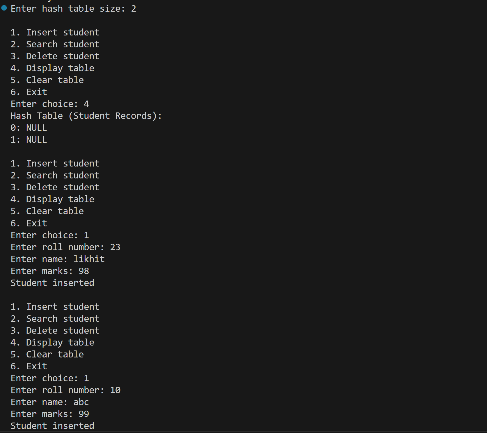
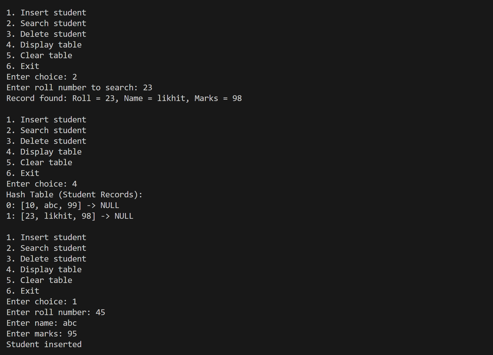
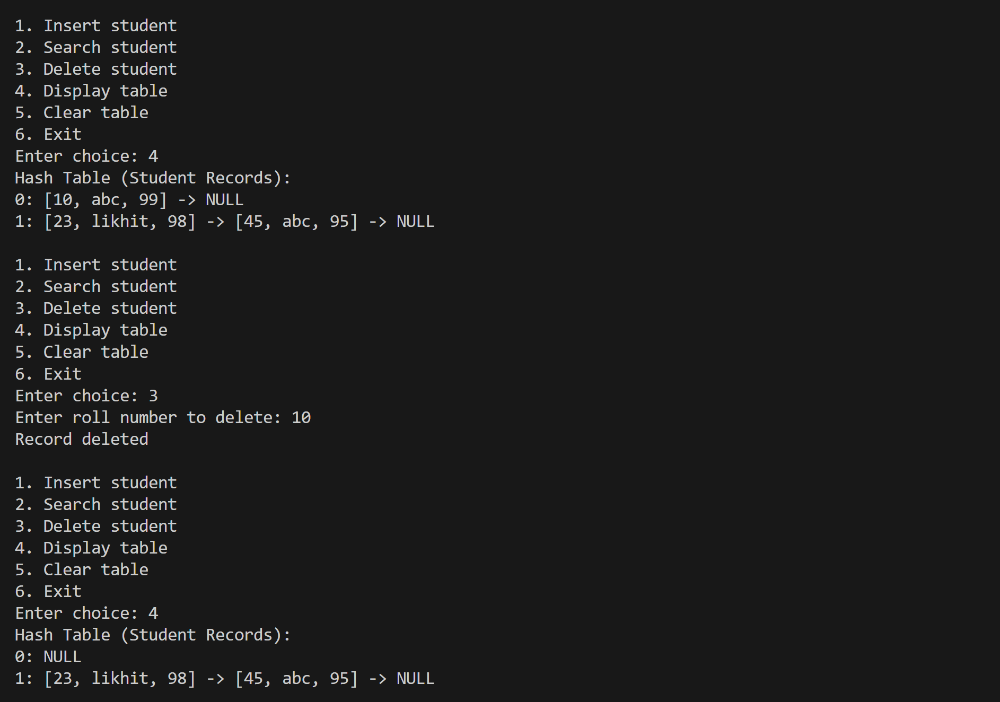
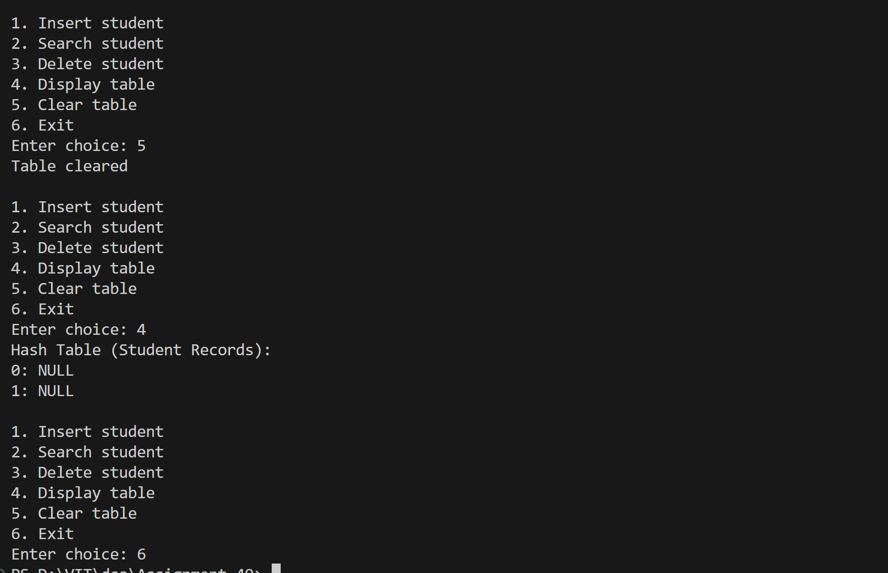

# Store and retrieve student records using roll numbers.

## Name: Likhit Chirmade, Roll no: 23

## Theory

### Student Database with Hashing

A hash table implementation for storing student records using roll numbers as keys. Uses separate chaining for collision resolution.

### Student Record Structure

```cpp
struct Student {
    int roll;      // Primary key
    string name;   // Student name
    int marks;     // Marks obtained
};
```

### Hash Function

```
h(roll) = roll mod table_size
```

Maps roll numbers to table indices.

### Separate Chaining

Each table slot contains a linked list of student records:
```cpp
vector<list<Student>> table;
```

### Operations

#### Insert
```
1. Calculate index = hash(roll)
2. Check for duplicate roll number
3. If duplicate → Reject
4. Else → Add to chain at index
```

**Duplicate Prevention:** Ensures unique roll numbers.

#### Search
```
1. Calculate index = hash(roll)
2. Traverse chain at table[index]
3. Compare roll numbers
4. Return student record if found
```

**Pass by Reference:** Returns student data via output parameter.

#### Delete
```
1. Calculate index = hash(roll)
2. Traverse chain using iterator
3. Match roll number
4. Erase from list if found
```

#### Display
```
For each index:
    Print all student records in chain
```

Shows complete table structure with chains.

### C++ Concepts

**Structure with Multiple Fields:**
```cpp
struct Student {
    int roll;
    string name;
    int marks;
};
```

**Pass by Reference:**
```cpp
bool search(int roll, Student &out) {
    // Modifies out parameter
}
```

**Iterator-based Deletion:**
```cpp
for (auto it = list.begin(); it != list.end(); it++) {
    if (it->roll == key) {
        list.erase(it);
        break;
    }
}
```

**Range-based Loop:**
```cpp
for (auto &student : table[idx]) {
    // Access student fields
}
```

### Advantages

1. **Fast Lookup:** O(1) average by roll number
2. **No Duplicates:** Enforced at insertion
3. **Dynamic Size:** Chains grow as needed
4. **Complete Records:** Stores multiple fields per student

### Time Complexity

| Operation | Average | Worst |
|-----------|---------|-------|
| Insert | O(α) | O(n) |
| Search | O(α) | O(n) |
| Delete | O(α) | O(n) |
| Display | O(n) | O(n) |

where α = n/m (load factor)

### Space Complexity

O(n + m) for n students and m table size

## Code

```cpp
#include <iostream>
#include <vector>
#include <list>
using namespace std;

struct Student_lac {
    int roll_lac;
    string name_lac;
    int marks_lac;
};

class StudentHash_lac {
    int size_lac;
    vector<list<Student_lac>> table_lac;

public:
    StudentHash_lac(int n_lac = 10) {
        size_lac = n_lac;
        table_lac.assign(size_lac, list<Student_lac>());
    }

    int hash_lac(int roll_lac) {
        return roll_lac % size_lac;
    }

    void insert_lac(Student_lac s_lac) {
        int idx_lac = hash_lac(s_lac.roll_lac);

        for (auto &stu_lac : table_lac[idx_lac]) {
            if (stu_lac.roll_lac == s_lac.roll_lac) {
                cout << "Roll number already exists\n";
                return;
            }
        }

        table_lac[idx_lac].push_back(s_lac);
        cout << "Student inserted\n";
    }

    bool search_lac(int roll_lac, Student_lac &out_lac) {
        int idx_lac = hash_lac(roll_lac);

        for (auto &stu_lac : table_lac[idx_lac]) {
            if (stu_lac.roll_lac == roll_lac) {
                out_lac = stu_lac;
                return true;
            }
        }
        return false;
    }

    bool delete_lac(int roll_lac) {
        int idx_lac = hash_lac(roll_lac);

        for (auto it_lac = table_lac[idx_lac].begin(); it_lac != table_lac[idx_lac].end(); it_lac++) {
            if (it_lac->roll_lac == roll_lac) {
                table_lac[idx_lac].erase(it_lac);
                return true;
            }
        }
        return false;
    }

    void display_lac() {
        cout << "Hash Table (Student Records):\n";
        for (int i_lac = 0; i_lac < size_lac; i_lac++) {
            cout << i_lac << ": ";
            for (auto &stu_lac : table_lac[i_lac]) {
                cout << "[" << stu_lac.roll_lac << ", " << stu_lac.name_lac << ", " << stu_lac.marks_lac << "] -> ";
            }
            cout << "NULL\n";
        }
    }

    void clear_lac() {
        for (int i_lac = 0; i_lac < size_lac; i_lac++)
            table_lac[i_lac].clear();
        cout << "Table cleared\n";
    }
};

int main() {
    int size_lac;
    cout << "Enter hash table size: ";
    cin >> size_lac;

    StudentHash_lac ht_lac(size_lac);

    while (true) {
        cout << "\n1. Insert student\n2. Search student\n3. Delete student\n4. Display table\n5. Clear table\n6. Exit\nEnter choice: ";
        int choice_lac;
        cin >> choice_lac;

        if (choice_lac == 1) {
            Student_lac s_lac;
            cout << "Enter roll number: ";
            cin >> s_lac.roll_lac;
            cout << "Enter name: ";
            cin >> s_lac.name_lac;
            cout << "Enter marks: ";
            cin >> s_lac.marks_lac;

            ht_lac.insert_lac(s_lac);
        }
        else if (choice_lac == 2) {
            int roll_lac;
            cout << "Enter roll number to search: ";
            cin >> roll_lac;

            Student_lac srch_lac;
            if (ht_lac.search_lac(roll_lac, srch_lac)) {
                cout << "Record found: Roll = " << srch_lac.roll_lac 
                     << ", Name = " << srch_lac.name_lac 
                     << ", Marks = " << srch_lac.marks_lac << "\n";
            } else {
                cout << "Record not found\n";
            }
        }
        else if (choice_lac == 3) {
            int roll_lac;
            cout << "Enter roll number to delete: ";
            cin >> roll_lac;

            if (ht_lac.delete_lac(roll_lac)) cout << "Record deleted\n";
            else cout << "Record not found\n";
        }
        else if (choice_lac == 4) {
            ht_lac.display_lac();
        }
        else if (choice_lac == 5) {
            ht_lac.clear_lac();
        }
        else if (choice_lac == 6) break;
        else cout << "Invalid choice\n";
    }

    return 0;
}
```

## Output





