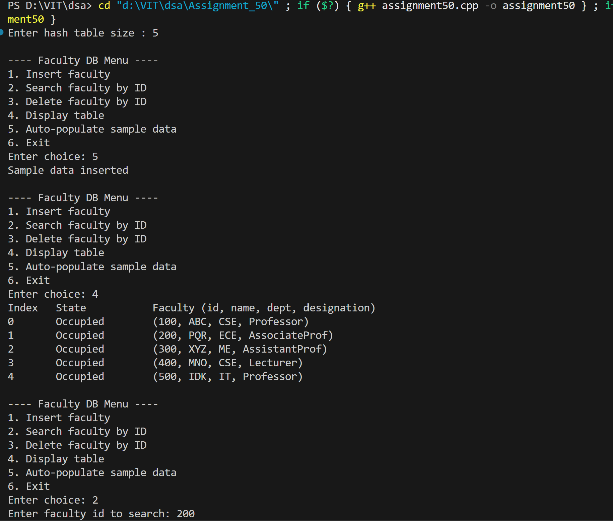
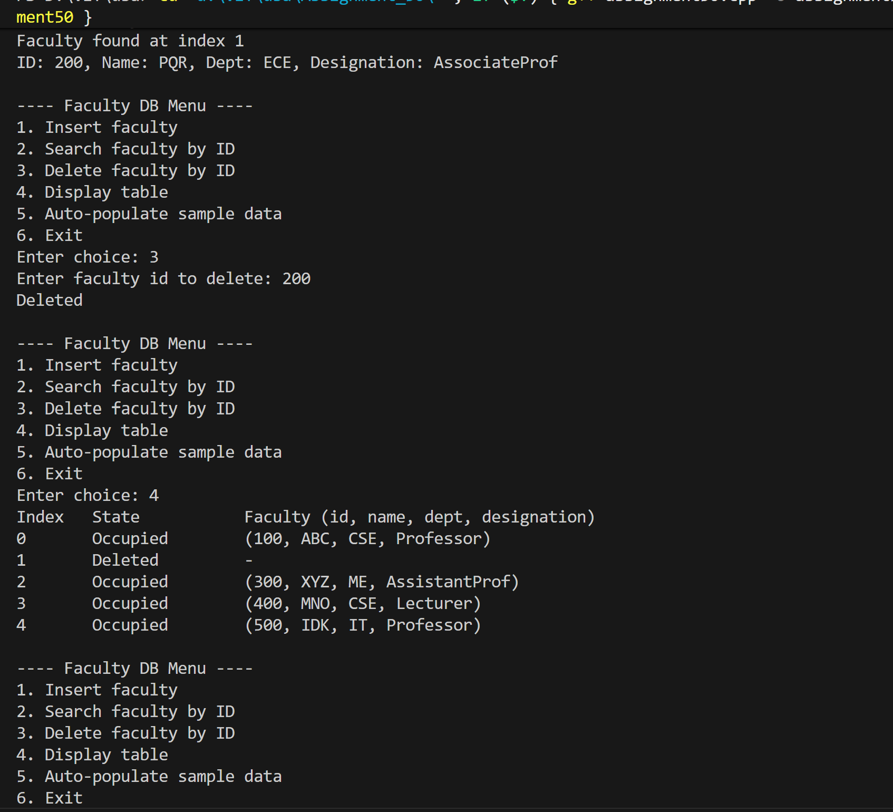
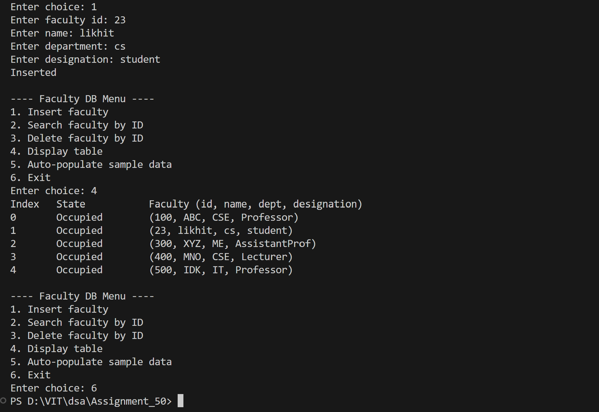

# WAP to simulate a faculty database as a hash table. Search a particular faculty by using MOD as a hash function for linear probing method of collision handling technique.

## Name: Likhit Chirmade, Roll no: 23

## Theory

### Faculty Database with Linear Probing

Hash table implementation for faculty records using division (MOD) hash function and linear probing collision resolution.

### Faculty Record Structure

```cpp
struct Faculty {
    int id;              // Primary key
    string name;         // Faculty name
    string dept;         // Department
    string designation;  // Position/rank
};
```

### Hash Function (MOD/Division Method)

```
h(id) = id mod table_size
```

Handles negative IDs: `if h < 0, then h = h + table_size`

### Linear Probing

Sequential search for next available slot:
```
index = (h(id) + i) mod table_size
where i = 0, 1, 2, 3, ...
```

### State Management

- **0 (Empty)**: Never used
- **1 (Occupied)**: Contains faculty record
- **2 (Deleted)**: Previously occupied, available for reuse

### Operations

#### Insert
```
1. Calculate index = hash(id)
2. Probe linearly until empty/deleted slot
3. Check for duplicate ID
4. Insert faculty record
```

#### Search
```
1. Calculate index = hash(id)
2. Probe while slots not empty
3. Return index if ID matches
4. Return -1 if not found
```

#### Delete
```
1. Search for faculty by ID
2. Mark state as deleted
3. Clear record data
```

#### Auto-populate
```
Inserts sample faculty data for testing
```

### Time Complexity

| Operation | Average | Worst |
|-----------|---------|-------|
| Insert | O(1) | O(n) |
| Search | O(1) | O(n) |
| Delete | O(1) | O(n) |

### Space Complexity

O(m) where m is table size

## Code

```cpp
#include <iostream>
#include <vector>
#include <string>
using namespace std;

struct Faculty_lac {
    int id_lac;
    string name_lac;
    string dept_lac;
    string designation_lac;
};

class FacultyHash_lac {
    int size_lac;
    vector<Faculty_lac> table_lac;
    vector<int> state_lac; // 0=empty, 1=occupied, 2=deleted

public:
    FacultyHash_lac(int n_lac = 11) {
        size_lac = n_lac;
        table_lac.assign(size_lac, Faculty_lac{0,"","",""});
        state_lac.assign(size_lac, 0);
    }

    int hash_lac(int id_lac) {
        int idx_lac = id_lac % size_lac;
        if (idx_lac < 0) idx_lac += size_lac;
        return idx_lac;
    }

    bool insert_lac(const Faculty_lac &f_lac) {
        int idx_lac = hash_lac(f_lac.id_lac);
        int start_lac = idx_lac;

        do {
            if (state_lac[idx_lac] == 0 || state_lac[idx_lac] == 2) {
                table_lac[idx_lac] = f_lac;
                state_lac[idx_lac] = 1;
                return true;
            }
            if (state_lac[idx_lac] == 1 && table_lac[idx_lac].id_lac == f_lac.id_lac)
                return false;

            idx_lac = (idx_lac + 1) % size_lac;
        } while (idx_lac != start_lac);

        return false;
    }

    int searchIndex_lac(int id_lac) {
        int idx_lac = hash_lac(id_lac);
        int start_lac = idx_lac;

        do {
            if (state_lac[idx_lac] == 0) return -1;
            if (state_lac[idx_lac] == 1 && table_lac[idx_lac].id_lac == id_lac)
                return idx_lac;

            idx_lac = (idx_lac + 1) % size_lac;
        } while (idx_lac != start_lac);

        return -1;
    }

    Faculty_lac get_lac(int idx_lac) {
        return table_lac[idx_lac];
    }

    bool remove_lac(int id_lac) {
        int pos_lac = searchIndex_lac(id_lac);
        if (pos_lac == -1) return false;

        state_lac[pos_lac] = 2;
        table_lac[pos_lac] = Faculty_lac{0,"","",""};
        return true;
    }

    void display_lac() {
        cout << "Index\tState\t\tFaculty (id, name, dept, designation)\n";
        for (int i_lac = 0; i_lac < size_lac; i_lac++) {
            cout << i_lac << "\t";
            if (state_lac[i_lac] == 0) cout << "Empty\t\t-\n";
            else if (state_lac[i_lac] == 2) cout << "Deleted\t\t-\n";
            else {
                cout << "Occupied\t(" << table_lac[i_lac].id_lac << ", " 
                     << table_lac[i_lac].name_lac << ", " 
                     << table_lac[i_lac].dept_lac << ", " 
                     << table_lac[i_lac].designation_lac << ")\n";
            }
        }
    }

    void autoPopulate_lac() {
        insert_lac(Faculty_lac{100, "ABC", "CSE", "Professor"});
        insert_lac(Faculty_lac{200, "PQR", "ECE", "AssociateProf"});
        insert_lac(Faculty_lac{300, "XYZ", "ME",  "AssistantProf"});
        insert_lac(Faculty_lac{400, "MNO", "CSE", "Lecturer"});
        insert_lac(Faculty_lac{500, "IDK", "IT",  "Professor"});
    } 
};

int main() {
    int size_lac;
    cout << "Enter hash table size (e.g. 11): ";
    cin >> size_lac;

    FacultyHash_lac ht_lac(size_lac);

    while (true) {
        cout << "\n---- Faculty DB Menu ----\n";
        cout << "1. Insert faculty\n2. Search faculty by ID\n3. Delete faculty by ID\n4. Display table\n5. Auto-populate sample data\n6. Exit\nEnter choice: ";

        int choice_lac;
        cin >> choice_lac;

        if (choice_lac == 1) {
            Faculty_lac f_lac;
            cout << "Enter faculty id: "; cin >> f_lac.id_lac;
            cout << "Enter name: "; cin >> f_lac.name_lac;
            cout << "Enter department: "; cin >> f_lac.dept_lac;
            cout << "Enter designation: "; cin >> f_lac.designation_lac;

            if (ht_lac.insert_lac(f_lac)) cout << "Inserted\n";
            else cout << "Insertion failed\n";
        }
        else if (choice_lac == 2) {
            int id_lac;
            cout << "Enter faculty id to search: ";
            cin >> id_lac;

            int pos_lac = ht_lac.searchIndex_lac(id_lac);
            if (pos_lac == -1) cout << "Faculty not found\n";
            else {
                Faculty_lac f_lac = ht_lac.get_lac(pos_lac);
                cout << "Faculty found at index " << pos_lac << "\n";
                cout << "ID: " << f_lac.id_lac 
                     << ", Name: " << f_lac.name_lac
                     << ", Dept: " << f_lac.dept_lac
                     << ", Designation: " << f_lac.designation_lac << "\n";
            }
        }
        else if (choice_lac == 3) {
            int id_lac;
            cout << "Enter faculty id to delete: ";
            cin >> id_lac;
            cout << (ht_lac.remove_lac(id_lac) ? "Deleted\n" : "Faculty not found\n");
        }
        else if (choice_lac == 4) ht_lac.display_lac();
        else if (choice_lac == 5) { ht_lac.autoPopulate_lac(); cout << "Sample data inserted\n"; }
        else if (choice_lac == 6) break;
        else cout << "Invalid choice\n";
    }
    return 0;
}
```

## Output




