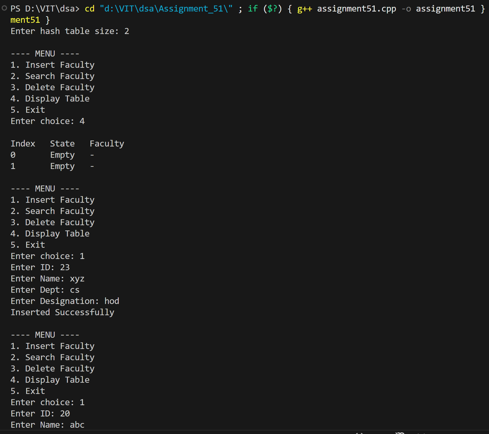
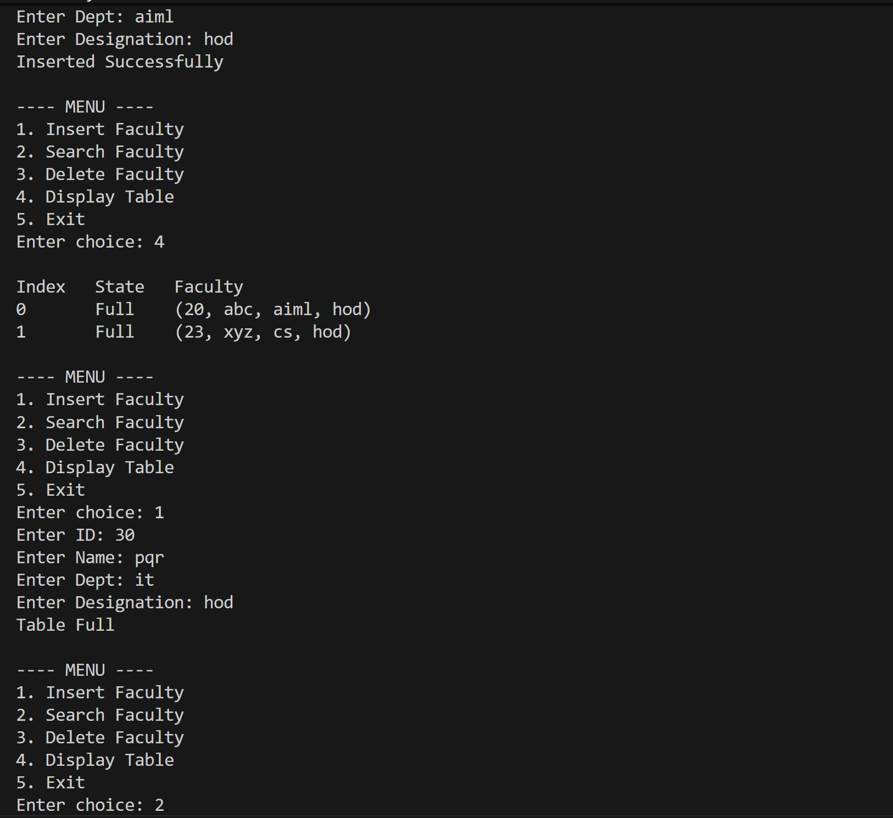
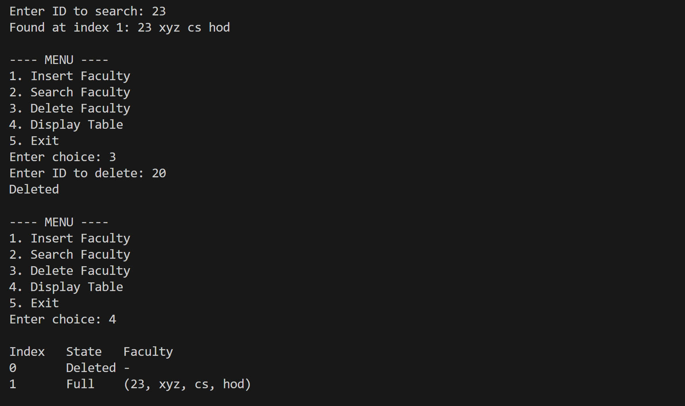

# WAP to simulate a faculty database as a hash table. Search a particular faculty by using 'divide' as a hash function for linear probing with chaining without replacement method of collision handling technique.

## Name: Likhit Chirmade, Roll no: 23

## Theory

### Hash Table with Linear Probing

A hash table is a data structure that maps keys to values using a hash function. Linear probing is an open addressing collision resolution technique where we search for the next available slot sequentially.

**Hash Function (Division Method):**
```
h(key) = key mod table_size
```

This method divides the key by table size and uses the remainder as the hash index.

### Linear Probing

When a collision occurs, linear probing searches for the next empty slot by incrementing the index.

**Probing Sequence:**
```
h(key, i) = (h(key) + i) mod m

where:
- i = 0, 1, 2, 3, ... (probe number)
- m = table size
```

**Example:**
```
Table size = 10
Key = 23

h(23) = 23 mod 10 = 3

If slot 3 is occupied:
Probe 0: (3 + 0) mod 10 = 3
Probe 1: (3 + 1) mod 10 = 4
Probe 2: (3 + 2) mod 10 = 5
...
```

### State Management

Each slot has three possible states:
- **0 (Empty)**: Never been used
- **1 (Full)**: Currently occupied
- **2 (Deleted)**: Previously occupied, now deleted

**Why track deleted state?**
- Maintains search integrity
- Allows slot reuse
- Prevents breaking probe chains

### Operations

#### 1. Insert
```
Algorithm:
1. Calculate index = hash(key)
2. While slot is occupied:
   - Move to next slot (linear probing)
   - If back to start, table is full
3. Insert at empty or deleted slot
```

**Time Complexity:**
- Average: O(1)
- Worst: O(n) when table is nearly full

#### 2. Search
```
Algorithm:
1. Calculate index = hash(key)
2. While slot is not empty:
   - If key matches, return index
   - Move to next slot
   - If back to start, not found
3. Return -1 if not found
```

**Time Complexity:**
- Average: O(1)
- Worst: O(n)

#### 3. Delete
```
Algorithm:
1. Search for the key
2. If found, mark state as deleted (2)
3. Clear the data
```

**Lazy Deletion:** Marks slot as deleted without physically removing, maintaining probe sequence.

### Primary Clustering

Linear probing suffers from primary clustering where consecutive occupied slots form clusters, increasing search time.

**Example:**
```
Initial: [_, _, _, _, _, _, _, _, _, _]
Insert 23: [_, _, _, 23, _, _, _, _, _, _]
Insert 33: [_, _, _, 23, 33, _, _, _, _, _]
Insert 43: [_, _, _, 23, 33, 43, _, _, _, _]

Cluster formed at indices 3-5
```

### Advantages and Disadvantages

**Advantages:**
- Simple implementation
- Good cache performance (sequential access)
- No extra memory for pointers

**Disadvantages:**
- Primary clustering
- Performance degrades as load factor increases
- Deletion requires special handling

### Load Factor

```
α = n / m

where:
- n = number of elements
- m = table size
```

**Recommended:** Keep α < 0.7 for good performance

### Time Complexity

| Operation | Average | Worst |
|-----------|---------|-------|
| Insert | O(1) | O(n) |
| Search | O(1) | O(n) |
| Delete | O(1) | O(n) |

### Space Complexity

- O(m) where m is table size

## Code

```cpp
#include <iostream>
#include <vector>
#include <string>
using namespace std;

struct Faculty_lac {
    int id_lac;
    string name_lac;
    string dept_lac;
    string designation_lac;
};

class FacultyHash_lac {
public:
    int size_lac;
    vector<Faculty_lac> table_lac;
    vector<int> state_lac; // 0 = empty, 1 = full, 2 = deleted

    FacultyHash_lac(int n_lac = 10) {
        size_lac = n_lac;
        table_lac.assign(size_lac, Faculty_lac{0,"","",""});
        state_lac.assign(size_lac, 0);
    }

    int hash_lac(int id_lac) {
        return id_lac % size_lac;
    }

    bool insert_lac(Faculty_lac f_lac) {
        int idx_lac = hash_lac(f_lac.id_lac);
        int start_lac = idx_lac;

        do {
            if (state_lac[idx_lac] == 0 || state_lac[idx_lac] == 2) { 
                table_lac[idx_lac] = f_lac;
                state_lac[idx_lac] = 1;
                return true;
            }
            idx_lac = (idx_lac + 1) % size_lac;
        } while (idx_lac != start_lac);

        return false;
    }

    int search_lac(int id_lac) {
        int idx_lac = hash_lac(id_lac);
        int start_lac = idx_lac;

        do {
            if (state_lac[idx_lac] == 0) return -1;
            if (state_lac[idx_lac] == 1 && table_lac[idx_lac].id_lac == id_lac)
                return idx_lac;

            idx_lac = (idx_lac + 1) % size_lac;
        } while (idx_lac != start_lac);

        return -1;
    }

    bool delete_lac(int id_lac) {
        int pos_lac = search_lac(id_lac);
        if (pos_lac == -1) return false;

        state_lac[pos_lac] = 2;
        table_lac[pos_lac] = Faculty_lac{0,"","",""};
        return true;
    }

    void display_lac() {
        cout << "\nIndex\tState\tFaculty\n";
        for (int i_lac = 0; i_lac < size_lac; i_lac++) {
            cout << i_lac << "\t";
            if (state_lac[i_lac] == 0)
                cout << "Empty\t-\n";
            else if (state_lac[i_lac] == 2)
                cout << "Deleted\t-\n";
            else
                cout << "Full\t(" 
                     << table_lac[i_lac].id_lac << ", "
                     << table_lac[i_lac].name_lac << ", "
                     << table_lac[i_lac].dept_lac << ", "
                     << table_lac[i_lac].designation_lac 
                     << ")\n";
        }
    }
};

int main() {
    int size_lac;
    cout << "Enter hash table size: ";
    cin >> size_lac;

    FacultyHash_lac ht_lac(size_lac);

    while (true) {
        cout << "\n---- MENU ----\n";
        cout << "1. Insert Faculty\n";
        cout << "2. Search Faculty\n";
        cout << "3. Delete Faculty\n";
        cout << "4. Display Table\n";
        cout << "5. Exit\n";
        cout << "Enter choice: ";

        int ch_lac;
        cin >> ch_lac;

        if (ch_lac == 1) {
            Faculty_lac f_lac;
            cout << "Enter ID: "; cin >> f_lac.id_lac;
            cout << "Enter Name: "; cin >> f_lac.name_lac;
            cout << "Enter Dept: "; cin >> f_lac.dept_lac;
            cout << "Enter Designation: "; cin >> f_lac.designation_lac;

            if (ht_lac.insert_lac(f_lac)) cout << "Inserted Successfully\n";
            else cout << "Table Full\n";
        }
        else if (ch_lac == 2) {
            int id_lac;
            cout << "Enter ID to search: ";
            cin >> id_lac;

            int pos_lac = ht_lac.search_lac(id_lac);
            if (pos_lac == -1) cout << "Not Found\n";
            else {
                Faculty_lac f_lac = ht_lac.table_lac[pos_lac];
                cout << "Found at index " << pos_lac << ": "
                     << f_lac.id_lac << " " << f_lac.name_lac << " " 
                     << f_lac.dept_lac << " " << f_lac.designation_lac << "\n";
            }
        }
        else if (ch_lac == 3) {
            int id_lac;
            cout << "Enter ID to delete: ";
            cin >> id_lac;

            if (ht_lac.delete_lac(id_lac)) cout << "Deleted\n";
            else cout << "Not Found\n";
        }
        else if (ch_lac == 4) ht_lac.display_lac();
        else if (ch_lac == 5) break;
        else cout << "Invalid Choice\n";
    }

    return 0;
}
```

## Output




