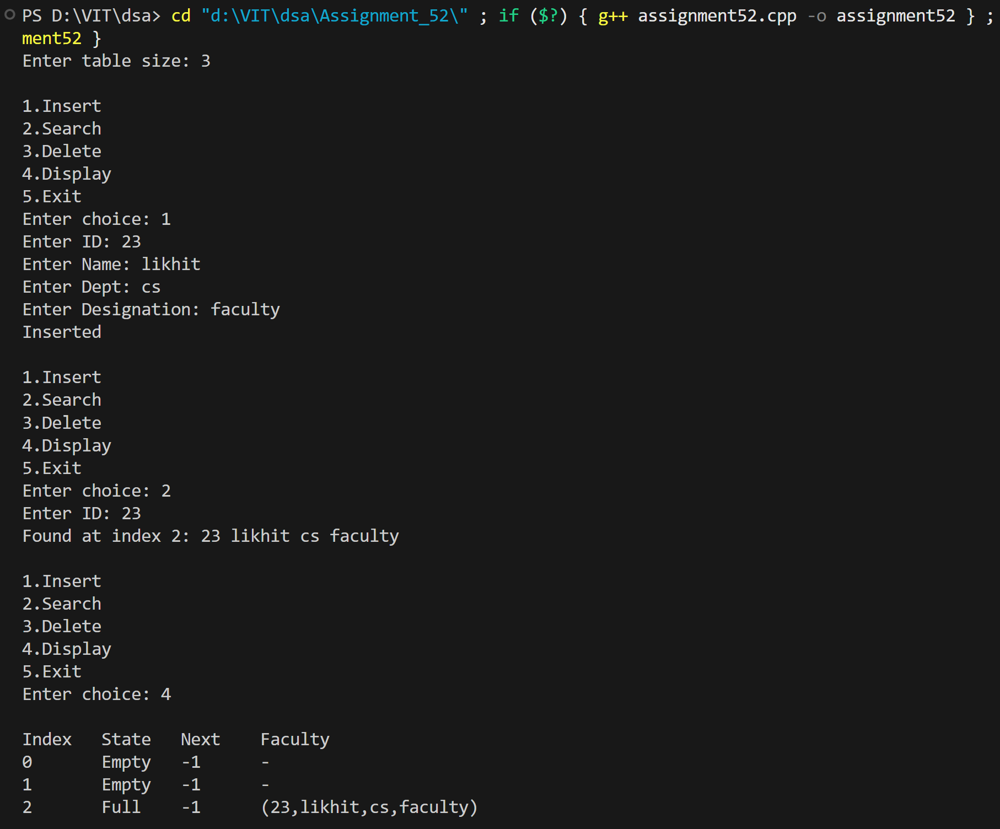
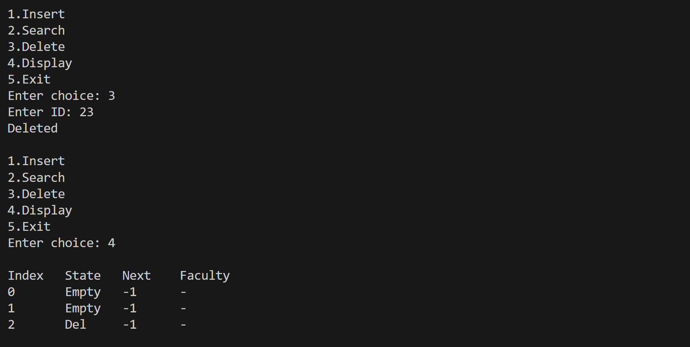

# WAP to simulate a faculty database as a hash table. Search a particular faculty by using MOD as a hash function for linear probing with chaining with replacement method of collision handling technique.

## Name: Likhit Chirmade, Roll no: 23

## Theory

### Linear Probing with Chaining WITH Replacement

This is a hybrid collision resolution technique that combines open addressing with chaining. When a collision occurs, the algorithm decides whether to displace the existing element based on whether it's in its home location.

**Key Concept:** If an element is NOT in its home location, it can be displaced to make room for an element that IS trying to reach its home location.

### Hash Function (Division/MOD Method)

```
h(key) = key mod table_size
```

Simple and efficient, uses modulo operation to map keys to indices.

### Chaining WITH Replacement Algorithm

**Insertion Logic:**

1. Calculate home location for new key
2. If home slot is empty → Insert directly
3. If home slot is occupied:
   - Check if existing element is in its home location
   - **If existing element is NOT home:** Displace it, insert new element
   - **If existing element IS home:** Chain the new element

**Example:**
```
Table size = 10

Insert 23: h(23) = 3 → Insert at index 3
Insert 45: h(45) = 5 → Insert at index 5  
Insert 13: h(13) = 3 → Collision!
  - Element 23 is at its home (3)
  - Chain 13 to next free slot
  
Insert 35: h(35) = 5 → Collision!
  - Element 45 is at its home (5)
  - Chain 35 to next free slot

Insert 25: h(25) = 5 → Collision!
  - Element 45 is at its home (5)
  - But if 45 was displaced (not home), replace it
```

### Data Structure

**Node Structure:**
```cpp
struct Node {
    int id;
    string name;
    string dept;
    string designation;
};

vector<Node> table;      // Hash table
vector<int> state;       // 0=Empty, 1=Full, 2=Deleted
vector<int> next;        // Chain pointer (-1 = end)
```

**Chain Pointer:**
- Stores index of next element in chain
- -1 indicates end of chain
- Allows traversal of colliding elements

### Operations

#### 1. Insert with Replacement

```
Algorithm:
1. Calculate home = hash(key)
2. If table[home] is empty:
   - Insert directly
   - Set next[home] = -1
3. Else:
   - homeOfExisting = hash(table[home].key)
   - If homeOfExisting ≠ home:
     // Existing element is displaced
     a. Save existing element
     b. Insert new element at home
     c. Find free slot for displaced element
     d. Rechain displaced element
   - Else:
     // Existing element is at home
     a. Find free slot
     b. Insert new element there
     c. Chain it to home location
```

**Time Complexity:** O(n) worst case due to rechaining

#### 2. Search

```
Algorithm:
1. Calculate home = hash(key)
2. Start from home location
3. Follow chain using next pointers
4. Compare keys at each step
5. Return index if found, -1 otherwise
```

**Time Complexity:** O(chain_length)

#### 3. Delete

```
Algorithm:
1. Search for element
2. If found:
   - Mark state as deleted
   - Update chain pointers
   - Remove from chain
```

**Time Complexity:** O(chain_length)

### Advantages

1. **Better Space Utilization:** Elements prefer their home locations
2. **Reduced Clustering:** Displaced elements are moved
3. **Faster Search:** Home elements found immediately
4. **Dynamic Chaining:** Handles collisions gracefully

### Disadvantages

1. **Complex Implementation:** Displacement logic is intricate
2. **Rechaining Overhead:** Moving elements requires updating chains
3. **Pointer Management:** Extra space for next pointers

### Comparison: With vs Without Replacement

| Aspect | Without Replacement | With Replacement |
|--------|-------------------|------------------|
| Displacement | Never | When not at home |
| Home Priority | No | Yes |
| Complexity | Simple | Complex |
| Performance | Good | Better |

### Example Walkthrough

```
Table size = 7
Insert sequence: 8, 15, 22, 1

Step 1: Insert 8
h(8) = 1
Table[1] = 8, next[1] = -1

Step 2: Insert 15
h(15) = 1 (collision!)
8 is at home (h(8) = 1)
Find free slot: 2
Table[2] = 15, next[1] = 2, next[2] = -1

Step 3: Insert 22
h(22) = 1 (collision!)
8 is at home
Find free slot: 3
Table[3] = 22, next[2] = 3, next[3] = -1

Step 4: Insert 1
h(1) = 1 (collision!)
8 is NOT at home (h(8) = 1, but let's say 8 was displaced)
Displace 8, insert 1 at index 1
Rechain 8
```

### Time Complexity

| Operation | Average | Worst |
|-----------|---------|-------|
| Insert | O(1) | O(n) |
| Search | O(1) | O(n) |
| Delete | O(1) | O(n) |

### Space Complexity

- O(m) for table
- O(m) for state array
- O(m) for next pointers
- **Total:** O(3m) = O(m)

## Code

```cpp
#include <iostream>
#include <vector>
#include <string>
using namespace std;

struct Faculty_lac {
    int id_lac;
    string name_lac;
    string dept_lac;
    string designation_lac;
};

class FacultyHash_lac {
    int size_lac;
    vector<Faculty_lac> table_lac;
    vector<int> state_lac;   // 0 = Empty, 1 = Full, 2 = Deleted
    vector<int> next_lac;    // Linked list chain

public:
    FacultyHash_lac(int n_lac = 10) {
        size_lac = n_lac;
        table_lac.assign(size_lac, Faculty_lac{0,"","",""});
        state_lac.assign(size_lac, 0);
        next_lac.assign(size_lac, -1);
    }

    int hash_lac(int id_lac) {
        return id_lac % size_lac;
    }

    int findFree_lac() {
        for (int i = 0; i < size_lac; i++)
            if (state_lac[i] == 0) return i;
        return -1;
    }

    bool insert_lac(Faculty_lac f_lac) {
        int home = hash_lac(f_lac.id_lac);

        if (state_lac[home] == 0) {
            table_lac[home] = f_lac;
            state_lac[home] = 1;
            next_lac[home] = -1;
            return true;
        }

        int homeExisting = hash_lac(table_lac[home].id_lac);

        if (homeExisting != home) {
            Faculty_lac temp = table_lac[home];
            table_lac[home] = f_lac;

            int freeSlot = findFree_lac();
            if (freeSlot == -1) return false;

            table_lac[freeSlot] = temp;
            state_lac[freeSlot] = 1;

            int tempHome = hash_lac(temp.id_lac);
            int cur = tempHome;
            while (next_lac[cur] != -1) cur = next_lac[cur];
            next_lac[cur] = freeSlot;
            next_lac[freeSlot] = -1;
            return true;
        }

        int freeSlot = findFree_lac();
        if (freeSlot == -1) return false;

        table_lac[freeSlot] = f_lac;
        state_lac[freeSlot] = 1;
        next_lac[freeSlot] = -1;

        int cur = home;
        while (next_lac[cur] != -1) cur = next_lac[cur];
        next_lac[cur] = freeSlot;

        return true;
    }

    int search_lac(int id_lac) {
        int home = hash_lac(id_lac);
        int cur = home;

        while (cur != -1) {
            if (state_lac[cur] == 1 && table_lac[cur].id_lac == id_lac)
                return cur;
            cur = next_lac[cur];
        }
        return -1;
    }

    bool delete_lac(int id_lac) {
        int home = hash_lac(id_lac);
        int cur = home, prev = -1;

        while (cur != -1) {
            if (table_lac[cur].id_lac == id_lac && state_lac[cur] == 1) {
                state_lac[cur] = 2;
                table_lac[cur] = Faculty_lac{0,"","",""};
                if (prev != -1) next_lac[prev] = next_lac[cur];
                next_lac[cur] = -1;
                return true;
            }
            prev = cur;
            cur = next_lac[cur];
        }
        return false;
    }

    void display_lac() {
        cout << "\nIndex\tState\tNext\tFaculty\n";
        for (int i = 0; i < size_lac; i++) {
            cout << i << "\t";
            if (state_lac[i] == 0) cout << "Empty\t";
            else if (state_lac[i] == 2) cout << "Del\t";
            else cout << "Full\t";

            cout << next_lac[i] << "\t";

            if (state_lac[i] == 1)
                cout << "(" << table_lac[i].id_lac << ","
                     << table_lac[i].name_lac << ","
                     << table_lac[i].dept_lac << ","
                     << table_lac[i].designation_lac << ")";
            else cout << "-";
            cout << "\n";
        }
    }
};

int main() {
    int size_lac;
    cout << "Enter table size: ";
    cin >> size_lac;

    FacultyHash_lac ht_lac(size_lac);

    while (true) {
        cout << "\n1.Insert\n2.Search\n3.Delete\n4.Display\n5.Exit\nEnter choice: ";
        int ch; cin >> ch;

        if (ch == 1) {
            Faculty_lac f_lac;
            cout << "Enter ID: "; cin >> f_lac.id_lac;
            cout << "Enter Name: "; cin >> f_lac.name_lac;
            cout << "Enter Dept: "; cin >> f_lac.dept_lac;
            cout << "Enter Designation: "; cin >> f_lac.designation_lac;
            if (ht_lac.insert_lac(f_lac)) cout << "Inserted\n";
            else cout << "Table Full\n";
        }

        else if (ch == 2) {
            int id; cout << "Enter ID: "; cin >> id;
            int pos = ht_lac.search_lac(id);
            if (pos == -1) cout << "Not found\n";
            else {
                Faculty_lac f = ht_lac.table_lac[pos];
                cout << "Found at index " << pos << ": "
                     << f.id_lac << " " << f.name_lac << " "
                     << f.dept_lac << " " << f.designation_lac << "\n";
            }
        }

        else if (ch == 3) {
            int id; cout << "Enter ID: "; cin >> id;
            if (ht_lac.delete_lac(id)) cout << "Deleted\n";
            else cout << "Not found\n";
        }

        else if (ch == 4) ht_lac.display_lac();
        else if (ch == 5) break;
        else cout << "Invalid choice\n";
    }

    return 0;
}
```

## Output



