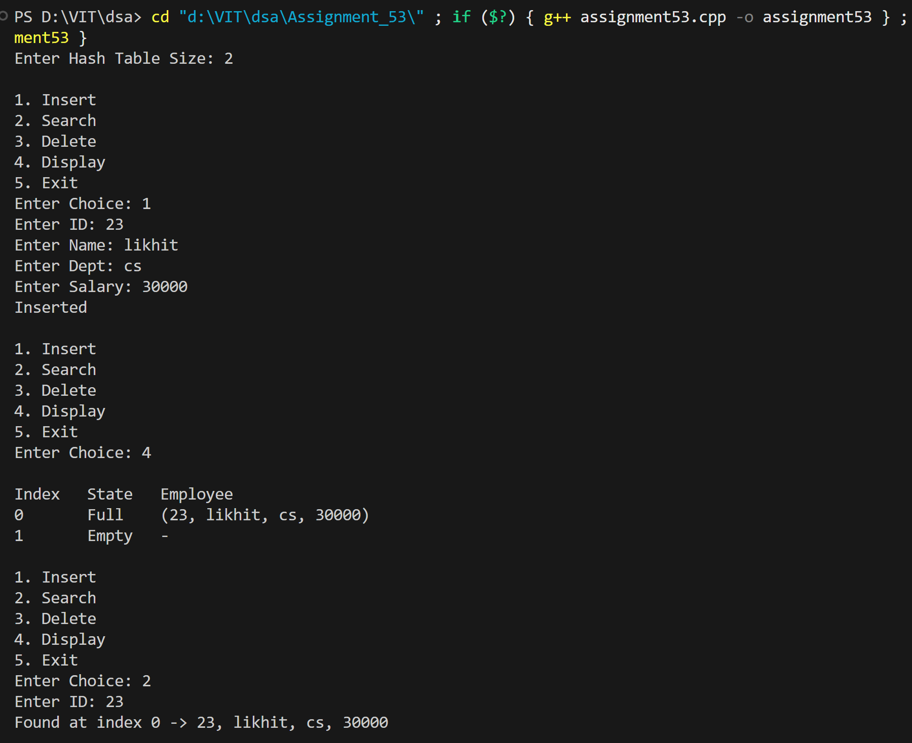
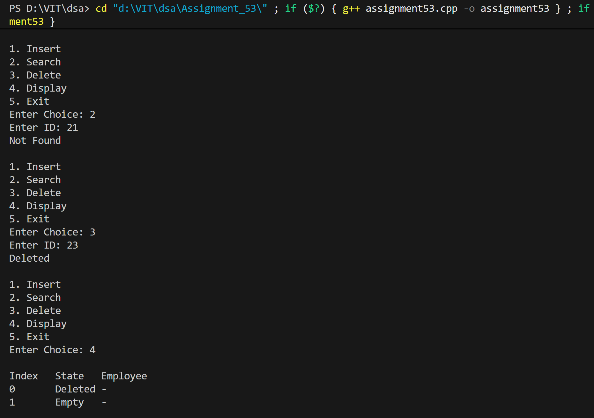

# WAP to simulate employee databases as a hash table. Search a particular employee by using Mid square method as a hash function for linear probing method of collision handling technique.

## Name: Likhit Chirmade, Roll no: 23

## Theory

### Mid-Square Hashing Method

The mid-square method is a hash function that squares the key and extracts the middle digits to generate the hash value.

**Algorithm:**
```
1. Square the key: key²
2. Extract middle digits from the squared value
3. Apply modulo with table size
```

**Example:**
```
Key = 123
Square = 123² = 15129
Middle digits (2 digits) = 51
Hash = 51 mod 10 = 1
```

### Why Mid-Square Method?

**Advantages:**
- Good distribution of keys
- Middle digits are influenced by all digits of the key
- Reduces clustering compared to simple modulo
- Works well for numeric keys

**Disadvantages:**
- Requires squaring (computational overhead)
- String manipulation needed
- May overflow for large keys

### Implementation Steps

```cpp
int hash(int key) {
    long long square = key * key;
    string s = to_string(square);
    
    // Extract middle 2 digits
    int len = s.length();
    int mid = len / 2;
    int start = max(0, mid - 1);
    
    int value = stoi(s.substr(start, 2));
    return value % table_size;
}
```

**Example Walkthrough:**
```
Key = 45
Square = 45² = 2025
String = "2025"
Length = 4
Mid = 2
Start = max(0, 2-1) = 1
Extract = "02" → 2
Hash = 2 mod 10 = 2
```

### Linear Probing

When collision occurs, search sequentially for next empty slot.

**Probe Sequence:**
```
h(key, i) = (hash(key) + i) mod m

where i = 0, 1, 2, 3, ...
```

### State Management

- **0 (Empty):** Slot never used
- **1 (Filled):** Currently occupied
- **2 (Deleted):** Previously occupied, now deleted

### Operations

#### 1. Insert
```
1. Calculate hash index
2. If slot empty or deleted → Insert
3. Else probe linearly until empty slot found
4. If table full → Return false
```

**Time Complexity:** O(1) average, O(n) worst

#### 2. Search
```
1. Calculate hash index
2. While slot not empty:
   - If key matches → Return index
   - Probe to next slot
3. Return -1 if not found
```

**Time Complexity:** O(1) average, O(n) worst

#### 3. Delete
```
1. Search for key
2. If found → Mark as deleted (state = 2)
3. Clear data
```

**Time Complexity:** Same as search

### Primary Clustering

Linear probing creates clusters of consecutive occupied slots, degrading performance.

**Example:**
```
Hash values: 3, 4, 5, 3, 4
Result: [_, _, _, X, X, X, _, _, _, _]
        Cluster at 3-5
```

### Time Complexity

| Operation | Average | Worst |
|-----------|---------|-------|
| Insert | O(1) | O(n) |
| Search | O(1) | O(n) |
| Delete | O(1) | O(n) |

### Space Complexity

- O(m) where m is table size

## Code

```cpp
#include <iostream>
#include <vector>
#include <string>
using namespace std;

struct Employee_lac {
    int id_lac;
    string name_lac;
    string dept_lac;
    int salary_lac;
};

class EmployeeHash_lac {
public:
    int size_lac;
    vector<Employee_lac> table_lac;
    vector<int> state_lac;  // 0 = empty, 1 = filled, 2 = deleted

    EmployeeHash_lac(int n_lac = 10) {
        size_lac = n_lac;
        table_lac.assign(size_lac, Employee_lac{0,"","",0});
        state_lac.assign(size_lac, 0);
    }

    int hash_lac(int id_lac) {
        long long square = 1LL * id_lac * id_lac;
        string s = to_string(square);
        int len = s.length();
        int mid = len / 2;
        int digits = 2;
        int start = max(0, mid - digits / 2);
        int value = stoi(s.substr(start, digits));
        return value % size_lac;
    }

    bool insert_lac(Employee_lac e) {
        int idx = hash_lac(e.id_lac);
        int start = idx;

        do {
            if (state_lac[idx] == 0 || state_lac[idx] == 2) {
                table_lac[idx] = e;
                state_lac[idx] = 1;
                return true;
            }
            idx = (idx + 1) % size_lac;
        } while (idx != start);

        return false;
    }

    int search_lac(int id) {
        int idx = hash_lac(id);
        int start = idx;

        do {
            if (state_lac[idx] == 0) return -1;
            if (state_lac[idx] == 1 && table_lac[idx].id_lac == id)
                return idx;
            idx = (idx + 1) % size_lac;
        } while (idx != start);

        return -1;
    }

    bool delete_lac(int id) {
        int pos = search_lac(id);
        if (pos == -1) return false;
        state_lac[pos] = 2;
        table_lac[pos] = Employee_lac{0,"","",0};
        return true;
    }

    void display_lac() {
        cout << "\nIndex\tState\tEmployee\n";
        for (int i = 0; i < size_lac; i++) {
            cout << i << "\t";
            if (state_lac[i] == 0)
                cout << "Empty\t-\n";
            else if (state_lac[i] == 2)
                cout << "Deleted\t-\n";
            else
                cout << "Full\t(" << table_lac[i].id_lac << ", "
                     << table_lac[i].name_lac << ", "
                     << table_lac[i].dept_lac << ", "
                     << table_lac[i].salary_lac << ")\n";
        }
    }
};

int main() {
    int size_lac;
    cout << "Enter Hash Table Size: ";
    cin >> size_lac;

    EmployeeHash_lac ht(size_lac);

    while (true) {
        cout << "\n1. Insert\n2. Search\n3. Delete\n4. Display\n5. Exit\nEnter Choice: ";
        int ch; cin >> ch;

        if (ch == 1) {
            Employee_lac e;
            cout << "Enter ID: "; cin >> e.id_lac;
            cout << "Enter Name: "; cin >> e.name_lac;
            cout << "Enter Dept: "; cin >> e.dept_lac;
            cout << "Enter Salary: "; cin >> e.salary_lac;
            if (ht.insert_lac(e)) cout << "Inserted\n";
            else cout << "Table Full\n";
        }

        else if (ch == 2) {
            int id; cout << "Enter ID: "; cin >> id;
            int pos = ht.search_lac(id);
            if (pos == -1) cout << "Not Found\n";
            else {
                Employee_lac e = ht.table_lac[pos];
                cout << "Found at index " << pos << " → "
                     << e.id_lac << ", " << e.name_lac << ", "
                     << e.dept_lac << ", " << e.salary_lac << "\n";
            }
        }

        else if (ch == 3) {
            int id; cout << "Enter ID: "; cin >> id;
            if (ht.delete_lac(id)) cout << "Deleted\n";
            else cout << "Not Found\n";
        }

        else if (ch == 4) ht.display_lac();
        else if (ch == 5) break;
        else cout << "Invalid Choice\n";
    }

    return 0;
}
```

## Output


