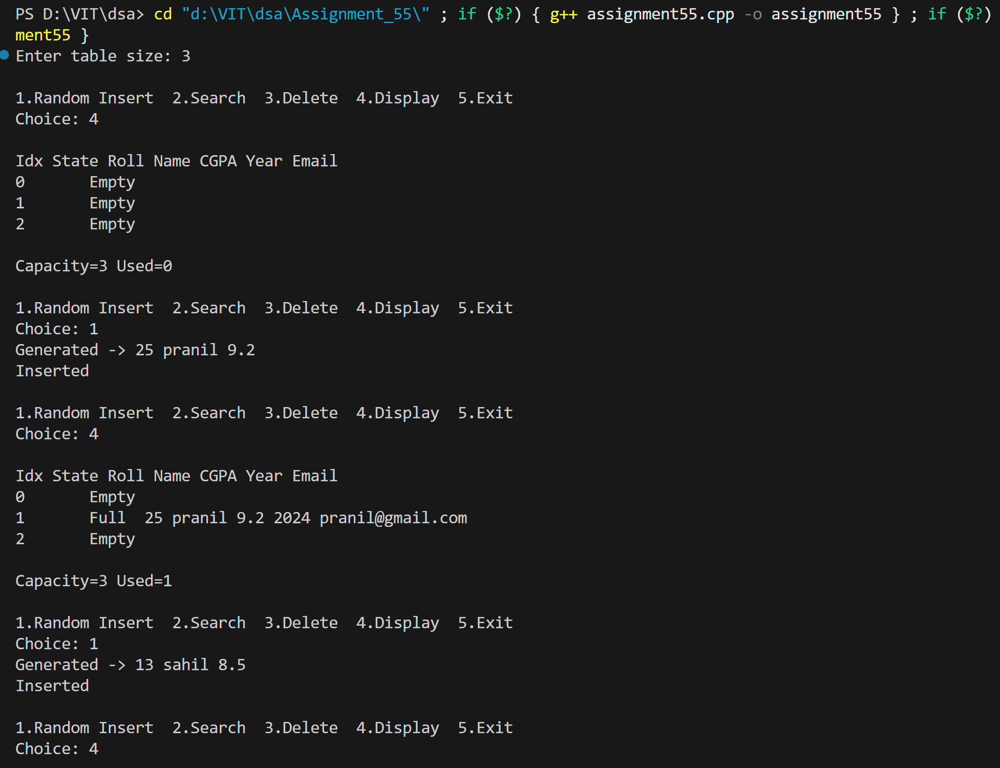
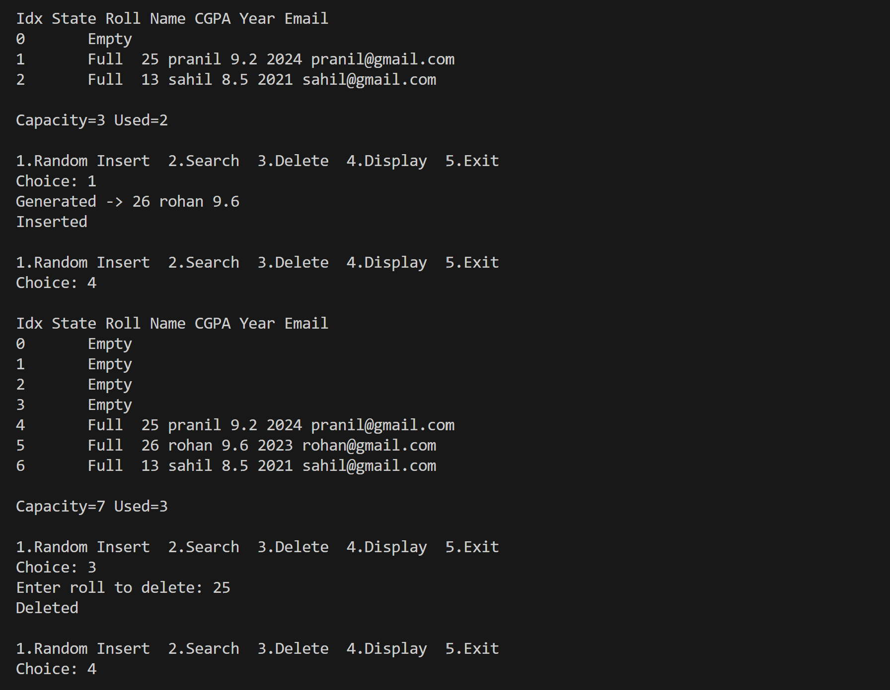
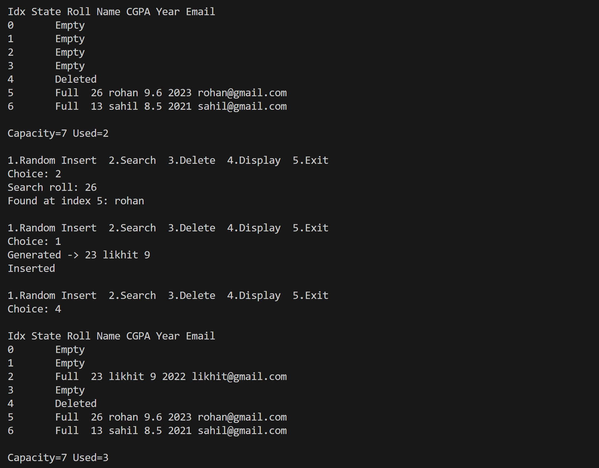

# Design and implement a smart college placement portal that uses advanced hashing techniques to efficiently manage student placement records with high performance and low collision probability, even under dynamic data growth.

## Name: Likhit Chirmade, Roll no: 23

## Theory

### Hash Tables

A hash table is a data structure that implements an associative array abstract data type, a structure that can map keys to values. It uses a hash function to compute an index into an array of buckets or slots, from which the desired value can be found.

**Key Concepts:**
- **Hash Function**: Converts a key into an array index
- **Collision**: When two keys hash to the same index
- **Load Factor**: Ratio of used slots to total capacity (α = n/m)
- **Collision Resolution**: Techniques to handle collisions

### Double Hashing

Double hashing is an open addressing collision resolution technique that uses two hash functions to determine the probe sequence when a collision occurs.

**Formula:**
```
h(k, i) = (h1(k) + i × h2(k)) mod m

where:
- h1(k) = primary hash function
- h2(k) = secondary hash function
- i = probe number (0, 1, 2, ...)
- m = table size
```

**Hash Functions Used:**

1. **Primary Hash Function (h1):**
```
h1(key) = key mod m
```
- Simple modulo operation
- Distributes keys across table

2. **Secondary Hash Function (h2):**
```
h2(key) = 1 + (key mod (m - 2))
```
- Always returns value between 1 and m-1
- Ensures non-zero step size
- Guarantees all slots are probed

**Why h2 uses (m - 2)?**
- Ensures h2(key) is never 0
- Prevents infinite loops at same position
- Creates different probe sequences for different keys

### Collision Resolution: Open Addressing

Open addressing stores all elements in the hash table itself. When a collision occurs, the algorithm searches for the next available slot using a probe sequence.

**Probe Sequence in Double Hashing:**
```
Position 0: h1(key)
Position 1: (h1(key) + 1×h2(key)) mod m
Position 2: (h1(key) + 2×h2(key)) mod m
Position 3: (h1(key) + 3×h2(key)) mod m
...
```

**Example:**
```
Table size m = 11
Key = 23

h1(23) = 23 mod 11 = 1
h2(23) = 1 + (23 mod 9) = 1 + 5 = 6

Probe sequence:
i=0: (1 + 0×6) mod 11 = 1
i=1: (1 + 1×6) mod 11 = 7
i=2: (1 + 2×6) mod 11 = 2
i=3: (1 + 3×6) mod 11 = 8
...
```

### State Management in Hash Tables

Each slot in the hash table has three possible states:

1. **Empty (state = 0)**: Never been used
2. **Occupied (state = 1)**: Currently holds valid data
3. **Deleted (state = 2)**: Previously held data, now deleted

**Why Track Deleted State?**
- Maintains probe sequence integrity
- Prevents search from stopping prematurely
- Allows slots to be reused for insertion
- Critical for correctness in open addressing

**State Transitions:**
```
Empty (0) → Occupied (1)  [on insert]
Occupied (1) → Deleted (2)  [on delete]
Deleted (2) → Occupied (1)  [on reinsert]
```

### Prime Numbers in Hashing

Using prime numbers for table size reduces clustering and improves distribution.

**Prime Number Check Algorithm:**
```cpp
bool isPrime(n):
    if n ≤ 1: return false
    if n ≤ 3: return true
    if n mod 2 == 0: return false
    
    for i = 3 to √n step 2:
        if n mod i == 0:
            return false
    return true
```

**Why Prime Table Size?**
- Reduces clustering patterns
- Better key distribution
- Minimizes collisions
- Ensures h2(key) and m are coprime (for double hashing)

**Finding Next Prime:**
```cpp
int nextPrime(n):
    while not isPrime(n):
        n++
    return n
```

### Dynamic Resizing (Rehashing)

When the load factor exceeds a threshold (typically 0.6-0.7), the table is resized to maintain performance.

**Rehashing Algorithm:**
```
1. Calculate new capacity = nextPrime(2 × current_capacity)
2. Create new table with new capacity
3. For each occupied slot in old table:
   a. Extract the element
   b. Recompute hash using new capacity
   c. Insert into new table
4. Replace old table with new table
```

**Load Factor Threshold:**
```
α = used_slots / capacity

If α > 0.6:
    trigger rehashing
```

**Why Rehash at 0.6?**
- Maintains O(1) average-case performance
- Prevents excessive collisions
- Balances space vs. time tradeoff
- Industry-standard threshold

**Example:**
```
Initial capacity: 7
Used slots: 5
Load factor: 5/7 = 0.71 > 0.6

Action: Rehash
New capacity: nextPrime(7 × 2) = nextPrime(14) = 17

All 5 elements rehashed into table of size 17
```

### Student Record Structure

```cpp
struct Student {
    int roll;        // Primary key
    string name;     // Student name
    string course;   // Course (e.g., CSE)
    double cgpa;     // CGPA (0.0 - 10.0)
    int year;        // Admission year
    string email;    // Email address
    int state;       // 0=Empty, 1=Occupied, 2=Deleted
};
```

### Hash Table Operations

#### 1. **Insertion**

**Algorithm:**
```
insert(student):
    if load_factor > 0.6:
        rehash()
    
    key = student.roll
    i = 0
    firstDeleted = -1
    
    while i < capacity:
        idx = (h1(key) + i×h2(key)) mod capacity
        
        if table[idx].state == Empty:
            if firstDeleted != -1:
                idx = firstDeleted
            table[idx] = student
            table[idx].state = Occupied
            used++
            return true
        
        if table[idx].state == Deleted and firstDeleted == -1:
            firstDeleted = idx
        
        if table[idx].state == Occupied and table[idx].roll == key:
            return false  // Duplicate
        
        i++
    
    if firstDeleted != -1:
        table[firstDeleted] = student
        table[firstDeleted].state = Occupied
        used++
        return true
    
    return false  // Table full
```

**Key Points:**
- Checks load factor before insertion
- Reuses deleted slots (optimization)
- Prevents duplicate keys
- Returns false if key exists or table full

#### 2. **Search**

**Algorithm:**
```
search(roll):
    key = roll
    i = 0
    
    while i < capacity:
        idx = (h1(key) + i×h2(key)) mod capacity
        
        if table[idx].state == Empty:
            return -1  // Not found
        
        if table[idx].state == Occupied and table[idx].roll == key:
            return idx  // Found
        
        i++
    
    return -1  // Not found after full probe
```

**Search Behavior:**
- Follows same probe sequence as insertion
- Stops at empty slot (key never inserted)
- Continues through deleted slots
- Returns index if found, -1 otherwise

#### 3. **Deletion**

**Algorithm:**
```
delete(roll):
    pos = search(roll)
    
    if pos == -1:
        return false  // Not found
    
    table[pos] = Student()  // Reset to default
    table[pos].state = Deleted
    used--
    return true
```

**Lazy Deletion:**
- Marks slot as deleted (state = 2)
- Doesn't physically remove data
- Maintains probe sequence integrity
- Slot can be reused later

### Time Complexity Analysis

| Operation | Average Case | Worst Case | Notes |
|-----------|-------------|------------|-------|
| Insert | O(1) | O(n) | With good hash function and α < 0.7 |
| Search | O(1) | O(n) | Expected constant time |
| Delete | O(1) | O(n) | Search + mark deleted |
| Rehash | O(n) | O(n) | Amortized O(1) per insert |
| isPrime | O(√n) | O(√n) | For checking primality |

**Load Factor Impact:**
```
α = 0.5: Average probes ≈ 1.5
α = 0.6: Average probes ≈ 2.0
α = 0.7: Average probes ≈ 3.3
α = 0.8: Average probes ≈ 5.5
α = 0.9: Average probes ≈ 11.0
```

### Space Complexity

- **O(m)**: where m is table capacity
- Additional space for rehashing: O(2m) temporarily
- Each student record: O(1) fixed size

### Advantages of Double Hashing

1. **Better Distribution**: Two hash functions reduce clustering
2. **Full Table Utilization**: Can probe all slots if h2 and m are coprime
3. **Performance**: Better than linear/quadratic probing
4. **Flexibility**: Different probe sequences for different keys

### Disadvantages

1. **Complexity**: More complex than linear probing
2. **Cache Performance**: Poor cache locality due to large jumps
3. **Two Hash Functions**: Requires computing two functions
4. **Prime Requirement**: Table size must be prime

### Comparison with Other Techniques

| Technique | Clustering | Cache | Complexity | Performance |
|-----------|-----------|-------|------------|-------------|
| Linear Probing | Primary | Good | Simple | Good for α < 0.5 |
| Quadratic Probing | Secondary | Medium | Medium | Good for α < 0.7 |
| Double Hashing | Minimal | Poor | Complex | Best for α < 0.8 |
| Chaining | None | Good | Simple | Good for any α |

### C++ Concepts Used

**1. Structures with Constructors:**
```cpp
struct Student {
    int roll;
    string name;
    
    Student() : roll(0), name("") {}  // Member initializer list
};
```

**2. Vector Operations:**
```cpp
vector<Student> table;
table.assign(capacity, Student());  // Initialize with default values
```

**3. Pass by Reference:**
```cpp
bool insert(Student s, bool resize=true)
// s passed by value (copy)
// resize has default parameter
```

**4. Default Parameters:**
```cpp
void insert(Student s, bool resize=true)
// resize defaults to true if not provided
```

**5. Modulo Arithmetic:**
```cpp
int idx = (h1(key) + i*h2(key)) % capacity;
// Ensures index stays within bounds
```

**6. Random Number Generation:**
```cpp
#include <cstdlib>
int r = rand() % 4;  // Random index 0-3
```

**7. Ternary Operator:**
```cpp
int num = (p) ? stoi(p->data) : 0;
// Conditional assignment
```

### Real-World Applications

1. **Database Indexing**: Fast student record lookup
2. **Caching Systems**: Quick data retrieval
3. **Symbol Tables**: Compiler implementations
4. **Routing Tables**: Network packet routing
5. **Password Storage**: Hash-based authentication
6. **Deduplication**: Detecting duplicate records
7. **Spell Checkers**: Dictionary lookups

### Placement Portal Use Case

**Scenario**: College placement management system

**Requirements:**
- Store 1000+ student records
- Fast search by roll number
- Handle dynamic additions (new students)
- Support deletions (graduated students)
- Maintain high performance under load

**Solution Benefits:**
- O(1) average search time
- Automatic resizing for growth
- Efficient memory usage
- No external data structures needed
- Handles collisions gracefully

### Best Practices

1. **Choose Prime Table Size**: Reduces collisions
2. **Monitor Load Factor**: Rehash before performance degrades
3. **Use Good Hash Functions**: Uniform distribution is key
4. **Handle Edge Cases**: Empty tables, duplicates, full tables
5. **Track States**: Proper state management for correctness

### Performance Optimization Tips

1. **Initial Capacity**: Choose based on expected data size
2. **Load Factor Threshold**: 0.6-0.7 is optimal
3. **Prime Numbers**: Always use prime table sizes
4. **Reuse Deleted Slots**: Improves space efficiency
5. **Avoid Rehashing**: Size table appropriately initially

## Code

```cpp
#include <iostream>
#include <vector>
#include <string>
#include <cstdlib> // rand()
using namespace std;

struct Student_lac {
    int roll_lac;
    string name_lac;
    string course_lac;
    double cgpa_lac;
    int year_lac;
    string email_lac;
    int state_lac;

    Student_lac() : roll_lac(0), name_lac(""), course_lac("CSE"), cgpa_lac(0.0), year_lac(0),
                    email_lac(""), state_lac(0) {}
};

bool isPrime_lac(int n){
    if(n<=1) return false;
    if(n<=3) return true;
    if(n%2==0) return false;
    for(int i=3;i*i<=n;i+=2)
        if(n%i==0) return false;
    return true;
}

int nextPrime_lac(int n){
    while(!isPrime_lac(n)) n++;
    return n;
}

class StudentHash_lac{
public:
    int capacity_lac, used_lac;
    vector<Student_lac> table_lac;

    StudentHash_lac(int cap){
        capacity_lac = nextPrime_lac(cap);
        table_lac.assign(capacity_lac, Student_lac());
        used_lac = 0;
    }

    int h1_lac(int key){ return key % capacity_lac; }
    int h2_lac(int key){ return 1 + (key % (capacity_lac - 2)); }

    void rehash_lac(){
        int newCap = nextPrime_lac(capacity_lac * 2);
        vector<Student_lac> old = table_lac;
        table_lac.assign(newCap, Student_lac());
        int oldCap = capacity_lac;

        capacity_lac = newCap;
        used_lac = 0;

        for(int i=0;i<oldCap;i++)
            if(old[i].state_lac == 1)
                insert_lac(old[i], false);
    }

    bool insert_lac(Student_lac s, bool resize=true){
        if(resize && (double)used_lac/capacity_lac > 0.6) rehash_lac();

        int key = s.roll_lac, i=0;
        int idx = (h1_lac(key)+i*h2_lac(key))%capacity_lac;
        int firstDel = -1;

        while(i<capacity_lac){
            if(table_lac[idx].state_lac==0){
                if(firstDel!=-1) idx=firstDel;
                table_lac[idx]=s;
                table_lac[idx].state_lac=1;
                used_lac++; return true;
            }
            if(table_lac[idx].state_lac==2 && firstDel==-1)
                firstDel = idx;
            else if(table_lac[idx].state_lac==1 && table_lac[idx].roll_lac==key)
                return false;

            i++; idx = (h1_lac(key)+i*h2_lac(key))%capacity_lac;
        }

        if(firstDel!=-1){
            table_lac[firstDel]=s;
            table_lac[firstDel].state_lac=1;
            used_lac++; return true;
        }
        return false;
    }

    int search_lac(int roll){
        int key = roll, i=0;
        int idx=(h1_lac(key)+i*h2_lac(key))%capacity_lac;

        while(i<capacity_lac){
            if(table_lac[idx].state_lac==0) return -1;
            if(table_lac[idx].state_lac==1 && table_lac[idx].roll_lac==key)
                return idx;

            i++; idx=(h1_lac(key)+i*h2_lac(key))%capacity_lac;
        }
        return -1;
    }

    bool remove_lac(int roll){
        int pos = search_lac(roll);
        if(pos==-1) return false;

        table_lac[pos] = Student_lac();
        table_lac[pos].state_lac = 2;
        used_lac--;
        return true;
    }

    void display_lac(){
        cout << "\nIdx State Roll Name CGPA Year Email\n";
        for(int i=0;i<capacity_lac;i++){
            cout<<i<<"\t";
            if(table_lac[i].state_lac==0) cout<<"Empty\n";
            else if(table_lac[i].state_lac==2) cout<<"Deleted\n";
            else cout<<"Full  "<<table_lac[i].roll_lac<<" "<<table_lac[i].name_lac
                <<" "<<table_lac[i].cgpa_lac<<" "<<table_lac[i].year_lac<<" "<<table_lac[i].email_lac<<"\n";
        }
        cout<<"\nCapacity="<<capacity_lac<<" Used="<<used_lac<<"\n";
    }
};

int main(){
    
    string names[4]   = {"likhit","pranil","rohan","sahil"};
    int rolls[4]      = {23,25,26,13};
    double cgpa[4]    = {9.0,9.2,9.6,8.5};
    int year[4]       = {2022,2024,2023,2021};
    string mail[4]    = {"likhit@gmail.com","pranil@gmail.com","rohan@gmail.com","sahil@gmail.com"};

    int cap;
    cout<<"Enter table size: "; cin>>cap;
    StudentHash_lac H(cap);

    while(true){
        cout<<"\n1.Random Insert  2.Search  3.Delete  4.Display  5.Exit\nChoice: ";
        int ch; cin>>ch;

        if(ch==1){
            int r = rand()%4; 
            Student_lac s;
            s.roll_lac = rolls[r];
            s.name_lac = names[r];
            s.cgpa_lac = cgpa[r];
            s.year_lac = year[r];
            s.email_lac = mail[r];

            cout<<"Generated -> "<<s.roll_lac<<" "<<s.name_lac<<" "<<s.cgpa_lac<<"\n";

            if(H.insert_lac(s)) cout<<"Inserted\n";
            else cout<<"FAILED (Duplicate or Full)\n";
        }

        else if(ch==2){
            int r; cout<<"Search roll: "; cin>>r;
            int p=H.search_lac(r);
            if(p==-1) cout<<"Not Found\n";
            else cout<<"Found at index "<<p<<": "<<H.table_lac[p].name_lac<<"\n";
        }

        else if(ch==3){
            int r; cout<<"Enter roll to delete: "; cin>>r;
            cout<<(H.remove_lac(r) ? "Deleted\n":"Not Found\n");
        }

        else if(ch==4) H.display_lac();
        else if(ch==5) break;
        else cout<<"Invalid\n";
    }
    return 0;
}
```

## Output




