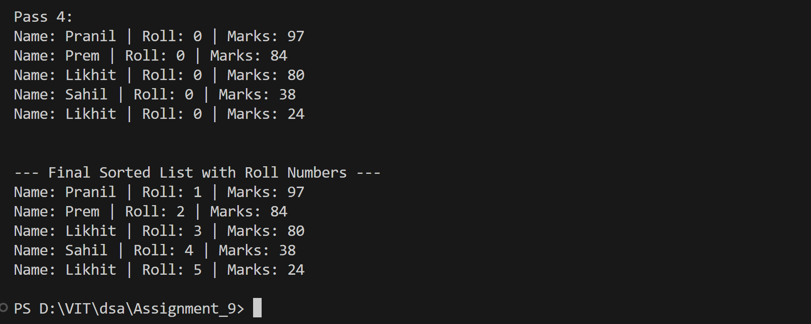

# Bubble Sort on Student Records by Marks (Descending Order)

## Name: Likhit Chirmade, Roll no: 23

## Theory

### Bubble Sort Algorithm

Bubble sort is a simple comparison-based sorting algorithm that repeatedly compares adjacent elements and swaps them if they are in the wrong order. The algorithm gets its name because smaller (or larger) elements "bubble" to their correct positions.

### Descending Order Sorting

In this implementation, students are sorted by marks in descending order (highest marks first). The comparison condition is reversed:
- **Ascending**: `if (arr[j] > arr[j+1])` - swap if current is greater
- **Descending**: `if (arr[j] < arr[j+1])` - swap if current is smaller

### Algorithm Steps

1. **Outer Loop**: Runs n-1 times (n = number of elements)
2. **Inner Loop**: Compares adjacent elements
   - Compares arr[j] with arr[j+1]
   - Swaps if arr[j].marks < arr[j+1].marks (for descending order)
3. **Optimization**: After each pass, the largest element is in its correct position
   - Inner loop runs `n - i - 1` times in pass i
4. **Repeat**: Continue until array is sorted

### Pass-by-Pass Analysis

**Example with 4 students:**
```
Initial: [45, 78, 23, 90]

Pass 1:
  Compare 45 and 78: 45 < 78, swap → [78, 45, 23, 90]
  Compare 45 and 23: 45 > 23, no swap
  Compare 23 and 90: 23 < 90, swap → [78, 45, 90, 23]
  Result: [78, 45, 90, 23]

Pass 2:
  Compare 78 and 45: 78 > 45, no swap
  Compare 45 and 90: 45 < 90, swap → [78, 90, 45, 23]
  Result: [78, 90, 45, 23]

Pass 3:
  Compare 78 and 90: 78 < 90, swap → [90, 78, 45, 23]
  Result: [90, 78, 45, 23]

Final Sorted: [90, 78, 45, 23] (Descending)
```

### Time Complexity

- **Best Case**: O(n²) - even if sorted, all comparisons are made
- **Average Case**: O(n²)
- **Worst Case**: O(n²) - reverse sorted array

### Space Complexity

- **O(1)**: In-place sorting, only uses temporary variable for swapping

### Characteristics

1. **Stable**: Maintains relative order of equal elements
2. **In-place**: No extra array needed
3. **Simple**: Easy to understand and implement
4. **Inefficient**: Not suitable for large datasets

### Roll Number Assignment

After sorting by marks, roll numbers are assigned sequentially:
- Rank 1 (highest marks) → Roll No. 1
- Rank 2 → Roll No. 2
- And so on...

This creates a merit-based roll number system.

### C++ Concepts Used

**Structure with Multiple Data Types:**
```cpp
struct Student_lac {
    string name_lac;      // String type
    int roll_lac;         // Integer type
    float marks_lac;      // Float type
};
```

**Array of Structures:**
```cpp
Student_lac* students = new Student_lac[n];    // Dynamic allocation
```

**Structure Member Access:**
```cpp
students[i].name_lac       // Access member using dot operator
students[i].marks_lac
```

**Structure Assignment:**
```cpp
Student_lac temp = arr[j];    // Copies all members
arr[j] = arr[j+1];
arr[j+1] = temp;
```

**Random Array Element Selection:**
```cpp
names[rand() % 10]    // Randomly select from array of 10 names
```

**Modulo Operator for Range:**
```cpp
rand() % 101    // Generates random number from 0 to 100
```

## Code

```cpp
#include <iostream>
#include <cstdlib>
using namespace std;

struct Student_lac {
    string name_lac;
    int roll_lac;
    float marks_lac;
};

void printStudents_lac(Student_lac arr_lac[], int n_lac) {
    for (int i_lac = 0; i_lac < n_lac; i_lac++) {
        cout << "Name: " << arr_lac[i_lac].name_lac
             << " | Roll: " << arr_lac[i_lac].roll_lac
             << " | Marks: " << arr_lac[i_lac].marks_lac << endl;
    }
    cout << endl;
}

void bubbleSortStudents_lac(Student_lac arr_lac[], int n_lac) {
    int passCount_lac = 0;
    for (int i_lac = 0; i_lac < n_lac - 1; i_lac++) {
        passCount_lac++;
        cout << "Pass " << passCount_lac << ":" << endl;
        for (int j_lac = 0; j_lac < n_lac - i_lac - 1; j_lac++) {
            if (arr_lac[j_lac].marks_lac < arr_lac[j_lac + 1].marks_lac) {
                cout << "Swapping " << arr_lac[j_lac].name_lac << " (" << arr_lac[j_lac].marks_lac
                     << ") and " << arr_lac[j_lac + 1].name_lac << " (" << arr_lac[j_lac + 1].marks_lac << ")" << endl;
                Student_lac temp_lac = arr_lac[j_lac];
                arr_lac[j_lac] = arr_lac[j_lac + 1];
                arr_lac[j_lac + 1] = temp_lac;
            }
        }
        printStudents_lac(arr_lac, n_lac);
    }

    for (int i_lac = 0; i_lac < n_lac; i_lac++) {
        arr_lac[i_lac].roll_lac = i_lac + 1;
    }
}

int main() {
    int n_lac;
    cout << "Enter number of students: ";
    cin >> n_lac;

    Student_lac* students_lac = new Student_lac[n_lac];
    string names_lac[] = {"Likhit", "Sahil", "Rohan", "Pranil", "Jack", "Kunal", "Prem", "Neha", "Tanya", "Riya"};

    for (int i_lac = 0; i_lac < n_lac; i_lac++) {
        students_lac[i_lac].name_lac = names_lac[rand() % 10];
        students_lac[i_lac].marks_lac = rand() % 101;
        students_lac[i_lac].roll_lac = 0;
    }

    cout << "\nOriginal List of Students:\n";
    printStudents_lac(students_lac, n_lac);

    cout << "\n--- Bubble Sort Pass-by-Pass Analysis ---\n";
    bubbleSortStudents_lac(students_lac, n_lac);

    cout << "\n--- Final Sorted List with Roll Numbers ---\n";
    printStudents_lac(students_lac, n_lac);

    delete[] students_lac;
    return 0;
}
```

## Output



